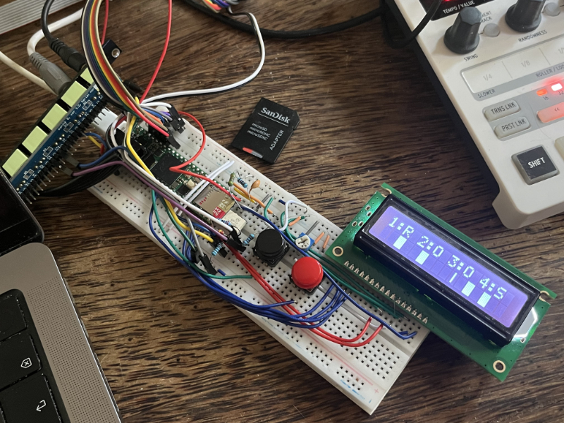

[](https://polyformproject.org/licenses/noncommercial/1.0.0/)

# Midi Looper #


This Midilooper has been created with help of chatgpt and later Cursor. It has proven to be a great tutor to help me guide and understand every added feature's logic. It saved me a lot of time looking for the correct approach or answers on how to tackle things.

The main inspiration was taken from this minimalistic 4 track looper using only 2 buttons and 4 digits:
https://iestyn-lewis.github.io/4by8/

## Hardware ##
- 1x Teensy 4.1
- 2x momentary buttons
- 1x encoder with push button
- 1x 256x64 4bit monochrome display type [NHD-3.12-25664UCY2](https://nl.mouser.com/ProductDetail/Newhaven-Display/NHD-3.12-25664UCY2?qs=EQmeiuRlVUSdkL9ZYPHyoA%3D%3D) (there is also code for using a liquid lcd display 16x2)
- 1x 6N137

The midi circuit is based on https://www.pjrc.com/teensy/td_libs_MIDI.html

## Installation ##
The project uses a modified [SSD1322 library](https://github.com/Lytrix/SSD1322_OLED_Arduino_library/tree/develop/) adding TsyDMASPI to be able to reduce CPU usage running via DMA. To add it use this command when cloning the repo:

`git clone https://github.com/Lytrix/MidiLooper.git --recurse-submodules`


## Features ##
Multi-track MIDI looper with full undo/redo, auto-save/load, and clear visual feedback—ready for live performance or creative studio work!

- 4 Midi Tracks
- 192 PPQN internal clock for live recording
- 24 PPQN midi Sync
- 256x64 display and 16x2 display driver
- 2 button operation   
- 99 Undos per track (overdub and clear)
- Track clear Undo (restore last cleared track)
- Overdub Undo (revert last overdub layer)
- Automatic saving after each edit (record, overdub, undo, clear) and full recall of your Loops on SD card when powering up.
- Reload last used state and loops on startup
- Robust state machine for all track transitions
- Visual feedback for all actions and states

## ✏️ Note Editor ##
- Piano-roll note editor integrated into the looper UI
- Encoder-driven movement of note start positions, with seamless wrap-around support
- Raw note end tick stored intact; wrapping logic is deferred to display and playback layers
- Intelligent overlap resolution:
  - Left-to-right moves delete overlapping notes
  - Right-to-left moves shorten overlapping notes (down to a 1/16th-step) and delete if too short
  - Direction-aware restoration of previously deleted or shortened notes when moving away
- Selection bracket and highlight visually track the moving note
- Host-side unit tests in `test/` to validate wrap logic and edit behavior

## 🔴 Button A – Recording, Overdubbing, Playback, Undo, and Clear ##

| Press #     | From State               | To State                 | Symbol Change | Key Action           |
| ----------- | ------------------------ | ------------------------ | ------------- | -------------------- |
| 1× (single) | `TRACK_EMPTY`            | `TRACK_RECORDING`        | – → R         | `startRecording()`   |
| (internal)  | `TRACK_RECORDING`        | `TRACK_STOPPED_RECORDING`| (not shown)   | `stopRecording()`    |
| (internal)  | `TRACK_STOPPED_RECORDING`| `TRACK_PLAYING`          | (not shown)   | `startPlaying()`     |
| 1× (single) | `TRACK_PLAYING`          | `TRACK_OVERDUBBING`      | P → O         | `startOverdubbing()` |
| 1× (single) | `TRACK_OVERDUBBING`      | `TRACK_PLAYING`          | O → P         | `stopOverdubbing()`  |
| **Double**  | Any (with undo history)  | No change                | No change     | `undoOverdub()`      |
| Long        | Any (with data)          | `TRACK_EMPTY`            | → –           | `clearTrack()`       |


## 🔵 Button B – Track Select, Mute, and Clear Undo ##

|  Press #    | From State         | To State           | Key Action                 |
| ----------- | ------------------ | ------------------ | -------------------------- |
| 1× (single) | Selected Track     | Select next track  | `setSelectedTrack()`       |
| Long        | Any                | Mute/Unmute        | `toggleMuteTrack()`        |
| **Double**  | Cleared track      | Restore last clear | `undoClearTrack()`         |


- Retroactive bar-quantized recording (record complete bars, but allow earlier recording start)
```
| 1   2   3   4 | 1   2   3   4 |  
          ^ You press record here (beat 3)
                		    	^ You press stop here (beat 4)  

New Loop ready for overdub to add the notes in the first bar.
| 1   2   3   4 | 1   2   3   4 |   
```


## 🔄 Undo/Redo System ##
- **Overdub Undo:** Instantly revert the last overdub layer on any track (Button A double press).
- **Clear Undo:** Restore the last cleared track (Button B double press).
- **Per-track history:** Each track maintains its own undo/redo history for both overdubs and clears.
- **Auto-save:** All changes (record, overdub, undo, clear) are saved to SD card immediately.

## 🔧 Module Relationships and Data Flow ##

| Module         | Key Data                            | Connected Modules             | Purpose                                                                 |
|----------------|--------------------------------------|-------------------------------|-------------------------------------------------------------------------|
| `ButtonManager`| Button press type, `millis()`       | `TrackManager`, `ClockManager`| Triggers recording/playback/overdub/mute/clear/undo actions             |
| `TrackManager` | `selectedTrack`, `masterLoopLength` | `Track`, `ClockManager`       | Manages track states and coordination, handles quantized events         |
| `Track`        | `MidiEvent`, `NoteEvent`, `startLoopTick`, `loopLengthTicks` | N/A                        | Stores and manages MIDI/Note data, performs playback and recording      |
| `TrackUndo`    | Undo/redo/clear history per track    | `Track`                       | Manages all undo/redo/clear operations and history for each track       |
| `ClockManager` | `currentTick`                       | All other modules             | Provides global timing for sync and quantization                        |
| `DisplayManager`| —                                   | `TrackManager`, `Track`       | Displays NoteEvents, loop status, and other track information           |
+| `EditStartNoteState`| `movingNote.note, lastStart, lastEnd, deletedNotes`| `EditManager`, `Track` | Manages encoder-driven note start edits, wrap-around logic, overlap deletion/shortening/restoration |


## Software development journey ##
Some of the chat can be viewed here of my journey. 
 
MidiLooper (First one. Got really messy with too many workarounds, but with auto load/save functionality from SD)
https://chatgpt.com/share/680a4839-6720-800b-ae73-9aff16f6e41f

MidiLooperV2 (Simpler switch logic for tracks, focussing on workflow logic)
https://chatgpt.com/share/680e999a-c860-800b-a079-9862a59f1e89

MidiLooperV3 (Started off from a framework in C++, hope it will be more stable to use)
https://chatgpt.com/share/680e98f9-2a64-800b-abb2-4e1bd359c90f

Developing the SSD1322 circular DMA logic was a lot of fun using Cursor. It was really helpfull to have an LLM model explain someone elses 2000+ lines of code in how the logic worked I wanted to port to this display. 

© 2025 Lytrix (Eelke Jager)
Licensed under the PolyForm Noncommercial 1.0.0.  
Private use for further development with mentioning me as author is allowed. 
For any commercial use or distribution please contact me for a separate license.  
