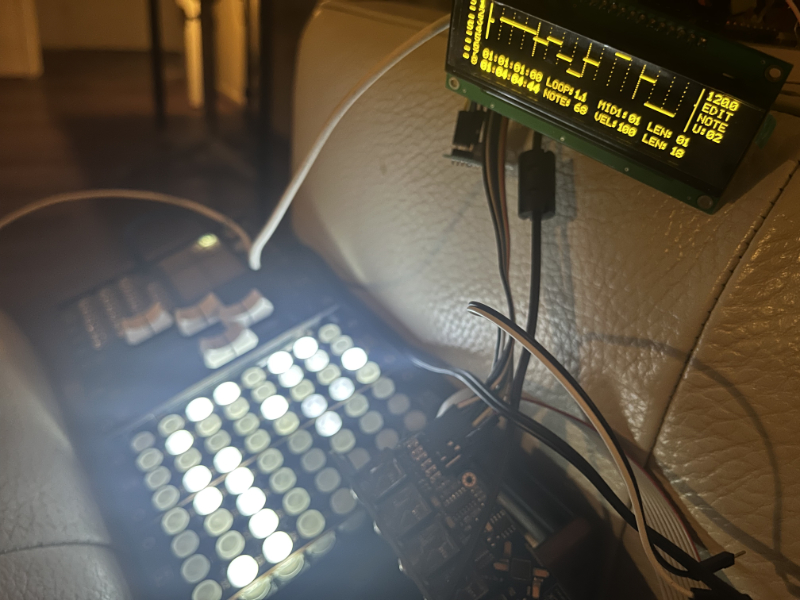

[](https://polyformproject.org/licenses/noncommercial/1.0.0/)

# Midi Looper Droid



## Midi Looper with Droid MotoFader and B24

This is the codebase to run a **multi-track MIDI looper** on a **Teensy 4.1** with live loop jaming manipulations, piano-roll note/cc editing, tight hardware serial timing via minijack midi outs and usb on a 192 PPQN clock with hands on control workflow. It is built for **live performance**: record and layer multiple loop slots per track, remix them by quantized slot switching into new jams **while the music never needs to stop running** to keep into the vibe of the music with undo/redo capabilities.

The **base configuration** of this device is a minimal **encoder-and-4-buttons** module that must carry the full core workflow on its own (it exists physically but is currently dormant in the firmware — see [`docs/00-authority/PROJECT_INTENT.md`](docs/00-authority/PROJECT_INTENT.md) for the project goal and decision log).

### Firmware versions

| Version | Branch | Control surface | README |
|---------|--------|-----------------|--------|
| **v1** | `main` | 2 buttons + encoder, 16×2 LCD | [v1 README](https://github.com/Lytrix/MidiLooper/blob/main/README.md) |
| **v2** | `midi-faders` | DROID / iPad MIDI, basic SD save, no PSRAM required | [v2 README](https://github.com/Lytrix/MidiLooper/blob/midi-faders/README.md) |
| **v3** | `dev` | DROID 8×8 + 4 motorized faders, Sets/revisions, multi-slot (**this document**) | — |

Branch policy and local archive refs: [`docs/BRANCHING.md`](docs/BRANCHING.md).

**v3 (`dev`)** drives the DROID **extension surface**: an **8×8 button grid with 4 motorized faders**. Underneath, everything stays **MIDI-addressable**, so another controller can be made into a dedicated controller for this midi looper by updating [`include/MidiConfig.h`](include/MidiConfig.h) to your controller setup.

---

## Hardware & first-time setup

Built around a **[Teensy 4.1](https://www.pjrc.com/store/teensy41.html)**. PJRC documents the board, memory expansion, RTC, and programming flow on that page — summary for this project below.

### Required / recommended parts

| Part | Why |
|------|-----|
| **Teensy 4.1** | Main processor (600 MHz Cortex-M7, built-in micro SD socket, USB host). |
| **Micro SD card** | Loop data, **Current** workspace, and **Set** revision history (`SD.begin(BUILTIN_SDCARD)` — native 4-bit SDIO on the board socket). |
| **8 MB PSRAM** (QSPI, bottom of board) | **Strongly recommended.** Long loops store MIDI events in the **external memory pool** (`extmem_malloc` / PSRAM). Without a chip soldered, allocation falls back to internal RAM2 and long-record headroom is limited. PJRC: [PSRAM chip](https://www.pjrc.com/store/psram.html); if you fit **one** chip, use the **smaller** QSPI pads on the underside ([Teensy 4.1 memory section](https://www.pjrc.com/store/teensy41.html)). |
| **CR2032 coin cell** on **VBAT** + **GND** | Keeps the **RTC** (real-time clock) running when main power is off so revision **save timestamps** and boot recovery metadata stay meaningful. A 3 V coin cell is fine; CR2032 is what PJRC recommends. |
| **SSD1322 OLED** (256×64) or 16×2 LCD | Piano roll and load/save overlay UI. |
| **6N137 MIDI in**, USB / DIN MIDI out | Clock and note I/O (see [PJRC MIDI library wiring](https://www.pjrc.com/teensy/td_libs_MIDI.html)). |
| **DROID M4 + 2× B32 + moto faders** (this build) | Button grid and faders — [DROID product page](https://shop.dermannmitdermaschine.de/pages/droid-universal-cv-processor). |

### RTC, date/time, and battery wiring

Teensy 4.1 has a **32.768 kHz crystal** for the RTC. With a coin cell on **VBAT**, date/time is kept while USB/VIN power is removed ([Timing → Real Time Clock](https://www.pjrc.com/store/teensy41.html)).

- Solder **VBAT** (positive) and **GND** to a **CR2032 holder** (or compatible 3 V cell).
- On first **upload**, **Teensy Loader** (via PlatformIO / Teensyduino) sets the RTC from your **PC clock** — set the host time correctly before flashing.
- After that, timestamps on saved **Set revisions** use RTC time when the cell is present; without VBAT, time resets when power cycles.

### First flash & run

1. Install [PlatformIO](https://platformio.org/) (this repo: `platformio.ini`, board **Teensy 4.1**).
2. Format an SD card (FAT32), insert in the Teensy socket.
3. Solder **PSRAM** (if used) and connect **VBAT** battery before or after first flash.
4. Build and upload (default env with serial capture for development):

   ```bash
   pio run -e teensy41-capture-serial -t upload
   ```

5. On upload, Teensy enters **program mode** automatically when USB serial is listening; if a bad sketch blocks USB, use the **Program** button on the board ([Programming → Program pushbutton](https://www.pjrc.com/store/teensy41.html)).
6. Power the DROID (or your MIDI controller), wire MIDI to the Teensy, start transport — **Current** workspace is created on SD under `/MidiLooper/current/` as you record; **Save** in the load/save overlay appends **Set** revisions under `/MidiLooper/sets/`.

---

## How it’s meant to be played

### Gesture-first

The looper assumes **intent from how you press**, not from hunting through menus. Every button has the same 5 gestures to get to any function FAST!
**short**
**long**
**double**
**triple**
**hold + second press**

The **primary** action is always a **short** press; extremer edits like delete or undo actions use **long** / **double**.

### Remix loops into a song by jamming

**Loops** are **immediate**—punch in, overdub, slice, retrigger. 
**Notes** are **detailed**—timing, length, velocity—on the **piano roll** and faders. 
**Jam regions** (bars and 16ths in **LOOP_EDIT**) let you **zoom** playback into a new Loop, practice it, or perform inside a subset of the full loop and recording this jam into a new loop. The aim is **flow**: building a song feels like **playing**, not like operating a spreadsheet.

### Jams vs Loops

**Loops** means **per-track loop slots**: eight buffers per track for record, overdub, clear, and undo—see [**Loops**](docs/Guides/control-surface/Loops.md). Slot switching is quantized and each track can run a multi-slot enabled set with per-slot mute/enable states.

**Remixes** of earlier recorded loops is where **jam performance** comes alive. In **Loop edit** the **Bars** and **16ths** buttons can be triggered/looped and recorded into new loops.

---

## Buttons

This cheat sheet and all [`docs/Guides/control-surface/`](docs/Guides/control-surface/) guides apply to **v3 (`dev`)** only. v1 and v2 use different mappings — see their branch READMEs in [Firmware versions](#firmware-versions) above.

The current setup is based on Droid using this config file: [`droid/midilooper_v1.ini`](droid/midilooper_v1.ini). To **remap**, edit [`include/MidiConfig.h`](include/MidiConfig.h) and [`src/Utils/MidiButtonConfig.cpp`](src/Utils/MidiButtonConfig.cpp). More info can be found in the [**MIDI config guide**](docs/Guides/MIDI_CONFIG_GUIDE.md) and the [**config summary**](docs/Guides/MIDI_CONFIG_GUIDE.md#config-summary-default-droid-mapping) for Channel 16.

Below is the **cheat sheet** of all available button gestures.

| Row | Short | Long | Double | Triple | Hold / two-step |
|-----|-------|------|--------|--------|-----------------|
| [**Scenes**](docs/Guides/control-surface/Scenes.md) | — | — | — | — | Not in firmware yet — roadmap / Phase 3 snapshots |
| [**Tracks**](docs/Guides/control-surface/Tracks.md) | Select that track | Exclusive solo | Mute / unmute | — | — |
| [**Jams**](docs/Guides/control-surface/Jams.md) | — | — | — | — | Not in firmware yet — target row for jam capture (jam today via Bars/16ths) |
| [**Loops**](docs/Guides/control-surface/Loops.md) | Select/record slot; when playing, switch slot quantized to next 16th (`projectionCycleStartTick` + `queuedStartTick` on commit); selected slot toggles mute | If pressed slot is selected and filled: clear slot. If not selected and filled: queue single-slot switch at loop end | Slot undo | Slot redo | Hold one or more slots, release to commit multi-slot enabled set on next 16th |
| [**Bars**](docs/Guides/control-surface/Bars-and-16ths.md) | LOOP_EDIT: seek bar / jam. **Playing (non-edit):** queue playback restart at bar on next 16th | Enter one-bar or two-bar jam | Exit jam | Undo loop start edit | Hold bar A → press bar B for range |
| [**16ths**](docs/Guides/control-surface/Bars-and-16ths.md) | LOOP_EDIT: seek 16th in jam. **Playing (non-edit):** queue playback restart at 16th on next grid | 16th jam / seek | Exit jam | Undo loop start | Hold 16th A → press 16th B for range |
| [**Main controls**](docs/Guides/control-surface/Main-controls.md) | **35** NOTELEN: start vs end · **36** record/play · **37** next track · **38** enter / cycle edit · **39** transport | **36** clear · **37** mute · **38** exit edit | **35** delete/create · **36** undo overdub · **37** undo clear · **38** load/save overlay | **36** redo overdub · **37** redo clear | **40** play/stop: long = snap window · hold = track playhead (long loops) · **41–48** extended transport |

**Main controls detail (channel 16):**

| Note | Short | Long | Double | Triple |
|------|-------|------|--------|--------|
| **35** NOTELEN | Toggle note start vs end editing | — | Delete selected note, or create at bracket when empty | — |
| **36** REC/PLAY | Record / play / overdub | Clear track (with data) | Undo overdub | Redo overdub |
| **37** MUTE/DE | Next track | Mute current track | Undo clear | Redo clear |
| **38** Edit | Enter edit / cycle NOTE_EDIT ↔ LOOP_EDIT | Exit edit | **Toggle load/save overlay** | — |
| **39** Transport | Global start/stop | — | Reset to loop start | — |

**Extended transport (channel 16, notes 40–47):**

| Note | Short | Long | Hold (while pressed) |
|------|-------|------|----------------------|
| **40** Play/Stop | Toggle play/stop on selected track | Center detailed piano-roll window on current playhead (loops **>16 bars**) | Window and playhead track current tick (same as playback auto-follow; restores during NOTE_EDIT) |
| **41** | Set loop start | — | — |
| **42** | Set loop end | — | — |
| **43** | Quantize | — | — |
| **44** Copy/Paste | Copy note | Paste note | — |
| **45–48** | Move current tick (beat / 16th nudge) | — | — |

During **NOTE_EDIT** on long loops, the detailed window stays fixed until you **long-press** or **hold** play/stop (note 40). Short press still toggles play. See [**Display**](docs/Guides/control-surface/Display.md#long-loop-bounded-window).

### Load / save overlay (Sets & revisions)

**Enter / exit:** **Edit mode** (note **38**) **double-press** toggles the overlay. While open, record / track gestures scroll the list; **confirm** is **Edit short** or **encoder short** only (not NOTELEN).

**On SD card** ([`docs/Guides/DEFERRED_RUNTIME_PERSISTENCE.md`](docs/Guides/DEFERRED_RUNTIME_PERSISTENCE.md)):

| Area | Path | Role |
|------|------|------|
| **Current** | `/MidiLooper/current/` | Mutable live workspace (auto-saved while playing). |
| **Sets** | `/MidiLooper/sets/S####/revisions/v####.bin` | Immutable **revision** snapshots (REVPK02). **Save** appends a revision; **Current** is unchanged after save. |

**Overlay controls** (while overlay is open):

| Control | Short | Long | Double |
|---------|-------|------|--------|
| **REC/PLAY** (36) | Scroll list **down** | — | — |
| **Track / MUTE** (37) | Scroll list **up** | — | — |
| **Edit mode** (38) | **Confirm** focused row (save, load, dirty-prompt choice) | At **root**: exit overlay · In **revision history**: back to Set list | Exit overlay |
| **NOTELEN** (35) | — (suppressed) | — | Toggle **favorite** on focused **Set** row (root list) |

GPIO **encoder** (when enabled): rotate = scroll; **short press** = confirm (same as Edit **38** short).

**Root list rows:** **Save** → **Edit short** or **encoder short** queues a **revision commit** (background, chunk-bounded) and closes the overlay. **Current** → detail only. **Set** folder (e.g. `S0001`) → **Edit short** loads **latest validated revision** into Current; **Edit long** opens **revision history**; **NOTELEN double** toggles **favorite**.

**Revision history:** scroll with record/track (or encoder); **Edit short** or **encoder short** loads the focused revision; **Edit long** goes back.

**Dirty workspace:** **Yes / No / Cancel** prompt — **Edit short** or **encoder short** confirms the highlighted choice; **Edit long** cancels.

Detail panel shows Set id, revision, track/loop counts, BPM, bars, per-track slot bars, and **RTC date/time** when the revision was saved. More: [`docs/Guides/control-surface/Main-controls.md`](docs/Guides/control-surface/Main-controls.md), handoff [`docs/plans/set_revision_persistence_handoff.md`](docs/plans/set_revision_persistence_handoff.md).

## Faders

The four faders sit beside the button grid. Their role changes depending on whether you are in **NOTE_EDIT** or **LOOP_EDIT**.

| Fader | NOTE_EDIT | LOOP_EDIT |
|-------|-----------|-----------|
| **Fader 1** | Note selector | Loop start point |
| **Fader 2** | 16th coarse position | Loop length / loop end |
| **Fader 3** | 16th fine offset | — |
| **Fader 4** | Note pitch | — |

Midi channels, CCs, and pitchbend mappings can be found in [`include/MidiConfig.h`](include/MidiConfig.h) and the [**MIDI config guide**](docs/Guides/MIDI_CONFIG_GUIDE.md). Motorized DROID faders: [**DROID motorfader pitchbend**](docs/Guides/DROID_MOTORFADER_PITCHBEND.md) (select/geometry sync, feedback ignore). More detail: [**Faders**](docs/Guides/control-surface/Faders.md), [loop start editing](docs/Guides/LOOP_START_EDITING.md), and [fader state](docs/Guides/FADER_STATE_SYSTEM.md).

## Display

The display is built around the **piano roll** with loop and current note played information and **track status strip**. After recording a first loop you often want to edit small parts in detail or shift notes. It also shows what part of the loop is active, selected slot focus, and what you are editing right now. That means the display is not just “status”; it is part of how you shape your groove, ofsett start end boundaries, all while the loop is running.

The **track column** gives a quick status for each track using letters such as `-` Empty, `P(lay)`, `O(verdub)`, `R(ecord)`, `M(uted)`, `S(topped)` and `A(rmed)`.

For more detail: [**Display**](docs/Guides/control-surface/Display.md).

---

## Technical features

**Hardware** is Teensy 4.1 (see [**Hardware & first-time setup**](#hardware--first-time-setup) for PSRAM, VBAT battery, SD, and first flash), SSD1322 256×64 OLED or 16×2 LCD, 6N137 MIDI in, and in this case a **DROID** M4 + 2× B32—[product page](https://shop.dermannmitdermaschine.de/pages/droid-universal-cv-processor). MIDI wiring follows the [PJRC MIDI library](https://www.pjrc.com/teensy/td_libs_MIDI.html) pattern.

**External-clock sync (DAW master → Teensy slave → MIDI recorded back):** steady-state notes can sit late on the grid until you compensate. That offset comes from the DAW + driver round-trip (and whether notes return over **DIN** or **Teensy USB**), not from the looper firmware. Re-measure if your audio buffer, interface, MIDI route, or clock source changes.

- **Ableton:** on the MIDI **Out** port that sends clock to the Teensy, set **MIDI Clock Sync Delay** (Preferences → Link/Tempo/MIDI → Output → Sync). In the tested setup, steady-state recorded notes landed on-grid at **-11 ms** when notes return over **DIN**, and **-9 ms** when they return over **Teensy USB**.
- **Bitwig:** there is no per-port MIDI clock sync delay. Send clock via **Settings → Controllers → Generic → MIDI Clock Transmitter** (or **HW Instrument → Send MIDI Clock**). Compensate on **each track** that sends clock or notes to the Teensy: set **Track Delay** (note offset) to about **-11 ms** (DIN return) or **-9 ms** (USB return) and fine-tune by recording a known pattern. Apply the same offset on every outbound track in the chain.

For more details on the logic: [loop start / length](docs/Guides/LOOP_START_EDITING.md), [jam phases](docs/Guides/jam-bar-step-phases.md), [note moves](docs/Guides/MOVE_NOTE_LOGIC.md), [DROID motor faders](docs/Guides/DROID_MOTORFADER_PITCHBEND.md), [fader state](docs/Guides/FADER_STATE_SYSTEM.md). A compact **Channel 16** listing lives under [**Config summary**](docs/Guides/MIDI_CONFIG_GUIDE.md#config-summary-default-droid-mapping) in the MIDI guide.

State persistence uses storage **version 4+** on loop slots (**passes** timeline per slot: record, overdub, and edit passes), plus **CurrentSet v6** workspace files and **Set revision** packs on SD. Runtime auto-save writes **Current**; explicit **Save** in the overlay commits an immutable revision without clearing Current. See [**Load / save overlay**](#load--save-overlay-sets--revisions) and [`docs/Guides/DEFERRED_RUNTIME_PERSISTENCE.md`](docs/Guides/DEFERRED_RUNTIME_PERSISTENCE.md).

### Loop storage vocabulary (code)

Each **loop slot** (`Loop`) separates live capture from committed timeline **passes**:

| Term | Role |
|------|------|
| **Capture** | Live record/overdub buffer until stop |
| **passes** (`LoopPasses`) | Canonical timeline: **recordPass**, **overdubPasses[]**, **editPasses[]** |
| **recordPass** / **overdubPass** | Committed capture from record or overdub stop |
| **editPass** | One `saveNoteEditPass()` row in **passes.editPasses[]** |
| **EditSessionType** | Live edit session on **EditSession** (`Loop`, `Note`, `ControlChange`) |
| **EditPassType** | Stored domain on each `editPass` (`Note`, `ControlChange`, `Audio`) |
| **EditActionType** | Stored edit action (`Create`, `Update`, `Delete`) |
| **EditPropertyType** | Updated stored field (`Pitch`, `Length`, `StartTick`, `EndTick`, `Tick`, `Value`, `None`) |
| **commitCapturePass()** | Seal **Capture** into **recordPass** or append **overdubPass** |
| **RecordPassAdded** / **OverdubPassAdded** | Global undo when a capture pass commits |
| **NoteEditPassClosed** | Global undo when a note-edit pass batch closes on exit |
| **EditSession** | Live edit RAM owner on **EditManager** (`sessionType`, store, focus, in-session undo) |
| **saveNoteEditPass()** | Persist note scoped rows into **passes.editPasses[]** (legacy **EditChange** payload retained during migration) |
| **closeNoteEditPass()** | Flush a **noteEditPass** batch and push **NoteEditPassClosed** undo |
| **EditNoteState** | Base class for note-edit UI states (`EditSelectNoteState`, …) |
| **DebugSessionCapture** | Instrumented `#CAP` serial fixtures (`teensy41-capture-serial` build) |

Committed **passes** materialize via `LoopPasses::materialize()` for playback and display; live note edit reads/writes **NoteEditSession.store**. Full storage rules: [`docs/Guides/LOOP_MIDI_STORAGE_AND_VALIDATION.md`](docs/Guides/LOOP_MIDI_STORAGE_AND_VALIDATION.md).

Naming notes: **merge** means active capture pass merge (`mergeActiveCapturePasses`, `mergeMaterializedPassesWithCapture`), **materialize** means full pass replay (`materializeToEventVector`), and memory tiers are **internal heap** (fast RAM) plus **external memory pool** (external RAM / PSRAM hardware).

**How the system works (record → memory → playback → display → SD):** [`docs/plans/record_overdub_memory_display_timeline_enhancement.md`](docs/plans/record_overdub_memory_display_timeline_enhancement.md) — end-to-end timeline with Mermaid diagrams (external memory pool chunks, play-ahead, deferred save, boot reload). Pair with [`docs/Guides/DEFERRED_RUNTIME_PERSISTENCE.md`](docs/Guides/DEFERRED_RUNTIME_PERSISTENCE.md) for save FSM detail.

**Read the numbers first:** [`include/MidiConfig.h`](include/MidiConfig.h) — channels, notes, CCs, LED bases.

**Remap any controller:** [`docs/Guides/MIDI_CONFIG_GUIDE.md`](docs/Guides/MIDI_CONFIG_GUIDE.md) — checklist, tables, `MidiButtonConfig.cpp`, and matching `droid/midilooper_v1.ini` if you want to make your own Droid setup.

**Full capability list:** [`docs/FEATURES.md`](docs/FEATURES.md).

**Code layout (Handler / Manager / Processor / Actions):** [`docs/Guides/CODE_STRUCTURE.md`](docs/Guides/CODE_STRUCTURE.md).

**Build:** [PlatformIO](https://platformio.org/) — `platformio.ini`, board **Teensy 4.1**.

**Documentation index:** [`docs/README.md`](docs/README.md) — guides, refinements, archived plans.

**Feature conventions / Phase 3 pointer:** [`docs/FEATURE_PLANS.md`](docs/FEATURE_PLANS.md). Exported design plans: [`docs/plans/README.md`](docs/plans/README.md).

---

## Credits and inspiration

Inspiration: [4×8 — minimal 4-track looper](https://iestyn-lewis.github.io/4by8/).

**Development tooling:** Early exploration used ChatGPT; most of the current structure and refactors were done with **Cursor** (Claude and similar models)—useful for navigating large C++ modules and keeping docs in sync with behavior.

**Chat logs (historical):**  
[MidiLooper (V1)](https://chatgpt.com/share/680a4839-6720-800b-ae73-9aff16f6e41f) · [MidiLooperV2](https://chatgpt.com/share/680e999a-c860-800b-a079-9862a59f1e89) · [MidiLooperV3](https://chatgpt.com/share/680e98f9-2a64-800b-abb2-4e1bd359c90f)

SSD1322 circular DMA bring-up was prototyped with Cursor against existing driver code.

---

## Examples

- [`examples/ButtonConfiguration40Example.cpp`](examples/ButtonConfiguration40Example.cpp) — MIDI button mapping example  
- [`droid/midilooper_v1.ini`](droid/midilooper_v1.ini) — Reference DROID patch  

---

© 2025 Lytrix (Eelke Jager)  
Licensed under the [PolyForm Noncommercial 1.0.0](https://polyformproject.org/licenses/noncommercial/1.0.0/).  
Private use for further development with attribution is allowed. For commercial use or distribution, contact the author for a separate license.
