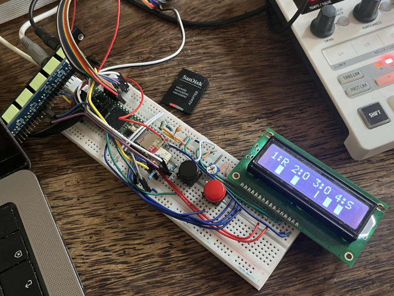

[](https://polyformproject.org/licenses/noncommercial/1.0.0/)

# Midi Looper #


This Midilooper has been created with help of chatgpt and later Cursor with Claude. It has proven to be a great tutor to help me guide and understand every added feature's logic. It saved me a lot of time looking for the correct approach or answers on how to tackle things.

The main inspiration was taken from this minimalistic 4 track looper using only 2 buttons and 4 digits:
https://iestyn-lewis.github.io/4by8/

## Development Status ##
This is my current working branch which has more mature code and bugfixes including more edit options, Midi Led controls and Looping options. It uses the [Droid controllers](https://shop.dermannmitdermaschine.de/pages/droid-universal-cv-processor) instead of the buttons and encoder which do not work ATM in this branch, my aim is to put those back later so you can build a minimal Midilooper version with the same possibilities.

## Hardware ##
- 1x Teensy 4.1
- 1x 256x64 4bit monochrome display (SSD1322 OLED) — code also supports 16x2 LCD
- 1x 6N137 (optocoupler for MIDI)
- **Optional:** DROID controller (M4 + 2× B32) for full hardware control and LED feedback — see [DROID Controller](#-droid-controller) below

The MIDI circuit is based on https://www.pjrc.com/teensy/td_libs_MIDI.html

**Note:** The project is configured for DROID controller input. Button mappings are loaded at startup in `MidiButtonConfig::Config::initialize()`; see `src/Utils/MidiButtonConfig.cpp` and `droid/midilooper_v1.ini` for the layout. Central note/channel numbers live in [`include/MidiConfig.h`](include/MidiConfig.h); for remapping controllers see [`docs/MIDI_CONFIG_GUIDE.md`](docs/MIDI_CONFIG_GUIDE.md).

### Channel 16 (control) quick map

Incoming **buttons** on **Channel 16** (record/arm/edit transport excluded from loop recording on this channel):

| Notes | Role |
|------|------|
| 0–15 | 16th steps (jam / seek in LOOP_EDIT; see [Jam Loops](#-jam-loops-bar16th-buttons)) |
| 17–24 | Bar 1–8 (jam / seek) |
| 35 | NOTELEN — toggle note position vs length edit mode |
| 36–39 | Main row: REC/PLAY, MUTE/DE (track switch), Edit Mode, global transport (see Row 7 below) |
| 40–48 | Extended transport (play/stop, loop edit helpers, nudge, etc. — see `MidiButtonConfig`) |
| 50–57 | **Loop slots 1–8** for the **selected** track — record/overdub, clear, undo/redo, hold-layer ([detail](#track-row-and-loop-slot-buttons-channel-16)) |
| 60–67 | **Tracks 1–8** — select, mute, solo |

LED **feedback** for the loop and track rows uses the **same note numbers on Channel 15** (see [LED Feedback](#led-feedback-channel-15)).

## Code Conventions ##

Class and module naming follows consistent semantics. When reading the codebase, use these meanings:

| Suffix | Role | Examples |
|--------|------|----------|
| **Handler** | Receives events and routes or processes them | `MidiHandler` receives all MIDI and dispatches to appropriate modules |
| **Manager** | Owns a domain or coordinates components | `TrackManager`, `ClockManager`, `LoopEditManager` |
| **Processor** | Transforms input (raw → detected events) | `MidiButtonProcessor` detects short/long/double/triple from Note On/Off |
| **Actions** | Executes domain operations | `MidiButtonActions`, `MidiFaderActions` perform record, undo, fader moves |

**Input pipelines** (buttons, faders) use the pattern **Manager** → **Processor** + **Actions**:
- `MidiButtonManager` coordinates `MidiButtonProcessor` (detection) and `MidiButtonActions` (execution)
- `MidiFaderManager` coordinates `MidiFaderProcessor` and `MidiFaderActions`

Standalone **Handler** classes (e.g. `BarStepButtonHandler`) receive and process events in a single class when the full Manager/Processor/Actions split is not needed.

## Features ##
Multi-track MIDI looper with full undo/redo, auto-save/load, and clear visual feedback—ready for live performance or creative studio work!

- 8 MIDI tracks (`Config::NUM_TRACKS`), each with **8 loop slots** (`Config::MAX_LOOPS_PER_TRACK`)
- 192 PPQN internal clock for live recording
- 24 PPQN MIDI Sync
- 256x64 display and 16x2 display driver
- 99 Undos per track (overdub and clear)
- Track clear Undo (restore last cleared track)
- Overdub Undo (revert last overdub layer)
- **Loop Start Point Editing** (dynamic loop start position control with fader)
- **Loop Length Editing** (1-128 bars with CC control and automatic fader feedback)
- **Note Length Editing Mode** (toggle between position and length editing for notes)
- Automatic saving after each edit (record, overdub, undo, clear) and full recall of your Loops on SD card when powering up.
- Reload last used state and loops on startup
- Robust state machine for all track transitions
- Visual feedback for all actions and states on both displays
- 256x64 OLED display with piano roll visualization
- 16x2 LCD display with essential info
- SD card storage for loop data
- Comprehensive undo/redo system with multiple history stacks
- Real-time MIDI playback with precise timing
- Multi-layer overdubbing with separate undo states
- Track muting and solo functionality
- Automatic loop synchronization
- Motorized fader support with feedback prevention
- Dedicated edit modes for different operations
- Full wrap-around support for notes crossing loop boundaries
- **DROID LED feedback** — 16th step content, current tick indicator, 8 bar LEDs, loop row (50–57), track row (60–67); updates on loop start/length change
- **Track row & loop slot row (Ch. 16)** — per-track select / double-mute / long-solo; per-slot quantized record, overdub, clear, slot undo/redo, layered hold ([detail](#track-row-and-loop-slot-buttons-channel-16))
- **OLED track column** — letters per track (`-`, `P`, `O`, `R`, `A`, …); **`M`** if muted or solo-hidden; **selected** row still shows real state under solo ([`DisplayManager::drawTrackStatus`](src/DisplayManager.cpp), [`docs/DESIGN_PRINCIPLES.md`](docs/DESIGN_PRINCIPLES.md))

## ✏️ Note Editor ##
- Piano-roll note editor integrated into the looper UI
- Encoder-driven movement of note start positions, with seamless wrap-around support
- Raw note end tick stored intact; wrapping logic is deferred to display and playback layers
- Intelligent overlap resolution:
  - Left-to-right moves delete overlapping notes
  - Right-to-left moves shorten overlapping notes (down to a 1/16th-step) and delete if too short
  - Direction-aware restoration of previously deleted or shortened notes when moving away
- Selection bracket and highlight visually track the moving note
- Host-side unit tests in `test/` to validate wrap logic and edit behavior


## 🔄 Loop Start Point Editing ##
- **Dynamic loop start control** via Fader 1 (Pitchbend Channel 16) in LOOP_EDIT mode
- **Same positioning logic as note select fader** - uses note start positions OR 16th-note step positions for precise control
- **1000ms grace period** before automatic endpoint adjustment to prevent unwanted changes during movement
- **Automatic endpoint updating** maintains bar-based loop length relative to new start point
- **Complete display system integration** - all MIDI events, cursor, and bracket adjust to show content relative to loop start
- **Full undo/redo support** - single undo state allows return to original loop start point
- **Seamless integration** with existing note editing system - all faders work correctly with relative positioning

## 🎛️ Loop Length Editing ##
- **Dynamic loop length control** via CC 101 on Channel 16 in LOOP_EDIT mode
- **Bar-based editing** - maps CC values (0-127) to loop lengths (1-128 bars)
  - CC 0 = 1 bar
  - CC 127 = 128 bars
  - Linear scaling between these values
- **Non-destructive editing** - preserves all existing MIDI events when changing loop length
- **Automatic fader feedback** - sends current loop length back to controller when switching tracks or entering LOOP_EDIT mode
- **Real-time display updates** - piano roll and timing display adjust automatically to new loop length
- **Track-specific lengths** - each track can have its own loop length independent of others

## 📏 Note Length Editing Mode ##
- **Toggle between position and length editing** via NOTELEN (**note 35**, Channel 16 — `MidiConfig::LengthEdit::NOTE`)
- **Two distinct editing modes**:
  - **Position Edit Mode** (default): Faders 1, 2, 3 control note START positions
  - **Length Edit Mode**: Faders 1, 2, 3 control note END positions (length editing)
- **Seamless mode switching** with automatic fader position updates
- **Visual feedback** - console logs clearly indicate which mode is active
- **Integrated with all fader controls**:
  - Fader 1: Note selection (works in both modes)
  - Fader 2: Coarse position control (16th-note steps)
  - Fader 3: Fine position control (tick-level precision)
- **Minimum length enforcement** - prevents notes from becoming shorter than 1/16th note
- **Wrap-around support** - note lengths can extend across loop boundaries

For detailed technical documentation, see: [`docs/LOOP_START_EDITING.md`](docs/LOOP_START_EDITING.md)

## 🎛️ DROID Controller ##

The looper is configured for a DROID controller (M4 + 2× B32). MIDI channels and CCs are centralized in [`include/MidiConfig.h`](include/MidiConfig.h); the DROID ini must match. Configuration: [`droid/midilooper_v1.ini`](droid/midilooper_v1.ini).

### 8×8 Button Grid + 4 Sliders Overview

| | Col 1 | Col 2 | Col 3 | Col 4 | Col 5 | Col 6 | Col 7 | Col 8 |
|--|-------|-------|-------|-------|-------|-------|-------|-------|
| **Scene** | Scene 0 | Scene 1 | Scene 2 | Scene 3 | Scene 4 | Scene 5 | Scene 6 | Scene 7 |
| **Track** | **60** | **61** | **62** | **63** | **64** | **65** | **66** | **67** |
| **REMIX** | — | — | — | — | — | — | — | — |
| **8BARS** | — | — | — | — | — | — | — | — |
| **1BAR** | Bar 1 | Bar 2 | Bar 3 | Bar 4 | Bar 5 | Bar 6 | Bar 7 | Bar 8 |
| **16th** | 16th 0–15 (jam/seek) + Playhead LEDs (receives from Teensy) | | | | | | | |
| **Row 7** | **REC/PLAY** | **MUTE/DE** | **Edit Mode** | **NOTELEN** | — | — | **&lt;** | **&gt;** |

Map a B32 **Track** row to MIDI **Channel 16 notes 60–67** (track 1…8): **short** = select that track, **double** = mute, **long** = exclusive solo — see [Track row and loop slot buttons](#track-row-and-loop-slot-buttons-channel-16) and [`droid/midilooper_v1.ini`](droid/midilooper_v1.ini). A **Loop / slot** row should use notes **50–57** on the same channel (same section).

| Slider | **NOTE_EDIT** (Program 1) | **LOOP_EDIT** (Program 0) |
|--------|---------------------------|---------------------------|
| **F1** | Note selector (pitchbend ch16) | Loop start point |
| **F2** | 16th coarse position (pitchbend ch15) | Loop end / length (CC 101) |
| **F3** | 16th fine offset (CC2 ch15) | — |
| **F4** | Note pitch 0–127 (CC3 ch15) | — |

**Row 7 buttons (Channel 16):**
- **REC/PLAY** (note 36): Record/Overdub/Stop — single/double/triple/long for undo/redo/clear
- **MUTE/DE** (note 37): Track select / Mute — single=next track, long=mute, double/triple=undo/redo clear
- **Edit Mode** (note 38): Cycle NOTE_EDIT ↔ LOOP_EDIT — double=delete note, long=exit edit
- **NOTELEN** (note **35**): Toggle position vs length editing

### Track row and loop slot buttons (Channel 16)

This is the **primary multi-loop** control surface: **eight tracks**, each with **eight loop slots** (`Config::NUM_TRACKS`, `Config::MAX_LOOPS_PER_TRACK` in [`include/Globals.h`](include/Globals.h)).

**vs. REC/PLAY (note 36):** The main **REC/PLAY** button drives the **selected** track’s global record / overdub / play state ([state table](#-recplay-button-note-36) below). The **loop slot row (50–57)** chooses **which slot** on that track is active and handles **slot-specific** record, overdub, clear, and undo. Use both together: pick a **track** (60–67), then a **slot** (50–57).

Button **input** uses **Channel 16**; **LED feedback** for the same layout uses **Channel 15** (notes 50–57 and 60–67). Numbers match [`include/MidiConfig.h`](include/MidiConfig.h). Gestures are defined in [`src/Utils/MidiButtonConfig.cpp`](src/Utils/MidiButtonConfig.cpp) (`loadConfiguration`) and executed in [`src/MidiButtonActions.cpp`](src/MidiButtonActions.cpp). UX rationale is summarized in [`docs/DESIGN_PRINCIPLES.md`](docs/DESIGN_PRINCIPLES.md).

**Track row (notes 60–67, one button per track):**

| Gesture | Action |
|--------|--------|
| **Short** | Select that track (`SELECT_TRACK` with track index). |
| **Double** | Toggle mute on that track (`MUTE_TRACK`). |
| **Long** | Exclusive solo for that track (`SOLO_TRACK` → `handleSoloTrack` → `TrackManager::toggleSoloTrack`). Long-press the same track again to clear all solo. `isTrackAudible` combines per-track mute and solo mask. |

**Loop slot row (notes 50–57, one button per loop slot on the selected track):**

| Gesture | Action |
|--------|--------|
| **Short** | Slot-aware record / play / overdub / finalize — see [`handleToggleRecordForSlot`](src/MidiButtonActions.cpp): e.g. while **playing**, empty slot queues quantized record (loop phase from the previously active slot when its loop length is valid, else bar); second short while queued punches in immediately and requests loop-origin alignment on stop; non-empty slot starts or stops **overdub**. While **recording/overdubbing**, short on **another** slot finalizes capture and switches slot. While **stopped**, short on empty slot starts recording (immediate when quantization does not apply); short on non-empty toggles play/stop. |
| **Long** | Select that slot, then clear **that** slot’s loop (`CLEAR_TRACK_FOR_SLOT` → active loop clear). |
| **Double** | Undo for that slot (`UNDO_FOR_SLOT`). |
| **Triple** | Redo for that slot (`REDO_FOR_SLOT`). |
| **Hold** | Past **long-press time + 50 ms**, layering arms: optional queued record on an **empty** held slot while playing, using phase from the **base** slot; release clears layering and pending queue (`MidiButtonManager::updateLoopHoldLayering`). |

**SSD1322 OLED (track column):** The left column shows one letter per track. **User mute** or **solo-hide** (another track is soloed and this row is not the selected row) shows **`M`**. The **selected** track always shows its **real** machine state (`P`, `O`, `R`, `A`, `-`, …) unless that track is **muted**, so you can keep editing a part that is silent under solo.

**Notes:** REC/PLAY, MUTE/DE, Edit Mode, and NOTELEN are fully implemented. The **track row** and **loop row** behavior above is defined in firmware config; your DROID ini must send the same Channel 16 notes for those rows. **MUTE/DE (37)** and **track row (60–67)** are both valid ways to change track — MUTE/DE **short** cycles **next** track only; the **track row** jumps to a specific track. For jam loop selection with 1BAR and 16th buttons, see [Jam Loops (Bar/16th Buttons)](#-jam-loops-bar16th-buttons) below.

### LED Feedback (Channel 15)

The Teensy sends LED feedback to the DROID on **Channel 15** (notes 0–15, 16–31, 40–47, 50–67). Route this output to the DROID via MIDI thru (e.g. Teensy → Ableton → DROID).

| LED Type | Notes | Description |
|----------|-------|-------------|
| **16th step content** | 0–15 | Shows which 16th steps have notes in the current bar |
| **Current tick** | 16–31 | Highlights the playing 16th step (which step is currently playing) |
| **8 bar LEDs** | 40–47 | Bar 1–8 status: used (vel 32), has notes (vel 64), current bar (vel 127) |
| **Track row** | 60–67 | Track 1–8: selected (vel 127), has data (vel 32), empty (vel 0) |
| **Loop row** | 50–57 | Loop slot 1–8: selected (vel 127), has data (vel 32), empty (vel 0) |

**Behavior:**
- **Initial update on startup** — 16th and bar LEDs refresh once after setup (no need to switch tracks)
- **Loop start aware** — 16th content and tick indicator respect the loop start point (fader in LOOP_EDIT mode)
- **Loop start change** — LEDs update immediately when you move the loop start, both during play and when stopped
- **Loop length change** — LEDs update when resizing; bars beyond the new loop length receive NoteOff
- **Bar LED logic** — Uses NoteOn velocity updates only during playback; NoteOff only when required (track switch, loop resize, clear)
- **LED logging** — Disabled by default; set `logger.setCategoryEnabled(CAT_MIDI_LED, true)` in `main.cpp` for debug

---

## 🔄 Jam Loops (Bar/16th Buttons) ##

The **1BAR** row (notes 17–24) and **16th** row (notes 0–15) on Channel 16 select and trigger jam loops when in **LOOP_EDIT** mode. A jam loop is a sub-region of the full loop that repeats for focused playback or practice.

**Prerequisites:** LOOP_EDIT mode (Edit Mode button), selected track with loop data.

### Entering jam mode

| Action | Result |
|--------|--------|
| **HOLD_ONE bar** (hold ~600ms) | Enter single-bar jam. Playback loops that one bar (Bar 1–8). |
| **HOLD_TWO bars** | Enter multibar jam. Hold bar A, then press bar B (see timing below). Playback loops bars A through B inclusive. |
| **HOLD_TWO 16ths** | Enter multi-16th jam. Hold 16th A, then press 16th B. Playback loops the 16th range. |

**HOLD_TWO timing:** Hold the first bar/16th, then press the second. Either:
- **Gap method:** At least 800ms between first press and second press, then release; or
- **Overlap method:** Hold first for ≥600ms, press second, overlap ≥200ms, then release.

### While jamming

| Action | Result |
|--------|--------|
| **SHORT_PRESS bar** (in jam region) | Seek playback to that bar. |
| **SHORT_PRESS bar** (outside jam region) | Switch to single-bar jam on that bar. |
| **SHORT_PRESS 16th** (in jam region) | Seek playback to that 16th step. |
| **HOLD_ONE same bar** | Seek to start of current bar. |
| **HOLD_ONE different bar** | Switch to single-bar jam on that bar. |
| **DOUBLE_PRESS** | Exit jam mode, return to full loop playback. |
| **TRIPLE_PRESS** | Undo loop start edit (no exit). |

**Immediate seek:** Pressing a bar or 16th button triggers an immediate seek on NoteOn (before release) when the position is within the current jam region or when not jamming. No need to wait for release.

### Summary

- **Enter:** HOLD_ONE bar = 1 bar, HOLD_TWO = range
- **Seek:** SHORT_PRESS bar/16th (in jam)
- **Switch bar:** SHORT_PRESS bar outside jam, or HOLD_ONE different bar
- **Exit:** DOUBLE_PRESS only (short press does not exit)

---

## 🔴 REC/PLAY Button (Note 36) ##

Applies to the **currently selected** track only. Per-loop-slot recording and overdub on the **active slot** use the **loop row (50–57)** — [Track row and loop slot buttons](#track-row-and-loop-slot-buttons-channel-16).

| Press #     | From State               | To State                 | Symbol Change | Key Action           |
| ----------- | ------------------------ | ------------------------ | ------------- | -------------------- |
| 1× (single) | `TRACK_EMPTY`            | `TRACK_RECORDING`        | – → R         | `startRecording()`   |
| (internal)  | `TRACK_RECORDING`        | `TRACK_STOPPED_RECORDING`| (not shown)   | `stopRecording()`    |
| (internal)  | `TRACK_STOPPED_RECORDING`| `TRACK_PLAYING`          | (not shown)   | `startPlaying()`     |
| 1× (single) | `TRACK_PLAYING`          | `TRACK_OVERDUBBING`      | P → O         | `startOverdubbing()` |
| 1× (single) | `TRACK_OVERDUBBING`      | `TRACK_PLAYING`          | O → P         | `stopOverdubbing()`  |
| **Double**  | Any (with undo history)  | No change                | No change     | `undoOverdub()`      |
| **Triple**  | Any (with redo history)  | No change                | No change     | `redoOverdub()`      |
| Long        | Any (with data)          | `TRACK_EMPTY`            | → –           | `clearTrack()`       |

## 🔵 MUTE/DE Button (Note 37) ##

**Track row (60–67)** is the usual place for **direct track select**, **mute**, and **solo**. This button is the **legacy** transport strip control: **short** = **next** track only, **long** = mute **current** track.

|  Press #    | From State         | To State           | Key Action                 |
| ----------- | ------------------ | ------------------ | -------------------------- |
| 1× (single) | Selected Track     | Select next track  | `setSelectedTrack()`       |
| Long        | Any                | Mute/Unmute        | `toggleMuteTrack()`        |
| **Double**  | Cleared track      | Restore last clear | `undoClearTrack()`         |
| **Triple**  | Any (with redo)    | Redo last clear    | `redoClearTrack()`         |

## 🔵 Edit Mode Button (Note 38) ##

|  Press #    | Action                                           |
| ----------- | ------------------------------------------------ |
| 1× (single) | Cycle mode: NOTE_EDIT ↔ LOOP_EDIT                |
| **Double**  | Delete selected note                             |
| Long        | Exit edit mode                                   |

### Retroactive bar-quantized recording
Record complete bars while allowing an earlier start:
```
| 1   2   3   4 | 1   2   3   4 |  
          ^ You press record here (beat 3)
                		    	^ You press stop here (beat 4)  

New Loop ready for overdub to add the notes in the first bar.
| 1   2   3   4 | 1   2   3   4 |   
```


## 🔄 Undo/Redo System ##

The looper provides comprehensive undo/redo functionality for both overdub and clear operations:

- **Per-track history:** Each track maintains its own undo/redo history for both overdubs and clears.
- **Automatic snapshots:** Undo snapshots are automatically created before overdubs, edits, and clears.
- **Hash-based optimization:** Edit operations that result in no net changes automatically discard their undo snapshots.
- **Triple press redo:** Redo functionality is accessed via triple press on buttons A and B.

### Button Controls:
- **REC/PLAY double press:** Undo last overdub operation
- **REC/PLAY triple press:** Redo last undone overdub operation  
- **MUTE/DE double press:** Undo last clear operation
- **MUTE/DE triple press:** Redo last undone clear operation

### Technical Details:
- Undo history is preserved across sessions via SD card storage
- Redo history is cleared when new operations are performed (standard behavior)
- Maximum undo history is configurable via `Config::MAX_UNDO_HISTORY`
- Both physical buttons and MIDI buttons support the same undo/redo controls

## 🔧 Module Relationships and Data Flow ##

| Module         | Key Data                            | Connected Modules             | Purpose                                                                 |
|----------------|--------------------------------------|-------------------------------|-------------------------------------------------------------------------|
| `ButtonManager`| Button press type, `millis()`       | `TrackManager`, `ClockManager`| Triggers recording/playback/overdub/mute/clear/undo actions             |
| `TrackManager` | `selectedTrack`, `masterLoopLength` | `Track`, `ClockManager`       | Manages track states and coordination, handles quantized events         |
| `Track`        | `MidiEvent`, `NoteEvent`, `startLoopTick`, `loopLengthTicks`, `loopStartTick` | N/A                           | Stores MIDI events, track state, loop parameters, and cached note data |
| `ClockManager` | `masterLoopLength`, `currentTick`   | `TrackManager`, `MidiHandler` | Distributes timing across all tracks, manages master loop synchronization |
| `MidiHandler`  | MIDI events, channel routing        | `ClockManager`, `NoteEditManager` | Handles MIDI I/O, event filtering, and channel management              |
| `MidiLedManager` | `lastBarVelocity`, `lastLoopStartTick` | `Track`, `MidiHandler` | DROID LED feedback: 16th content, current tick, 8 bar LEDs; respects loop start/length |
| `NoteEditManager`| `selectedNoteIdx`, `bracketTick`, `editMode`, `loopStartTick`, `lengthEditingMode` | `Track`, `MidiHandler`, `DisplayManager` | Manages note selection, editing, loop start/length control, and fader integration |
| `DisplayManager`| Visual state, display buffer       | `NoteEditManager`, `Track`, `TrackManager` | Renders piano roll, track strip (incl. solo/mute), and real-time feedback |
| `MidiButtonManager` | Raw Note On/Off, timing windows  | `MidiButtonProcessor`, `MidiButtonActions` | Gesture detection and dispatch for Ch. 16 (incl. loop hold layering) |


## Software development journey ##
Some of the chat can be viewed here of my journey. 
 
MidiLooper (First one. Got really messy with too many workarounds, but with auto load/save functionality from SD)
https://chatgpt.com/share/680a4839-6720-800b-ae73-9aff16f6e41f

MidiLooperV2 (Simpler switch logic for tracks, focussing on workflow logic)
https://chatgpt.com/share/680e999a-c860-800b-a079-9862a59f1e89

MidiLooperV3 (Started off from a framework in C++, hope it will be more stable to use)
https://chatgpt.com/share/680e98f9-2a64-800b-abb2-4e1bd359c90f

Developing the SSD1322 circular DMA logic was a lot of fun using Cursor. It was really helpfull to have an LLM model explain someone elses 2000+ lines of code in how the logic worked I wanted to port to this display. 

## Technical Documentation ##
Detailed technical documentation is available in the `docs/` directory:

- **[Design principles](docs/DESIGN_PRINCIPLES.md)** — gesture-first UX, track row vs loop row behavior, minimal-button goals
- **[MIDI config guide](docs/MIDI_CONFIG_GUIDE.md)** — remapping channels, notes, and CCs for your controller
- **[Feature plans index](docs/FEATURE_PLANS.md)** — phased / summary docs in `docs/` (jam/bar-step, loop start, buttons, faders, optimization analysis, etc.)
- **[Cursor design plans](plans/README.md)** — archived `*.plan.md` from `.cursor/plans/` (dual-tick / multi-loop jam architecture, bar-step, BPM, MIDI, …)
- **[Loop Start Editing](docs/LOOP_START_EDITING.md)** - Comprehensive guide to the loop start point editing system
- **[Loop Length and Note Length Editing](README.md#🎛️-loop-length-editing)** - Complete guide to loop length control and note length editing modes
- **[Fader State System](docs/FADER_STATE_SYSTEM.md)** - Hardware fader management and state machine
- **[Move Note Logic](docs/MOVE_NOTE_LOGIC.md)** - Note movement and overlap resolution system
- Additional reference docs in `docs/` (e.g. note wrapping, manual test notes, optimization code example)

© 2025 Lytrix (Eelke Jager)
Licensed under the PolyForm Noncommercial 1.0.0.  
Private use for further development with mentioning me as author is allowed. 
For any commercial use or distribution please contact me for a separate license.  

## Examples ##
The `/examples` directory contains working examples and demonstrations:

- **[Button Configuration Example](examples/ButtonConfiguration40Example.cpp)** - MIDI button mapping (40-button / full config)
- **[DROID Configuration](droid/midilooper_v1.ini)** - Complete DROID M4 + 2× B32 mapping for the looper

**Loop Editing (DROID / MIDI):**
- **Loop length**: Fader 2 in LOOP_EDIT mode, or CC 101 on Channel 16 (0-127 = 1-128 bars)
- **Loop start**: Fader 1 (Pitchbend Ch 16) in LOOP_EDIT mode
- **Note length mode**: NOTELEN (note **35**, Ch 16) toggles position vs length editing
- **Tracks / loop slots**: Ch 16 notes **60–67** (track) and **50–57** (slots) — see [Track row and loop slot buttons](#track-row-and-loop-slot-buttons-channel-16)
- **Jam loops**: 1BAR (notes 17–24) and 16th (notes 0–15) — see [Jam Loops](#-jam-loops-bar16th-buttons)
