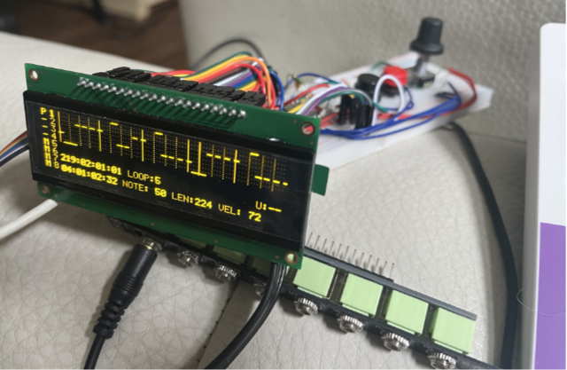

[](https://polyformproject.org/licenses/noncommercial/1.0.0/)

# Midi Looper #


This Midilooper has been created with help of chatgpt and later Cursor. It has proven to be a great tutor to help me guide and understand every added feature's logic. It saved me a lot of time looking for the correct approach or answers on how to tackle things.

The main inspiration was taken from this minimalistic 4 track looper using only 2 buttons and 4 digits:
https://iestyn-lewis.github.io/4by8/

## Hardware ##
- 1x Teensy 4.1
- 2x momentary buttons
- 1x encoder with push button
- 1x 256x64 4bit monochrome display type [NHD-3.12-25664UCY2](https://nl.mouser.com/ProductDetail/Newhaven-Display/NHD-3.12-25664UCY2?qs=EQmeiuRlVUSdkL9ZYPHyoA%3D%3D) (there is also code for using a liquid lcd display 16x2)
- 1x 6N137

The midi circuit is based on https://www.pjrc.com/teensy/td_libs_MIDI.html

## Installation ##
The project uses a modified [SSD1322 library](https://github.com/Lytrix/SSD1322_OLED_Arduino_library/tree/develop/) adding TsyDMASPI to be able to reduce CPU usage running via DMA. To add it use this command when cloning the repo:

`git clone https://github.com/Lytrix/MidiLooper.git --recurse-submodules`


## Features ##
Multi-track MIDI looper with full undo/redo, auto-save/load, and clear visual feedback—ready for live performance or creative studio work!

- 4 Midi Tracks
- 192 PPQN internal clock for live recording
- 24 PPQN midi Sync
- 256x64 display and 16x2 display driver
- 2 button operation   
- 99 Undos per track (overdub and clear)
- Track clear Undo (restore last cleared track)
- Overdub Undo (revert last overdub layer)
- **Loop Start Point Editing** (dynamic loop start position control with fader)
- **Loop Length Editing** (1-128 bars with CC control and automatic fader feedback)
- **Note Length Editing Mode** (toggle between position and length editing for notes)
- Automatic saving after each edit (record, overdub, undo, clear) and full recall of your Loops on SD card when powering up.
- Reload last used state and loops on startup
- Robust state machine for all track transitions
- Visual feedback for all actions and states on both displays
- 256x64 OLED display with piano roll visualization
- 16x2 LCD display with essential info
- SD card storage for loop data
- Comprehensive undo/redo system with multiple history stacks
- Real-time MIDI playback with precise timing
- Multi-layer overdubbing with separate undo states
- Track muting and solo functionality
- Automatic loop synchronization
- Motorized fader support with feedback prevention
- Dedicated edit modes for different operations
- Full wrap-around support for notes crossing loop boundaries

## ✏️ Note Editor ##
- Piano-roll note editor integrated into the looper UI
- Encoder-driven movement of note start positions, with seamless wrap-around support
- Raw note end tick stored intact; wrapping logic is deferred to display and playback layers
- Intelligent overlap resolution:
  - Left-to-right moves delete overlapping notes
  - Right-to-left moves shorten overlapping notes (down to a 1/16th-step) and delete if too short
  - Direction-aware restoration of previously deleted or shortened notes when moving away
- Selection bracket and highlight visually track the moving note
- Host-side unit tests in `test/` to validate wrap logic and edit behavior

## 🔄 Loop Start Point Editing ##
- **Dynamic loop start control** via Fader 1 (Pitchbend Channel 16) in LOOP_EDIT mode
- **Same positioning logic as note select fader** - uses note start positions OR 16th-note step positions for precise control
- **1000ms grace period** before automatic endpoint adjustment to prevent unwanted changes during movement
- **Automatic endpoint updating** maintains bar-based loop length relative to new start point
- **Complete display system integration** - all MIDI events, cursor, and bracket adjust to show content relative to loop start
- **Full undo/redo support** - single undo state allows return to original loop start point
- **Seamless integration** with existing note editing system - all faders work correctly with relative positioning

## 🎛️ Loop Length Editing ##
- **Dynamic loop length control** via CC 101 on Channel 16 in LOOP_EDIT mode
- **Bar-based editing** - maps CC values (0-127) to loop lengths (1-128 bars)
  - CC 0 = 1 bar
  - CC 127 = 128 bars
  - Linear scaling between these values
- **Non-destructive editing** - preserves all existing MIDI events when changing loop length
- **Automatic fader feedback** - sends current loop length back to controller when switching tracks or entering LOOP_EDIT mode
- **Real-time display updates** - piano roll and timing display adjust automatically to new loop length
- **Track-specific lengths** - each track can have its own loop length independent of others

## 📏 Note Length Editing Mode ##
- **Toggle between position and length editing** via Note 3 on Channel 16 (momentary button)
- **Two distinct editing modes**:
  - **Position Edit Mode** (default): Faders 1, 2, 3 control note START positions
  - **Length Edit Mode**: Faders 1, 2, 3 control note END positions (length editing)
- **Seamless mode switching** with automatic fader position updates
- **Visual feedback** - console logs clearly indicate which mode is active
- **Integrated with all fader controls**:
  - Fader 1: Note selection (works in both modes)
  - Fader 2: Coarse position control (16th-note steps)
  - Fader 3: Fine position control (tick-level precision)
- **Minimum length enforcement** - prevents notes from becoming shorter than 1/16th note
- **Wrap-around support** - note lengths can extend across loop boundaries

For detailed technical documentation, see: [`docs/LOOP_START_EDITING.md`](docs/LOOP_START_EDITING.md)

## 🔴 Button A – Recording, Overdubbing, Playback, Undo, Redo, and Clear ##

| Press #     | From State               | To State                 | Symbol Change | Key Action           |
| ----------- | ------------------------ | ------------------------ | ------------- | -------------------- |
| 1× (single) | `TRACK_EMPTY`            | `TRACK_RECORDING`        | – → R         | `startRecording()`   |
| (internal)  | `TRACK_RECORDING`        | `TRACK_STOPPED_RECORDING`| (not shown)   | `stopRecording()`    |
| (internal)  | `TRACK_STOPPED_RECORDING`| `TRACK_PLAYING`          | (not shown)   | `startPlaying()`     |
| 1× (single) | `TRACK_PLAYING`          | `TRACK_OVERDUBBING`      | P → O         | `startOverdubbing()` |
| 1× (single) | `TRACK_OVERDUBBING`      | `TRACK_PLAYING`          | O → P         | `stopOverdubbing()`  |
| **Double**  | Any (with undo history)  | No change                | No change     | `undoOverdub()`      |
| **Triple**  | Any (with redo history)  | No change                | No change     | `redoOverdub()`      |
| Long        | Any (with data)          | `TRACK_EMPTY`            | → –           | `clearTrack()`       |


## 🔵 Button B – Track Select, Mute, Undo Clear, and Redo Clear ##

|  Press #    | From State         | To State           | Key Action                 |
| ----------- | ------------------ | ------------------ | -------------------------- |
| 1× (single) | Selected Track     | Select next track  | `setSelectedTrack()`       |
| Long        | Any                | Mute/Unmute        | `toggleMuteTrack()`        |
| **Double**  | Cleared track      | Restore last clear | `undoClearTrack()`         |
| **Triple**  | Any (with redo)    | Redo last clear    | `redoClearTrack()`         |


- Retroactive bar-quantized recording (record complete bars, but allow earlier recording start)
```
| 1   2   3   4 | 1   2   3   4 |  
          ^ You press record here (beat 3)
                		    	^ You press stop here (beat 4)  

New Loop ready for overdub to add the notes in the first bar.
| 1   2   3   4 | 1   2   3   4 |   
```


## 🔄 Undo/Redo System ##

The looper provides comprehensive undo/redo functionality for both overdub and clear operations:

- **Per-track history:** Each track maintains its own undo/redo history for both overdubs and clears.
- **Automatic snapshots:** Undo snapshots are automatically created before overdubs, edits, and clears.
- **Hash-based optimization:** Edit operations that result in no net changes automatically discard their undo snapshots.
- **Triple press redo:** Redo functionality is accessed via triple press on buttons A and B.

### Button Controls:
- **Button A Double Press:** Undo last overdub operation
- **Button A Triple Press:** Redo last undone overdub operation  
- **Button B Double Press:** Undo last clear operation
- **Button B Triple Press:** Redo last undone clear operation

### Technical Details:
- Undo history is preserved across sessions via SD card storage
- Redo history is cleared when new operations are performed (standard behavior)
- Maximum undo history is configurable via `Config::MAX_UNDO_HISTORY`
- Both physical buttons and MIDI buttons support the same undo/redo controls

## 🔧 Module Relationships and Data Flow ##

| Module         | Key Data                            | Connected Modules             | Purpose                                                                 |
|----------------|--------------------------------------|-------------------------------|-------------------------------------------------------------------------|
| `ButtonManager`| Button press type, `millis()`       | `TrackManager`, `ClockManager`| Triggers recording/playback/overdub/mute/clear/undo actions             |
| `TrackManager` | `selectedTrack`, `masterLoopLength` | `Track`, `ClockManager`       | Manages track states and coordination, handles quantized events         |
| `Track`        | `MidiEvent`, `NoteEvent`, `startLoopTick`, `loopLengthTicks`, `loopStartTick` | N/A                           | Stores MIDI events, track state, loop parameters, and cached note data |
| `ClockManager` | `masterLoopLength`, `currentTick`   | `TrackManager`, `MidiHandler` | Distributes timing across all tracks, manages master loop synchronization |
| `MidiHandler`  | MIDI events, channel routing        | `ClockManager`, `NoteEditManager` | Handles MIDI I/O, event filtering, and channel management              |
| `NoteEditManager`| `selectedNoteIdx`, `bracketTick`, `editMode`, `loopStartTick`, `lengthEditingMode` | `Track`, `MidiHandler`, `DisplayManager` | Manages note selection, editing, loop start/length control, and fader integration |
| `DisplayManager`| Visual state, display buffer       | `NoteEditManager`, `Track`    | Renders piano roll, track info, and real-time visual feedback          |


## Software development journey ##
Some of the chat can be viewed here of my journey. 
 
MidiLooper (First one. Got really messy with too many workarounds, but with auto load/save functionality from SD)
https://chatgpt.com/share/680a4839-6720-800b-ae73-9aff16f6e41f

MidiLooperV2 (Simpler switch logic for tracks, focussing on workflow logic)
https://chatgpt.com/share/680e999a-c860-800b-a079-9862a59f1e89

MidiLooperV3 (Started off from a framework in C++, hope it will be more stable to use)
https://chatgpt.com/share/680e98f9-2a64-800b-abb2-4e1bd359c90f

Developing the SSD1322 circular DMA logic was a lot of fun using Cursor. It was really helpfull to have an LLM model explain someone elses 2000+ lines of code in how the logic worked I wanted to port to this display. 

## Technical Documentation ##
Detailed technical documentation is available in the `docs/` directory:

- **[Loop Start Editing](docs/LOOP_START_EDITING.md)** - Comprehensive guide to the loop start point editing system
- **[Loop Start Implementation Summary](docs/LOOP_START_IMPLEMENTATION_SUMMARY.md)** - Implementation phases and issues resolved
- **[Loop Length and Note Length Editing](README.md#🎛️-loop-length-editing)** - Complete guide to loop length control and note length editing modes
- **[Fader State System](docs/FADER_STATE_SYSTEM.md)** - Hardware fader management and state machine
- **[Move Note Logic](docs/MOVE_NOTE_LOGIC.md)** - Note movement and overlap resolution system
- Additional implementation and refactoring documentation

© 2025 Lytrix (Eelke Jager)
Licensed under the PolyForm Noncommercial 1.0.0.  
Private use for further development with mentioning me as author is allowed. 
For any commercial use or distribution please contact me for a separate license.  

## Examples ##
The `/examples` directory contains working examples and demonstrations:

- **[Button Configuration Example](examples/ButtonConfiguration40Example.cpp)** - Complete MIDI button mapping configuration
  - Includes loop editing controls (loop length via CC 101, note length mode via Note 3)
  - Demonstrates all edit modes and their MIDI mappings
  - Shows channel routing and parameter mapping
  - 40-button configuration with transport controls and extended features

**Loop Editing Examples:**
- **Loop Length Control**: Send CC 101 on Channel 16 with values 0-127 to set loop length from 1-128 bars
- **Note Length Mode**: Press Note 3 on Channel 16 to toggle between position and length editing modes
- **Loop Start Editing**: Use Fader 1 (Pitchbend Channel 16) in LOOP_EDIT mode to adjust loop start point
