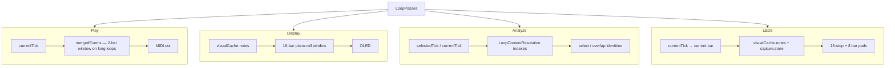

# Runtime architecture — derived representations

**Parent:** [RuntimeArchitecture.md](RuntimeArchitecture.md)

**Naming:** “Derived view” in diagrams means **derived representation** in prose and new docs. Avoid new `*View` type names in code ([NAMING.md](../NAMING.md)).

---

## Question

> How should the authoritative timeline be represented for runtime consumers?

A derived representation is **not** owned by a consumer. It has an owner, revision, invalidation rules, and build policy.

It is **not** the same as a window or interval — one representation can be projected onto many intervals.

---

## Consumers — play, display, analyze, LEDs

Hot-path work stays a **short window** of data, not the whole loop. Each consumer has its own origin tick, representation, and interval. They do not share one list.



| Consumer | Origin | Reads | Does not read |
|----------|--------|-------|----------------|
| **Play** | `currentTick` | `LoopPlaybackRuntime.mergedEvents` (MIDI events) | `visualCache` |
| **Display** | paint window | `visualCache.notes` / `capturePreview.notes` (`DisplayNote`s) | `mergedEvents` |
| **Analyze** | `selectedTick` (NOTE_EDIT) or `currentTick` (overdub overlap) | Prepared `LoopContentResolution` (`tickEvents`, `spanBoundaries`, `resolveState`, `resolveWindow`) | A reconstructed whole-loop `DisplayNote` list |
| **LEDs** | current bar / 16th | `visualCache.notes` (committed presence) + `loop.capture.store` when capture is active | `mergedEvents`; LCR; a gather into a private LED list |

**Play today:** `Track::playMidiEvents` phases `currentTick`, then walks `mergedEvents` in `playbackOrder`. `ensurePlaybackMergedMidiEventsBuilt` fills that list from pass gather (`gatherCommittedEventsInWindow` = 2 bars on long loops; full gather on short). Live overdub also walks `loop.capture.store`. NOTE_EDIT still full-replaces `mergedEvents` from `sessionMidiEvents()` — target is the play window plus settled overlay `NoteId`s (DEC-037 Editor amendment).

**Display today:** OLED filters `visualCache.notes`. Idle `rebuildVisualCacheIdleSlice` fills dirty bars (2–4 bars). When `tryResolvePreparedWindow` matches `playbackRevision`, that slice comes from `resolveWindow`; otherwise gather + reconstruct. Paint is not playback.

**Analyze target:** same window shape as play. Overdub overlap already aims at `resolveState(currentTick)`. NOTE_EDIT hydrate moves select / overlap onto the same indexes around `selectedTick` ([`note_edit_hydrate_enhancement.md`](../../Plans/note_edit_hydrate_enhancement.md)). Prepared miss stays legacy (`visualCache` / today’s gather). LCR is not a second `visualCache`; it does not store `DisplayNote`s. **Overdub overlap authority** (consume vs display across wrap): [`overdub_lifecycle_representation_authority.md`](../../Plans/overdub_lifecycle_representation_authority.md).

**LEDs today:** `MidiLedManager::hasNoteOnInRangeForLed` is the content query. Sixteen-step pads (`analyzeAndUpdateBar`) and eight bar pads (`updateBarLeds`) ask “does a note start in this storage range?” They scan `visualCache.notes` (`DisplayNote` start ticks). While overdubbing they also scan `loop.capture.store`. Empty `visualCache.notes` means no committed presence — they do **not** flatten or gather. `prepareLedNoteLookup` does not fill a private list. Tick-row pads (notes 16–31) are clock only (`updateCurrentTick`). Track-select and loop-select pads are slot state (`updateTrackSelectLeds`: `trackHasData` / `slotVelocities`), not timeline content.

`visualCache` stays the piano-roll list. Deleting it is not this model. LED pads reuse that list; they do not own a second copy.

---

## Pipeline

```
Capture Storage
        │
        ▼
Derived Event Representation
        │
        ├──────────────┬──────────────┬──────────────┐
        ▼              ▼              ▼              ▼
   Play window    Display list    Analyze indexes  LED pads
   mergedEvents   visualCache     LoopContentResolution
        │              │              │              │
        ▼              ▼              ▼              ▼
   playMidiEvents  DisplayManager  select / overlap  MidiLedManager
                         │
                         └─ LED pads also read visualCache.notes + capture.store
```

---

## Owner table (brownfield)

| Representation | Owner | Storage (today) | Revision | Build policy | Consumers |
|----------------|-------|-----------------|----------|--------------|-----------|
| **Event (loop)** | `Loop` | `passesMaterializedStore_` / `midiEvents()` | Materialize dirty | On demand; not on MIDI-clock tick | Playback seed, display reconstruct input |
| **Event (NOTE_EDIT)** | `EditManager` | `NoteEditSession.store` | `sessionPreviewRevision_` | On geometry commit / store write | `sessionMidiEvents()`, overlap analyze |
| **Display** | `Loop` | `visualCache.notes`, `capturePreview.notes` | `revision` fields | **Target:** idle-deferred when dirty; not every PLAYING frame | `DisplayManager` |
| **Playback order** | `Track` / `LoopPlaybackRuntime` | `mergedEvents`, `playbackOrder` | Runtime rebuild flag | Prewarm off hot path; rebuild on transport / invalidation | `playMidiEvents` |
| **LED bar hint** | `MidiLedManager` | Reads `visualCache.notes` + `capture.store`; no private gather list | Inherits display revision | Bar change / wrap only; do not flatten when cache empty | 16-step + 8 bar pads |
| **Analyze indexes** | `Loop` / `LoopContentResolution` | Prepared `tickEvents` / `spanBoundaries` | `playbackRevision` stamp | Idle / STOPPED construct; consume when stamp matches | Overdub overlap today; NOTE_EDIT select / overlap (hydrate target) |

**Exception:** `NoteEditSession.store` is a live **overlay** on passes during edit — not a pure derivative of `materialize()` alone. Tier-2 playback audition **target** (DEC-037 Editor amendment 2026-08-16): overlay selected + participating overlap `NoteId`s onto the playback window around `currentTick`. Today’s firmware still full-replaces `mergedEvents` from `sessionMidiEvents()`; that replace is not the architecture.

---

## Runtime requests

Combine **representation + `TickInterval`**:

```
Runtime Request = Derived Representation × Interval → Consumer result
```

| Consumer | Representation | Interval example |
|----------|----------------|------------------|
| Play | Event representation (`mergedEvents`) | 2-bar window on long loops; full gather on short; phase at `projectionCycleStartTick` |
| Display | Display representation | Detailed 16-bar `TickInterval` on piano roll |
| LED (16-step + bar pads) | `visualCache.notes` + `capture.store` | Current bar (16 sixteenths) and bars 0–7 |
| NOTE_EDIT select | Prepared LCR `tickEvents` / `spanBoundaries` + Edit projection context | Bounded onset/navigation neighborhood around `selectedTick`. Not `resolveState` (DEC-037 Editor amendment 2026-08-16). v1 `[0, loopLength)` withdrawn |
| NOTE_EDIT overlap | Prepared LCR indexed identities (`resolveState` at S; window identities in `[S, E)`) + `NoteGeometryResolver` | Selected span after mover stop + one display-update trigger. Identities then `appendNoteEvents`; not a reconstructed `DisplayNote` vector. Prepared miss is legacy compatibility only. |

Same interval, different consumers:

```
TickInterval bars 8–24
    → Playback: send MIDI events in projected phase range
    → Display: filter DisplayNotes intersecting window
    → LEDs: note-present query for bar indices in range
```

---

## Invalidation rules

1. **Storage mutation** → invalidate event representation → cascade to display + playback representations.
2. **Consumer** checks revision; if stale, **asks owner** to rebuild (or accepts deferred staleness per policy).
3. **Consumers must not** call `ensureVisualCacheBuilt()` / `materializeToEventVector()` on hot paths (PLAYING, per-CC fader) — owner schedules on idle or explicit refresh.

---

## Incremental build

`VisualCache.dirtyBars` is the seed for **bar-granular** idle rebuild. That path is shipped.

`Loop::rebuildVisualCacheIdleSlice` finds the next dirty bar, rebuilds up to 2–4 consecutive dirty bars (plus one-bar gather pad), splices those notes into `visualCache.notes`, and clears those flags. `slice_clean` when none remain. Paint does **not** rebuild on window move: `resolveWindowedDisplayNotes` filters a non-empty `visualCache.notes` with `filterDisplayNotesByWindowInclusion` over the paint window plus follow margin (`kWindowedGatherMarginBars`, at least `kFollowReadyLookaheadBars`).

`visualCacheCoversWindow` authorizes a neighborhood when every bar in the window (plus optional lookahead) is clean, even if the rest of the loop is dirty. Incremental committed / overdub paint still filters a non-empty cache while globally dirty so auto-follow can show the next bar; `overdubSourceViewNotes` is consume ownership, not display authority.

What is **not** per-bar yet:

- `rebuildVisualCacheFromPasses` still full-reconstructs (`ensureVisualCacheBuilt`, NOTE_EDIT open).
- `markDisplayCachesStale` still marks every bar dirty.

---

## Related

- [IntervalProjection.md](IntervalProjection.md) — interval math after representation exists
- [Display.md](Display.md), [Playback.md](Playback.md) — consumer contracts
- [note_edit_hydrate_enhancement.md](../../Plans/note_edit_hydrate_enhancement.md) — NOTE_EDIT analyze around `selectedTick`
- [INTERNAL_HEAP_AND_EXTERNAL_MEMORY.md](../../Guides/INTERNAL_HEAP_AND_EXTERNAL_MEMORY.md) — allocator tier for cold representations
