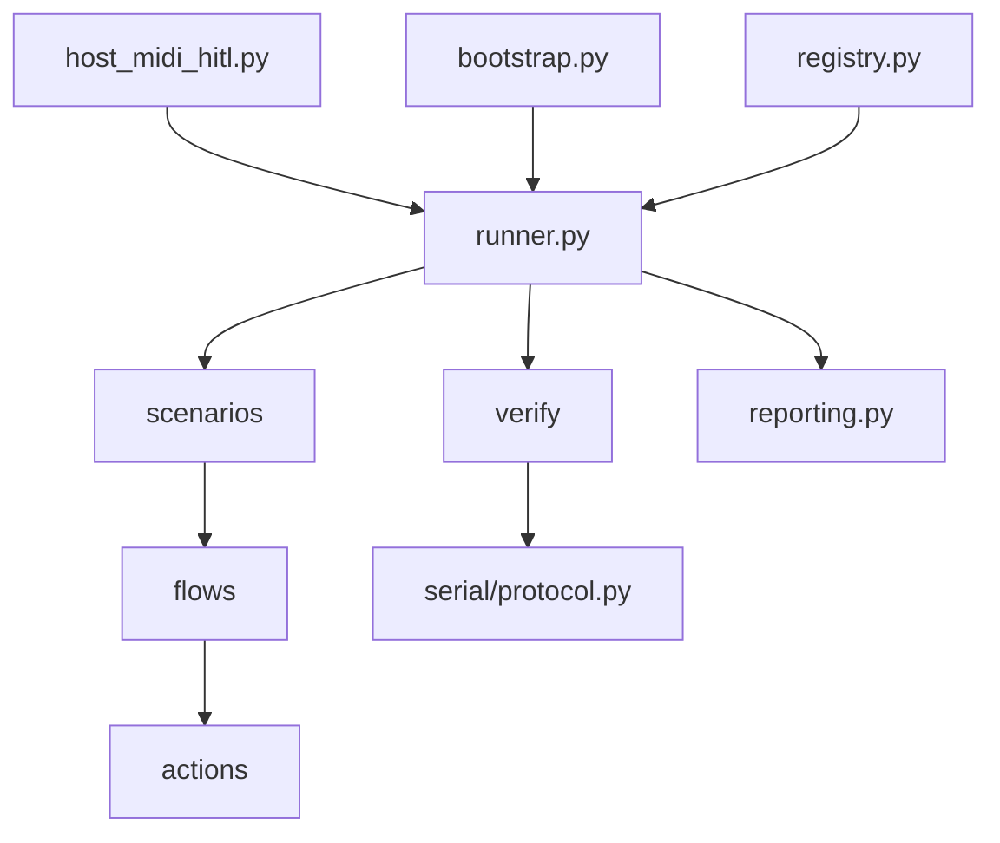

# HITL architecture

Canonical long-lived reference for the layered HITL framework. Migration plan: [`docs/Plans/hitl_cli_rebuild_enhancement.md`](../../Plans/hitl_cli_rebuild_enhancement.md). Major changes after migration: OpenSpec + DEC (§12.5).

## 1. Stable invariants vs implementation

**Guiding principle:** Do not introduce a layer until multiple independent responsibilities naturally require it.

### Stable invariants (long-lived — survive refactors)

- Dependencies flow **downward only**.
- Every concept has **exactly one owner** (see §2).
- **Flows are stateless** — no mutable runtime state in flow modules.
- **Protocol parsing** exists in exactly one place (`serial/protocol.py`).
- **Time waits** live in `actions/`; **observation waits** live in `verify/`.
- Scenarios express intent; they do not parse `#CAP` or send MIDI.
- **Extensibility:** new scenarios compose existing **flows** first; add new **actions** only when the hardware interaction is genuinely new.
- **No `ScenarioRunner` initially** — `runner.py` calls `spec.run(ctx)` directly. Introduce a dedicated execution layer later only if retries, tracing, cancellation, timeouts, or middleware accumulate.
- **Regression knowledge** — successful HITL runs are project knowledge, not temporary output (see §11).
- **Executable specifications** — scenarios describe expected behaviour via flow composition, not hardware steps (see §5.6).
- **Deterministic scenarios** — same firmware + config + inputs → same observable behaviour (see §12.4).
- **Immutable corpus** — never overwrite successful bundles; corrections create new bundles (see §11.6).
- **Boring architecture** — no speculative abstractions (see §12.1).
- **Architectural evolution** — after migration, major HITL architecture changes go through OpenSpec / DEC, not silent edits to `HITL_ARCHITECTURE.md` (see §12.5).

### Implementation (may evolve)

Module names and file layout below are **today's mapping**, not part of the contract. Refactors may rename or split files without changing invariants.

Examples: `bootstrap.py`, `reporting.py`, `flows/record_seed.py`, per-scenario files under `scenarios/`, capture bundle directory layout under `captures/`.

---

## 2. Layering

```text
CLI (host_midi_hitl.py)
 ↓
cli.py                    ← argparse only
 ↓
bootstrap.py              ← HitlSession + ActionContext + ScenarioContext
 ↓
runner.py                 ← preset loop, verify-only mode, exit codes, reporting
 ↓
Scenario                  ← spec.run(ctx) → ScenarioResult
 ↓
Flows                     ← stateless semantic operations
 ↓
Actions                   ← device MIDI + time-based waits
 ↓
midi_io / transport_clock
 ↓
serial/protocol.py        ← decode #CAP (no pass/fail)
 ↓
verify/                   ← observation waits + assertions
 ↓
reporting.py              ← JSON from ScenarioResult + VerificationResult
 ↓
Firmware
```



**Dependency rule:** imports flow downward only.

---

## 3. Single-owner principle

Every concept has exactly one owner.

**One obvious place:** every capability should have one obvious module to implement it. When adding functionality, extend the existing owner — avoid secondary helper modules and duplicate implementations (e.g. no `capture_helpers.py`, `capture_common.py`, `capture_utils.py` when `verify/capture.py` already owns capture assertions).

| Concept | Owner module |
|---------|----------------|
| CLI argument parsing | `cli.py` |
| Runtime assembly (ports, contexts) | `bootstrap.py` |
| Open resources (MIDI, serial collector) | `HitlSession` in `session.py` |
| Device-time runtime state (markers, ports ref) | `ActionContext` in `context.py` |
| Scenario identity + artifact paths (no execution mode) | `ScenarioContext` in `context.py` |
| Protocol decoding (`#CAP` regex) | `serial/protocol.py` only |
| Time-based waits (sleep, hold, clock poll) | `actions/` |
| Observation waits (transitions, capture complete) | `verify/` |
| Device operations (press, encoder, transport) | `actions/` |
| Semantic multi-step operations | `flows/` |
| Pass/fail assertions | `verify/` |
| Scenario wiring | `scenarios/` (via `ScenarioSpec.run`) |
| Scenario definitions, presets, verifier lookup | `registry.py` |
| JSON report + capture bundle output | `reporting.py` |
| Regression corpus layout + metadata | `reporting.py` (bundle writer) |
| Preset loop, verify-only mode, exit codes, timeouts | `runner.py` |

---

## 4. Context hierarchy

### `HitlSession` (`session.py`)

Owns open MIDI ports, optional `SerialCaptureCollector`, serial line snapshot accessor. No scenario metadata.

### `ActionContext` (`context.py`)

Passed to **flows** and **actions** only:

```python
@dataclass
class ActionContext:
    session: HitlSession
    config: HitlConfig
```

Convenience properties: `out_port`, `in_port`, `collector`, `markers` (markers live on session).

### `ScenarioContext` (`context.py`)

Passed to **scenarios** only; wraps `ActionContext`. **No execution-mode flags** — `verify_only` is owned by `runner.py`.

```python
@dataclass
class ScenarioContext:
    action: ActionContext
    scenario_id: str
    out_dir: Path
    started_at: datetime
    # report_writer hook optional; scenarios do not call reporting directly
```

Scenarios call `flows.record_seed(ctx.action)` — flows never see report paths or CLI execution policy.

---

## 5. Invariants (detail)

### 5.1 Flows are stateless

> Flows never own mutable runtime state.

All mutable runtime state lives in `HitlSession` and `ActionContext` / session markers. Flow functions compose actions; they do not store scenario-local globals or module-level caches.

### 5.2 Waiting responsibilities

| Kind | Owner | Examples |
|------|-------|----------|
| **Time waits** | `actions/` | `sleep_ms`, button hold duration, MIDI clock poll timeout |
| **Observation waits** | `verify/` (during run, via serial tail poll helpers used by flows through a narrow `verify/wait.py` facade if needed) | wait until `ST` transition count, `RECS` row, capture complete |

**Rule:** Actions never parse `#CAP` lines. Verifiers never send MIDI. If a flow must block until firmware reaches a state, it calls a **verify wait helper** (observation), not an action.

### 5.3 Protocol parsing

> Every `#CAP` / `ST` / `RECS` / `DISP` / `MO` regex exists in exactly one module: `serial/protocol.py`.

Verifiers import parsers; they do not duplicate regex.

### 5.4 Scenarios hide protocol

Scenarios express intent:

```python
def run(scenario_ctx: ScenarioContext) -> ScenarioResult:
    flows.record_overdub(scenario_ctx.action)
    return ScenarioResult(
        observations={},
        markers=scenario_ctx.action.session.markers,
        artifacts={},
    )
```

`runner.py` coordinates run → verify → report and derives process exit codes:

```python
if config.verify_only:
    lines = read_serial_log(config)
    verification = registry.verify(spec.verifier_id, lines, scenario_ctx)
    result = None
else:
    result = spec.run(scenario_ctx)
    lines = scenario_ctx.action.session.snapshot_lines()
    verification = registry.verify(spec.verifier_id, lines, scenario_ctx)
exit_code = reporting.write_and_exit_code(spec, result, verification, scenario_ctx)
```

### 5.5 Extensibility

> New scenarios should normally be created by composing existing flows rather than introducing new device actions.

Add new **actions** only when the hardware interaction itself is genuinely new (e.g. a new button class or encoder gesture). This keeps the action layer stable and encourages reuse.

### 5.6 Scenarios are executable specifications

> A scenario describes **what behaviour is expected**, not **how** it is implemented.

Scenarios read like executable specifications — they compose **flows** that express user intent and expected firmware behaviour. Implementation details belong in flows and actions, never in scenarios.

Good:

```python
def run(ctx: ScenarioContext) -> ScenarioResult:
    flows.record_seed(ctx.action)
    flows.enter_note_edit(ctx.action)
    flows.move_note(ctx.action)
    flows.exit_note_edit(ctx.action)
    return ScenarioResult(observations={}, markers=ctx.action.session.markers, artifacts={})
```

Avoid:

```python
press(Button.RECORD)
sleep_ms(150)
rotate_encoder(4)
press(Button.OK)
```

---

## 6. Core types

### `HitlConfig` (`config.py`)

Immutable run configuration: track, channel, bars, ports, timing, serial mode A/B, loop_slot, **`verify_only`**. Built by `cli.py`. Execution policy stays in config + runner, not in `ScenarioContext`.

### `ScenarioResult` (`types.py`)

Domain-oriented output from a scenario run. **No `exit_code`** — the runner derives process exit from `ScenarioResult` + `VerificationResult`.

```python
@dataclass
class ScenarioResult:
    observations: dict[str, object]   # scenario-specific counters, notes sent, etc.
    markers: list[str]                # serial marker lines collected during run
    artifacts: dict[str, Path]          # e.g. serial_path, snapshot paths
```

### `VerificationResult` (`verify/result.py`)

Replace ad-hoc `dict` returns. Verification accelerates debugging — every failure should answer: what failed, what was expected, what was observed, and where to investigate next.

```python
@dataclass
class VerificationFailure:
    check: str                        # e.g. "ST transition after record stop"
    expected: str
    observed: str
    serial_line: int | None = None    # first divergence in serial.log
    known_good_bundle: str | None = None
    suggestion: str | None = None     # e.g. "Compare ST sequence with known-good bundle"

@dataclass
class VerificationResult:
    passed: bool
    warnings: list[str]
    failures: list[VerificationFailure]   # actionable diagnostics, not bare strings
    metrics: dict[str, object] = field(default_factory=dict)
    attachments: dict[str, object] = field(default_factory=dict)

    @property
    def ok(self) -> bool:
        return self.passed and not self.failures
```

Example console output on failure:

```text
FAIL  scenario: record_overdub
  Expectation: RECORDING → PLAYING after STOP
  Observed:    RECORDING → STOPPED
  Known-good:  captures/2026-07-31_uip_5_5
  First divergence: serial line 421
  Suggestion: Compare ST transition sequence with known-good bundle
```

All verifiers return `VerificationResult`. `reporting.py` serializes failures into `report.json`.

### Registry (`registry.py`)

**Single owner** for:

| Responsibility | Type / API |
|----------------|------------|
| Scenario definitions | `ScenarioSpec` (id, description, tags, verifier_id, `run` callable) |
| Preset definitions | `PresetSpec` (scenario_ids, tags) |
| Verifier lookup | `get_verifier(verifier_id)` / `verify(verifier_id, lines, ctx)` |

```python
@dataclass(frozen=True)
class ScenarioSpec:
    id: str
    description: str
    tags: tuple[str, ...]
    verifier_id: str | None          # e.g. "capture", "playback", "display"
    run: Callable[[ScenarioContext], ScenarioResult] | None = None
    # Future metadata (no pipeline change required):
    # expected_runtime_s, timeout_s, hardware_requirements, prerequisites, ...
```

`ScenarioSpec` intentionally allows metadata expansion (timeouts, hardware requirements, tags, prerequisites) without changing the execution pipeline — `runner.py` reads fields as they are added.

Presets reference scenario ids; registry resolves `ScenarioSpec` + verifier factory:

```python
PRESETS: dict[str, PresetSpec] = {
    "base": PresetSpec(scenario_ids=("record_overdub",), tags=("record",)),
    "uip_5_5": PresetSpec(
        scenario_ids=("record_seed", "edit_minimal", "long_loop_display_window", "slot_queued_start"),
        tags=("uip", "gate"),
    ),
}
```

---

## 7. Module layout (implementation — may evolve)

```text
scripts/
  host_midi_hitl.py
  hitl/
    config.py
    cli.py
    bootstrap.py              # HitlSession + ActionContext + ScenarioContext (narrow)
    session.py
    context.py                # ActionContext, ScenarioContext
    types.py                  # ScenarioResult, shared dataclasses
    runner.py                 # preset loop: run → verify → report → exit code
    reporting.py              # JSON reports (not in bootstrap)
    registry.py               # ScenarioSpec, PresetSpec, verifier lookup
    actions/
      buttons.py
      encoder.py
      transport.py              # time waits + clock poll
      track.py
    flows/
      record_seed.py
      record_overdub.py
      clear_slot.py
      queued_switch.py
      note_edit_smoke.py
      long_loop_display.py
    serial/
      protocol.py
    verify/
      result.py
      capture.py
      playback.py
      display.py
      transitions.py            # observation waits + assertions
    scenarios/
      record_seed.py
      record_overdub.py
      edit_minimal.py
      long_loop_display_window.py
      slot_queued_start.py
```

**`bootstrap.py`** (not `factory.py`): create config-backed session and contexts only. No report generation, no verify dispatch, no CLI parsing.

---

## 8. Layer dependencies (positive rules)

Each layer may depend only on what it needs. Everything else is disallowed; `test_hitl_import_gate.py` enforces this.

| Layer | May depend on |
|-------|----------------|
| **Scenarios** | `flows`, `context` (ScenarioContext), `config`, `registry` (types only) |
| **Flows** | `actions`, `context` (ActionContext), `config` |
| **Actions** | `midi_io`, `transport_clock`, `control_constants`, `ActionContext` |
| **Verify** | `serial.protocol`, `VerificationResult`, `HitlConfig`, `ScenarioContext` (read-only) |
| **Runner** | `bootstrap`, `registry`, `reporting`, `verify`, `config`, `scenarios` (via registry) |
| **Reporting** | `ScenarioResult`, `VerificationResult`, `ScenarioSpec` |

Implicit rule: lower layers never import higher layers (`actions` does not import `flows`; `verify` does not import `actions`).

### Import gate (`test_hitl_import_gate.py`)

Mirror the table above for scenarios and flows first (highest regression risk). Expand to actions/verify in Phase 1.

---

## 9. Composition (no scenario flags)

| Flow | Composes |
|------|----------|
| `flows.record_seed(action_ctx)` | clear → LOOP_EDIT precondition → arm → stream → stop |
| `flows.record_overdub(action_ctx)` | `record_seed` → overdub(s) → undo/redo |
| `flows.note_edit_smoke(action_ctx)` | enter NOTE_EDIT → fixture edits → exit |

Presets compose **scenarios**, not CLI flags:

| Preset | Scenarios |
|--------|-----------|
| `base` | `record_overdub` |
| `edit_minimal` | `record_seed`, `edit_minimal` |
| `uip_5_5` | `record_seed`, `edit_minimal`, `long_loop_display_window`, `slot_queued_start` |

`base` id retained for [HITL-Test-Flow.mdc](../../../.cursor/rules/HITL-Test-Flow.mdc).

---

## 10. Orchestration flow (`runner.py`)

`runner.py` owns: preset iteration, **verify-only mode**, timeout policy (future), cancellation (future), metrics (future), reporting, and **process exit codes**.

```python
for spec in resolved_scenarios:
    scenario_ctx = bootstrap.scenario_context(config, spec.id, ...)
    if config.verify_only:
        lines = read_serial_log(config)
        result = None
        verification = registry.verify(spec.verifier_id, lines, scenario_ctx)
    else:
        result = spec.run(scenario_ctx)
        lines = scenario_ctx.action.session.snapshot_lines()
        verification = registry.verify(spec.verifier_id, lines, scenario_ctx)
    exit_code = reporting.write_scenario(spec, result, verification, scenario_ctx)
```

**No `ScenarioRunner`.** If future requirements (retries, tracing, execution middleware, timeout wrappers) accumulate, introduce a dedicated execution layer then — with a well-defined purpose, not speculatively.

---

## 11. Regression knowledge & corpus

The HITL framework is both a **validation system** and a **behavioural archive** of the firmware. Over time it answers: what did correct behaviour look like, when did it change, and is the failure in firmware or in verification?

### 11.1 Invariant

> **Successful HITL runs are project knowledge, not temporary output.**

Every successful preset/scenario execution should produce artifacts that let future investigations answer:

- What did correct firmware behaviour look like?
- Which serial transitions occurred?
- Which timings were observed?
- Which reports were produced?
- Which firmware revision and git commit generated them?
- Which scenario configuration produced these results?

### 11.2 Regression-first workflow

Preferred order when investigating a regression:

```text
Regression reported
        ↓
Locate most recent successful capture for same preset/scenario
        ↓
Replay verification against archived capture (optional — verify-only mode)
        ↓
Run same scenario on current firmware
        ↓
Compare reports → serial output → transitions → timings
        ↓
Explain behavioural difference
        ↓
Determine root cause → fix implementation (or strengthen verification)
```

**First question:** *How does today's behaviour differ from the last known-good behaviour?*

Compare behaviour against the regression corpus **before** weakening verification or adding ad-hoc debugging logic.

```text
Known-good capture → New failing capture → Compare observations → Identify differences → Then change code or verification
```

### 11.3 Capture bundle (stable format)

Treat capture artifacts as part of the public architecture. On **pass**, `reporting.py` writes a complete bundle (not report JSON alone):

```text
captures/
    2026-08-04_142115_uip_5_5/
        report.json       # VerificationResult + ScenarioResult summary per scenario
        serial.log        # full #CAP session (copied or symlinked from Mode B capture)
        metadata.json     # preset, scenario_ids, git_commit, firmware_version, timestamp, mode
        config.json       # HitlConfig snapshot (ports, bars, track, timing)
        firmware.txt      # build env / version string when available
```

Example `metadata.json`:

```json
{
  "schema_version": 1,
  "preset": "uip_5_5",
  "scenario_ids": ["record_seed", "edit_minimal", "long_loop_display_window", "slot_queued_start"],
  "git_commit": "...",
  "firmware_version": "...",
  "timestamp": "...",
  "mode": "Mode B"
}
```

`report.json` also carries `schema_version`. Treat capture bundles as a **public project format** — extend via additive fields; bump version on breaking changes. Older bundles must remain readable.

**Corpus growth:** `captures/` accumulates known-good behaviour over time — bisecting regressions, validating optimisations preserved external behaviour, and auditing verification rule changes against history.

### 11.6 Immutable evidence

The regression corpus is immutable historical evidence:

- **Never overwrite** a successful capture bundle.
- Every successful run creates a **new** bundle directory.
- Corrections create additional bundles — do not modify previous ones.

This preserves behavioural history for regression analysis and git bisect investigations.

**Migration note:** flat `session_*.log` files from [`capture_session.py`](../../../scripts/capture_session.py) remain valid during transition; new runs use bundle directories. `.current_session` can point at bundle `serial.log` or a shim path until Mode B is updated.

### 11.4 Developer & agent guidance

When a scenario has previously passed:

| Situation | Policy |
|-----------|--------|
| **Before changing firmware** | Search for prior successful runs of the same preset/scenario; compare against most recent known-good bundle; explain behavioural differences before proposing fixes |
| **Before changing verification** | Confirm prior expectation is genuinely wrong; compare multiple historical captures; prefer **strengthening** over weakening; never remove assertions solely to make a regression pass |
| **Before new scenarios** | Compose existing flows; new actions only for new hardware; reuse existing verifiers |

**Evidence priority:** report JSON, serial logs, captured artifacts, and metadata are primary evidence — not memory or abbreviated console output.

Document these rules in [`HITL_REGRESSION_WORKFLOW.md`](../../Guides/HITL_REGRESSION_WORKFLOW.md) (Phase 4) and reinforce via slim [HITL-Test-Flow.mdc](../../../.cursor/rules/HITL-Test-Flow.mdc).

### 11.5 Long-term objective

The corpus becomes executable documentation of expected behaviour — supporting questions such as:

- What did the firmware do when this feature originally shipped?
- When did this behaviour change?
- Which commit introduced the regression?
- Is verification incorrect, or has firmware behaviour changed?
- Does the current build still satisfy the historical behavioural contract?

---

## 12. Architectural philosophy

Long-term principles — not migration tasks. The framework optimises for: clear ownership, semantic composition, deterministic behaviour, executable specifications, preserved behavioural history, evidence-driven debugging, and incremental evolution.

### 12.1 Prefer boring architecture

Introduce abstractions only after multiple independent responsibilities demonstrate a stable pattern. Avoid speculative architecture.

**Do not build (unless concrete need emerges):**

- `ScenarioRunner` (until retries/middleware/tracing justify it)
- Legacy compatibility layer
- Plugin system
- Generic execution framework
- Service locator

Evolve from concrete requirements, not anticipated future complexity.

### 12.2 Domain vs infrastructure

| Domain (behavioural logic) | Infrastructure (execution) |
|----------------------------|----------------------------|
| Scenarios | Runner |
| Flows | CLI |
| Verification rules | Bootstrap |
| | Reporting |
| | Serial / MIDI transport |

Domain layers (scenarios, flows, verify) must not depend on **how** scenarios are executed. This allows future execution environments (CLI, CI, IDE tooling, automated regression) without changing behavioural logic.

### 12.3 Architectural decision checklist

Before introducing a new abstraction or module:

1. Does an existing owner already exist?
2. Can this be expressed by composing existing flows?
3. Is this domain logic or infrastructure?
4. Does this introduce a second owner?
5. Does this abstraction solve **at least two** independent use cases?

If the answer to (5) is no, extend the existing design.

### 12.4 Deterministic scenarios

Given the same firmware revision, configuration, scenario, and inputs, scenarios should produce the same observable behaviour.

Avoid:

- Hidden timing dependencies
- Random waits
- Persistent state leakage between scenarios
- Dependence on order of prior scenario execution without explicit setup

Deterministic scenarios greatly increase the long-term value of the regression corpus.

### 12.5 Architectural evolution

After migration completes, **major** changes to the long-lived HITL architecture should be introduced through **architectural decision records** (OpenSpec change + append to [`DECISION_LOG.md`](../../DECISION_LOG.md)), not by silently editing [`HITL_ARCHITECTURE.md`](HITL_ARCHITECTURE.md).

| Artifact | Role |
|----------|------|
| **`HITL_ARCHITECTURE.md`** | Describes the **current** system — what it is today |
| **OpenSpec change** (`openspec/changes/<name>/`) | Proposed delta: design, tasks, specs when behaviour or contracts change |
| **`DECISION_LOG.md` (DEC-###)** | Records **why** the architecture changed — durable rationale |

**Workflow for major HITL architecture changes:**

1. `/opsx:propose` (or equivalent) — design + tasks before implementation.
2. Implement; update `HITL_ARCHITECTURE.md` to reflect the **new** steady state.
3. Append DEC to `DECISION_LOG.md` with context, alternatives considered, and consequences.
4. Archive OpenSpec change when complete (`/opsx:archive`).

**Major** (requires DEC + OpenSpec): new layers or owners, dependency-rule changes, capture bundle schema breaks, verification contract changes, new top-level modules.

**Minor** (architecture doc edit only): clarifications, diagrams, typos, module renames that preserve invariants, additive bundle metadata with schema version bump documented inline.

This keeps `HITL_ARCHITECTURE.md` trustworthy six months later: the doc shows what exists; DECs explain how and why it got there.

