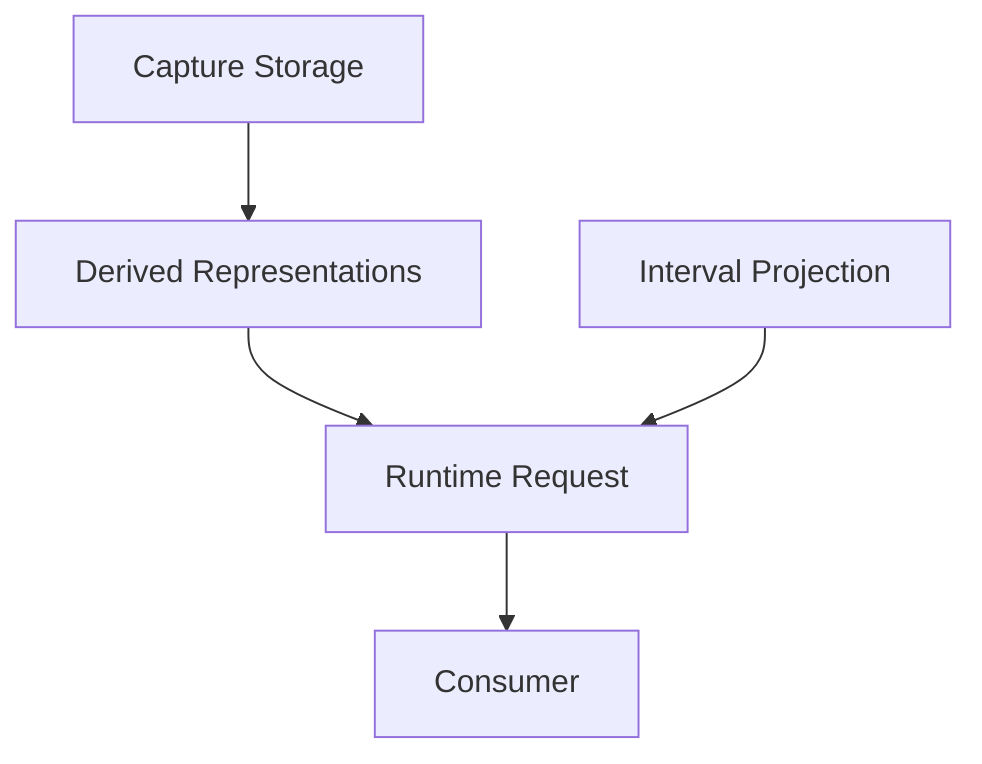

# Runtime architecture

**Authority:** structural model for how timeline data flows from storage to consumers. Subordinate to [ARCHITECTURE_RULES.md](../ARCHITECTURE_RULES.md). Behavior detail lives in [Guides](../../Guides/) and OpenSpec; this document defines **layers, ownership, and invariants**. **Decision:** [DEC-016](../../DECISION_LOG.md#dec-016-runtime-architecture-four-layer-model).

**Entry point for agents:** read this file first for display, playback, LED, or NOTE_EDIT read paths — then the layer-specific child doc.

**Naming:** [NAMING.md](../NAMING.md) — architectural vocabulary and concept boundaries.

---

## Four layers

Each layer answers one question. Do not collapse them.

```
Capture Storage          →  What is authoritative?
Derived Representations  →  How is it represented for runtime?
Interval Projection      →  Which tick range is relevant?
Runtime Request          →  Representation × interval → consumer input
```



| Layer | Question | Child doc |
|-------|----------|-----------|
| Capture storage | What is the authoritative timeline? | [Storage.md](Storage.md) |
| Derived representations | How should data be shaped for consumers? | [DerivedViews.md](DerivedViews.md) |
| Interval projection | Which part of the timeline matters? | [IntervalProjection.md](IntervalProjection.md) |
| Consumers | Who reads the result? | [Playback.md](Playback.md), [Display.md](Display.md); analyze and LEDs in [DerivedViews.md](DerivedViews.md) § Consumers |

**Invariant:** changing the active **interval** must not require rebuilding the full **representation** unless the representation’s source revision changed.

**Invariant:** changing **representation** must not change which **interval** projection selects — only what exists inside it.

---

## Runtime request (common language)

Every consumer is the same pattern:

```
Derived Representation  +  TickInterval  →  Consumer result
```

| Consumer | Representation (today) | Interval (today) |
|----------|------------------------|------------------|
| Play | `mergedEvents` + `playbackOrder` — not `visualCache` | 2-bar gather on long loops; full gather on short; phase via `projectionCycleStartTick` |
| Display | `visualCache.notes` / `capturePreview.notes` | Detailed 16-bar `TickInterval` + optional overview |
| Analyze | Prepared `LoopContentResolution` when the stamp matches; NOTE_EDIT still rematerializes today | Neighborhood around `currentTick` (overdub) or `selectedTick` (NOTE_EDIT target) |
| LEDs | `visualCache.notes` + `capture.store` (presence); tick row is `currentTick` only; track/loop select is slot state | Current bar (16 sixteenths) and bars 0–7 |

Intervals are **consumer-agnostic** — one `TickInterval` (e.g. bars 8–24) can feed playback, display, or LED queries; the consumer interprets the projected slice.

See [DerivedViews.md](DerivedViews.md) § Runtime requests.

---

## Dependency graph (data pipeline)

Representations depend on storage; consumers depend on representations — not on each other’s rebuild paths.

```
Capture Storage (passes, capture, chunks)
        │
        ▼
Derived Event Representation  (materialized MIDI / session store / LCR indexes)
        │
        ├──────────────────┬──────────────────┬──────────────────┐
        ▼                  ▼                  ▼                  ▼
   Play window        Display list       Analyze indexes    LED pads
   mergedEvents       visualCache        LoopContentResolution
        │                  │                  │                  │
        ▼                  ▼                  ▼                  ▼
   playMidiEvents     DisplayManager     select / overlap   MidiLedManager
                             │
                             └─ 16-step + bar pads read visualCache.notes + capture.store
```

**Rule:** consumers **request** a representation at an interval; they do **not** call peer rebuild APIs (`ensureVisualCacheBuilt` from `MidiLedManager`, etc.).

---

## Revisions (dependency chain)

Revisions are a **chain**, not independent flags. A consumer checks whether its inputs are stale relative to the chain.

```
Storage revision (passes / capture / session store mutation)
        │
        ▼
Event representation revision
        │
        ├─────────────┬─────────────┐
        ▼             ▼             ▼
Playback repr.   Display repr.  Analyze indexes
```

**Brownfield identifiers** (until rename migration):

| Concept | Field / API today |
|---------|-------------------|
| Storage dirty | pass publish, capture seal, `NoteEditSession.store` write |
| Display representation | `Loop::visualCache.revision`, `capturePreview.revision` |
| Playback representation | `LoopPlaybackRuntime` rebuild / `sessionPreviewRevision_` during NOTE_EDIT |
| Invalidate hook | `Track::invalidateCaches()` |

Target behavior: validate revision → schedule rebuild on owner → consumer reads when fresh enough for policy (immediate vs idle-deferred).

---

## Scheduling (responsibilities, not a mandated class)

Whether coordination lives on `Loop`, `Track`, a future scheduler, or `main.cpp` idle maintenance is an **implementation** choice.

Each derived representation **must** document:

| Field | Meaning |
|-------|---------|
| **Owner** | Who builds and stores it |
| **Dependencies** | Which storage / upstream representations |
| **Revision** | How consumers detect staleness |
| **Invalidation** | What events bump revision |
| **Build policy** | Immediate, idle-deferred, incremental (bar-dirty), hot-path forbidden |
| **Consumers** | Who may read it |

See [DerivedViews.md](DerivedViews.md) § Owner table.

---

## Terminology: “cache” vs “representation”

Reserve **cache** for structures whose **primary** purpose is avoiding recomputation of an identical result (e.g. `passesMaterializedStore_` COW flat).

Prefer **derived representation** for consumer-facing shapes:

| Legacy name | Architecture term |
|-------------|-------------------|
| `visualCache.notes` | Derived display representation |
| `primaryWindow.mergedEvents` | Derived playback representation |
| `sessionMidiEvents()` | Derived event representation (NOTE_EDIT overlay) |

Code identifiers may still say `VisualCache` until a rename migration; docs use representation language.

---

## Related authority

| Topic | Document |
|-------|----------|
| Storage / passes / undo | [Guides/LOOP_MIDI_STORAGE_AND_VALIDATION.md](../../Guides/LOOP_MIDI_STORAGE_AND_VALIDATION.md) |
| Memory tiers | [Guides/INTERNAL_HEAP_AND_EXTERNAL_MEMORY.md](../../Guides/INTERNAL_HEAP_AND_EXTERNAL_MEMORY.md) |
| UIP engine | [IntervalProjection.md](IntervalProjection.md), `openspec/changes/unified-interval-projection/design.md` |
| End-to-end timeline | [plans/record_overdub_memory_display_timeline_enhancement.md](../../Plans/record_overdub_memory_display_timeline_enhancement.md) |
| Module ownership | [ARCHITECTURE_RULES.md](../ARCHITECTURE_RULES.md) |

## Historical / investigation (not architecture)

Regression bisects, timing tables, and fix validation belong in **plans** — e.g. [overdub_start_64bar_playing_window_regression_bugfix.md](../../Plans/overdub_start_64bar_playing_window_regression_bugfix.md). Do not add investigation detail to this folder.
