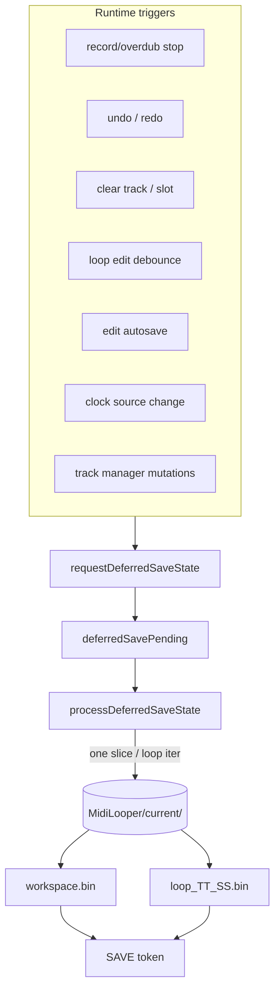

# Deferred runtime persistence and chunk-bounded SD save

Agent-oriented map of how loop state is written to SD after runtime events (record/overdub stop, undo, clear, autosave). Read this before changing `StorageManager`, `StorageLoopIo`, or any call site that used to invoke synchronous `saveState()`.

For the unified RAM + SD mental model and proposed continuous-runtime-persistence evolution, see [`RUNTIME_STORAGE_AND_PERSISTENCE.md`](RUNTIME_STORAGE_AND_PERSISTENCE.md). For the in-RAM chunk pool, capture lifecycle, and undo COW rules, see [`LOOP_MIDI_STORAGE_AND_VALIDATION.md`](LOOP_MIDI_STORAGE_AND_VALIDATION.md).

---

## Problem this solves

Long record/overdub passes leave **~12–16 KiB RAM2 free** at stop. A synchronous full-state save previously:

1. Flattened large pass trees into RAM2 `std::vector`s.
2. Competed with display reconstruction and undo snapshot work on the same heap.
3. Could exhaust RAM2 and crash before `PERS,result,...,ok`.

The fix is two-part:

| Layer | Mechanism |
|-------|-----------|
| **M1 — headroom** | External-memory-first length-scaling buffers + internal-heap floor admission (`LoopEventStore::hasInternalHeapHeadroomForNonCriticalWork`) |
| **M2 — writer** | Central **deferred save** — one bounded SD slice per main-loop iteration, chunk-sized working set |
| **M3 — CurrentSet (v6)** | Deferred FSM writes `MidiLooper/current/workspace.bin` + per-slot `loop_TT_SS.bin` (not monolithic `/midilooper_state.raw`) |

In-RAM MIDI events still live in the **PSRAM chunk pool** (`LoopEventStore`). SD persistence **streams** those chunks without building a full-loop flat buffer in RAM2.

---

## SD layout (v6 CurrentSet)

Runtime deferred saves target **`MidiLooper/current/`**:

| File | Content |
|------|---------|
| `workspace.bin` | Epoch/provenance record; v6 interim runtime bundle lives under `temp/runtime.bundle.bin` until transport/global split |
| `loop_TT_SS.bin` | One slot per file under `slots/` (`loop_00_07.bin`, …); `StorageLoopIo` payload + **SAVE** token (see below) |

Atomic write pattern per file: `.tmp` → verify **SAVE** token at file end → rename.

Boot: `loadState` → `MidiLooper/current/`; on failure → latest recovery checkpoint → newest SavedSet under `sets/archive/` → empty. v5 `/midilooper_state.raw` migrates once to CurrentSet then quarantines to `/state.bad.{millis}`.

### Persistence tokens: **SAVE** and **SVOK**

**Token** means a **fixed 4-byte ASCII tag** written when an SD save finishes, so load/validate can reject truncated `.tmp` files. The tag **is** the four letters on disk — not a separate abstract id. Use **SAVE** / **SVOK** in docs and logs; reserve **marker** for loop tick / timeline semantics elsewhere.

| Token | Where | Bytes on SD (LE u32) | Meaning |
|-------|--------|----------------------|---------|
| **SAVE** | Last 4 bytes of each CurrentSet epoch file (`runtime.bundle.bin`, `loop_TT_SS.bin`, …) | `'S' 'A' 'V' 'E'` → `0x45564153` | Deferred save completed this file |
| **SVOK** | First u32 of the 12-byte REVPK02 footer on `sets/S####/v####.bin` | `'S' 'V' 'O' 'K'` → `0x53564F4B` | Revision snapshot pack valid (“snapshot OK”) |

**CurrentSet slot file:**

```text
[epoch header]  optional 16 B when v6 epoch wrapper present
[payload]       StorageLoopIo v5 slot file body (loop passes on SD) OR runtime bundle body
[4 B]           SAVE
```

**REVPK02 revision footer (12 B at end of `v####.bin`):**

```text
SVOK           u32   must match ASCII SVOK
payloadCrc32   u32   CRC over full chunk payload stream
fileSize       u32   total file size (must match SD size)
```

**Verify:** seek to last 4 bytes (CurrentSet) or read footer (revision); compare **SAVE** or **SVOK** before parsing payload. Write each token **once** per file — a second **SAVE** in the payload corrupts load (revision load bug, 2026-06-27).

**Code:** `CurrentSetStorage::kSaveFileToken` (**SAVE**); `RevisionPackedBlob::kRevisionSvokFileToken` / `RevisionFooter::svokToken` (**SVOK**).

### SD file vocabulary

Data lives in two places — name which one you mean:

| Layer | Domain | Examples |
|-------|--------|----------|
| **RAM** | Live loop MIDI — **capture**, **passes**, **editPasses**, PSRAM **chunks** | `Loop::passes`, `NoteEditSession.store`, `LoopEventStore` |
| **SD card** | Files under `MidiLooper/` on the Teensy **SD card** (FAT) | `loop_TT_SS.bin`, `workspace.bin`, `sets/S####/v####.bin` |

| Term | Meaning | Code examples |
|------|---------|---------------|
| **FileToken** | 4-byte ASCII file footer — **SAVE** or **SVOK** | `kSaveFileToken`, `kRevisionSvokFileToken`, `writeSaveFileToken` |
| **FileHeader** | Fixed bytes at start of a file or revision chunk section | `EpochFileHeader`, `RevisionHeader`, `ChunkHeader` |
| **Pass file header** | Fixed bytes before one capture/overdub pass body in a **slot file** — always use full name | `CapturePassSlotFileHeader`, `writeDeferredCapturePassHeader` |
| **Directory entry** | Fixed index row — always spell out entity + `Entry` | `RevisionLoopSlotDirectoryEntry` |
| **FileBytes** | Exact SD bytes (CRC / streaming) | `revisionChunkHeaderFileBytes`, `measureLoopSlotFileBytes` |
| **Chunk** | Variable REVPK02 section or RAM PSRAM event chunk — always qualify | revision **LoopSlot** chunk; RAM **chunk** ID |
| **Epoch** | Workspace save generation counter | `currentEpoch`, `sourceEpoch` |
| **Slot file** | One loop on SD (`loop_TT_SS.bin`) | `writeLoopPersisted` / `readLoopPersisted` |

**Naming rule:** prefer the **longer spelled-out identifier** so the entity and scope are readable (`CapturePassSlotFileHeader`, not `PassHeader`). Directory/index rows end in **`Entry`** (`RevisionLoopSlotDirectoryEntry`, not `SlotIndexEntry`).

Private encode structs in `.cpp` use `*FileLayout` + local `fileLayout` (`toFileLayout` / `fromFileLayout`).

**Integration:** “wire GPIO in `main`” → **connect** / **hook up** / **integrate** (not SD vocabulary).

---

## Central routing

Runtime code **must not** call `StorageManager::saveState()` on the hot path. It calls **`requestDeferredSaveState()`**, which queues work consumed by **`processDeferredSaveState()`** in `main.cpp` **after** MIDI/clock/playback servicing.

**`saveState()`** is a maintenance entry point only: it queues (or continues) a deferred save and **drains every slice synchronously** until `PERS,result,...,ok` or failure. There is no second on-disk format or duplicate writer — one chunk-bounded FSM serves both paths.



### Call sites (request only)

| Source | When |
|--------|------|
| `Track::finalizeCommitSideEffects` | Record/overdub stop published |
| `Track::advanceStateAfterRecordStop` / overdub entry paths | State advance with optional heap sample |
| `TrackUndo.cpp` | After undo/redo applied |
| `TrackManager.cpp` | Clear slot, track lifecycle |
| `MidiButtonActions.cpp` | Clear / destructive actions |
| `LoopEditManager.cpp` | Loop length edit debounce flush |
| `ClockManager.cpp` | Clock source transition |
| `StorageManager::processEditAutosave` | Periodic edit dirty flush |

`requestDeferredSaveState(state, admissionHeap)` accepts an optional **stop-path heap sample**. When provided, admission uses that sample instead of calling `getInternalHeapFreeBytes()` from the main loop (avoids re-entrant heap walks during save slices).

---

## Scheduler rules (`processDeferredSaveState`)

1. **Cooperative budget during capture** — when any track is `RECORDING` or `OVERDUBBING`, persistence runs with `Config::maxPersistenceMicrosActive` (~300 µs) per main-loop call instead of a transport hard block (DEC-020 Phase 3). At most one finite-state-machine sub-step per call while capture is active.
2. **Admission** — before `dispatch`, checks **current** `getInternalHeapFreeBytes()` via `hasInternalHeapHeadroomForNonCriticalWork`. The optional stop-path `admissionHeap` from `requestDeferredSaveState` is **telemetry only** (`PERS,request`, `PERS,defer`, `PERS,dispatch`). Below floor: `PERS,defer,...,heap_floor` and retry next idle iteration. Once `deferredSaveInProgress`, slices run to completion without re-gating.
3. **One logical step per call** — each invocation advances at most one sub-step (header field, one chunk batch, one undo entry fragment, etc.).
4. **Display** — `isDeferredSaveActive()` reflects active SD-I/O windows in the current slice, not whole-job queued/in-progress state.
5. **Dirty flags** — edit/loop dirty state clears only after **`PERS,result,...,ok`**. Failed or incomplete saves leave dirty set for retry.

Placement in `src/main.cpp`:

```cpp
// After transport / handleMidiInput() and display update:
StorageManager::processDeferredSaveState(looperState.getLooperState());
```

### Sidebar save status indicator

`DisplayManager::drawSidebar` draws a **4-dot row** below the undo field (bottom-right). One combined channel reflects deferred save phase via `StorageManager::getDeferredSaveDisplayStatus(nowMs)`:

| Phase | Visual |
|-------|--------|
| Idle | dots off |
| Pending | all dim (queued, e.g. heap-floor deferred) |
| InProgress | one bright dot rotates every ~200 ms |
| Completed | all bright ≤800 ms after `PERS,result,...,ok` |
| Failed | all mid brightness ≤800 ms after failed result |

Capture builds emit `#CAP,SAVE,<phase>,rotateStep` on phase transitions only.

---

## Save stage FSM

Top-level stages (`DeferredSaveStage` in `StorageManager.cpp`):

| Stage | Content |
|-------|---------|
| `CurrentSetMeta` | v6 meta header + BPM, looper state, master length, track count |
| `TrackHeaderAndSlots` | Per-track header + slot metadata (enabled, muted, loop id) |
| `CurrentSetLoopSlot` | Per-slot `loop_TT_SS.bin` via `stepDeferredLoopPersist` / `StorageLoopIo`; clean slots are skipped via CurrentSet dirty tracking |
| `Footer` | Selected track, active loop indices, undo magic, then empty GUS headers (DEC-035 Stage 3 — no live-stack walk) |
| `UndoStacks` | Leftover in-flight stage only: writes empty GUS headers per track. New saves finish in Footer. |
| `CurrentSetCompletion` | Patch `lastActiveUnix`; write `workspace.bin`; `PERS,result,...,ok` |

Nested cursors (`deferredSaveTrackCursor`, `deferredSavePoolCursor`, `deferredSaveChunkCursor`, `deferredSaveUndoEntryCursor`, …) resume mid-stage on the next main-loop call.

Telemetry: `#CAP,PERS,<phase>,duration_us,heap_before,heap_after,<detail>` plus `PERS,slice,...` per sub-step when `SESSION_CAPTURE` is enabled.

---

## Chunk-bounded loop pool write

**Files:** `src/StorageLoopIo.cpp`, `include/StorageLoopIo.h`

Capture passes persist as **chunk refs**, not flattened RAM buffers:

- `writeCapturePassChunkStream` reads at most **`LoopEventStoreConfig::CHUNK_CAPACITY` (256)** events into `deferredSaveMidiBatch` (`ExternalMemoryFirstAllocator<MidiEvent>`) per slice.
- Pass headers and edit tails write in separate deferred sub-stages (`DeferredLoopWriteStage`).
- Native gate: `test_64_bar_save_completes_at_ram2_floor_with_bounded_batch` asserts max batch ≤ `CHUNK_CAPACITY`.

Load path validates the completion marker and can **quarantine** a partial file on failure (`quarantineStorageFile`).

---

## Boot load sequence

Full cold-boot ordering (sync load, deferred slot restore, USB Host deferral, `BOOT,*` telemetry): **[`BOOT_LOAD.md`](BOOT_LOAD.md)**.

## Boot after long save

**`stabilizeBootMemoryAfterLoad()`** (called from load):

- If heap < reserve after loading a long loop: clear undo stacks (loop data intact), skip playback prewarm.
- Prevents first `displayManager.update()` from allocating on an empty heap.

---

## External-memory-first buffers (M1)

**File:** `include/Utils/ExternalMemoryFirstAllocator.h`

Length-scaling containers use `ExternalMemoryFirstAllocator` (`extmem_malloc` first, `malloc` fallback):

- `NoteUtils::CachedNoteList`, `PlaybackOrderVec`, `LoopPasses` materialize temporaries
- `GlobalUndoStack` entry vector
- `VisualCache.notes`, `CapturePreview.notes`, `DisplayManager::liveDisplayNotes`
- `NoteUtils::DisplayNoteVec` / `reconstructDisplayNotes()` for playback display
- `StorageManager::deferredSaveMidiBatch`

**Display note:** playback display prefers **`visualCache.notes`** (built from `mergeActiveCapturePasses`) over re-reconstructing the full materialized view when heap is tight after overdub stop.

---

## Internal-heap floor constants

| Constant | Value | Role |
|----------|-------|------|
| `Config::HEAP_RESERVE_BYTES` | 32 KiB | Edit admission, general reserve |
| `LoopEventStoreConfig::INTERNAL_HEAP_SAFETY_FLOOR_BYTES` | 12 KiB | Deferred save / non-critical growth admission |

HITL baseline asserts `heap_before ≥ 12288` at `record_stop` entry for runs ≥ 48 bars (`scripts/host_midi_automation_baseline.py`).

---

## Tests and HITL gates

| Gate | Command / artifact |
|------|-------------------|
| Native full matrix | `pio test -e native` |
| Pool + bounded save | `test_pool_budget`, `test_storage_loop_io` |
| 48/64 record-only, 64+64 overdub | `scripts/host_midi_automation_baseline.py` + serial capture |
| Undo/redo after long overdub | default `--undo-redo-delay-ms 3000` (wait for `PERS,result,ok`) |

Spec: `openspec/specs/long-record-memory-headroom/spec.md`.
