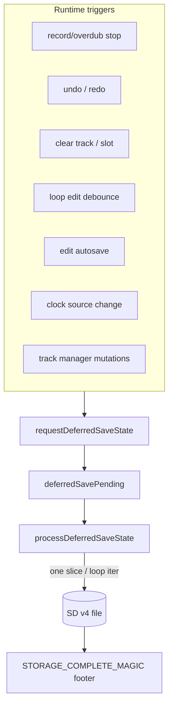

# Deferred runtime persistence and chunk-bounded SD save

Agent-oriented map of how loop state is written to SD after runtime events (record/overdub stop, undo, clear, autosave). Read this before changing `StorageManager`, `StorageLoopIo`, or any call site that used to invoke synchronous `saveState()`.

For the in-RAM chunk pool, capture lifecycle, and undo COW rules, see [`LOOP_MIDI_STORAGE_AND_VALIDATION.md`](LOOP_MIDI_STORAGE_AND_VALIDATION.md).

---

## Problem this solves

Long record/overdub passes leave **~12–16 KiB RAM2 free** at stop. A synchronous full-state save previously:

1. Flattened large pass trees into RAM2 `std::vector`s.
2. Competed with display reconstruction and undo snapshot work on the same heap.
3. Could exhaust RAM2 and crash before `PERS,result,...,ok`.

The fix is two-part:

| Layer | Mechanism |
|-------|-----------|
| **M1 — headroom** | PSRAM-first length-scaling buffers + RAM2 floor admission (`LoopEventStore::hasRam2HeadroomForNonCriticalWork`) |
| **M2 — writer** | Central **deferred save** — one bounded SD slice per main-loop iteration, chunk-sized working set |

In-RAM MIDI events still live in the **PSRAM chunk pool** (`LoopEventStore`). SD persistence **streams** those chunks without building a full-loop flat buffer in RAM2.

---

## Central routing

Runtime code **must not** call synchronous `StorageManager::saveState()` on the hot path. It calls **`requestDeferredSaveState()`**, which queues work consumed by **`processDeferredSaveState()`** in `main.cpp` **after** MIDI/clock/playback servicing.



### Call sites (request only)

| Source | When |
|--------|------|
| `Track::finalizeCommitSideEffects` | Record/overdub stop published |
| `Track::advanceStateAfterRecordStop` / overdub entry paths | State advance with optional heap sample |
| `TrackUndo.cpp` | After undo/redo applied |
| `TrackManager.cpp` | Clear slot, track lifecycle |
| `MidiButtonActions.cpp` | Clear / destructive actions |
| `LoopEditManager.cpp` | Loop length edit debounce flush |
| `ClockManager.cpp` | Clock source transition |
| `StorageManager::processEditAutosave` | Periodic edit dirty flush |

`requestDeferredSaveState(state, admissionHeap)` accepts an optional **stop-path heap sample**. When provided, admission uses that sample instead of calling `getFreeHeap()` from the main loop (avoids re-entrant heap walks during save slices).

---

## Scheduler rules (`processDeferredSaveState`)

1. **No work while capture active** — returns immediately if any track is `RECORDING` or `OVERDUBBING`.
2. **Admission** — before `dispatch`, checks `hasRam2HeadroomForNonCriticalWork(admissionHeap)`. Below floor: `PERS,defer,...,heap_floor` and retry next idle iteration. Once `deferredSaveInProgress`, slices run to completion without re-gating.
3. **One logical step per call** — each invocation advances at most one sub-step (header field, one chunk batch, one undo entry fragment, etc.).
4. **Display** — `isDeferredSaveActive()` is true only while **`deferredSaveInProgress`** (SD file open), not while merely queued. OLED updates skip during in-flight writes.
5. **Dirty flags** — edit/loop dirty state clears only after **`PERS,result,...,ok`**. Failed or incomplete saves leave dirty set for retry.

Placement in `src/main.cpp`:

```cpp
// After transport/MIDI service, before idle maintenance:
StorageManager::processDeferredSaveState(looperState.getLooperState());
```

---

## Save stage FSM

Top-level stages (`DeferredSaveStage` in `StorageManager.cpp`):

| Stage | Content |
|-------|---------|
| `GlobalHeader` | Version, BPM, looper state, master length, track count |
| `TrackHeaderAndSlots` | Per-track header + slot metadata (enabled, muted, loop id) |
| `LoopPool` | Per-slot loop snapshot via `stepDeferredLoopPersist` / `StorageLoopIo` |
| `Footer` | Selected track, active loop indices, undo magic |
| `UndoStacks` | Global undo entries (bounded per slice — no full-pass flatten) |
| `CompletionMarker` | `STORAGE_COMPLETE_MAGIC` (`"SAVE"`) — load fails hard if missing |

Nested cursors (`deferredSaveTrackCursor`, `deferredSavePoolCursor`, `deferredSaveChunkCursor`, `deferredSaveUndoEntryCursor`, …) resume mid-stage on the next main-loop call.

Telemetry: `#CAP,PERS,<phase>,duration_us,heap_before,heap_after,<detail>` plus `PERS,slice,...` per sub-step when `SESSION_CAPTURE` is enabled.

---

## Chunk-bounded loop pool write

**Files:** `src/StorageLoopIo.cpp`, `include/StorageLoopIo.h`

Capture passes persist as **chunk refs**, not flattened RAM buffers:

- `writeCapturePassChunkStream` reads at most **`LoopEventStoreConfig::CHUNK_CAPACITY` (256)** events into `deferredSaveMidiBatch` (`PsramFirstAllocator<MidiEvent>`) per slice.
- Pass headers and edit tails write in separate deferred sub-stages (`DeferredLoopWriteStage`).
- Native gate: `test_64_bar_save_completes_at_ram2_floor_with_bounded_batch` asserts max batch ≤ `CHUNK_CAPACITY`.

Load path validates the completion marker and can **quarantine** a partial file on failure (`quarantineStorageFile`).

---

## Boot after long save

**`stabilizeBootMemoryAfterLoad()`** (called from load):

- If heap < reserve after loading a long loop: clear undo stacks (loop data intact), skip playback prewarm.
- Prevents first `displayManager.update()` from allocating on an empty heap.

---

## PSRAM-first buffers (M1)

**File:** `include/Utils/PsramFirstAllocator.h`

Length-scaling containers use `PsramFirstAllocator` (`extmem_malloc` first, `malloc` fallback):

- `NoteUtils::CachedNoteList`, `PlaybackOrderVec`, `LoopPasses` materialize temporaries
- `GlobalUndoStack` entry vector
- `VisualCache.notes`, `CapturePreview.notes`, `DisplayManager::liveDisplayNotes`
- `NoteUtils::DisplayNoteVec` / `reconstructDisplayNotes()` for playback display
- `StorageManager::deferredSaveMidiBatch`

**Display note:** playback display prefers **`visualCache.notes`** (built from `flattenActiveCapturePasses`) over re-reconstructing the full materialized view when heap is tight after overdub stop.

---

## RAM2 floor constants

| Constant | Value | Role |
|----------|-------|------|
| `Config::HEAP_RESERVE_BYTES` | 32 KiB | Edit admission, general reserve |
| `LoopEventStoreConfig::RAM2_SAFETY_FLOOR_BYTES` | 12 KiB | Deferred save / non-critical growth admission |

HITL baseline asserts `heap_before ≥ 12288` at `record_stop` entry for runs ≥ 48 bars (`scripts/host_midi_automation_baseline.py`).

---

## Tests and HITL gates

| Gate | Command / artifact |
|------|-------------------|
| Native full matrix | `pio test -e native` |
| Pool + bounded save | `test_pool_budget`, `test_storage_loop_io` |
| 48/64 record-only, 64+64 overdub | `scripts/host_midi_automation_baseline.py` + serial capture |
| Undo/redo after long overdub | default `--undo-redo-delay-ms 3000` (wait for `PERS,result,ok`) |

Spec: `openspec/specs/long-record-memory-headroom/spec.md`.
