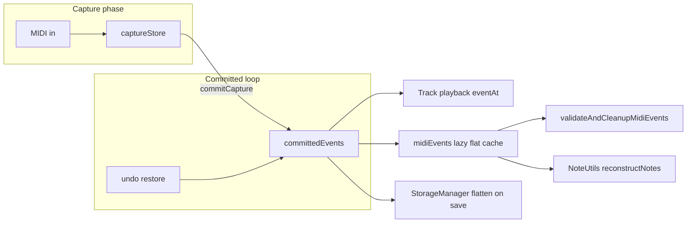

# Loop MIDI storage, validation, and undo

Agent-oriented map of how loop MIDI events are stored, cleaned up, snapshotted, and persisted. Read this before changing `Loop`, `Track`, `TrackUndo`, `StorageManager`, or stop-path code.

For display-only note pairing (piano roll, loop shorten), see [`NOTE_WRAPPING_LOGIC.md`](NOTE_WRAPPING_LOGIC.md). For overdub undo history design rationale, see [`../plans/overdub_undo_baseline_phase1_refinement.md`](../plans/overdub_undo_baseline_phase1_refinement.md). For the scalability roadmap (chunk pool, deferred validate), see [`../plans/memory_scalability_refactor_enhancement.md`](../plans/memory_scalability_refactor_enhancement.md).

---

## Mental model

Each **loop slot** (`Loop` in `include/Loop.h`) holds two event stores:

| Store | Type | Role |
|-------|------|------|
| `committedEvents` | `CowLoopEventStore` | Baseline loop; what playback and undo restore target |
| `captureStore` | `LoopEventStore` | Append buffer during **record** or **overdub**; merged at phase stop |

**Rule:** Hot playback paths use `loop.eventAt(i)` / `committedEvents.readStore()` (chunk index). Edit, validation, and SD I/O still go through `loop.midiEvents()` (lazy flatten → optional sync back to chunks via `invalidateCaches()` → `syncFlatToStore()`).

---

## Chunk storage (Phase 4)

**Files:** `include/LoopEventStore.h`, `src/LoopEventStore.cpp`, `include/LoopEventBuffer.h`

- Events live in fixed **256-event PSRAM chunks** (`LoopEventStoreConfig::CHUNK_CAPACITY`).
- A global pool holds up to **512 chunks** (`POOL_CHUNK_COUNT`); initialized once in `main()` via `LoopEventStore::initPool()`.
- Chunk ID lists use `ExtMemAllocator` (PSRAM on Teensy, heap fallback in native tests).

**Key operations:**

| API | Cost | When |
|-----|------|------|
| `append` | O(1) amortized | Live capture, record path |
| `adoptAll(other)` | O(chunks) | Record stop: empty committed → move capture chunks in |
| `mergeFrom(other)` | O(events) | Overdub stop: sorted merge into new chunk list |
| `cloneShared()` | O(events) | Undo snapshots and restore (deep copy) |
| `flatten` / `loadFromFlat` | O(events) | SD save/load, legacy edit paths |

**Copy-on-write wrapper (`CowLoopEventStore`):**

- `mutStore()` / `mutFlat()` clone the backing store when `shared_ptr` use count &gt; 1.
- `shareForSnapshot()` returns the live store ref (used only to feed `cloneShared()` into history).
- `restoreFromSnapshot(snap)` always **`snap->cloneShared()`** — never a shallow struct copy. `LoopEventStore` copy ctor is deleted to enforce this.

---

## Capture lifecycle

**Files:** `include/Loop.h`, `src/Loop.cpp`, `src/Track.cpp`

1. **`beginCapture(Record | Overdub)`** — clears `captureStore`, sets `capturePhase`.
2. **`appendCaptureEvent`** — writes to `captureStore`; dedupes near-duplicates and (on overdub) against committed baseline in a tick window.
3. **`commitCapture`** at record/overdub stop:
   - Empty committed → `adoptAll(captureStore)` (moves chunks, no full copy).
   - Non-empty → `mergeFrom(captureStore)` (new merged chunk list).
4. **`discardCapture`** — used when undoing an **open** overdub capture (session still open).

After commit, **`finalizeLoopAtStop`** runs (see below). Loop length is already set on record stop before commit/validate.

---

## Note validation (three tiers)

There are **three separate** “note correctness” mechanisms; do not conflate them.

### 1. Hot stop path — wrap window only

**Files:** `include/Utils/LoopStopFinalize.h`, `Track::finalizeLoopAtStop` in `src/Track.cpp`

Runs on **every** record stop and overdub stop (after `loopLengthTicks` is known):

- Flushes `pendingNotes` into synthetic note-offs at the stop playhead (or loop end).
- Calls `LoopStopFinalize::finalizeWrapWindow` on the **head + tail 1-bar window** (default `wrapWindow = TICKS_PER_BAR`):
  - Pairs tail note-ons with head note-offs for **wrapped** notes.
  - Inserts synthetic note-offs for **open tail** note-ons still sounding at stop.
- Sets `deferredFullMidiValidate = true` for later idle pass.
- Does **not** scan or sort the full loop — safe for 32+ bar loops on stop.

### 2. Cold full pass — orphaned pair cleanup

**Files:** `Track::validateAndCleanupMidiEvents`, `Track::processDeferredIdleMaintenance`

Full-loop pass over `loop.midiEvents()` (flat):

- Sorts by tick; note-offs before note-ons at equal tick.
- Removes orphaned note-ons/offs (LIFO for duplicate note-ons).
- Inserts synthetic note-offs for unmatched tail note-ons (uses loop length / optional playhead close tick).
- Second pass recognizes **wrapped** pairs (note-off before note-on in tick order, &gt; half loop apart).

**When it runs:**

| Trigger | Path |
|---------|------|
| After stop | **Deferred** — `main()` loop calls `processDeferredIdleMaintenance()` only when **no** track is playing/recording/overdubbing |
| SD load | **Immediate** — `StorageManager` after loading slot events |
| Manual / legacy | Direct call (avoid on hot paths) |

### 3. Display reconstruction — not storage mutation

**Files:** `src/Utils/NoteUtils.cpp`, tests in `test/test_noteutils_reconstruct/`

`NoteUtils::reconstructNotes(events, loopLength)` builds **DisplayNote** segments for piano roll / LEDs. It discards note-ons at or beyond `loopLength` and wraps note-offs for UI — see [`NOTE_WRAPPING_LOGIC.md`](NOTE_WRAPPING_LOGIC.md). It does **not** write back to `committedEvents`.

---

## Undo: two stacks, one button

**Files:** `src/TrackUndo.cpp`, `src/MidiButtonActions.cpp`, `src/ButtonManager.cpp`, `src/Track.cpp`

### Overdub / record undo (`midiHistory` + `overdubGeomHistory`)

Snapshots are **`shared_ptr<const LoopEventStore>`** (chunk refs, deep-copied on push) plus geometry `{loopLengthTicks, startLoopTick, loopStartTick}`.

**Fresh take from empty (clear → record → overdub):**

| Step | Action | Stack after |
|------|--------|-------------|
| Record start (empty) | Zero geometry; `pushUndoSnapshot` (empty preroll) | 1 snapshot |
| Record stop | `establishRecordStopBaseline` — keep empty preroll, push record baseline | 2 snapshots |
| Overdub start | `beginOverdubSession` only (**no** extra snapshot) | 2 snapshots |
| Overdub stop | `endOverdubSession` | 2 snapshots |
| Undo 1 | Restore record baseline (drops overdub) | 1 snapshot |
| Undo 2 | Restore empty preroll → `TRACK_EMPTY`, length 0 | 0 snapshots |

Loaded loop with no preroll: record stop pushes one baseline; overdub undo removes overdub only.

**Important:** `pushUndoSnapshot` / restore always use **`cloneShared()`** so live edits and overdub merge never alias snapshot memory.

### Clear-slot undo (`clearMidiHistory` + length/state deques)

Pushed on **long-press clear** before `Track::clear()`. Restores pre-clear slot content via chunk restore (not flat-only).

**Routing (MIDI record double-tap → `handleUndo`):**

1. **Overdub undo** if `canUndo(track)` (midi history non-empty) — **wins over clear undo**
2. Else **clear undo** if `clearMidiHistory` non-empty

**Clear undo is discarded** when a **new recording starts** (`startRecording` → `loop.clearClearUndoStacks()`). A clear→record→overdub session must not restore the pre-clear loop on undo.

Hardware **Button A double-press** calls `undoOverdub` directly (no clear precedence). MIDI and slot-scoped undo use `handleUndo()`.

Phase 1 session markers (`overdubSessionOpen`, baseline event count) avoid a second full snapshot at overdub entry; see plan doc above.

---

## SD persistence

**File:** `src/StorageManager.cpp` (format v3)

- On disk, loop events and undo snapshots are still **flat `MidiEvent` arrays** (count + bytes).
- In RAM, committed loop and undo history use **chunk stores**; save path **flattens**; load path **`loadFromFlat`** into new stores.
- After load, **`validateAndCleanupMidiEvents()`** runs once per slot with events.
- Undo snapshot save/load: flatten each `MidiSnapshotRef`, rebuild `LoopEventStore` on load.

SD schema has not been bumped for chunking; chunking is an in-memory representation only.

---

## Build environments and diagnostics

| Env | Purpose |
|-----|---------|
| `teensy41` | Default firmware |
| `teensy41-capture-serial` | HITL / capture: `SESSION_CAPTURE=1`, `#CAP` serial lines |
| `teensy41-capture` | Silent production-style capture build (no session serial) |
| `teensy41-capture-bypass` | Adds `BYPASS_STOP_UNDO_SAVE=1` — skips undo snapshot push and `saveState` on stop (diagnostic only) |

**Do not** add `MemoryMonitor` or full-loop validation on record/overdub stop hot paths. Idle maintenance and `HotPathTelemetry` deferred summary are wired in `main()`.

Record stop no longer calls `queueDeferredRecordRevts()` (removed from the hot path). `SC_REC_FLUSH_PENDING_REVTS` in `main()` only emits previously queued REVTs. HITL often reports `record_stored_revt_missing` while otherwise passing. Non-`SESSION_CAPTURE` builds stub all `#CAP` / REVT macros.

---

## Tests (native)

| Suite | Covers |
|-------|--------|
| `test/test_loop_event_store` | Chunk append, adopt, merge, **restore deep copy** |
| `test/test_loop_stop_finalize` | Wrap-window synthetic offs, playhead close tick |
| `test/test_noteutils_reconstruct` | Display note pairing vs loop length |
| `test/test_redo_functionality` | Undo/redo stacks (host `Track`; listed in `test_ignore` for native — run on Teensy env if needed) |

Run: `pio test -e native` from project root.

---

## File index (quick lookup)

| Concern | Primary files |
|---------|----------------|
| Chunk pool + store | `LoopEventStore.h/.cpp` |
| COW + flat cache | `LoopEventBuffer.h` |
| Loop capture/commit | `Loop.h`, `Loop.cpp` |
| Stop + deferred validate | `Track.cpp` (`finalizeLoopAtStop`, `validateAndCleanupMidiEvents`, `processDeferredIdleMaintenance`) |
| Wrap-window finalize | `Utils/LoopStopFinalize.h` |
| Undo | `TrackUndo.cpp`, `TrackUndo.h` |
| Undo routing | `MidiButtonActions.cpp` (`handleUndo`), `ButtonManager.cpp` (Button A double → `undoOverdub`) |
| SD | `StorageManager.cpp` |
| Main idle hooks | `main.cpp` |
| Display notes | `Utils/NoteUtils.cpp` |

---

## Common mistakes (for agents)

1. **Using shallow copy for undo restore** — always `cloneShared()` / `restoreFromSnapshot`; never `LoopEventStore(*snap)`.
2. **Full `validateAndCleanupMidiEvents` on stop** — replaced by `finalizeLoopAtStop` + idle deferral for long loops.
3. **Clear undo shadowing overdub undo** — check `handleUndo` order and `clearClearUndoStacks()` on record start.
4. **Editing only flat cache** — after `midiEvents()` mutation, call `invalidateCaches()` so chunks and note cache stay consistent.
5. **Assuming SD stores chunks** — flatten on save; do not read/write chunk IDs to disk without a format version bump.
6. **Confusing `reconstructNotes` with storage validation** — UI wrapping ≠ committed event cleanup.
