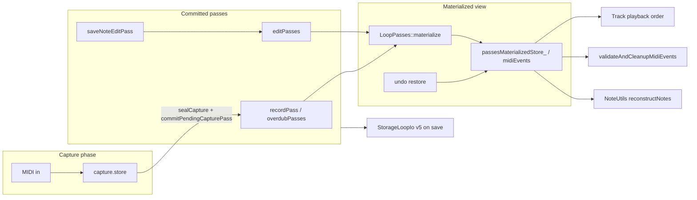

# Loop MIDI storage, validation, and undo

Agent-oriented map of how loop MIDI events are stored, cleaned up, snapshotted, and persisted. Read this before changing `Loop`, `Track`, `TrackUndo`, `StorageManager`, `StorageLoopIo`, or stop-path code.

For display-only note pairing (piano roll, loop shorten), see [`NOTE_WRAPPING_LOGIC.md`](NOTE_WRAPPING_LOGIC.md). For overdub undo history design rationale, see [`../Plans/overdub_undo_baseline_phase1_refinement.md`](../Plans/overdub_undo_baseline_phase1_refinement.md). For the scalability roadmap (chunk pool, deferred validate), see [`../Plans/memory_scalability_refactor_enhancement.md`](../Plans/memory_scalability_refactor_enhancement.md). For internal heap vs external memory pool routing (NOTE_EDIT cold buffers, undo admission), see [`INTERNAL_HEAP_AND_EXTERNAL_MEMORY.md`](INTERNAL_HEAP_AND_EXTERNAL_MEMORY.md). For the unified RAM + SD mental model and proposed continuous-runtime-persistence evolution, see [`RUNTIME_STORAGE_AND_PERSISTENCE.md`](RUNTIME_STORAGE_AND_PERSISTENCE.md). For central deferred SD save routing and chunk-bounded writer stages, see [`DEFERRED_RUNTIME_PERSISTENCE.md`](DEFERRED_RUNTIME_PERSISTENCE.md). For a record/overdub timeline across memory, playback, display, and SD, see [`../Plans/record_overdub_memory_display_timeline_enhancement.md`](../Plans/record_overdub_memory_display_timeline_enhancement.md).

---

## Mental model

Each **loop slot** (`Loop` in `include/Loop.h`) holds live capture, committed **passes**, and a materialized event view:

| Store | Type | Role |
|-------|------|------|
| `capture` | `Capture` | Live record/overdub append buffer (`capture.store`, `capture.phase`) |
| `passes` | `LoopPasses` | Canonical timeline: **recordPass**, **overdubPasses[]**, **editPasses[]**, **loopGeometries[]** |
| `passesMaterializedStore_` | `CowLoopEventStore` | Derived materialized MIDI cache behind `midiEvents()` (non-canonical) |



**Rule:** Hot playback paths use **`mergeActiveCapturePasses`** / chunk refs plus **`LoopPasses::materialize`** — not a full-loop materialization on every stop. During **NoteEditSession**, live mutations go to **`EditManager::noteEditSession.store`**; **`saveNoteEditPass()`** appends **EditPass** rows to **`passes.editPasses[]`** without rewriting capture passes.

### Passes — Capture / recordPass / overdubPass / editPass / NoteEditSession

| Layer | Storage | Global undo (when applicable) |
|-------|---------|------------------------------|
| **recordPass** / **overdubPass** | `Loop::passes` capture passes (chunk refs) | **RecordPassAdded** / **OverdubPassAdded** (disable pass on undo) |
| **editPass** | `Loop::passes.editPasses[]` (`EditPassType` + `EditActionType` + `EditPropertyType` + row fields) | **NoteEditPassClosed** / **ControlChangeEditPassClosed** (per closed edit-pass batch) |
| **NoteEditSession** | RAM `noteEditSession.store` while editing | `NoteEditSessionUndoStack` (before `saveNoteEditPass`) |

- **`LoopPasses::materialize()`** — merge active capture passes, then overlay active **editPasses** in storage order (`EditPassType::Note` apply path; explicit `ControlChange` no-op stub until CC edit apply ships).
- **Row payload invariant:** a note row is located by **`targetNoteId`** (`findNoteOnById`); **`startTick`** / **`endTick`** are **payload**, never a lookup key. Replay applies each row **as stored** — it must not rewrite a row's span from an earlier row for the same note, or a second **Length** / **NoteRange** row on that note becomes a no-op ([`note_edit_replay_row_payload_bugfix.md`](../Plans/note_edit_replay_row_payload_bugfix.md)).
- **Same-pitch pairing invariant:** note-off pairing for same-channel, same-pitch spans is **LIFO** everywhere, including replay (`findNoteOffForOnIndex` matches `findLinearOffForNoteOnLifo` / `findCorrespondingNoteOff` / `pairedNoteOnTickForOffAtIndex`). A later same-pitch note-on does not leave the outer note unpaired ([`note_edit_note_off_pairing_lifo_bugfix.md`](../Plans/note_edit_note_off_pairing_lifo_bugfix.md)).
- **`saveNoteEditPass()`** — one committed **editPass** row; may share a **noteEditPassIndex** batch.
- **`closeNoteEditPass()`** — note-edit exit / overdub-while-editing boundary; pushes **NoteEditPassClosed** for **editPass** ids not yet checkpointed on the global stack.
- **`markCurrentEditBatchDurable()`** — mid-session durability boundary (autosave, slot depart); pushes **NoteEditPassClosed** for newly committed ids while **NoteEditSession** stays open. **NoteEditPassClosed** means the batch is independently undoable (**U:**), not that NOTE_EDIT ended.
- **Durability invariant:** any **editPass** row persisted outside active **NoteEditSession** RAM must have a matching global undo entry with **`editPassIds`** (runtime bundle **STK1** extension serializes `editPassIndex`, `editPassType`, ids).
- **§0.6.1 record routing** — at most one **recordPass** per slot; a second record stop routes to **overdubPass** (`effectiveCapturePassPhase` in `sealCapture`).
- **SD v5** — `StorageLoopIo` writes **passes** to each **slot file** (slot file layout for capture passes + **editPasses** tail); `autosaveIntervalMs` (5 min) + urgent flush on note-edit exit when dirty.

**Future session names (not implemented):** **LoopEditSession**, **ControlChangeEditSession**; playback/jam session **TBD**.

---

## Chunk storage (Phase 4)

**Files:** `include/LoopEventStore.h`, `src/LoopEventStore.cpp`, `include/LoopEventBuffer.h`

- Events live in fixed **256-event PSRAM chunks** (`LoopEventStoreConfig::CHUNK_CAPACITY`).
- A global pool holds up to **512 chunks** (`POOL_CHUNK_COUNT`); initialized once in `main()` via `LoopEventStore::initPool()`.
- Chunk ID lists use `InternalHeapFirstAllocator` (internal heap first on Teensy, external-memory fallback in native tests).

**Key operations:**

| API | Cost | When |
|-----|------|------|
| `append` | O(1) amortized | Live capture, record path |
| `detachChunksTo` | O(chunks) | `sealCapture` — move capture chunks into `pendingCapturePass_` |
| `adoptChunkIds` / `adoptAll` | O(chunks) | Stop finalize, load, undo restore paths |
| `cloneShared()` | O(events) | Undo restore (deep copy on apply) |
| `copyEventsTo` / `loadFromEvents` | O(events) | SD save/load, materialize, cold validate |
| `usedChunkCount` / `freeChunkCount` | O(1) | Pool-budget admission and undo pressure |
| `canAllocChunkWithReserve()` | O(1) | `sealCapture` — true when `freeChunkCount() > CHUNK_RESERVE` |

**Pool admission (pool-budget):**

- **`PassConfig::CHUNK_RESERVE`** (default 16) — chunks held back for playback headroom.
- **`sealCapture`** returns **`SealOutcome::PoolExhausted`** when `canAllocChunkWithReserve()` is false; there is **no** fixed `capturePassCount` cap.
- **`saveNoteEditPass`** checks **`Config::HEAP_RESERVE_BYTES`** (32 KiB) plus estimated **editPass** row payload before appending an **editPass** row.
- **`reclaimUnreferencedDisabledPasses`** frees **Disabled** capture/edit pass rows whose ids are not pinned by any **`GlobalUndoStack`** entry (`include/PassReclaim.h`, `TrackManager::reclaimUnreferencedDisabledPasses`). Runs on idle (`main.cpp`), after undo trim / redo-branch drop, and once on seal/edit admission retry.

**RAM2 headroom policy (long-record-memory-headroom):**

- **`LoopEventStoreConfig::INTERNAL_HEAP_SAFETY_FLOOR_BYTES`** = **12 KiB** is the non-critical internal-heap floor.
- **`LoopEventStore::hasInternalHeapHeadroomForNonCriticalWork(freeHeapBytes)`** gates deferred save admission using a **stop-path** `getInternalHeapFreeBytes()` sample (`requestDeferredSaveState`); the main loop does not re-query heap while save slices run.
- Below floor, non-critical persistence work defers (`PERS,defer,...,heap_floor`) and retries on later idle iterations; MIDI clock, note-out, and playback are not gated.
- Runtime persistence requests route through `StorageManager::requestDeferredSaveState`; direct synchronous `saveState()` is a cold-path writer and is not used by record/overdub stop, undo/redo, loop edit debounce, clear track, edit autosave, or clock-source transition.
- `StorageManager::processDeferredSaveState` advances at most one small writer step per main-loop iteration after MIDI/clock/playback servicing. OLED display updates are skipped while a deferred save is active so non-timing SPI work does not compete with SD persistence.
- Length-scaling non-hot buffers are PSRAM-first:
  - `NoteUtils::CachedNoteList` storage
  - `PlaybackOrderVec`
  - `LoopPasses` materialize merge temporaries
  - `GlobalUndoStack` entry vector (`UndoEntryVec`)
  - display note storage (`VisualCache.notes`, `CapturePreview.notes`, `DisplayManager::liveDisplayNotes`)
  - **NOTE_EDIT (2026-07):** `NoteEditFocus` maps, `NoteEditSessionUndoStack`, session `eventsCache_`, `DisplayManager::liveDisplayEventBuffer`, `MemoryPool::globalMidiEventPool`, UIP span/projection temps — see [`INTERNAL_HEAP_AND_EXTERNAL_MEMORY.md`](INTERNAL_HEAP_AND_EXTERNAL_MEMORY.md)
- During live record display, `DisplayManager::resolveDisplayNotes` reads the incrementally maintained `CapturePreview.notes` and open tails instead of flattening the whole capture store each frame. `SC_DISP` capture telemetry reports direct event counts without building a frame-only `MidiEventVec`.

**Copy-on-write wrapper (`CowLoopEventStore`):**

- `mutStore()` / `mutEvents()` clone the backing store when `shared_ptr` use count &gt; 1.
- `shareForSnapshot()` returns the live store ref for undo/redo history (O(1) push; COW on live `mutStore()`).
- `restoreFromSnapshot(snap)` always **`snap->cloneShared()`** — never a shallow struct copy. `LoopEventStore` copy ctor is deleted to enforce this.

---

## Capture lifecycle

**Files:** `include/Loop.h`, `src/Loop.cpp`, `src/Track.cpp`

1. **`beginCapture(Record | Overdub)`** — clears `capture.store`, sets `capture.phase`.
2. **`appendCaptureEvent`** — writes to `capture.store`; dedupes near-duplicates and (on overdub) against merged capture passes in a tick window.
3. **`commitCapturePass`** at record/overdub stop:
   - **`sealCapture`** — wrap-window finalize on record capture; detach chunks into **`pendingCapturePass_`** (routes record vs overdub via `effectiveCapturePassPhase`).
   - **`commitPendingCapturePass`** — append to **recordPass** or **overdubPasses[]**; clear live capture.
   - On publish: **`finalizeLoopAtStop`** + **`pushRecordPassAdded`** / **`pushOverdubPassAdded`** on global undo stack.
4. **`discardCapture`** — undo open overdub capture (session still open).
5. **`discardPendingCapturePass`** — rollback failed seal/publish.

After commit, **`finalizeLoopAtStop`** runs (see below). Loop length is set on record stop before commit/validate; overdub stop uses playhead close tick.

---

## Capture ownership invariants (overdub wrap)

**Files:** `Track::recordMidiEvents`, `Track::finalizePendingNotes`, `Track::stopRecording`, `Track::stopOverdubbing`, `Loop::sealCapture`, `NoteUtils::reconstructNotes`

1. **Playback is read-only** — `Track::playMidiEvents` / `playMidiEventsForSlot` must not append capture events, synthesize note-offs, or modify `pendingNotes`.
2. **Linear storage is not playback order** — a wrapped note may be stored as `NoteOff@head` before `NoteOn@tail` in sorted tick order; `reconstructNotes` pairs them into display segments.
3. **Single close pipeline** — open notes close at **record/overdub stop** via `finalizePendingNotes(currentTick)` then `LoopStopFinalize::finalizeWrapWindowOnStore` in `sealCapture` with the same playhead `closeTick`. No mid-wrap capture mutation.
4. **Shared capture phase** — transport-active overdub and record-while-playing use `Track::capturePhaseTick` → `tickPhaseInProjectionCycle` (same frame as playback playhead); punch-in record uses linear offset from `startLoopTick`; `stopOverdubbing` / finalize use the same `capturePhaseTick` for `closeTick`. Stop must not use unwrapped absolute delta + L-1 clamp. Coordinate decision: [`capture_coordinate_canonical_decision_refinement.md`](../Plans/capture_coordinate_canonical_decision_refinement.md).
5. **Finalize → seal ownership transition** — after `finalizePendingNotes` returns, each cleared pending key has a capture `NoteOff` at the same phase tick live capture would use; `sealCapture` must not close those notes again.
6. **Wrapped head NoteOff is canonical** — when `tickRelative < prior tail NoteOn` and the key is still in `pendingNotes`, live overdub records the head off without monotonic bump. Normal pairs obey `NoteOn <= NoteOff`; wrap pairs intentionally do not.

Canonical wrapped pair in capture store:

```text
NoteOn@tailTick   (e.g. 1920)
NoteOff@headTick  (e.g. 55)   ← head < tail in linear loop-relative space
```

Tests: `test/test_capture_note_off_rules/`, `test/test_noteutils_reconstruct/`.

---

## Note validation (three tiers)

There are **three separate** “note correctness” mechanisms; do not conflate them.

### 1. Hot stop path — wrap window only

**Files:** `include/Utils/LoopStopFinalize.h`, `Track::finalizeLoopAtStop` in `src/Track.cpp`, `Loop::sealCapture` in `src/Loop.cpp`

Runs on **every** record and overdub stop (after `loopLengthTicks` is known):

- **`sealCapture`** on `capture.store` for **record and overdub** (before detach):
  - `finalizePendingNotes(currentTick)` before commit on record and overdub stop.
  - `LoopStopFinalize::finalizeWrapWindowOnStore` on the **head + tail 1-bar window** with playhead `closeTick`.
  - **`removePairsShorterThanNoteMinLength`** when **`noteMinLengthRemoveEnabled`**.
  - **`verifyCaptureHotStop`** — log warning only.
- **`finalizeLoopAtStop`** — schedules deferred full validate on record stop only; **no write-back** on overdub stop (pass rows stay separate for undo).
- Does **not** run full-loop `validateAndCleanupMidiEvents` on stop.

### 1b. Incremental capture sanity — disabled v1

**Files:** `include/Utils/CaptureIncrementalSanity.h`, `src/Utils/CaptureIncrementalSanity.cpp` (module + unit tests only)

Live capture is append-only + incremental `capturePreview`. **Do not** mutate `capture.store` on `appendCaptureEvent` or in the main loop.

### 2. Cold full pass — orphaned pair cleanup

**Files:** `Track::validateAndCleanupMidiEvents`, `Track::processDeferredIdleMaintenance`

Full-loop pass over merged active capture passes (materialized flat):

- Uses **`LoopEventValidation::repairOrphanNoteEvents`** (wrap-aware) on a probe copy.
- **v1 log-only:** reports orphan count; does **not** write back or call **`commitStopFinalizeFromStore`** (undo-safe).
- **Q16 (shipped):** when **`noteMinLengthRemoveEnabled`**, remove completed pairs with span **&lt; `noteMinLengthTicks`** on **`sealCapture`** hot stop — see [`capture_pass_note_min_length_refinement.md`](../Plans/capture_pass_note_min_length_refinement.md).

**When it runs:**

| Trigger | Path |
|---------|------|
| After stop | **Deferred** — `main()` calls `processDeferredIdleMaintenance(now)` per track; runs after **`Config::deferredValidateMaxDelayMs`** (default 60s) even while **PLAYING**; blocked while that track is **RECORDING** or **OVERDUBBING** |
| SD load | **Not wired** — validate on load is planned; use deferred idle after boot playback |
| Manual / legacy | Direct call (avoid on hot paths) |

#### Heap tradeoff (do not reverse for load/display speed)

**Shipped in `15a35b4` (2026-06-15):** stop path stopped running full-loop note-pair cleanup. It uses wrap-window `LoopStopFinalize` only and defers full `validateAndCleanupMidiEvents` to idle. That change recovered a large amount of internal free heap after stop (on the order of **~120 KiB → ~320 KiB** free in the sessions that motivated Phase 4), together with PSRAM chunk storage.

**Wrong lever for slow boot / large-loop piano roll:** putting full pair validation back on record/overdub stop (or running it synchronously on every SD slot load) reintroduces that heap spike and does **not** fix first-paint latency. Full validate is **not** on the SD load path today (table above).

**Where load + first piano-roll time actually go:**

| Cost | Owner / path |
|------|----------------|
| SD read per slot | `loadLoopSlotFromCurrentSetSd` / deferred restore queue (one slot per idle today) |
| First piano-roll paint | `Loop` visualCache rebuild + `NoteUtils::reconstructNotes` (display pairing — tier 3, not storage mutate) |
| Avoided on load (heap) | Full `materializeEditViewFromPasses` per restore slot — removed in `68ce6ad` after 42-slot boot exhausted RAM1 |

For faster time-to-UI on large loops, follow [prioritized_boot_load_isolation_refinement.md](../Plans/prioritized_boot_load_isolation_refinement.md) (slot load session, window-first display) — not reverting `15a35b4`.

### 3. Display reconstruction — not storage mutation

**Files:** `src/Utils/NoteUtils.cpp`, tests in `test/test_noteutils_reconstruct/`

`NoteUtils::reconstructNotes(events, loopLength)` builds **DisplayNote** segments for piano roll / LEDs. It discards note-ons at or beyond `loopLength` and wraps note-offs for UI — see [`NOTE_WRAPPING_LOGIC.md`](NOTE_WRAPPING_LOGIC.md). It does **not** write back to committed passes or `passesMaterializedStore_`.

### NOTE_EDIT live store — pairing and overlap (EditSessionAction)

While **NoteEditSession** is active, **`EditManager::noteEditSession.store`** holds **linear** note-on/note-off pairs (DEC-014). The **EditSessionAction** pipeline (see [`edit-session-action-geometry`](../../openspec/specs/edit-session-action-geometry/spec.md)) is the sole live mutator for overlap geometry:

1. **Wrap** — display/wrapped segments are linearized via **Edit projection** (`IntervalProjection::projectEditIntervalsForAnalysis` / `resolveLinearNoteSpanForOverlap`); storage ticks stay linear.
2. **Same pitch** — when a causing note overlaps a target on the **same pitch**, classify as **OverlapNoteOn** (mover hits target on), **OverlapNoteOff** (tail trim), or **CompleteCover** (swallow).
3. **Cross-pitch** — time overlap across pitches stays in scope for move/length; polyphonic shorten across pitches is **deferred**.
4. **Restore** — when constraints rebuild to baseline, explicit **RestoreNote** reinserts pairs (no scratch registry).
5. **Boundary** — shared tick: **note-on keeps tick**; earlier **note-off → on−1** so both notes can sound.
6. **Macro commit** — one **`noteEditPass` batch** with rows for every **`NoteId`** changed vs transaction baseline (not a second cleanup pass).

Playback/materialize from committed passes uses the same **paired on/off** model as import tools that prefer **no same-pitch overlap** in the stored event list (new on implicitly ends prior same-pitch note at playback). Wrap at loop boundary is handled in **display** and **stop finalize**, not by rewriting live edit storage mid-gesture.

### Capture / overdub cleanup (separate from NOTE_EDIT)

| Mechanism | Role |
|-----------|------|
| **`finalizePendingNotes`** + **`LoopStopFinalize`** | Hot stop: close held keys; synthetic offs for tail open-ons; wrap-window pairing |
| **`CaptureIncrementalSanity`** | During capture: pair-close, wrap slice, budget orphan repair |
| **`isDuplicateCaptureEvent`** | Drop duplicate **events** within **12 ticks** (`DUPLICATE_TICK_TOLERANCE`) on **record** capture. Skipped when `overdubSourceView` is established — overdub overlap authority is source-view geometry (`accumulatePendingNoteChangesForIncomingNote`), not reverse-tick capture-store dedup |
| **`overdubSourceView` + pending delta** | At overdub start: materialize-aware baseline. Completed notes → Add/Shorten/Hide via `resolveConstrainedGeometry` (shared `noteMinLengthTicks`). Stop seals Shorten/Hide as EditPass companions; one `OverdubPassAdded` undo (GUS STK2). OpenSpec: `overdub-pass-overlap-resolution` (DEC-031/032) |
| **`validateAndCleanupMidiEvents`** | Idle fallback: remove orphan on/off; no synth insert |
| **Q16** | **`removePairsShorterThanNoteMinLength`** + **`verifyCaptureHotStop`** on hot stop when enabled |

#### Overdub stop — same-pitch overlap restore (pending-note close)

**Owner:** `Track::finalizePendingNotes`

When overdubbing, a performer can re-trigger a pitch that already has a published note sounding
and then stop overdub before the performer release arrives. If stop-finalize blindly appends a
synthetic `NoteOff` at the stop tick, canonical LIFO pairing will close the *earlier* published
note (truncation) instead of discarding the incomplete re-trigger.

Stop behavior for each pending `(channel,note)` on **overdub stop**:

1. **Stale pending guard (dedup / bookkeeping mismatch)**  
   If the active overdub capture already contains a real `NoteOff` later than the pending
   note-on tick (same `(channel,note)`), treat `pendingNotes` as stale and **do not** append a
   stop-time synthetic off.

2. **Overlap restore**  
   If a published same-pitch note is sounding at the pending note-on tick **or** at the stop close
   tick, discard the open capture `NoteOn` (`Loop::removeOpenCaptureNoteOn`) and **do not** append
   a synthetic `NoteOff`. This preserves the earlier published span.  
   **Not authoritative when `hasOverdubSourceView()`** — session geometry owns overlap; do not drop Adds via this restore path.

3. **Normal finalize**  
   Otherwise, append a capture `NoteOff` at the stop close tick (same phase mapping as live
   overdub capture) so a genuinely open held note is closed.

**Verification signature (SESSION_CAPTURE logs):**

- **Good** (no truncation): the earlier stored note closes at its real off tick (example note 23):

```text
SEVT,N,192,4,23
SEVT,F,384,4,23
DNTE,23,192,192,192,...
```

- **Bad** (synthetic truncation): a stop-time off lands inside the earlier span:

```text
SEVT,N,192,4,23
SEVT,F,312,4,23   // synthetic stop off (wrong)
SEVT,F,384,4,23   // real off still exists
DNTE,23,192,192,120,...
```

NOTE_EDIT **32nd** hide floor (D16) applies to overlap **edit** only. Capture **NoteMinLength** is a user-global pair-span gate at stop — see [`capture_pass_note_min_length_refinement.md`](../Plans/capture_pass_note_min_length_refinement.md).

---

## Undo: global stack + in-edit session

**Files:** `src/TrackUndo.cpp`, `src/MidiButtonActions.cpp`, `src/ButtonManager.cpp`, `src/Track.cpp`, `include/GlobalUndoStack.h`

### Global undo (`Track::undoStack` / `GlobalUndoStack`)

| `UndoEntryKind` | Push | Undo action |
|-----------------|------|-------------|
| **RecordPassAdded** / **OverdubPassAdded** | `commitCapturePass` publish | `setCapturePassState(Disabled)` |
| **NoteEditPassClosed** / **ControlChangeEditPassClosed** | `closeNoteEditPass`, `markCurrentEditBatchDurable` | set referenced `editPasses[]` rows to **Disabled** |
| **ClearSlot** | long-press clear (`pushClearTrackSnapshot`) | restore `beforeSnapshot` + geometry + track state |
| **LoopBoundaryChange** | loop-start edit | restore prior loop start/length |

**Open overdub capture:** if `capture.phase == Overdub` and capture non-empty, undo discards live capture (`discardCapture`) without popping the stack.

**Fresh record → overdub example:**

| Step | Action | Stack after |
|------|--------|-------------|
| Record stop (publish) | `pushRecordPassAdded` | 1 entry |
| Overdub stop (publish) | `pushOverdubPassAdded` | 2 entries |
| Undo 1 | Disable last overdub pass | 1 entry (cursor) |
| Undo 2 | Disable record pass → empty slot | 0 entries (cursor) |

`beginOverdubSession` commits pending note-edit actions when entering overdub while editing; it does **not** call **closeNoteEditPass** or push capture-pass undo. In-edit overdub stop folds capture into **NoteEditSession.store** and pushes one **E:** entry (live capture **`redoEditRows`**); no **OverdubPassAdded** until edit exit.

**Wrap finalize (record/overdub stop):** `Loop::finalizeCaptureWrapWindowAtStop` is the single owner for wrap-window synthetic note-offs on **capture.store** — used by **`sealCapture`** (normal stop) and **`Track::handleNoteEditFold`** (in-edit overdub stop) before merge into **NoteEditSession.store**. **`foldLiveCaptureIntoNoteEditSession`** merges only; it does not run a second wrap pass.

**Important:** clear-slot snapshot entries capture a deep-cloned pass snapshot (`PersistedLoopSnapshot`) so undo/redo never aliases live chunk refs.

### In-edit session undo (`NoteEditSessionUndoStack`)

While **NoteEditSession** is active, `handleUndo` / `handleRedo` are **session-gated** — only the **E:** stack is consulted; there is **no fallthrough** to **U:** (global pass undo) until NOTE_EDIT exits.

**Redo branch:** undo only moves the stack **cursor**; entries after the cursor stay until a **new** geometry push (`pushEntry`) or global **`pushUndoEntry`** (new pass). Triple-press redo walks the cursor forward through those entries.

**E:** entries (pool-budget §9): **`SessionUndoEntry`** = **`editRows`** (scoped pre-commit **editPass** rows) + **`NoteEditFocus`** + **`NoteEditSelection`**. Pushed at geometry-kind boundaries via **`pushSessionUndoOnKindChange`** (not per fader tick). Restore: materialize from **passes** (excluding post-push committed **editPass** ids) + **`applyNoteEditPassSequence`** + focus/selection replay — no **`cloneShared`** per step.

- Depth target **`Config::PREFERRED_SESSION_UNDO_DEPTH`** (32); pressure trim keeps at least **`MIN_SESSION_UNDO_DEPTH`** (4).
- Push checks **split-tier** admission via **`canHeapAdmitSessionUndoEntry`**: internal payload vs **`HEAP_RESERVE_BYTES`** + internal heap free; `baselineMap` / `overlapNotes` vs external memory pool free when PSRAM is available. Failed push after reclaim: **`discardEventsCache()`** + one retry.

Committed **editPass** rows store canonical **EditPass** row fields (SD v5); live **NoteEditSession.store** is materialized from **passes**; **E:** stack stores edit-scope metadata only.

**E:** vs **U:** during NOTE_EDIT — **E:** = `NoteEditSessionUndoStack` (geometry/session RAM). **U:** = global stack pass undo; sidebar **U:** counts applied pass entries for the slot. Mid-session autosave calls **`markCurrentEditBatchDurable`** so reboot after interrupted NOTE_EDIT still has **U:** depth and undo can disable persisted **editPass** rows — but **U:** is **not** reachable via the undo button while NOTE_EDIT remains active (session-gated routing below).

### Routing (`handleUndo` / `handleRedo`)

**While NOTE_EDIT active** (`isNoteEditActive()`):

1. If **E:** stack non-empty → session undo/redo (`EditSession undo` / `redo` logs); return.
2. Else → log `No session undo available` / `No session redo available`; return. **Do not** pop **U:** (no `Scoped edit pass undone`, no capture-pass disable).

**While NOTE_EDIT inactive:**

1. Global undo/redo for the selected slot via `TrackUndo::undoForLoop` / `redoForLoop` — any `UndoEntryKind` at stack cursor for that slot (**RecordPassAdded**, **OverdubPassAdded**, **NoteEditPassClosed**, **LoopBoundaryChange**, **ClearSlot**, …).
2. Open overdub capture: if `capture.phase == Overdub` and capture non-empty, undo discards live capture (`discardCapture`) without popping the stack (handled inside the global undo path).

**Separate input path:** `handleUndoClearTrack` / `handleRedoClearTrack` — only when the top global entry is **ClearSlot** for the slot (Button B double-press).

GPIO **Button A double-press** and MIDI record double-tap call `handleUndo()`. `TrackUndo::undoOverdub` is a test/legacy helper — not the product undo input path.

**Slot clear** prunes global undo entries for that slot (`clearUndoHistoryForSlot` in `Track::clear()`).

**Global undo depth (pool-budget):**

- Target depth **`Config::PREFERRED_UNDO_DEPTH`** (99) when chunk reserve and heap reserve are satisfied.
- **`trimUndoStackForMemory`** drops oldest entries under pressure (`freeChunkCount() <= CHUNK_RESERVE`, heap below **`HEAP_RESERVE_BYTES`**, or depth above preferred with pressure) while keeping at least **`MIN_UNDO_DEPTH`** (8). When **`cursor > 0`**, trim removes the undo-history side (oldest entry) first so the redo branch at **`cursor..end`** stays intact. When **`cursor == 0`**, the full stack is the redo branch — trim skips unless **`ABSOLUTE_MAX_UNDO_ENTRIES`** or memory pressure forces a last-resort drop.
- **`ABSOLUTE_MAX_UNDO_ENTRIES`** (512) is a hard overflow rail.
- After each trim, redo-branch drop, or slot prune: **`reclaimUnreferencedDisabledPasses`** so disabled pass chunks and **ClearSlot** snapshot clones can be freed.

---

## SD persistence

**Files:** `src/StorageManager.cpp`, `include/StorageLoopIo.h`, `src/StorageLoopIo.cpp`

- Per-slot loop pool entries persist **`LoopPasses`** (capture passes + **editPasses** tail) via `writeLoopPersisted` / `readLoopPersisted`.
- `writeLoopPersisted` streams capture-pass events in bounded batches and records max batch size through storage-loop-io test hooks; the deferred save path writes live loop pool entries as metadata, capture-pass headers, and one capture chunk per main-loop iteration.
- **STORAGE_VERSION** **5** (when **`scoped-edit-pass-payload`** ships): **loadState** rejects v1–v4; firmware starts empty. **No** edit-tail migration.
- v5 **editPasses** tail: canonical **EditPassType** **SD file record** (**NoteRef** + property fields); **no** **EditChange** on disk.
- **`startLoopTick`** is stored in each loop snapshot and restored by **`applySnapshotToLoop`** on load (phase origin for `tickPhaseInLoop`).
- Truncated or corrupt **editPasses** tails fail **`readPersistedEditsTail`** (load aborts — no silent empty edits).
- Invalid persisted **`slotLoopId`** values outside `0..MAX_LOOPS_PER_TRACK-1` are repaired to the slot pool index on load (warning logged).
- **SD slot file** capture pass prefix uses **`CapturePassSlotFileHeader`** (fixed bytes before chunk stream); RAM uses **recordPass** / **overdubPass**. See [`DEFERRED_RUNTIME_PERSISTENCE.md`](DEFERRED_RUNTIME_PERSISTENCE.md) § SD file vocabulary.
- Global undo stack is persisted in v4 (header token + entries). **SAVE** / **SVOK** SD file tokens and slot-file vocabulary: [`DEFERRED_RUNTIME_PERSISTENCE.md`](DEFERRED_RUNTIME_PERSISTENCE.md).
- After load, **`validateAndCleanupMidiEvents()`** runs once per slot with events.
- Chunk IDs are **in-RAM only** until a format version bump; save/load flattens chunk contents through the persisted snapshot path.
- `StorageManager::processDeferredSaveState` runs as background work when no track is recording/overdubbing, including while playback is active; each slice yields back to the main loop before the next iteration.

---

## Build environments and diagnostics

| Env | Purpose |
|-----|---------|
| `teensy41` | Default firmware |
| `teensy41-capture-serial` | HITL / capture: `SESSION_CAPTURE=1`, `#CAP` serial lines |
| `teensy41-capture` | Silent production-style capture build (no session serial) |
| `teensy41-capture-bypass` | Adds `BYPASS_STOP_UNDO_SAVE=1` — skips undo snapshot push and `saveState` on stop (diagnostic only) |

**Do not** add `MemoryMonitor` or full-loop validation on record/overdub stop hot paths. Idle maintenance, deferred SD save (`processDeferredSaveState`), and `HotPathTelemetry` deferred summary are wired in `main()` — deferred save runs only when **no** track is recording/overdubbing, and can continue during **PLAYING**; deferred full validate runs only when the track is not **PLAYING**, **RECORDING**, or **OVERDUBBING**. **`TrackManager::prewarmPlaybackRuntime()`** runs after early loop allocation and successful **`loadState`** so first playback tick does not allocate runtime.

Record stop calls `queueDeferredRecordRevts()` after a published commit; idle maintenance emits REVT while `PLAYING` (not only when transport is stopped). Non-`SESSION_CAPTURE` builds stub all `#CAP` / REVT macros.

---

## Tests (native)

| Suite | Covers |
|-------|--------|
| `test/test_loop_event_store` | Chunk append, adopt, merge, **restore deep copy** |
| `test/test_loop_stop_finalize` | Wrap-window synthetic offs, playhead close tick |
| `test/test_noteutils_reconstruct` | Display note pairing vs loop length |
| `test/test_take_capture` | Capture pass seal/publish, record vs overdub routing |
| `test/test_loop_take_survival` | Pass timeline survives rematerialize and stop finalize |
| `test/test_storage_loop_io` | SD v5 pass round-trip, **startLoopTick** apply, truncated edit tail |
| `test/test_capture_state_guards` | Overdub **beginCapture** idempotency |
| `test/test_loop_pool` | **findById** null + slot-index fallback |
| `test/test_playback_prewarm` | Playback runtime / order prealloc stability |
| `test/test_deferred_validate_policy` | Deferred validate delay and playback/capture blocking |
| `test/test_edit_apply` | **editPasses** overlay via **applyNoteEditPass** / **applyNoteEditPassSequence** |
| `test/test_note_edit_session_undo` | **E:** **editRows** restore parity vs clone; 128-bar bounded entry memory |
| `test/test_redo_functionality` | Undo/redo stacks (host `Track`; listed in `test_ignore` for native — run on Teensy env if needed) |

Run: `pio test -e native` from project root.

---

## File index (quick lookup)

| Concern | Primary files |
|---------|----------------|
| Chunk pool + store | `LoopEventStore.h/.cpp` |
| COW + flat cache | `LoopEventBuffer.h` |
| Passes + materialize | `LoopPasses.h/.cpp`, `EditApply.cpp` |
| Loop capture/commit | `Loop.h`, `Loop.cpp` |
| Note edit session | `EditManager.cpp`, `NoteEditSession.h` |
| Stop + deferred validate | `Track.cpp` (`finalizeLoopAtStop`, `validateAndCleanupMidiEvents`, `processDeferredIdleMaintenance`) |
| Wrap-window finalize | `Utils/LoopStopFinalize.h` |
| Undo | `TrackUndo.cpp`, `GlobalUndoStack.h` |
| Undo routing | `MidiButtonActions.cpp` (`handleUndo`), `ButtonManager.cpp` |
| SD v5 passes I/O | `StorageLoopIo.h/.cpp`, `StorageManager.cpp` |
| Main idle hooks | `main.cpp` |
| Display notes | `Utils/NoteUtils.cpp` |

---

## Common mistakes (for agents)

1. **Using shallow copy for undo restore** — pass snapshots must deep-clone chunk refs when captured/restored.
2. **Full `validateAndCleanupMidiEvents` on stop** — replaced by `finalizeLoopAtStop` + idle deferral for long loops.
3. **Treating `midiEvents()` as canonical storage** — **passes** + **NoteEditSession.store** are source of truth; `passesMaterializedStore_` is derived.
4. **Treating `midiEvents()` writes as canonical** — they are derived-cache-only; canonical loop ownership remains in passes.
5. **Assuming SD stores chunk IDs** — v4 persists pass-shaped snapshots; do not read/write chunk IDs to disk without a format version bump.
6. **Confusing `reconstructNotes` with storage validation** — UI wrapping ≠ committed event cleanup.
7. **Reintroducing Take / `takes[]` / `commitTake()` names** — use **passes**, `commitCapturePass()`, **RecordPassAdded** / **OverdubPassAdded**.
