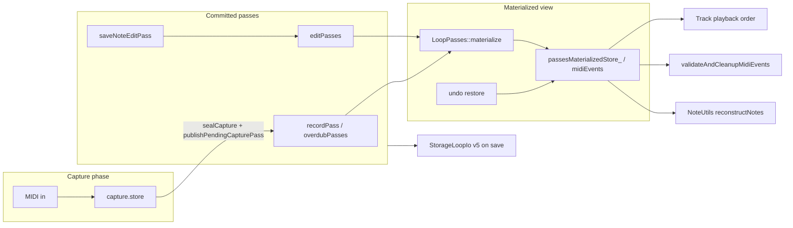

# Loop MIDI storage, validation, and undo

Agent-oriented map of how loop MIDI events are stored, cleaned up, snapshotted, and persisted. Read this before changing `Loop`, `Track`, `TrackUndo`, `StorageManager`, `StorageLoopIo`, or stop-path code.

For display-only note pairing (piano roll, loop shorten), see [`NOTE_WRAPPING_LOGIC.md`](NOTE_WRAPPING_LOGIC.md). For overdub undo history design rationale, see [`../plans/overdub_undo_baseline_phase1_refinement.md`](../plans/overdub_undo_baseline_phase1_refinement.md). For the scalability roadmap (chunk pool, deferred validate), see [`../plans/memory_scalability_refactor_enhancement.md`](../plans/memory_scalability_refactor_enhancement.md). For central deferred SD save routing and chunk-bounded writer stages, see [`DEFERRED_RUNTIME_PERSISTENCE.md`](DEFERRED_RUNTIME_PERSISTENCE.md). For a record/overdub timeline across memory, playback, display, and SD, see [`../plans/record_overdub_memory_display_timeline_enhancement.md`](../plans/record_overdub_memory_display_timeline_enhancement.md).

---

## Mental model

Each **loop slot** (`Loop` in `include/Loop.h`) holds live capture, committed **passes**, and a materialized event view:

| Store | Type | Role |
|-------|------|------|
| `capture` | `Capture` | Live record/overdub append buffer (`capture.store`, `capture.phase`) |
| `passes` | `LoopPasses` | Canonical timeline: **recordPass**, **overdubPasses[]**, **editPasses[]** |
| `passesMaterializedStore_` | `CowLoopEventStore` | Derived materialized MIDI cache behind `midiEvents()` (non-canonical) |

**Rule:** Hot playback paths use **`mergeActiveCapturePasses`** / chunk refs plus **`LoopPasses::materialize`** — not a full-loop materialization on every stop. During **NoteEditSession**, live mutations go to **`EditManager::noteEditSession.store`**; **`saveNoteEditPass()`** appends **EditPass** rows to **`passes.editPasses[]`** without rewriting capture passes.

### Passes — Capture / recordPass / overdubPass / editPass / NoteEditSession

| Layer | Storage | Global undo (when applicable) |
|-------|---------|------------------------------|
| **recordPass** / **overdubPass** | `Loop::passes` capture passes (chunk refs) | **RecordPassAdded** / **OverdubPassAdded** (disable pass on undo) |
| **editPass** | `Loop::passes.editPasses[]` (`EditPassType` + `EditActionType` + `EditPropertyType` + row fields) | **NoteEditPassClosed** / **ControlChangeEditPassClosed** (per closed edit-pass batch) |
| **NoteEditSession** | RAM `noteEditSession.store` while editing | `NoteEditSessionUndoStack` (before `saveNoteEditPass`) |

- **`LoopPasses::materialize()`** — merge active capture passes, then overlay active **editPasses** in storage order (`EditPassType::Note` apply path; explicit `ControlChange` no-op stub until CC edit apply ships).
- **`saveNoteEditPass()`** — one committed **editPass** row; may share a **noteEditPassIndex** batch.
- **`closeNoteEditPass()`** — note-edit exit / overdub-while-editing boundary; pushes **NoteEditPassClosed** for all **editPass** ids in the closed batch.
- **§0.6.1 record routing** — at most one **recordPass** per slot; a second record stop routes to **overdubPass** (`effectiveCapturePassPhase` in `sealCapture`).
- **SD v5** — `StorageLoopIo` persists **passes** per pool slot (wire-compatible capture-pass encoding + **editPasses** tail); `autosaveIntervalMs` (5 min) + urgent flush on note-edit exit when dirty.

**Future session names (not implemented):** **LoopEditSession**, **ControlChangeEditSession**; playback/jam session **TBD**.

---

## Chunk storage (Phase 4)

**Files:** `include/LoopEventStore.h`, `src/LoopEventStore.cpp`, `include/LoopEventBuffer.h`

- Events live in fixed **256-event PSRAM chunks** (`LoopEventStoreConfig::CHUNK_CAPACITY`).
- A global pool holds up to **512 chunks** (`POOL_CHUNK_COUNT`); initialized once in `main()` via `LoopEventStore::initPool()`.
- Chunk ID lists use `InternalHeapFirstAllocator` (internal heap first on Teensy, external-memory fallback in native tests).

**Key operations:**

| API | Cost | When |
|-----|------|------|
| `append` | O(1) amortized | Live capture, record path |
| `detachChunksTo` | O(chunks) | `sealCapture` — move capture chunks into `pendingCapturePass_` |
| `adoptChunkIds` / `adoptAll` | O(chunks) | Stop finalize, load, undo restore paths |
| `cloneShared()` | O(events) | Undo restore (deep copy on apply) |
| `flatten` / `loadFromFlat` | O(events) | SD save/load, materialize, cold validate |
| `usedChunkCount` / `freeChunkCount` | O(1) | Pool-budget admission and undo pressure |
| `canAllocChunkWithReserve()` | O(1) | `sealCapture` — true when `freeChunkCount() > CHUNK_RESERVE` |

**Pool admission (pool-budget):**

- **`PassConfig::CHUNK_RESERVE`** (default 16) — chunks held back for playback headroom.
- **`sealCapture`** returns **`SealOutcome::PoolExhausted`** when `canAllocChunkWithReserve()` is false; there is **no** fixed `capturePassCount` cap.
- **`saveNoteEditPass`** checks **`Config::HEAP_RESERVE_BYTES`** (32 KiB) plus estimated **editPass** row payload before appending an **editPass** row.
- **`reclaimUnreferencedDisabledPasses`** frees **Disabled** capture/edit pass rows whose ids are not pinned by any **`GlobalUndoStack`** entry (`include/PassReclaim.h`, `TrackManager::reclaimUnreferencedDisabledPasses`). Runs on idle (`main.cpp`), after undo trim / redo-branch drop, and once on seal/edit admission retry.

**RAM2 headroom policy (long-record-memory-headroom):**

- **`LoopEventStoreConfig::INTERNAL_HEAP_SAFETY_FLOOR_BYTES`** = **12 KiB** is the non-critical internal-heap floor.
- **`LoopEventStore::hasInternalHeapHeadroomForNonCriticalWork(freeHeapBytes)`** gates deferred save admission using a **stop-path** `getInternalHeapFreeBytes()` sample (`requestDeferredSaveState`); the main loop does not re-query heap while save slices run.
- Below floor, non-critical persistence work defers (`PERS,defer,...,heap_floor`) and retries on later idle iterations; MIDI clock, note-out, and playback are not gated.
- Runtime persistence requests route through `StorageManager::requestDeferredSaveState`; direct synchronous `saveState()` is a cold-path writer and is not used by record/overdub stop, undo/redo, loop edit debounce, clear track, edit autosave, or clock-source transition.
- `StorageManager::processDeferredSaveState` advances at most one small writer step per main-loop iteration after MIDI/clock/playback servicing. OLED display updates are skipped while a deferred save is active so non-timing SPI work does not compete with SD persistence.
- Length-scaling non-hot buffers are PSRAM-first:
  - `NoteUtils::CachedNoteList` storage
  - `PlaybackOrderVec`
  - `LoopPasses` materialize merge temporaries
  - `GlobalUndoStack` entry vector (`UndoEntryVec`)
  - display note storage (`VisualCache.notes`, `CapturePreview.notes`, `DisplayManager::liveDisplayNotes`)
- During live record display, `DisplayManager::resolveDisplayNotes` reads the incrementally maintained `CapturePreview.notes` and open tails instead of flattening the whole capture store each frame. `SC_DISP` capture telemetry reports direct event counts without building a frame-only `MidiEventVec`.

**Copy-on-write wrapper (`CowLoopEventStore`):**

- `mutStore()` / `mutFlat()` clone the backing store when `shared_ptr` use count &gt; 1.
- `shareForSnapshot()` returns the live store ref for undo/redo history (O(1) push; COW on live `mutStore()`).
- `restoreFromSnapshot(snap)` always **`snap->cloneShared()`** — never a shallow struct copy. `LoopEventStore` copy ctor is deleted to enforce this.

---

## Capture lifecycle

**Files:** `include/Loop.h`, `src/Loop.cpp`, `src/Track.cpp`

1. **`beginCapture(Record | Overdub)`** — clears `capture.store`, sets `capture.phase`.
2. **`appendCaptureEvent`** — writes to `capture.store`; dedupes near-duplicates and (on overdub) against merged capture passes in a tick window.
3. **`commitCapturePass`** at record/overdub stop:
   - **`sealCapture`** — wrap-window finalize on record capture; detach chunks into **`pendingCapturePass_`** (routes record vs overdub via `effectiveCapturePassPhase`).
   - **`publishPendingCapturePass`** — append to **recordPass** or **overdubPasses[]**; clear live capture.
   - On publish: **`finalizeLoopAtStop`** + **`pushRecordPassAdded`** / **`pushOverdubPassAdded`** on global undo stack.
4. **`discardCapture`** — undo open overdub capture (session still open).
5. **`discardPendingCapturePass`** — rollback failed seal/publish.

After commit, **`finalizeLoopAtStop`** runs (see below). Loop length is set on record stop before commit/validate; overdub stop uses playhead close tick.

---

## Note validation (three tiers)

There are **three separate** “note correctness” mechanisms; do not conflate them.

### 1. Hot stop path — wrap window only

**Files:** `include/Utils/LoopStopFinalize.h`, `Track::finalizeLoopAtStop` in `src/Track.cpp`

Runs on **every** record stop and overdub stop (after `loopLengthTicks` is known):

- **`mergeActiveCapturePasses`** into a temp store (active **recordPass** + **overdubPasses** only — no edit overlay).
- Flushes `pendingNotes` via `store.append(NoteOff(...))`.
- Calls `LoopStopFinalize::finalizeWrapWindowOnStore` on the **head + tail 1-bar window** (default `wrapWindow = TICKS_PER_BAR`):
  - Pairs tail note-ons with head note-offs for **wrapped** notes (head-window scan only).
  - Appends synthetic note-offs for **open tail** note-ons still sounding at stop.
- Writes back via **`commitStopFinalizeFromStore`** (rebuilds the just-published capture pass chunk list).
- Uses `loop.invalidatePlaybackCaches()` when events change.
- Sets `deferredFullMidiValidate = true` for later idle pass.
- Does **not** run full-loop sort/validate on stop.

### 2. Cold full pass — orphaned pair cleanup

**Files:** `Track::validateAndCleanupMidiEvents`, `Track::processDeferredIdleMaintenance`

Full-loop pass over `loop.midiEvents()` (materialized flat):

- Sorts by tick; note-offs before note-ons at equal tick.
- Removes orphaned note-ons/offs (LIFO for duplicate note-ons).
- Inserts synthetic note-offs for unmatched tail note-ons (uses loop length / optional playhead close tick).
- Second pass recognizes **wrapped** pairs (note-off before note-on in tick order, &gt; half loop apart).

**When it runs:**

| Trigger | Path |
|---------|------|
| After stop | **Deferred** — `main()` calls `processDeferredIdleMaintenance(now)` per track; runs after **`Config::deferredValidateMaxDelayMs`** (default 60s) even while **PLAYING**; blocked while that track is **RECORDING** or **OVERDUBBING** |
| SD load | **Immediate** — `StorageManager` after loading slot events |
| Manual / legacy | Direct call (avoid on hot paths) |

### 3. Display reconstruction — not storage mutation

**Files:** `src/Utils/NoteUtils.cpp`, tests in `test/test_noteutils_reconstruct/`

`NoteUtils::reconstructNotes(events, loopLength)` builds **DisplayNote** segments for piano roll / LEDs. It discards note-ons at or beyond `loopLength` and wraps note-offs for UI — see [`NOTE_WRAPPING_LOGIC.md`](NOTE_WRAPPING_LOGIC.md). It does **not** write back to committed passes or `passesMaterializedStore_`.

---

## Undo: global stack + in-edit session

**Files:** `src/TrackUndo.cpp`, `src/MidiButtonActions.cpp`, `src/ButtonManager.cpp`, `src/Track.cpp`, `include/GlobalUndoStack.h`

### Global undo (`Track::undoStack` / `GlobalUndoStack`)

| `UndoEntryKind` | Push | Undo action |
|-----------------|------|-------------|
| **RecordPassAdded** / **OverdubPassAdded** | `commitCapturePass` publish | `setCapturePassState(Disabled)` |
| **NoteEditPassClosed** / **ControlChangeEditPassClosed** | close scoped edit-pass batch | set referenced `editPasses[]` rows to **Disabled** |
| **ClearSlot** | long-press clear (`pushClearTrackSnapshot`) | restore `beforeSnapshot` + geometry + track state |
| **LoopBoundaryChange** | loop-start edit | restore prior loop start/length |

**Open overdub capture:** if `capture.phase == Overdub` and capture non-empty, undo discards live capture (`discardCapture`) without popping the stack.

**Fresh record → overdub example:**

| Step | Action | Stack after |
|------|--------|-------------|
| Record stop (publish) | `pushRecordPassAdded` | 1 entry |
| Overdub stop (publish) | `pushOverdubPassAdded` | 2 entries |
| Undo 1 | Disable last overdub pass | 1 entry (cursor) |
| Undo 2 | Disable record pass → empty slot | 0 entries (cursor) |

`beginOverdubSession` closes an open **noteEditPass** when entering overdub while editing; it does **not** push an extra capture-pass undo entry.

**Important:** clear-slot snapshot entries capture a deep-cloned pass snapshot (`PersistedLoopSnapshot`) so undo/redo never aliases live chunk refs.

### In-edit session undo (`NoteEditSessionUndoStack`)

While **NoteEditSession** is active, `handleUndo` / `handleRedo` prefer session undo (`NoteEditSession undo` / `redo` logs) before the global stack.

**E:** entries (pool-budget §9): **`SessionUndoEntry`** = **`editRows`** (scoped pre-commit **editPass** rows) + **`NoteEditFocus`** + **`NoteEditSelection`**. Pushed at geometry-kind boundaries via **`pushSessionUndoOnKindChange`** (not per fader tick). Restore: materialize from **passes** (excluding post-push committed **editPass** ids) + **`applyNoteEditPassSequence`** + focus/selection replay — no **`cloneShared`** per step.

- Depth target **`Config::PREFERRED_SESSION_UNDO_DEPTH`** (32); pressure trim keeps at least **`MIN_SESSION_UNDO_DEPTH`** (4).
- Push checks heap admission (**`HEAP_RESERVE_BYTES`** + estimated entry bytes); rejected pushes log a warning.

Committed **editPass** rows store canonical **EditPass** row fields (SD v5); live **NoteEditSession.store** is materialized from **passes**; **E:** stack stores edit-scope metadata only.

### Routing (`handleUndo`)

1. **NoteEditSession** undo if active and session stack non-empty
2. **Global undo** (`undoOverdub` — any `UndoEntryKind` at cursor)
3. **Clear-slot undo** (`canUndoClearTrack` — top entry is **ClearSlot**)

Hardware **Button A double-press** calls `undoOverdub` directly. MIDI record double-tap uses `handleUndo()`.

**Slot clear** prunes global undo entries for that slot (`clearUndoHistoryForSlot` in `Track::clear()`).

**Global undo depth (pool-budget):**

- Target depth **`Config::PREFERRED_UNDO_DEPTH`** (99) when chunk reserve and heap reserve are satisfied.
- **`trimUndoStackForMemory`** drops oldest entries under pressure (`freeChunkCount() <= CHUNK_RESERVE`, heap below **`HEAP_RESERVE_BYTES`**, or depth above preferred with pressure) while keeping at least **`MIN_UNDO_DEPTH`** (8).
- **`ABSOLUTE_MAX_UNDO_ENTRIES`** (512) is a hard overflow rail.
- After each trim, redo-branch drop, or slot prune: **`reclaimUnreferencedDisabledPasses`** so disabled pass chunks and **ClearSlot** snapshot clones can be freed.

---

## SD persistence

**Files:** `src/StorageManager.cpp`, `include/StorageLoopIo.h`, `src/StorageLoopIo.cpp`

- Per-slot loop pool entries persist **`LoopPasses`** (capture passes + **editPasses** tail) via `writeLoopPersisted` / `readLoopPersisted`.
- `writeLoopPersisted` streams capture-pass events in bounded batches and records max batch size through storage-loop-io test hooks; the deferred save path writes live loop pool entries as metadata, capture-pass headers, and one capture chunk per main-loop iteration.
- **STORAGE_VERSION** **5** (when **`scoped-edit-pass-payload`** ships): **loadState** rejects v1–v4; firmware starts empty. **No** edit-tail migration.
- v5 **editPasses** tail: canonical **EditPassType** row wire only (**NoteRef** + property fields); **no** **EditChange** on disk.
- **`startLoopTick`** is stored in each loop snapshot and restored by **`applySnapshotToLoop`** on load (phase origin for `tickPhaseInLoop`).
- Truncated or corrupt **editPasses** tails fail **`readPersistedEditsTail`** (load aborts — no silent empty edits).
- Invalid persisted **`slotLoopId`** values outside `0..MAX_LOOPS_PER_TRACK-1` are repaired to the slot pool index on load (warning logged).
- On-wire capture rows use legacy **take-shaped** fields (`PersistedCapturePassWire`) for backward compatibility; RAM uses **recordPass** / **overdubPass**.
- Global undo stack is persisted in v4 (magic + entries).
- After load, **`validateAndCleanupMidiEvents()`** runs once per slot with events.
- Chunk IDs are **in-RAM only** until a format version bump; save/load flattens chunk contents through the persisted snapshot path.
- `StorageManager::processDeferredSaveState` runs as background work when no track is recording/overdubbing, including while playback is active; each slice yields back to the main loop before the next iteration.

---

## Build environments and diagnostics

| Env | Purpose |
|-----|---------|
| `teensy41` | Default firmware |
| `teensy41-capture-serial` | HITL / capture: `SESSION_CAPTURE=1`, `#CAP` serial lines |
| `teensy41-capture` | Silent production-style capture build (no session serial) |
| `teensy41-capture-bypass` | Adds `BYPASS_STOP_UNDO_SAVE=1` — skips undo snapshot push and `saveState` on stop (diagnostic only) |

**Do not** add `MemoryMonitor` or full-loop validation on record/overdub stop hot paths. Idle maintenance, deferred SD save (`processDeferredSaveState`), and `HotPathTelemetry` deferred summary are wired in `main()` — deferred save runs only when **no** track is recording/overdubbing, and can continue during **PLAYING**; deferred full validate runs only when the track is not **PLAYING**, **RECORDING**, or **OVERDUBBING**. **`TrackManager::prewarmPlaybackRuntime()`** runs after early loop allocation and successful **`loadState`** so first playback tick does not allocate runtime.

Record stop calls `queueDeferredRecordRevts()` after a published commit; idle maintenance emits REVT while `PLAYING` (not only when transport is stopped). Non-`SESSION_CAPTURE` builds stub all `#CAP` / REVT macros.

---

## Tests (native)

| Suite | Covers |
|-------|--------|
| `test/test_loop_event_store` | Chunk append, adopt, merge, **restore deep copy** |
| `test/test_loop_stop_finalize` | Wrap-window synthetic offs, playhead close tick |
| `test/test_noteutils_reconstruct` | Display note pairing vs loop length |
| `test/test_take_capture` | Capture pass seal/publish, record vs overdub routing |
| `test/test_loop_take_survival` | Pass timeline survives rematerialize and stop finalize |
| `test/test_storage_loop_io` | SD v5 pass round-trip, **startLoopTick** apply, truncated edit tail |
| `test/test_capture_state_guards` | Overdub **beginCapture** idempotency |
| `test/test_loop_pool` | **findById** null + slot-index fallback |
| `test/test_playback_prewarm` | Playback runtime / order prealloc stability |
| `test/test_deferred_validate_policy` | Deferred validate delay and playback/capture blocking |
| `test/test_edit_apply` | **editPasses** overlay via **applyNoteEditPass** / **applyNoteEditPassSequence** |
| `test/test_note_edit_session_undo` | **E:** **editRows** restore parity vs clone; 128-bar bounded entry memory |
| `test/test_redo_functionality` | Undo/redo stacks (host `Track`; listed in `test_ignore` for native — run on Teensy env if needed) |

Run: `pio test -e native` from project root.

---

## File index (quick lookup)

| Concern | Primary files |
|---------|----------------|
| Chunk pool + store | `LoopEventStore.h/.cpp` |
| COW + flat cache | `LoopEventBuffer.h` |
| Passes + materialize | `LoopPasses.h/.cpp`, `EditApply.cpp` |
| Loop capture/commit | `Loop.h`, `Loop.cpp` |
| Note edit session | `EditManager.cpp`, `NoteEditSession.h` |
| Stop + deferred validate | `Track.cpp` (`finalizeLoopAtStop`, `validateAndCleanupMidiEvents`, `processDeferredIdleMaintenance`) |
| Wrap-window finalize | `Utils/LoopStopFinalize.h` |
| Undo | `TrackUndo.cpp`, `GlobalUndoStack.h` |
| Undo routing | `MidiButtonActions.cpp` (`handleUndo`), `ButtonManager.cpp` |
| SD v5 passes I/O | `StorageLoopIo.h/.cpp`, `StorageManager.cpp` |
| Main idle hooks | `main.cpp` |
| Display notes | `Utils/NoteUtils.cpp` |

---

## Common mistakes (for agents)

1. **Using shallow copy for undo restore** — pass snapshots must deep-clone chunk refs when captured/restored.
2. **Full `validateAndCleanupMidiEvents` on stop** — replaced by `finalizeLoopAtStop` + idle deferral for long loops.
3. **Treating `midiEvents()` as canonical storage** — **passes** + **NoteEditSession.store** are source of truth; `passesMaterializedStore_` is derived.
4. **Treating `midiEvents()` writes as canonical** — they are derived-cache-only; canonical loop ownership remains in passes.
5. **Assuming SD stores chunk IDs** — v4 persists pass-shaped snapshots; do not read/write chunk IDs to disk without a format version bump.
6. **Confusing `reconstructNotes` with storage validation** — UI wrapping ≠ committed event cleanup.
7. **Reintroducing Take / `takes[]` / `commitTake()` names** — use **passes**, `commitCapturePass()`, **RecordPassAdded** / **OverdubPassAdded**.
