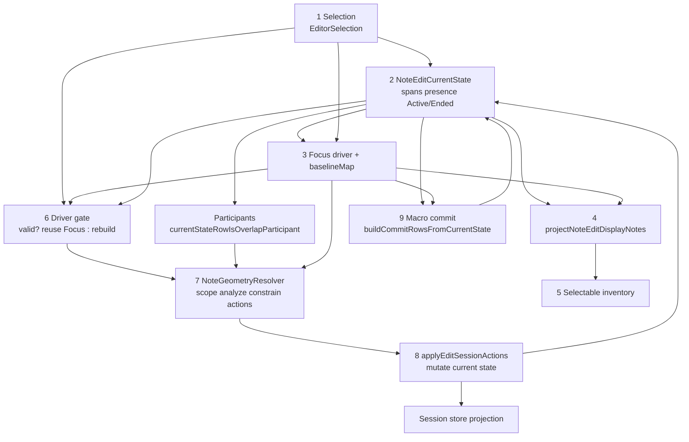

# Move / note-edit geometry logic

Living guide for NOTE_EDIT move, length, pitch, overlap hide/shorten/restore, and commit.
Normative OpenSpec: [`openspec/specs/edit-session-action-geometry/spec.md`](../../openspec/specs/edit-session-action-geometry/spec.md).
Authority contracts plan: [`docs/plans/note_edit_resolver_authority_contracts_refinement.md`](../plans/note_edit_resolver_authority_contracts_refinement.md).
Decision: DEC-029 (`NoteEditCurrentState`), DEC-030 (sticky `Ended` participation).

---

## Overview

During NOTE_EDIT, editable geometry is owned by **`NoteEditCurrentState`**. The geometry pipeline analyzes interactions, resolves constrained geometry, builds `EditSessionAction`s, and applies them to current state (then projects to the session MIDI store). The moving note stays intact; overlap notes hide, shorten, or leave-restore around it.

**Core principle:** the causing note (driver) is never modified by overlap resolution — other notes adapt.

---

## End-state authority chain (do not invert)

Each stage lists its owner and the only inputs it may trust. Same table as contracts plan §1, updated for shipped participation (`Ended`) and latch removal.

| # | Stage | Owner | Allowed inputs (end state) |
|---|-------|--------|----------------------------|
| 1 | Identity | `EditorSelection` (`primaryNote`, `selectedTick`) | user select events |
| 2 | State authority | `NoteEditCurrentState` (`currentSpan`, `committedSpan`, `presence`, `overlapParticipation`) | apply writers + commit/handoff seal — see below |
| 3 | Focus driver / baseline | `NoteEditFocus` (`movingNoteId`, `last`, `commitBaseline`, `baselineMap`) | stages 1 + 2 — **no** `changedOverlapNoteIds` |
| 4 | Display projection | `projectNoteEditDisplayNotes` / `resolveParticipantDisplaySpan` | stages 2 + 3, committed passes |
| 5 | Selectable inventory | selectable UI path / `filterProjectingSelectableDisplayNotes` | stage 4, filtered to editable rows |
| 6 | Driver gate | see [Driver gate](#driver-gate-stage-6) — validate/rebuild Focus before geometry | stages 1 + 2 + 3 |
| 7 | Geometry resolution | `NoteGeometryResolver` → `buildEditSessionActions` | Active participants + `baselineMap` + `EditedGeometry` |
| 8 | Apply / write | `applyEditSessionActions` → current-state mutation → store projection | stage 7 actions only |
| 9 | Commit | macro commit / `commitNoteEditPass` / `buildCommitRowsFromCurrentState` | stage 2 vs committed baseline |

### `NoteEditCurrentState` writers (split)

| Field | Writer | Examples |
|-------|--------|----------|
| **`currentSpan`** | Interactive apply pipeline (stage 8) | `HideNote`, `ShortenNote`, `MoveNote`, `RestoreNote` via `applyEditSessionActions` |
| **`committedSpan`** | Commit / handoff sealing | `commitNoteEditPass`, `syncCommittedSpan` after macro commit |
| **`overlapParticipation`** | Sticky clear → `Ended`; Shorten/Hide/Restore → `Active` | `clearChangedOverlapParticipationWhenInteractionCleared`, `applyEditSessionAction` |

### Identity terminology (do not conflate)

| Concept | Meaning | Typical carrier |
|---------|---------|-----------------|
| **Selection identity** | What the user selected | `EditorSelection.primaryNote`, `selectedTick` |
| **Driver identity** | Interaction anchor for geometry | `focus.movingNoteId`, `focus.last` — **not** always `primaryNote` |
| **Participant identity** | Notes in the overlap/edit closure | Current-state rows with `currentStateRowIsOverlapParticipant` |

**Removed (do not revive):** Focus `changedOverlapNoteIds`, `reconcileChangedOverlapNoteIdsFromLiveStore`, imperative `findOverlaps` / restore-first as the live engine.

`overlapNotes` on focus is **scratch** (evict/clear/undo sizing) — not membership or commit authority.

---

## Driver gate (stage 6)

The **driver** is the note Focus treats as the geometry interaction anchor: `(movingNoteId, focus.last)`. Selection and Focus can disagree after select handoff, rebuild, or presence changes — so live edit paths must not call the resolver on a stale Focus cache.

**Driver gate** is that check-and-repair step:

| Piece | Role |
|-------|------|
| `isLiveEditDriverValidFromCurrentState` | Predicate: is the cached driver still trustworthy? |
| `isLiveEditDriverValidForTrack` | Track wrapper — prefers current-state validity when `NoteEditCurrentState` is non-empty |
| `ensureNoteEditFocusForLiveEdit` | If invalid and a note is still selected → `rebuildNoteEditFocusForDisplayNote`; if valid → no-op |

Called before move / length / pitch geometry (e.g. from `EditStartNoteState`, `EditLengthNoteState`, `EditPitchNoteState`, `NoteMovementUtils`, deferred playing geometry).

### Validity checks (`isLiveEditDriverValidFromCurrentState`)

All must pass:

1. Focus active and `movingNoteId` valid  
2. Selection primary matches that driver id (`editorSelectionMatchesDriverNote`)  
3. Current state has a `currentSpan` for the driver  
4. Driver row still projects (`rowProjectsToStore` — not Hidden/Deleted)  
5. That `currentSpan` matches `focus.last` (pitch + start + end)

If any fail → Focus must not drive geometry until rebuilt (or the path bails when there is no selection).

### Why it exists

- **Selection ≠ driver:** `primaryNote` can change while Focus still names the previous mover until rebuild.  
- **Span drift:** apply updates `currentSpan` but `focus.last` can lag until sync/rebuild — a match failure forces rebuild instead of resolving from wrong brackets.  
- **Non-projecting mover:** a Hidden/Deleted note must not remain the live edit driver (Stage 1 / C2).

This stage does **not** choose overlap participants and does **not** emit actions — it only decides whether Focus may be reused as the causing note for stage 7.

---

## End-to-end flow

Selection and current state feed resolution; apply mutates state; display/inventory/commit are derived readers (commit also seals `committedSpan`). Stage 6 sits on the live-edit path between Focus and the resolver.



ASCII equivalent:

```text
User select
      │
      ▼
EditorSelection (1) ────────────────────────┐
      │                                       │
      ▼                                       ▼
NoteEditCurrentState (2) ◄── apply (8) / syncCommittedSpan (9)
  currentSpan, committedSpan, presence,
  overlapParticipation Active|Ended
      │
      ├──► participants = currentStateRowIsOverlapParticipant
      │
      ▼
NoteEditFocus (3)  movingNoteId, last, baselineMap, commitBaseline
      │
      ▼
driver gate (6)  — valid → reuse Focus; invalid + selected → rebuild Focus
      │
      ▼
NoteGeometryResolver (7)
  scope → analyze → constrain → buildEditSessionActions
      │
      ▼
applyEditSessionActions (8) ──► session store projection
      │
      ├──► projectNoteEditDisplayNotes (4) ──► selectable inventory (5)
      │
      └──► macro commit / buildCommitRowsFromCurrentState (9)
```

---

## Current-state row model

```text
NoteEditCurrentNoteState
  noteId
  committedSpan     ← sealed at commit / syncCommittedSpan
  currentSpan       ← live editable geometry (paint + analyze overlay)
  presence          ← Visible | Hidden | Deleted | Added
  overlapParticipation ← Active | Ended   (DEC-030)
```

### Participation (`overlapParticipation`)

| Value | Meaning |
|-------|---------|
| **Active** | May be an overlap participant (if Hidden/Deleted, or `currentSpan` ≠ `committedSpan`) |
| **Ended** | Sticky end-of-participation after deselect/clear while leaving shortened `currentSpan` (no geometry flash restore) |

Query: `currentStateRowIsOverlapParticipant` — **false** when `Ended`, even if spans still differ.

Re-enter **Active** on `ShortenNote` / `HideNote` / `RestoreNote` via `applyEditSessionAction`.

Sticky clear owner: `clearChangedOverlapParticipationWhenInteractionCleared` (sets `Ended` only; does not rewrite spans).

### Presence vs participation

- **Hidden / Deleted** → do not project to session store; still Active participants until leave-restore or sealed Delete.
- **Visible + shortened** → projects stub; may be inventory-masked while overlap closure is in progress.
- **Ended + Visible shortened** → still paints stub; **not** in evaluation scope / leave-restore / commit overlap rows.

---

## Geometry resolution detail (stage 7)

**Orchestrator entry:** [`NoteMovementUtils.cpp`](../../src/Utils/NoteMovementUtils.cpp) — `moveNoteWithOverlapHandling`, `changeLengthWithOverlapHandling`, active-session pitch → `NoteGeometryResolver::resolveForCausingNote`.

**Resolver:** [`NoteGeometryResolver.cpp`](../../src/EditManager/NoteGeometryResolver.cpp)

```text
EditedGeometry (causing spans + selection)
        │
        ▼
collectEvaluationScopeNoteIds   ← lane + sticky Active participants (current state)
        │
        ▼
analyzeEditSessionInteractions  ← positive interaction graph
        │
        ▼
groupEditSessionInteractionsByTarget
        │
        ▼
resolveAllConstrainedGeometry / determineConstrainedGeometryTargetNoteIds
        │   leave-restore targets = Active participants with cleared overlap closure
        ▼
buildEditSessionActions
        │
        ▼
applyEditSessionActions → NoteEditCurrentState.applyEditSessionAction
        │
        ▼
projectToSessionStore / sync projecting rows → session MIDI preview
        │
        ▼
finalReconstructAndSelect / applySelectionFromGeometryEdit  (UI only)
```

### Interaction → action (summary)

| Interaction | Typical action |
|-------------|----------------|
| `CompleteCover` / full cover | `HideNote` (or CompleteCover of already-shortened stub → Hide) |
| `OverlapNoteOff` | `ShortenNote` (restrictive combine) |
| `OverlapNoteOn` | Hide or shorten per resolve policy |
| No incoming + Active participant + closure cleared | `RestoreNote` to `committedSpan` (leave-restore) |
| Min length | Hide when below note-edit minimum |

Normative precedence: OpenSpec `edit-session-action-geometry`.

### Leave-restore (vacated lane / LTR clear)

Owned by constrained-target determination + `constrainedGeometryFromRestoreCandidate`:

- Session-unsealed **Hidden** → restore to `committedSpan` (`participatingNoteQualifiesForLeaveRestoreTarget`).
- **Visible shortened** (incl. sealed) → restore to `committedSpan` when mover clears closure (Stage 7.5.D).
- **Deleted** after deselect seal → does **not** leave-restore (Stage 7.5.E2).
- **Ended** → not a target.

---

## Commit / macro seal

**Path:** `commitAllPendingNoteEditActions` → when current state non-empty, `buildCommitRowsFromCurrentState` (overlap rows only for Active participants).

- Macro commit seals overlap geometry into passes and may `syncCommittedSpan` so leave-restore does not flash a pre-shorten length.
- F1 select / empty-step deselect may seal pending mover geometry when bracket-aligned (`isMacroCommitAlignedWithSelectTarget`).
- Empty-step deselect can call sticky clear (`Ended`) without rewriting shortened `currentSpan`.

Legacy `buildPreCommitEditPasses` (live-store diff) remains a fallback/parity path and also gates overlap rows on current-state participation when provided.

---

## Display and inventory

| Consumer | Rule |
|----------|------|
| Paint | `projectNoteEditDisplayNotes` — participants from `collectOverlapParticipantNoteIdsFromCurrentState`; Hidden/Deleted suppressed |
| Inventory | Selectable list excludes non-projecting / masked tails; Visible shortened may paint but stay unselectable while closure active |
| DNTE / sidebar | Primary from selection + current span — independent of paint count (C9) |

---

## Entry points (hardware / states)

| Path | Module |
|------|--------|
| Move / length / pitch faders | `EditStartNoteState`, `EditLengthNoteState`, `EditPitchNoteState` → `NoteMovementUtils` |
| Select / macro commit | `EditSelectNoteState`, `ControlSurfaceManager` F1 |
| Focus rebuild / deselect clear | `EditManager` focus rebuild, `clearVisibleOverlapParticipationBeforeDeselect` |
| Session undo | `NoteEditSessionUndoStack` (snapshots include focus + current state) |

Non-session pitch (no open NOTE_EDIT): `applySimplePitchChange` when safe; otherwise full resolve path.

---

## Hard don'ts

1. Do **not** use live-store presence alone as overlap membership authority.
2. Do **not** reintroduce a Focus latch list for participation.
3. Do **not** restore full `committedSpan` on sticky deselect of Visible shortened — set `Ended` instead.
4. Do **not** treat `overlapNotes` scratch as commit or filter authority.
5. Do **not** confuse selection identity with driver identity.
6. Display must not invent geometry the current state does not own.

---

## Status (2026-08)

| Area | State |
|------|--------|
| Geometry pipeline | `NoteGeometryResolver` wired for move / length / pitch / add / delete |
| Current-state ownership | DEC-029 — shipped through OpenSpec phases 1–8 |
| Participation / latch removal | DEC-030 + §11 steps 5.1–5.5 — shipped; smoke HITL `025807`, `030432`, `032118` |
| Display projection | `projectNoteEditDisplayNotes` sole active NOTE_EDIT producer |
| Orthogonal representation | Plan §12 **R1–R5 complete** — `ParticipatingNotePhase` removed; `NoteEditPresenceType` row encoding retained |
| Full edit HITL matrix | Still open (interim: `edit_minimal` / manual smoke) |

**Further reading:** [`FADER_STATE_SYSTEM.md`](FADER_STATE_SYSTEM.md), [`NOTE_WRAPPING_LOGIC.md`](NOTE_WRAPPING_LOGIC.md) (display wrap only), [`LOOP_MIDI_STORAGE_AND_VALIDATION.md`](LOOP_MIDI_STORAGE_AND_VALIDATION.md) (commit / undo / storage).
