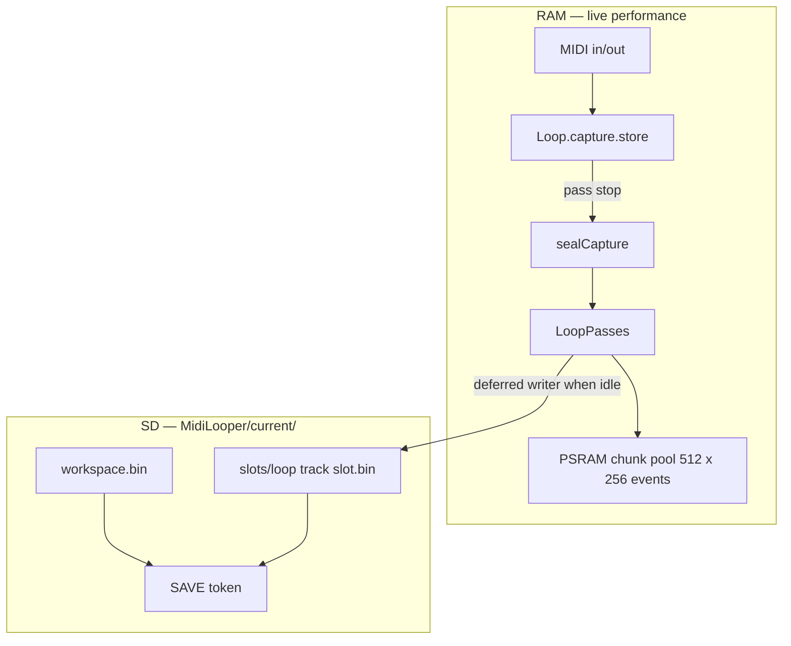
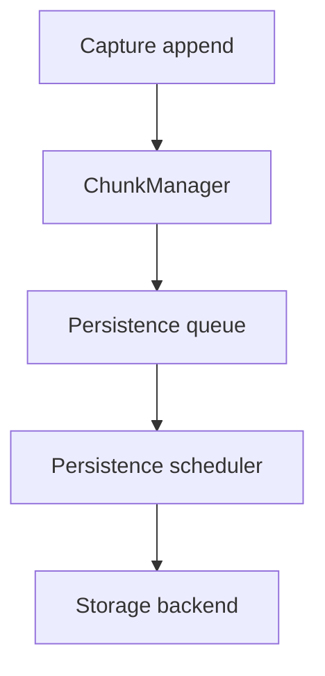

# Runtime storage and persistence

Agent-oriented map of how loop MIDI lives in RAM (chunk pool + passes) and how it reaches SD (deferred writer). Read this **first** when changing persistence scheduling, long-record save starvation, or the continuous-runtime-persistence track.

**Deep dives (do not duplicate here):**

| Guide | Role |
|-------|------|
| [`BOOT_LOAD.md`](BOOT_LOAD.md) | Cold-boot phase order, SDIO vs USB Host, `BOOT,*` telemetry |
| [`LOOP_MIDI_STORAGE_AND_VALIDATION.md`](LOOP_MIDI_STORAGE_AND_VALIDATION.md) | RAM capture, seal, passes, undo COW, hot-path constraints |
| [`DEFERRED_RUNTIME_PERSISTENCE.md`](DEFERRED_RUNTIME_PERSISTENCE.md) | Deferred writer FSM, SAVE tokens, call sites, chunk-bounded SD write |
| [`INTERNAL_HEAP_AND_EXTERNAL_MEMORY.md`](INTERNAL_HEAP_AND_EXTERNAL_MEMORY.md) | Internal heap vs external memory pool routing |

**Active architecture change (proposed):** OpenSpec [`continuous-runtime-persistence`](../../openspec/changes/continuous-runtime-persistence/) — invariant-driven, cooperative budget-driven capture-chunk persistence. Status: see [`docs/runtime/PROJECT_STATE.md`](../runtime/PROJECT_STATE.md).

### Core architectural invariants

1. **Runtime ownership is independent of persistence state.**
2. **A sealed chunk is immutable.**
3. **Persistence is cooperative and budget-driven.**
4. **Persistence preserves chunk seal order.**
5. **Runtime playback and recording always take precedence over persistence.**
6. **Memory reclamation is independent of persistence completion.**

Most implementation details follow from these rules.

---

## Read this when

- You are changing `StorageManager`, `StorageLoopIo`, persistence scheduling in `main.cpp`, or stop-path save triggers.
- A long record/overdub run fails to reach `PERS,result,...,ok` or crashes before persistence completes.
- You need the mental model linking **pass ownership**, **storage ownership**, and **chunk lifecycles**.

---

## Mental model: two layers

Performance data and SD persistence are related but **not synchronized during capture** today.



| Layer | Location | What lives there |
|-------|----------|------------------|
| **RAM** | PSRAM chunk pool (`LoopEventStore`) | Live capture buffer, sealed pass chunk refs, edit passes |
| **SD** | `MidiLooper/current/` | `workspace.bin` (meta + undo) + `slots/loop_TT_SS.bin` per loop slot |

---

## Pass ownership ≠ storage ownership

The central architectural separation:

| Concern | Owner | Question it answers | Does not own |
|---------|-------|-------------------|--------------|
| **Pass ownership** | `Loop`, `LoopPasses`, capture | Which events belong to this record/overdub pass? When is the pass open or closed? | SD bytes; chunk pool free list; persistence queue |
| **Storage ownership** | Persistence subsystem (`StorageManager`) | Which bytes are safely on SD? What work remains in the persistence queue? | Live capture append; sealed-chunk immutability in RAM |

A pass may remain **open** while individual chunks within it are already **persisted**. Pass-close finalizes pass metadata; it does not gate the first byte to SD.

```
Pass (open)
├── Chunk A  — runtime: Sealed; persistence: Persisted
├── Chunk B  — runtime: Sealed; persistence: Persisted
├── Chunk C  — runtime: Recording; persistence: Not scheduled
└── Chunk D  — (future tail)
```

Everything else — scheduler, queues, recovery, on-disk layout — follows from this separation.

---

## Architecture layers (target)

Persistence is a stack of responsibilities, not a single “save on stop” step:



| Layer | Owner | Responsibility | Does not own |
|-------|-------|----------------|--------------|
| **Capture** | `Loop.capture` | Append events to the single mutable tail chunk | SD bytes; pass-close metadata; chunk pool free list |
| **ChunkManager** | `LoopEventStore` (target) | Sealing, runtime chunk ownership, reference tracking, allocation, reclamation, lifecycle (`Free → Recording → Sealed`) | Persistence queue; SD writes; pass timeline |
| **Persistence queue** | Persistence subsystem (`StorageManager`, target) | Work items for sealed chunks; seal-order admission; exactly-once enqueue | Runtime chunk mutability; capture append |
| **Persistence scheduler** | `StorageManager` + `main.cpp` main loop | Cooperative budget-driven progress; yield after bounded work | Capture timing; playback; chunk lifecycle |
| **Storage backend** | `StorageManager`, `StorageLoopIo` | Bytes on SD; wire format; SAVE tokens | RAM chunk pool; when chunks seal |

Runtime ownership, persistence scheduling, and storage backends are **intentionally independent** layers. This separation allows future work — alternate storage formats, compression, DMA, journaling, or different persistence media — without modifying capture or playback ownership.

Scheduler changes must remain independent from storage-backend format evolution.

---

## Ownership by component

Every architectural part should have a clear owner. Use this table before moving responsibility across modules.

### Performance and timeline (RAM)

| Component | Owner | Owns | Does not own |
|-----------|-------|------|--------------|
| **Pass timeline** | `Loop`, `LoopPasses` | Which events belong to record/overdub/edit passes; pass open vs closed; chunk refs on passes | Chunk pool allocation; SD persistence progress |
| **Capture append** | `Loop.capture` | Live record/overdub buffer; exactly one mutable tail chunk per active capture | Sealed-chunk immutability enforcement (ChunkManager); SD writes |
| **ChunkManager** | `LoopEventStore` (target) | Pool chunks; seal; reference counts; reclaim when all runtime refs released | Pass membership; persistence queue; undo stack |
| **Playback merge** | `Loop`, `LoopPasses` | Read sealed chunks for MIDI out via `mergeActiveCapturePasses` / `materialize` | Mutating sealed chunks; scheduling SD writes |
| **Materialized cache** | `Loop` (`passesMaterializedStore_`) | Derived merged MIDI for display/playback shortcuts | Canonical timeline (passes remain source of truth) |
| **Note edit session** | `EditManager`, `NoteEditSession` | `editPasses[]`, live edit store, overlap notes | Capture-chunk persistence (out of scope v1) |
| **Undo snapshots** | `TrackUndo` | COW chunk refs in snapshots; `restoreFromSnapshot` always clones | In-place mutation of persisted SD bytes |

### Persistence (SD path)

| Component | Owner | Owns | Does not own |
|-----------|-------|------|--------------|
| **Save request** | Call sites → `StorageManager` | `requestDeferredSaveState()` sets pending; dirty flags | When capture may append |
| **Persistence queue** | Persistence subsystem (`StorageManager`, target) | Sealed-chunk work items; seal-order drain; exactly-once admission | Runtime `Recording` tail; chunk reclaim |
| **Persistence scheduler** | `StorageManager`, `main.cpp` | Cooperative slice budget; transport/heap gates (today); one finite-state-machine step per call | Loop capture; MIDI playback timing |
| **Deferred save finite-state machine** | `StorageManager` | Stage progression: meta → slots → loop body → footer → undo → completion | Chunk seal triggers |
| **Per-slot loop write** | `StorageManager/WorkspaceSave.cpp`, `StorageLoopIo` | One chunk per slice today; slot file bytes | Chunk pool lifecycle |
| **Storage backend** | `StorageLoopIo`, SD layout | On-disk representation; SAVE token; recovery load | RAM ownership of events |
| **Recovery on load** | `StorageManager`, `StorageLoopIo` | Reconstruct longest valid prefix of persisted sealed chunks; quarantine invalid tails | Mutating live runtime chunks during load |

### Cross-cutting rules

- **Playback and recording** own timing correctness; persistence **reads** sealed chunks but never blocks them.
- **Persistence completion** does not imply **memory reclaim** — runtime reference holders (`LoopPasses`, playback, undo) must release first.
- **Pass-close** (`publishPendingCapturePass`) owns pass metadata finalization, not first-byte-to-SD.

---

## Runtime invariants

These invariants drive every implementation decision for continuous runtime persistence:

### Runtime priority (governing rule)

> **Runtime recording and playback correctness always take precedence over persistence progress.**

Consequences:

- Persistence yields immediately when runtime work exists.
- Persistence may be delayed; playback timing is never delayed for persistence.
- Recording correctness is never compromised for storage throughput.

### Detailed invariants

1. **Capture owns exactly one mutable recording chunk** per active capture store.
2. **A sealed chunk is immutable** — no capture or edit path may mutate its events.
3. **Playback may read sealed chunks** regardless of persistence state.
4. **Persistence may read sealed chunks** — it never mutates runtime chunk contents.
5. **Undo never modifies persisted data in place** — COW / new chunk refs per existing undo rules.
6. **Chunk reuse occurs only after every runtime owner releases its references** — persistence alone does not free a chunk.
7. **Sealed chunks enter the persistence queue in seal order; persistence completes chunks in seal order.**
8. **A sealed chunk enters the persistence queue exactly once** — no duplicate scheduling.

### Persistence vs reclaim

> Persistence guarantees that data has been safely written to storage. Memory reclamation occurs only after all runtime owners have released their references.

Example: a chunk may be **Persisted** on SD while playback and an undo snapshot still hold chunk refs — it must remain allocated in the pool.

---

## Separate lifecycles: runtime vs persistence

Do **not** combine runtime ownership and persistence progress into one state machine.

### Runtime chunk lifecycle (ChunkManager internal)

Describes mutability inside the firmware. Nothing here implies SD state. **ChunkManager** owns sealing, reference tracking, allocation, reclamation, and these transitions.

```
Free → Recording → Sealed
```

- **Sealed** means immutable in RAM.
- Possible seal triggers (not exhaustive): chunk capacity reached, pass close, recording stop, future edit boundaries, future optimization strategies.
- **Invariant:** a sealed chunk is immutable — triggers are implementation details.

### Persistence lifecycle (subsystem state)

**Owner:** Persistence subsystem (`StorageManager`, target). Tracked per persistence work item (e.g. per sealed chunk), not as a property that replaces runtime state:

```
Not scheduled → Queued → Writing → Persisted
```

This model can later cover metadata, edit passes, undo snapshots, or other objects without changing runtime chunk ownership.

---

## Brownfield today: RAM path

Each **loop slot** (`Loop`) holds live capture and committed passes. Detail: [`LOOP_MIDI_STORAGE_AND_VALIDATION.md`](LOOP_MIDI_STORAGE_AND_VALIDATION.md).

| Store | Owner | Role |
|-------|-------|------|
| `capture.store` | `Loop.capture` | Live record/overdub append buffer (chunk-backed) |
| `passes` | `LoopPasses` | `recordPass`, `overdubPasses[]`, `editPasses[]` — canonical timeline |
| `passesMaterializedStore_` | `Loop` | Derived materialized MIDI cache (not canonical) |
| Chunk pool | `LoopEventStore` | Allocation, chunk storage in PSRAM (512 × 256 events) |

**Pass stop today:** `sealCapture()` → `publishPendingCapturePass()` → chunk refs on `LoopPasses`. Seal happens at **pass** boundary only.

**Pool:** 512 chunks × 256 events (`include/LoopEventStore.h`).

---

## Brownfield today: SD path

Runtime queues via **`requestDeferredSaveState()`**; **`processDeferredSaveState()`** in `main.cpp` consumes the queue. Detail: [`DEFERRED_RUNTIME_PERSISTENCE.md`](DEFERRED_RUNTIME_PERSISTENCE.md).

| Piece | Owner | Role today |
|-------|-------|------------|
| Save request / dirty flags | `StorageManager` | `requestDeferredSaveState()` from stop, undo, clear, edit autosave, etc. |
| Scheduler dispatch | `StorageManager`, `main.cpp` | One FSM sub-step per main-loop call when not gated |
| Deferred save stages | `StorageManager` | Meta → track/slot headers → per-slot loop body → footer → undo → `PERS,result` |
| Per-slot chunk write | `WorkspaceSave.cpp`, `StorageLoopIo` | One pool chunk (≤256 events) per slice via `stepDeferredLoopPersist()` |

Initial implementations should **reuse the current persistence format where practical**. Alternative storage layouts remain valid if they satisfy the invariants and recovery requirements below.

---

## Brownfield today: scheduler rules

| Rule | Effect today |
|------|----------------|
| **Transport gate** | `isCaptureActiveForPersistence()` → **no slices at all** during RECORDING/OVERDUBBING |
| **Heap floor** | 12 KiB internal-heap admission before dispatch |
| **Time budget** | ~300 µs active / longer idle (`PersistenceBudget`) — unused during capture due to transport gate |
| **One sub-step per call** | Finite-state machine resumes next main-loop iteration |

This transport gate is the primary cause of **64+64 save starvation**.

---

## Failure mode: 64+64 save starvation

Evidence: `captures/host_midi_automation_baseline_20260707_192649.json`

| Step | What happens |
|------|----------------|
| Record stop | Save queued; writer starts track headers |
| Overdub starts | Transport gate blocks all slices ~128 s |
| Overdub runs | Pool + heap fill; no SD drain |
| Overdub stop | Fault before `PERS,result` |

**Root cause:** persistence is transport-gated and pass-close-gated, not bandwidth-limited.

---

## Proposed evolution: continuous runtime persistence

OpenSpec **`continuous-runtime-persistence`**. **Park** transport-gated persistence patches; heap routing fixes (`runtime-derived-representation-heap`) may ship separately.

### Scope limitation (v1)

> Continuous runtime persistence currently applies only to **append-only capture-pass** storage.

> Edit passes, undo snapshots, and other mutable runtime structures continue using the existing deferred persistence model unless explicitly extended by a future proposal.

**Note edit** (`editPasses[]`, `NoteEditSession`) is explicitly out of scope — no change to note-edit persistence in v1.

### What stays unchanged

- `Loop`, `Capture`, `LoopPasses`, materialized store, undo semantics
- Deterministic MIDI timing (writer never runs unbounded in one main-loop turn)

### Failure policy (architectural — to be normative in OpenSpec)

Under sustained memory pressure, behavior must be **defined**, not emergent. OpenSpec must answer:

| Condition | Policy (to specify) |
|-----------|---------------------|
| Persistence queue depth grows without bound | Backpressure signal; diagnostic alarm; optional capture throttle |
| `freeChunkCount` approaches `CHUNK_RESERVE` | Emit pressure telemetry; define whether recording continues, overdub is rejected, or persistence is prioritized |
| Writer cannot keep up | `oldestDirtyChunkAge` drives policy — see diagnostics |

Recording must not silently fail; the chosen policy is emitted on serial (`#CAP,PERS,...`).

### Phased rollout (dependency order)

Scheduler changes are useful only after persistable sealed chunks exist:

| Phase | Deliverable |
|-------|-------------|
| **0** | Diagnostics only — no behavior change |
| **1** | Chunk ownership and lifecycle (`LoopEventStore` / ChunkManager; sealed = immutable) |
| **2** | Persistence queue for sealed capture chunks |
| **3** | Cooperative budget-driven scheduler (replace transport hard block) |
| **4** | Continuous mid-pass persistence (writer drains queue during capture) |
| **5** | Recovery — reconstruct longest valid prefix of persisted sealed chunks |
| **6** | Full 64+64 HITL; `PERS,result` + no reboot |

### Cooperative scheduling model

Persistence performs a bounded amount of work, then voluntarily yields:

```
Main loop → persistence slice → yield → next iteration
```

The scheduler is **cooperative budget-driven** — not a preemptive writer. This matches the existing firmware main-loop architecture.

### Power-loss recovery (target)

> Recovery reconstructs the **longest valid prefix** of successfully persisted sealed chunks.

Worst-case loss ≈ one active **recording** chunk (not yet sealed). Behavior must satisfy SAVE-token / quarantine rules regardless of on-disk layout choice.

### Diagnostics

**Phase 0 (no behavior change):**

| Metric | Purpose |
|--------|---------|
| `freeChunkCount` / `usedChunkCount` | Pool pressure |
| persistence queue depth | Backlog |
| chunks in `Writing` | Active SD work |
| max deferred backlog | Worst-case queue |
| peak writer latency (µs) | Scheduler cost |
| slices blocked by budget vs capture | Starvation attribution |
| **oldestDirtyChunkAge** | Is persistence keeping up? |
| mean / peak chunk seal → persist latency | End-to-end delay |

`oldestDirtyChunkAge` is the primary “keeping up” signal — more informative than queue depth alone.

**Phase 0 serial lines** (`SESSION_CAPTURE`):

```
#CAP,<us>,PERS,diag,<free>,<used>,<reserve>,<queue>,<writing>,<transportBlk>,<heapBlk>,<budgetBlk>,<slices>,<peakLatUs>,<dirtyAgeMs>,<maxBacklog>,<pending>,<inProg>,<captureActive>
#CAP,<us>,PERS,pressure,<free>,<reserve>,<used>
```

Phase 0 proxies: `queue` = deferred-save backlog (1 when pending/inProgress); `dirtyAgeMs` = time since first save request while work outstanding (until Phase 2 chunk queue).

### DMA

Not an architectural dependency. Primary bottleneck is SD flash latency, not RAM→SPI copies. Continuous persistence is complete without DMA; DMA may reduce CPU overhead later.

---

## Primary files

| Concern | Path |
|---------|------|
| Scheduler + FSM orchestration | `src/StorageManager.cpp` |
| Per-slot deferred write steps | `src/StorageManager/WorkspaceSave.cpp` |
| Loop slot wire format | `src/StorageLoopIo.cpp` |
| Transport gate | `src/StorageManager/Internal.cpp` |
| Slice time budget | `src/PersistenceBudget.cpp` |
| Chunk pool | `src/LoopEventStore.cpp` |
| Capture seal / publish | `src/Loop.cpp` |
| Save triggers | `src/Track.cpp` |
| Main-loop call | `src/main.cpp` |

---

## Verification

| Gate | Command / artifact |
|------|-------------------|
| Native | `pio test -e native` |
| Pool + bounded save | `test_pool_budget`, `test_storage_loop_io` |
| 64+64 HITL | `scripts/host_midi_automation_baseline.py` track 2 / slot 1 |
| Persistence serial | `PERS,request`, `PERS,slice`, `PERS,result` |
| Diagnostics | `oldestDirtyChunkAge`, queue depth during overdub |
| Save starvation | slice progress **during** overdub, not only after stop |

---

## Related

- [`docs/plans/record_overdub_memory_display_timeline_enhancement.md`](../plans/record_overdub_memory_display_timeline_enhancement.md)
- [`docs/plans/64bar_regression_commit_analysis_enhancement.md`](../plans/64bar_regression_commit_analysis_enhancement.md)
- `openspec/specs/long-record-memory-headroom/spec.md`
- OpenSpec: [`openspec/changes/continuous-runtime-persistence/`](../../openspec/changes/continuous-runtime-persistence/)
