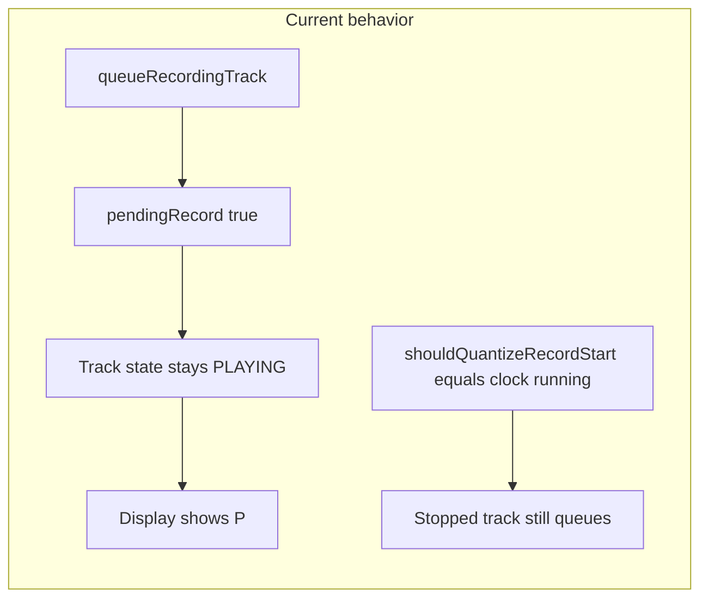

# Fix armed display and empty-slot record quantization

## What the log and code show

1. **“Queued recording at next bar” + `PLAYING -> RECORDING`**
  In `[src/MidiButtonActions.cpp](../../src/MidiButtonActions.cpp)`, an empty slot while `track.isPlaying()` calls `trackManager.queueRecordingTrack()` ([lines 148–157](../../src/MidiButtonActions.cpp)). That only sets `pendingRecord` / `pendingRecordSlot` in `[TrackManager::queueRecordingTrack](../../src/TrackManager.cpp)`; it does **not** call `Track::setState(TRACK_ARMED)`. The track stays `TRACK_PLAYING` until `handleQuantizedStart` runs and calls `startRecordingTrack`.
2. **Why the display shows `P` not `A`**
  `[DisplayManager::drawTrackStatus](../../src/DisplayManager.cpp)` uses `trackManager.getTrackState(i)`, which is implemented as a direct pass-through to `tracks[i].getState()` (`[TrackManager::getTrackState](../../src/TrackManager.cpp)` lines 281–283). There is **no** use of `pendingRecord`. `[trackStateToLetter](../../src/DisplayManager.cpp)` maps `TRACK_PLAYING` → `'P'` and `TRACK_ARMED` → `'A'`. So queued-but-not-yet-recording correctly shows `P` with the current design.
3. **Why “stopped track” still waits one bar**
  `[ClockManager::shouldQuantizeRecordStart()](../../src/ClockManager.cpp)` returns `isClockRunning()` only (sequencer running). The empty-slot branches in `handleToggleRecordForSlot` use that flag **alone** for both the `track.isPlaying()` path (~~149) and the `else if (!slotHasData)` path (~~168). So if the **global clock** is running (internal or external MIDI clock) but the **track** is stopped (`TRACK_STOPPED`, `TRACK_EMPTY`, etc.), the code still **queues** instead of calling `startRecordingTrack` immediately.
4. **Slot 0 MIDI events**
  `[Track::startRecording](../../src/Track.cpp)` clears `loop.midiEvents` only for `**getActiveLoop()`** (lines 145–154). `[handleQuantizedStart](../../src/TrackManager.cpp)` sets `setActiveLoopIndex(s)` to the pending slot **before** `startRecordingTrack`. `[finalizeCaptureAndSelectSlot](../../src/TrackManager.cpp)` calls `stopRecordingToStopped` while the active index is still the **previous** slot, then switches to the new slot. There is no reviewed path that clears `loops[0]` solely because recording started on another slot. If content really disappears from slot 0, it would be worth reproducing with logs (e.g. `hasDataInSlot(0)` before/after) or checking for a clear/undo/other action in the same session.

## Proposed changes

### A. Show armed (`A`) while recording is queued (display-aligned)

`[getTrackState](../../src/TrackManager.cpp)` is **only** referenced from `[DisplayManager.cpp](../../src/DisplayManager.cpp)` (verified via grep), so it is safe to adjust there without affecting LEDs (they use `Track` methods directly).

- In `TrackManager::getTrackState`, if `pendingRecord[trackIndex]` is true and the underlying `tracks[trackIndex].getState()` is `TRACK_PLAYING`, return `TRACK_ARMED` so the display shows `'A'` for “armed for next bar.”  
- Optionally also treat other non-recording states if you ever queue from them; the minimal fix matches your case: **queued + still playing** → `A`.

### B. Quantize empty-slot record only when the track is playing

In `[MidiButtonActions::handleToggleRecordForSlot](../../src/MidiButtonActions.cpp)`, replace the condition that gates queue vs immediate record:

- Today: `if (clockManager.shouldQuantizeRecordStart())` in both the `track.isPlaying()` empty-slot block and the `else if (!slotHasData)` block.
- Proposed: use **both** clock running **and** track playing, e.g.  
`clockManager.shouldQuantizeRecordStart() && track.isPlaying()`  
so that when the track is **not** playing (stopped / empty / etc.) but the clock is running, the empty slot goes to **immediate** `startRecordingTrack` (same as when the clock is not running, modulo existing `startRecordingTrack` behavior for no-clock case).

Keep the existing “second tap while queued → clear queue + immediate punch-in” logic unchanged (`isRecordingQueued` branches).

### C. (Optional) Document or log slot data for the “slot 0 cleared” report

If the issue persists after A/B, add targeted debug (e.g. log `hasDataInSlot(0)` and `getActiveLoopIndex()` around slot switches and `handleQuantizedStart`) to prove whether `loops[0]` is actually empty vs. only the active slot changed.

## Files to touch

| File                                                     | Change                                                                                        |
| -------------------------------------------------------- | --------------------------------------------------------------------------------------------- |
| `[src/TrackManager.cpp](../../src/TrackManager.cpp)`           | Extend `getTrackState` for `pendingRecord && PLAYING` → `TRACK_ARMED`.                        |
| `[src/MidiButtonActions.cpp](../../src/MidiButtonActions.cpp)` | Gate quantize with `track.isPlaying()` in the two empty-slot record branches (~149 and ~168). |

No change to `[ClockManager](../../src/ClockManager.cpp)` required unless you prefer a named helper (e.g. `shouldQuantizeRecordStartWhilePlaying()`) for clarity; local `&& track.isPlaying()` in the button handler is enough and keeps semantics explicit at the call site.

## Testing suggestions

- Clock running, track **playing**, empty slot: first press still queues; display shows **A** until bar boundary; second press still punch-in.
- Clock running, track **stopped** (or empty), empty slot: **immediate** record start, log “Start Recording” path, no “Queued recording at next bar.”
- Clock stopped: existing arm-on-start behavior unchanged (`startRecordingTrack` path in `[TrackManager](../../src/TrackManager.cpp)`).

