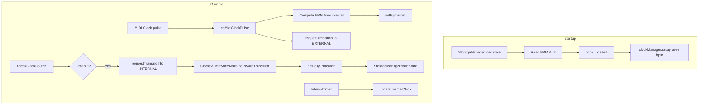

# BPM Display and Clock Persistence

## Summary

1. **Display**: Add "BPM: XXX.X" (one decimal) after CHN with one space, using fixed width.
2. **Fix slow internal tempo**: Internal clock uses wrong PPQN (24 instead of 192), causing 8x slowdown.
3. **Clock source state machine**: Use the same pattern as TrackStateMachine—ClockSourceStateMachine with isValidTransition/toString, requestTransitionTo, and actuallyTransition for EXTERNAL↔INTERNAL.
4. **Clock timeout and switch**: When MIDI clock stops (500ms timeout), request transition to INTERNAL; in actuallyTransition, capture BPM, persist, log.
5. **BPM from MIDI clock**: Compute BPM from interval between consecutive clock pulses.
6. **Persistence**: Add BPM to stored state; restore on startup for internal clock.

---

## 1. Display: Add BPM field

**File**: [src/DisplayManager.cpp](src/DisplayManager.cpp)

In `drawInfoArea`, after CHN (with one space between):

- Add `char bpmStr[8]` and `snprintf(bpmStr, sizeof(bpmStr), "%.1f", bpm)` (use global `bpm` from Globals.h).
- `bpmX = chnX + 6 + (3 + 1 + 5) * 6` (space + "CHN:XX" = 6 chars, then "BPM:XXX.X" = 9 chars for label+value).
- `drawInfoField("BPM", bpmStr, bpmX, y, false, 5)`.

Spacing: CHN:XX (6 chars) + 1 space + BPM:XXX.X (9 chars). Value width 5 chars (e.g. "120.0") keeps layout stable.

---

## 2. Fix slow internal tempo

**Root cause**: [src/ClockManager.cpp](src/ClockManager.cpp) uses `MidiConfig::PPQN` (24) for `microsPerTick`, but the app uses `Config::INTERNAL_PPQN` (192) for timing. Internal clock fires 24 times per quarter instead of 192, so tempo is 8x too slow.

**File**: [src/ClockManager.cpp](src/ClockManager.cpp)

Change all `MidiConfig::PPQN` to `Config::INTERNAL_PPQN` in:

- `setup()` (line 43): `microsPerTick = 60000000UL / (bpm * Config::INTERNAL_PPQN);`
- `setBpm()` (line 48): same formula
- `setTicksPerQuarterNote()` (line 54): same formula

Include `#include "Globals.h"` if not already present for `Config::`.

---

## 3. BPM computation from MIDI clock

**File**: [src/ClockManager.cpp](src/ClockManager.cpp), [include/ClockManager.h](include/ClockManager.h)

- Add members: `uint32_t lastMidiClockPulseTime` (micros of previous pulse), `bool lastMidiClockPulseValid` (false until we have 2 pulses), and optionally a small running average for stability.
- In `onMidiClockPulse()`: compute `deltaUs = micros() - lastMidiClockPulseTime`. If `lastMidiClockPulseValid` and deltaUs in reasonable range (e.g. 5–200ms for 40–300 BPM), compute `bpm = 60000000.0f / (24.0f * deltaUs)` and call `setBpm((uint16_t)(bpm + 0.5f))`. Clamp to 20–300. Store `lastMidiClockPulseTime = micros()` and set `lastMidiClockPulseValid = true`.

Note: `setBpm` takes `uint16_t`; either add `setBpmFloat(float)` for finer resolution or round. For display XXX.X we can keep float bpm in Globals and use it for both display and timing.

**File**: [include/ClockManager.h](include/ClockManager.h)

- Add `void setBpmFloat(float newBpm);` or change `setBpm` to accept float.
- Add private members for MIDI clock interval tracking.

---

## 4. Clock source state machine (same pattern as TrackStateMachine)

Use the existing [ClockSource](include/ClockManager.h) enum (CLOCK_INTERNAL, CLOCK_EXTERNAL) and follow the same state-machine pattern as [TrackStateMachine](src/TrackStateMachine.cpp) and [LooperStateManager](src/LooperState.cpp).

**New file**: [include/ClockSourceStateMachine.h](include/ClockSourceStateMachine.h)

- Namespace `ClockSourceStateMachine` with:
  - `bool isValidTransition(ClockSource current, ClockSource next)` — EXTERNAL→INTERNAL (timeout), INTERNAL→EXTERNAL (MIDI clock received).
  - `const char* toString(ClockSource source)` — for logging.

**New file**: [src/ClockSourceStateMachine.cpp](src/ClockSourceStateMachine.cpp)

- Implement transition rules and toString.

**File**: [include/ClockManager.h](include/ClockManager.h), [src/ClockManager.cpp](src/ClockManager.cpp)

- Replace `externalClockPresent` boolean with `ClockSource clockSource` (or keep a getter that derives from it).
- Add `void requestTransitionTo(ClockSource target)` — queues transition (like LooperStateManager).
- Add private `void actuallyTransition(ClockSource from, ClockSource to)` — runs on EXTERNAL→INTERNAL: persist BPM, call StorageManager::saveState, log; on INTERNAL→EXTERNAL: log.
- `checkClockSource()`: if `clockSource == CLOCK_EXTERNAL` and timeout, call `requestTransitionTo(CLOCK_INTERNAL)`.
- `onMidiClockPulse()`: when external clock detected, call `requestTransitionTo(CLOCK_EXTERNAL)` (or set directly on first pulse).
- `update()` (or process in `checkClockSource`): if transition pending, validate with `ClockSourceStateMachine::isValidTransition`, then `actuallyTransition`.

---

## 5. Persist and restore BPM

**File**: [src/StorageManager.cpp](src/StorageManager.cpp), [include/StorageManager.h](include/StorageManager.h)

- Bump `STORAGE_VERSION` to 2.
- After writing/reading version:
  - **Save (v2)**: Write `float bpm` (from global `::bpm`).
  - **Load (v2)**: Read `float bpm`, set `::bpm` and call `clockManager.setBpmFloat(bpm)` (or equivalent).
  - **Load (v1)**: Skip BPM, keep default 120.
- When saving, always write version 2 and BPM.

**File**: [include/ClockManager.h](include/ClockManager.h), [src/ClockManager.cpp](src/ClockManager.cpp)

- Add `void setBpmFloat(float newBpm)` that updates `bpm`, `microsPerTick`, and the IntervalTimer.

**File**: [src/Globals.cpp](src/Globals.cpp)

- Ensure `bpm` is updated when BPM changes (ClockManager should already do this via `setBpm`/`setBpmFloat`).

**Invocation of save**: When `actuallyTransition()` runs EXTERNAL→INTERNAL, call StorageManager::saveState. StorageManager currently saves via `saveState(looperState.getLooperState())`. We need to either:

- Add `StorageManager::saveConfig()` that writes only BPM to a small config file, or
- Call `StorageManager::saveState(...)` when switching to internal so the full state (including BPM in the new format) is written.

Simplest: when switching to internal in `checkClockSource()`, call `StorageManager::saveState(looperState.getLooperState())` so BPM is persisted with the rest of the state. This requires that `saveState` already include BPM in the v2 format.

**Startup order** ([src/main.cpp](src/main.cpp)):

- `looper.setup()` runs first and calls `StorageManager::loadState()`. In v2, `loadState` reads BPM and sets `::bpm` (and optionally calls `clockManager.setBpmFloat`).
- `clockManager.setup()` runs later and will use the already-set `bpm` for `microsPerTick`.
- Result: if no MIDI clock is present, internal clock starts at the restored BPM.

---

## 6. setBpmFloat for sub-integer BPM

**File**: [include/ClockManager.h](include/ClockManager.h), [src/ClockManager.cpp](src/ClockManager.cpp)

- Add `void setBpmFloat(float newBpm);`
- Implementation: clamp to 20–300, `bpm = newBpm`, `microsPerTick = 60000000UL / (bpm * Config::INTERNAL_PPQN)`, `clockTimer.update(microsPerTick)`.
- Use `setBpmFloat` when computing BPM from MIDI clock and when restoring from storage.

---

## Data flow

---

## Files to modify

| File                                                                   | Changes                                                                                                     |
| ---------------------------------------------------------------------- | ----------------------------------------------------------------------------------------------------------- |
| [include/ClockSourceStateMachine.h](include/ClockSourceStateMachine.h) | New: isValidTransition, toString                                                                            |
| [src/ClockSourceStateMachine.cpp](src/ClockSourceStateMachine.cpp)     | New: transition rules implementation                                                                        |
| [src/DisplayManager.cpp](src/DisplayManager.cpp)                       | Add BPM field after CHN with one space                                                                      |
| [src/ClockManager.cpp](src/ClockManager.cpp)                           | Use INTERNAL_PPQN; BPM from MIDI; state machine (requestTransitionTo, actuallyTransition, checkClockSource) |
| [include/ClockManager.h](include/ClockManager.h)                       | setBpmFloat, ClockSource state, requestTransitionTo, pendingTransition                                      |
| [src/StorageManager.cpp](src/StorageManager.cpp)                       | Version 2, save/load BPM                                                                                    |
| [src/main.cpp](src/main.cpp)                                           | Call checkClockSource() in loop                                                                             |

