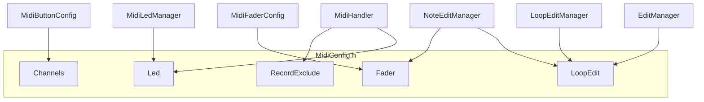

# Centralize MIDI Configuration

## Current State

MIDI-related constants are scattered across multiple files:


| Location                                               | Constants                                                                                                                 |
| ------------------------------------------------------ | ------------------------------------------------------------------------------------------------------------------------- |
| [Globals.h](include/Globals.h)                         | `MidiConfig`: CHANNEL(1), CHANNEL_OMNI(0), RECORD_EXCLUDE_CHANNEL_MIN/MAX(13-16), LED_CHANNEL_MIN/MAX(1-4)                |
| [MidiLedManager.h](include/MidiLedManager.h)           | LED_CHANNEL(3), TICK_CHANNEL(3), TICK_NOTE_OFFSET(16), BAR_LED_BASE_NOTE(40), note ranges 0-15, 16-31, 40-47              |
| [MidiButtonConfig.h](include/Utils/MidiButtonConfig.h) | Channels 1-4                                                                                                              |
| [MidiMapping.h](include/Utils/MidiMapping.h)           | BUTTON_CHANNEL(1), FADER_CHANNEL(15), SELECT_CHANNEL(16), CC_FINE(2), CC_NOTE_VALUE(3)                                    |
| [NoteEditManager.h](include/NoteEditManager.h)         | PITCHBEND_SELECT_CHANNEL(16), PITCHBEND_START_CHANNEL(15), FINE_CC(15/2), NOTE_VALUE_CC(15/3), PROGRAM_CHANGE_CHANNEL(16) |
| [LoopEditManager.h](include/LoopEditManager.h)         | LOOP_LENGTH_CC_CHANNEL(16), LOOP_LENGTH_CC_NUMBER(101)                                                                    |
| [EditManager.h](include/EditManager.h)                 | LOOP_LENGTH_CC_CHANNEL(16), LOOP_LENGTH_CC_NUMBER(101)                                                                    |

---

## Implementation Plan

### 1. Create `include/MidiConfig.h`

Single header with namespaced constants, organized by function:

```cpp
namespace MidiConfig {

// --- Ports ---
// Serial8 = DIN MIDI, usbMIDI = USB device, usbHost = USB Host (DROID)

// --- Channels ---
namespace Channels {
  constexpr uint8_t DEFAULT = 1;           // Legacy default
  constexpr uint8_t TRACK_SELECT = 2;
  constexpr uint8_t LED_FEEDBACK = 3;      // DROID LED (ch3 works on DROID 1.7)
  constexpr uint8_t TRANSPORT = 4;
  constexpr uint8_t FADER = 15;            // Faders 2,3,4 (coarse, fine, note value)
  constexpr uint8_t SELECT = 16;           // Fader 1 (select), buttons, loop length
}

// --- Record exclusion (channels not recorded) ---
constexpr uint8_t RECORD_EXCLUDE_MIN = 13;
constexpr uint8_t RECORD_EXCLUDE_MAX = 16;

// --- LED feedback (excluded from All Notes Off) ---
constexpr uint8_t LED_CHANNEL_MIN = 1;
constexpr uint8_t LED_CHANNEL_MAX = 4;

// --- LED notes (channel 3) ---
namespace Led {
  constexpr uint8_t CHANNEL = 3;
  constexpr uint8_t CONTENT_BASE = 0;      // 16th step content: notes 0-15
  constexpr uint8_t TICK_OFFSET = 16;      // Tick indicator: notes 16-31
  constexpr uint8_t BAR_BASE = 40;         // 8 bar LEDs: notes 40-47
}

// --- Fader / CC ---
namespace Fader {
  constexpr uint8_t SELECT_CHANNEL = 16;   // Fader 1, pitchbend
  constexpr uint8_t COARSE_CHANNEL = 15;   // Fader 2, pitchbend
  constexpr uint8_t FINE_CHANNEL = 15;
  constexpr uint8_t FINE_CC = 2;
  constexpr uint8_t NOTE_VALUE_CHANNEL = 15;
  constexpr uint8_t NOTE_VALUE_CC = 3;
}

// --- Loop editing ---
namespace LoopEdit {
  constexpr uint8_t LENGTH_CC_CHANNEL = 16;
  constexpr uint8_t LENGTH_CC_NUMBER = 101;
  constexpr uint8_t START_PITCHBEND_CHANNEL = 16;
}

// --- Program change (mode switching) ---
constexpr uint8_t PROGRAM_CHANGE_CHANNEL = 16;
}
```

### 2. Update `Globals.h`

- Remove `MidiConfig` namespace (or keep a minimal stub that `#include "MidiConfig.h"` and re-exports for backward compatibility).
- Move RECORD_EXCLUDE and LED_CHANNEL ranges to MidiConfig.h.
- Update [MidiHandler.cpp](src/MidiHandler.cpp) to use `MidiConfig::RECORD_EXCLUDE_MIN/MAX`, `MidiConfig::LED_CHANNEL_MIN/MAX`.

### 3. Update consumers


| File                                                   | Changes                                                                                                             |
| ------------------------------------------------------ | ------------------------------------------------------------------------------------------------------------------- |
| [MidiLedManager.h](include/MidiLedManager.h)           | Replace local constants with `MidiConfig::Led::*`, `MidiConfig::Channels::LED_FEEDBACK`                             |
| [MidiButtonConfig.h](include/Utils/MidiButtonConfig.h) | `Channels::*` reference `MidiConfig::Channels::*` or keep as aliases                                                |
| [MidiMapping.h](include/Utils/MidiMapping.h)           | `Defaults::*` reference `MidiConfig::*`                                                                             |
| [MidiFaderConfig.cpp](src/Utils/MidiFaderConfig.cpp)   | Use `MidiConfig::Fader::*` for hardcoded 15, 16, 2, 3                                                               |
| [NoteEditManager.h](include/NoteEditManager.h)         | Remove local constants; use `MidiConfig::Fader::*`, `MidiConfig::LoopEdit::*`, `MidiConfig::PROGRAM_CHANGE_CHANNEL` |
| [NoteEditManager.cpp](src/NoteEditManager.cpp)         | Replace hardcoded `channel == 16 && ccNumber == 101` with `MidiConfig::LoopEdit::*`                                 |
| [LoopEditManager.h](include/LoopEditManager.h)         | Use `MidiConfig::LoopEdit::LENGTH_CC_CHANNEL/NUMBER`                                                                |
| [EditManager.h](include/EditManager.h)                 | Use `MidiConfig::LoopEdit::*`, `MidiConfig::PROGRAM_CHANGE_CHANNEL`                                                 |


### 4. DROID ini and documentation

- Add a short comment block at top of [droid/midilooper_v1.ini](droid/midilooper_v1.ini) stating: "Channels/notes must match include/MidiConfig.h."
- Update [README.md](README.md) with a link to MidiConfig.h and a one-line note that MIDI routing is centralized there.

---

## Data Flow (Post-Centralization)




---

## Notes

- **Ports** (Serial8, usbMIDI, usbHost) are hardware/instance choices in MidiHandler.cpp, not easily centralizable as simple constants; they stay in MidiHandler.
- **Note ranges** (e.g. piano roll 36-84) in DisplayManager and EditSelectNoteState can optionally move to MidiConfig if desired; lower priority than channels/CCs.

