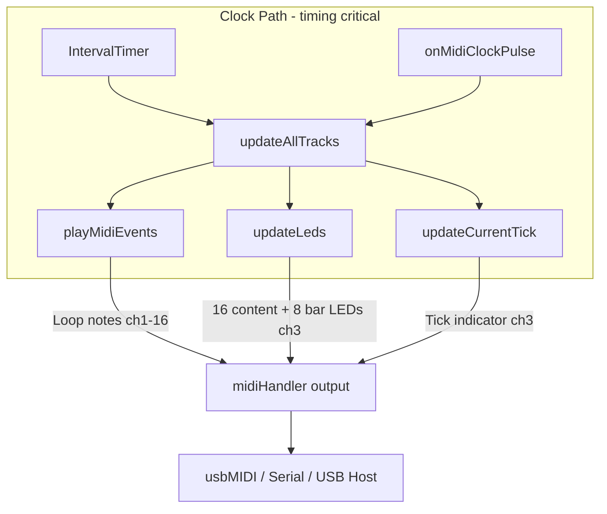

# MIDI LED vs Playback Notes – Priority Analysis

## User concern

The multitude of MIDI LED updates are sent together with actual playing notes, risking timing jitter for playback. LED traffic should have lower priority than playback notes.

## Current architecture




## Findings

### 1. LED updates share the clock path with playback

In [TrackManager::updateAllTracks](src/TrackManager.cpp) (lines 259–284):

```cpp
tracks[i].playMidiEvents(playTick, audible);   // playback notes
updateLeds(selTick);                           // LED updates
ledManager->updateCurrentTick(selTrack, selTick);  // tick indicator
```

All run in the same call stack driven by the clock (IntervalTimer or onMidiClockPulse). Playback notes go out first, then LEDs.

### 2. LED volume and blocking delays

[MidiLedManager](src/MidiLedManager.cpp) sends:

- **16 content LEDs** (16th step, notes 0–15)
- **8 bar LEDs** (notes 40–47)
- **Tick indicator** (notes 16–31, 1–2 messages per tick change)

Each send uses `delayMicroseconds(updateDelayMicros)` (default 500μs). On a bar boundary that's up to 26 messages × 500μs ≈ **13ms blocking** in the clock path. At 120 BPM a 16th note is ~125ms, so this can add noticeable jitter.

### 3. Shared output buffer

Playback notes and LED notes both go through [MidiHandler::sendMidiEvent](src/MidiHandler.cpp) / `sendNoteOn` to the same USB/Serial/USB Host buffers. LED traffic competes with playback for buffer space and serialization time.

### 4. Summary


| Aspect          | Current state                                | Issue                            |
| --------------- | -------------------------------------------- | -------------------------------- |
| LED call site   | Inside updateAllTracks (clock path)          | Blocks timing-critical path      |
| LED delays      | 500μs per message                            | ~13ms blocking on bar change     |
| Output path     | Same as playback (usbMIDI, Serial, USB Host) | Shared buffer, no prioritization |
| LED timing need | Visual feedback only                         | Does not need sub-ms precision   |


## Recommendation

1. **Phase separation**: LED packets only sent when no Track note/CC is being sent. Achieved by running LEDs from the main loop and playback from the clock path—they never execute concurrently.
2. **State-driven, no delays**: Remove all `delayMicroseconds`. Send an LED MIDI packet only when the desired state has changed from the last sent state.
3. **Decouple from clock path**: Remove LED updates from `updateAllTracks`.

## Guarantee: LED never sent while playback is sending

- **Internal clock**: Playback runs in `IntervalTimer` (interrupt). LED updates run in the main loop. When the main loop runs, the interrupt is not active.
- **External clock**: Playback runs from `handleMidiMessage` when a Clock is processed. LED updates run in a separate main-loop phase, after MIDI input is drained.

LED MIDI is only sent when no Track note/CC is actively being sent.

## Implementation approach

1. **TrackManager**
  - Remove `updateLeds(selTick)` and `ledManager->updateCurrentTick(...)` from `updateAllTracks`.
  - Add `updateLedsDeferred()` called from the main loop.
2. **MidiLedManager – remove all delays**
  - Remove every `delayMicroseconds(updateDelayMicros)` from sendLedUpdate, updateCurrentTick, updateBarLeds, clearAllLeds.
  - Remove or deprecate `setUpdateDelay` / `updateDelayMicros`.
3. **MidiLedManager – fully state-driven**
  - **Content LEDs** (analyzeAndUpdateBar): Currently always sends all 16. Change to only send when `newLedState[i] != lastLedState[i]`.
  - **Bar LEDs** (updateBarLeds): Already only sends when velocity changes. Remove the delay.
  - **Tick indicator** (updateCurrentTick): Already only sends when step changed. Remove the delay.
  - **sendLedUpdate**: Remove the delay. Caller must ensure state changed.
  - **clearAllLeds**: Must send to reset. Remove the delays.
4. **Main loop** ([main.cpp](src/main.cpp))
  - Call `trackManager.updateLedsDeferred()` after `handleMidiInput`.
  - Optionally throttle (e.g. every 4–8ms) if needed.

