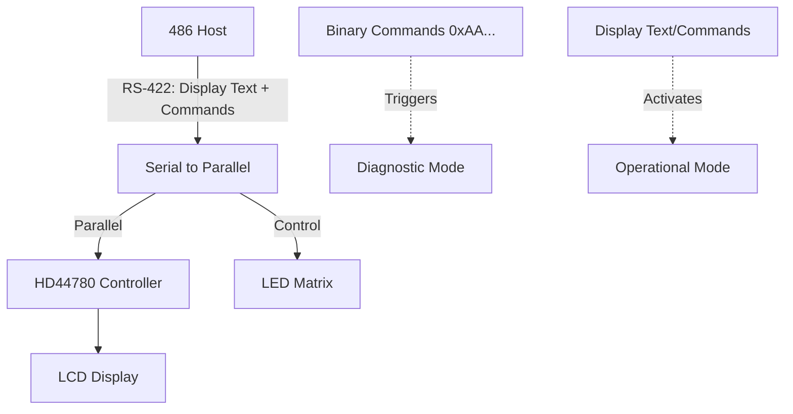

# Display Protocol Discovery for RE-8 Controller

## Problem Analysis

The RE-8 controller has an HD44780 display (Optrex) with a serial-to-parallel converter. When the 486 host sends display data (text like "Mounting disk...", location/time info), the controller enters **operational mode**. When we send binary command sequences (0xAA, etc.), it triggers **diagnostic mode**.

**Key Insight**: The operational protocol is display-oriented, not command-oriented.

## Architecture




## Implementation Strategy

### 1. Add LISTEN Mode (Pure Monitoring)

**Purpose**: Verify controller doesn't send spontaneous data, only monitors incoming bytes.

**Implementation** in `[OtariRE8Protocol.ino](OtariRE8Protocol.ino)`:

- Add `listenMode` boolean flag
- Add `LISTEN` command handler
- Display all received bytes without interpreting
- No transmission, only RX monitoring

### 2. Add ASCII Test Modes (ASCIITEST)

**Purpose**: Test if sending ASCII text triggers operational mode instead of diagnostic.

**Test patterns**:

- Simple ASCII strings: "Hello", "Test", "RE8"
- Display-like messages: "Mounting", "Ready", "00:00:00"
- Different string lengths (1-40 characters)
- With/without line breaks (CR/LF)

**Implementation**:

- `ASCIITEST` command - sends predefined ASCII strings
- `SENDTEXT <text>` command - send arbitrary ASCII text
- Monitor display for any visible changes
- Log any responses from controller

### 3. Add HD44780 Command Mode (DISPTEST)

**Purpose**: Send HD44780 display commands using common serial LCD protocols.

**Protocol variants to test**:

**Variant A - SerLCD Style** (SparkFun/common):

- `0xFE` prefix = command follows
- `0xFE 0x01` = Clear display
- `0xFE 0x80` = Set cursor to position 0
- Plain ASCII = display text

**Variant B - Direct HD44780**:

- No prefix, just raw HD44780 commands
- `0x01` = Clear
- `0x80 + pos` = Set cursor position
- `0x38` = Function set (8-bit, 2 lines)

**Variant C - Custom Protocol**:

- Test header bytes: `0x7E`, `0xFD`, `0xFF`
- Different escape sequences

**Test sequence**:

```
1. Send: 0xFE 0x01 (clear display)
2. Send: 0xFE 0x80 (cursor home)
3. Send: "RE-8 Test" (ASCII text)
4. Observe display for changes
```

### 4. Add LED Control Discovery (LEDTEST)

**Purpose**: Find commands that control LEDs (like the auto level button LED seen in video).

**Test patterns**:

- After successfully sending display text, try control sequences
- Common patterns: `0xFE 0xXX` where XX = LED control code
- GPIO-style commands for LED on/off
- Test bytes: `0x20-0x2F`, `0x40-0x4F` (common control ranges)

### 5. Enhanced Response Monitoring

**Add detailed logging** for operational mode tests:

- Timestamp each TX and RX
- Log controller display state changes
- Track LED state changes
- Note any unusual byte patterns received

## Code Changes to `[OtariRE8Protocol.ino](OtariRE8Protocol.ino)`

### Global Variables (after line ~60)

```cpp
// Display protocol testing
bool listenMode = false;
bool displayTesting = false;
uint8_t currentDisplayTest = 0;
const uint8_t MAX_DISPLAY_TEST = 20;
```

### New Functions (before sendDirectCommandTest at ~line 600)

1. `**sendAsciiTest(uint8_t testNum)**` - Send ASCII text patterns
2. `**sendDisplayCommand(uint8_t testNum)**` - Send HD44780 commands
3. `**sendLedTest(uint8_t testNum)**` - Test LED control sequences

### New Serial Commands (in loop(), after line ~3830)

```cpp
else if (input == "LISTEN") {
  listenMode = !listenMode;
  // Toggle listen-only mode
}
else if (input == "ASCIITEST") {
  // Run ASCII text tests
}
else if (input == "DISPTEST") {
  // Run display command tests
}
else if (input == "LEDTEST") {
  // Run LED control tests
}
else if (input.startsWith("SENDTEXT ")) {
  // Send custom ASCII text
}
```

## Test Procedure

### Phase 1: Pure Listening

1. Power cycle controller
2. Run `LISTEN` command
3. Wait 5 minutes
4. Observe if any bytes received
5. Check display state

### Phase 2: ASCII Text Tests

1. Power cycle controller
2. Run `ASCIITEST`
3. Observe display carefully after each test
4. Look for ANY change from "one moment please"
5. Note any responses received

### Phase 3: Display Command Tests

1. Power cycle controller
2. Run `DISPTEST`
3. Tests clear display, cursor positioning, text display
4. Try all three protocol variants
5. Watch for display changes OR exit from waiting state

### Phase 4: Combined Protocol

1. If ASCII or display commands show promise:
  - Combine successful patterns
  - Test initialization sequences
  - Try to replicate 486 behavior

## Expected Outcomes

**Success indicators**:

- Display changes from "one moment please"
- Display shows sent text
- LEDs activate
- Controller responds differently than with binary commands
- NO "test diagnosis" mode triggered

**If successful**: You'll have the operational display protocol and can build full host emulation.

**If unsuccessful**: The protocol may require additional signals (RTS/DTR), specific timing, or hardware handshaking not yet tested.

## Files Modified

- `[OtariRE8Protocol.ino](OtariRE8Protocol.ino)` - All changes in single file

