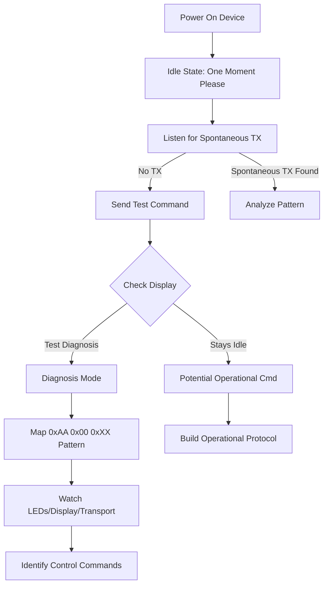

# Discover RE-8 Initialization Sequence

## Problem Analysis - UPDATED WITH VIDEO EVIDENCE

**Critical Discoveries**:

1. **Controller boot behavior** (without MAIN device):
  - Shows welcome screen, then "one moment please" after 2 minutes
  - Runs self-diagnostics (scans LED matrix, keyboard, displays, transport controls, encoder, cursor buttons)
  - Remains idle, waiting for host
2. **Controller behavior WITH proper MAIN device** (observed in video):
  - 486 computer boots up
  - Controller waits 10+ seconds
  - **Display does NOT show "test diagnosis"**
  - Display updates, LEDs activate, shows project number on 2-digit display
  - Controller enters normal operational mode

**Root cause of our problem**: We've been sending diagnostic commands (`0xAA 0x01 0x00 0xFF`, `0xAA 0x00 0xXX 0xYY`) which the controller recognizes as test/diagnostic protocol. The MAIN device must send a DIFFERENT initialization sequence that puts the controller into operational mode.

**Key insight**: There are TWO distinct protocols:

- **Operational Protocol**: Unknown initialization sequence → normal operation (LEDs, display updates, no "test diagnosis")
- **Diagnostic Protocol**: What we've been triggering with `0xAA` commands

**Goal**: Discover the operational initialization sequence through systematic testing.

## Strategy: Systematic Initialization Discovery

### Phase 1: Testing Infrastructure (QUIET/SENDRAW modes)

**Purpose**: Send commands without triggering automatic state machine behavior.

**Implementation:**

- **QUIET mode**: Sends commands without changing `deviceState`, only logs raw responses
- **SENDRAW command**: `SENDRAW 01 02 03` sends arbitrary bytes without interpretation
- **Display prompt**: After each test, prompts user to report controller display state

**Why critical**: We need to observe which commands DON'T trigger "test diagnosis" display.

**Files to modify:**

- `[OtariRE8Protocol.ino](OtariRE8Protocol.ino)` lines 3208-3210 (Serial input handler)

### Phase 2: Initialization Sequence Testing

**Goal**: Find command sequences that put controller into operational mode (NO "test diagnosis" on display).

**Test Categories** (all in QUIET mode, observe display after each):

#### 2A. Single-Byte Initialization Candidates

Test simple commands that might represent "ready" or "init":

- `0x00` - Null/sync
- `0x01` - SOH (Start of Heading)
- `0x02` - STX (Start of Text)
- `0x05` - ENQ (Enquiry - common handshake)
- `0x06` - ACK (Acknowledge)
- `0x10` - DLE (Data Link Escape)
- `0x16` - SYN (Synchronous Idle)
- `0x80`, `0x81`, `0x90`, `0x91` - High bit set variants

**Success criteria**: Display stays at "one moment please" OR changes to operational (NO "test diagnosis")

#### 2B. Alternative Header Patterns (NOT 0xAA)

The `0xAA` header might be diagnostic-only. Test:

- `0x55 0xXX 0xXX 0xXX` - Common alternating bit pattern
- `0xA5 0xXX 0xXX 0xXX` - Alternating nibbles
- `0x5A 0xXX 0xXX 0xXX` - Inverse alternating nibbles
- `0x80 0xXX 0xXX 0xXX` through `0x8F 0xXX 0xXX 0xXX` - High bit set
- `0xBB 0xXX 0xXX 0xXX` - Inverse of 0xAA

#### 2C. Initialization Handshakes (Multi-Step)

The 486 might send a sequence:

1. **Polling sequence**: Repeated ENQ (`0x05`) every 100ms for a few seconds
2. **Sync pattern**: `0x16 0x16 0x16` (SYN SYN SYN)
3. **Identity announcement**: `0x01` + device ID bytes
4. **Two-way handshake**:
  - Send `0x05` (ENQ)
  - If device responds, send `0x06` (ACK)
  - Then send init command

#### 2D. Timing-Based Discovery

The 10+ second delay in the video suggests timing matters:

- Test sending nothing for 5 seconds, then a command
- Test rapid burst of commands vs. spaced commands
- Test if controller expects commands at specific intervals

### Phase 3: Physical Behavior Observation

**Critical**: Watch the controller hardware during tests.

**What to observe**:

- **Display state**: "one moment please" vs "test diagnosis" vs operational data
- **LEDs**: Do any illuminate or change?
- **2-digit display**: Does it show anything?
- **Any mechanical sounds**: Relays clicking, motors engaging

**Classification**:

- **DIAGNOSTIC**: Display shows "test diagnosis" → command triggered diagnostic mode
- **IGNORED**: No response, display unchanged → command ignored or invalid
- **OPERATIONAL**: Display changes, LEDs activate, no "test diagnosis" → SUCCESS!

**Logging**: Add prompts after each test asking user to report these observations.

### Phase 4: Systematic Test Modes

Create automated test modes for each category:

**INITEST1**: Single-byte initialization candidates

- Tests each byte from Phase 2A
- Waits 2 seconds between tests
- Prompts for display observation

**INITEST2**: Alternative headers

- Tests `0x55`, `0xA5`, `0x5A`, `0x80-0x8F`, `0xBB` with various payloads
- Each with 4-byte patterns similar to `0xAA` commands but different headers

**INITEST3**: Handshake sequences

- Tests multi-step initialization patterns
- ENQ/ACK sequences
- Sync patterns

**INITEST4**: Timing variations

- Tests commands with different delays
- Rapid bursts vs. spaced commands

### Phase 5: Fallback - Diagnosis Mode Exploration

**If operational init not found**: We still have diagnosis mode access.

Map the diagnostic protocol to extract functionality:

- Comprehensive `0xAA 0x00 0x00-0xFF` mapping
- Test if commands control hardware (LEDs, display, transport)
- Look for multi-byte responses beyond 0xFF/0xFE

## Architecture Overview

## Implementation Priority

1. **QUIET mode + SENDRAW** (highest priority) - Test without state machine interference
2. **Display observation prompts** - Ask user to report controller display state after each test
3. **INITEST1** - Single-byte initialization candidates (quick wins)
4. **INITEST2** - Alternative header patterns (find operational header)
5. **INITEST3** - Multi-step handshakes (proper initialization sequence)
6. **INITEST4** - Timing-based testing (if simple commands don't work)

## Expected Outcomes

After implementing this plan, you will:

- **Best case**: Discover the operational initialization sequence → full access without "test diagnosis"
- **Likely case**: Identify command patterns that don't trigger diagnosis, even if incomplete
- **Fallback**: Have comprehensive diagnosis mode mapping for extracting functionality
- Have classified commands: OPERATIONAL vs DIAGNOSTIC vs IGNORED

## Key Success Indicators

Watch for these signs of progress:

1. **Any command that doesn't show "test diagnosis"** - even if it does nothing else
2. **Any LED illumination or display change** - indicates you're reaching the hardware
3. **Different responses to different headers** - reveals protocol structure
4. **Successful multi-step sequences** - shows handshake requirements

## Testing Discipline

**Critical rules**:

- **Power cycle before each test** or at least before each category
- **Observe display state** - this is your ground truth
- **Test one thing at a time** - don't combine variables
- **Document everything** - patterns emerge from systematic data

## Notes

- Video shows operational mode IS possible - initialization sequence exists
- The 10+ second delay suggests host software initialization, not just hardware boot
- `0xAA` header family appears to be diagnostic-only
- Focus on finding commands that keep display at "one moment please" or change it to operational data
- If controller responds differently to a command than to `0xAA` commands, you've found something significant

