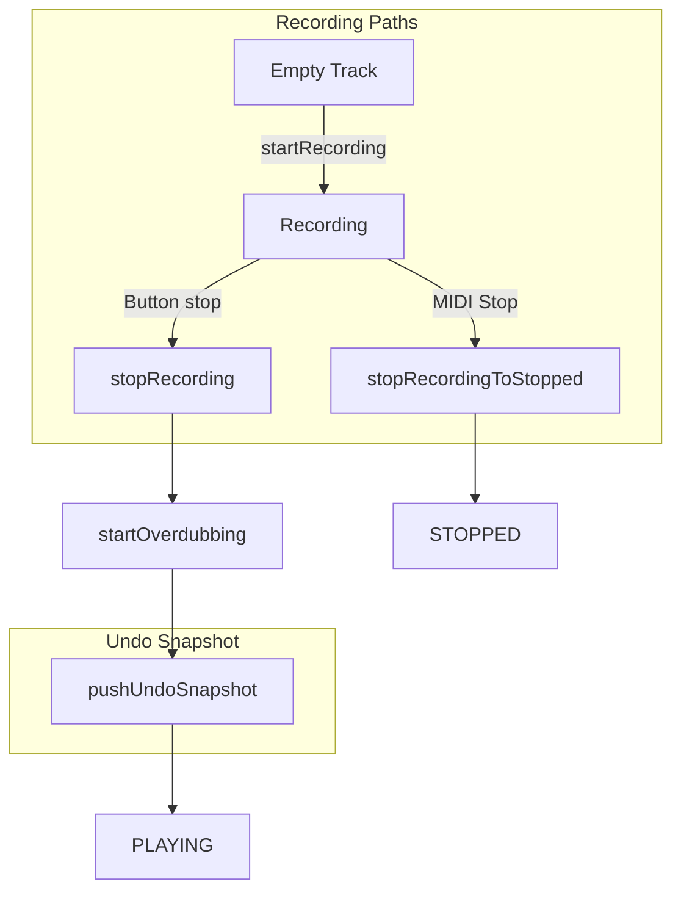

# Fix Undo State Storage

## User Clarification

Overdub and note-edit undo work. The gap is: **the initial recording is not stored as an undo state**. You cannot undo the first take (back to empty), and when using MIDI Stop to end the first recording, no snapshot is created at all.

## Current Architecture




## Root Cause: Initial Recording Undo Gap


| Path            | What happens                                              | Undo snapshot?                      |
| --------------- | --------------------------------------------------------- | ----------------------------------- |
| **Button stop** | `stopRecording` → `startOverdubbing` → `pushUndoSnapshot` | Yes – snapshot of initial recording |
| **MIDI Stop**   | `stopRecordingToStopped` → `setState(STOPPED)`            | **No** – no `pushUndoSnapshot`      |


Additionally, there is no snapshot of **empty** before the first recording, so you cannot undo the initial recording back to an empty track.

## Recommended Fix

### Fix 1: Store initial recording when stopping via MIDI Stop

In [src/Track.cpp](src/Track.cpp) `stopRecordingToStopped()`, push an undo snapshot of the initial recording before transitioning to STOPPED, mirroring the effect of `stopRecording` (which does it via `startOverdubbing`):

```cpp
// In stopRecordingToStopped, after invalidateCaches() and before setState(TRACK_STOPPED):
TrackUndo::pushUndoSnapshot(*this);
```

### Fix 2 (Optional): Store empty state before first recording

To allow undoing the initial recording back to an empty track, push a snapshot at the very start of [src/Track.cpp](src/Track.cpp) `startRecording()`, before `setState` and `midiEvents.clear()`:

```cpp
void Track::startRecording(uint32_t currentTick) {
  if (isEmpty()) {
    TrackUndo::pushUndoSnapshot(*this);
  }
  if (!setState(TRACK_RECORDING)) {
    return;
  }
  // ... rest unchanged
}
```

This gives an undo chain: empty → initial recording → overdub 1 → overdub 2, etc.

## Verification

1. Record first loop, stop with **MIDI Stop**. Verify undo count > 0 and that undo restores correctly.
2. If Fix 2 is applied: Record first loop, press Undo immediately. Verify track returns to empty.

