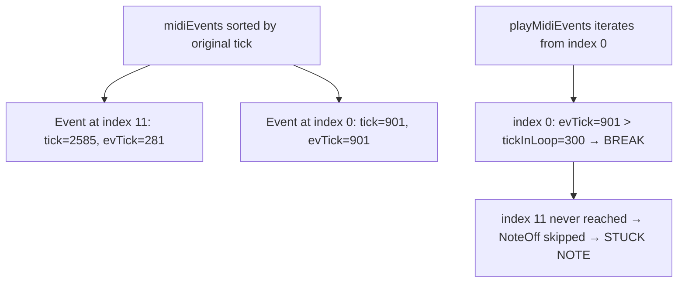
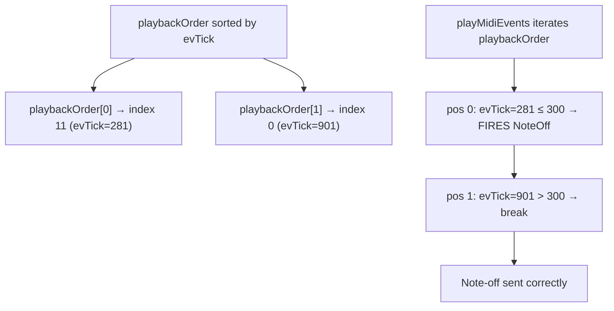

# Fix Wrapped Note-Off Playback (Root Cause)

## Problem

`playMidiEvents()` in [Track.cpp](src/Track.cpp) iterates `midiEvents` in original-tick order (ascending by `evt.tick`). For each event, it computes `evTick = evt.tick % loopLengthTicks`. When a note-off has an original tick beyond loop length (e.g., tick 2585 with loop length 2304), its `evTick` is 281 — but the event is at the **end** of the array. The `break` condition (`evTick > tickInLoop`) fires on earlier events with larger wrapped ticks, so the wrapped note-off is never reached.

`NoteUtils::reconstructNotes()` (used for display) handles wrapping correctly because it pairs events using stacks rather than linear iteration. `NoteMovementUtils::wrapPosition()` also correctly handles wrapping. The playback loop is the only code path that doesn't.



## Solution: Playback Order Index

Add a **playback order index** — a `std::vector<size_t>` of indices into `midiEvents`, sorted by wrapped tick (`evt.tick % loopLengthTicks`). This follows the existing cache/invalidation pattern already in the codebase (`invalidateCaches()`).



## Changes

### 1. [include/Track.h](include/Track.h) — Add playback order members

In the private section (near line 240, alongside existing caches):

```cpp
std::vector<size_t> playbackOrder;
bool playbackOrderDirty = true;
```

Add a private method declaration:

```cpp
void rebuildPlaybackOrder();
```

### 2. [include/Track.h](include/Track.h) — Extend `invalidateCaches()`

In the existing `invalidateCaches()` inline method (line 182), add:

```cpp
playbackOrderDirty = true;
```

### 3. [src/Track.cpp](src/Track.cpp) — Implement `rebuildPlaybackOrder()`

New method that builds a vector of indices `[0..midiEvents.size()-1]` sorted by `midiEvents[i].tick % loopLengthTicks` (using `NoteMovementUtils::wrapPosition` for consistency with existing patterns):

```cpp
void Track::rebuildPlaybackOrder() {
  playbackOrder.resize(midiEvents.size());
  for (size_t i = 0; i < midiEvents.size(); i++) {
    playbackOrder[i] = i;
  }
  uint32_t ll = loopLengthTicks;
  std::sort(playbackOrder.begin(), playbackOrder.end(),
    [&](size_t a, size_t b) {
      uint32_t ta = midiEvents[a].tick % ll;
      uint32_t tb = midiEvents[b].tick % ll;
      return ta < tb;
    });
  playbackOrderDirty = false;
}
```

### 4. [src/Track.cpp](src/Track.cpp) — Update `playMidiEvents()` (line 563)

- At the top: if `playbackOrderDirty`, call `rebuildPlaybackOrder()`
- Replace `midiEvents[nextEventIndex]` with `midiEvents[playbackOrder[nextEventIndex]]`
- Replace `midiEvents.size()` loop bound with `playbackOrder.size()`

The rest of the logic (wrap detection, window check, `nextEventIndex` management) stays identical.
