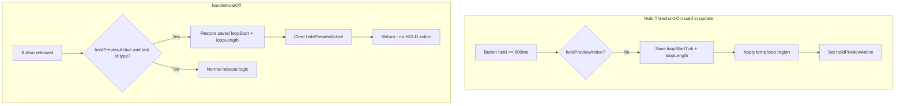

# Hold Loop Revert + Bar Button Fix + Crash Fix

## Issue 1: Bar Button Uses 16th Note Numbers

**Symptom**: When pushing a bar button in Loop Edit, the playhead moves to the right tick but the loop length changes to 16th (48 ticks) instead of bar (768 ticks).

**Root cause**: In [droid/midilooper_v1.ini](droid/midilooper_v1.ini), the BAR buttongroup (lines 404-419) outputs value 0-7. The midiout block does not specify explicit note numbers. The DROID default sends the value as the MIDI note, so BAR buttons send notes 0-7 – the same range as the first 8 sixteenth steps. The Teensy correctly parses note 0 as SIXTEENTH step 0 and uses `TICKS_PER_16TH_STEP` (48) instead of `TICKS_PER_BAR` (768).

**Fix**: Add explicit `note1=17` through `note8=24` to the BAR midiout block so bar buttons send notes 17-24 as expected by [include/MidiConfig.h](include/MidiConfig.h) `BarStepButton::BAR_BASE`.

---

## Issue 2: Teensy Crashes After ~1 Minute with Short Loop

**Symptom**: After loop length becomes 48 ticks (1 sixteenth), the device crashes within about a minute.

**Root cause** (to confirm): When loop length is 48 ticks, several code paths may misbehave:

- `EditManager::sendCurrentLoopLengthCC` sends CC for 1 bar (48/768=0 → bars=1) which can trigger `handleLoopLengthInput` and `StorageManager::saveState` in a potential feedback loop.
- Note reconstruction produces many "Discarding note-on beyond loop boundary" and "Note-off without matching note-on" – cache invalidation and repeated SD saves may cause memory pressure or watchdog issues.
- `MidiLedManager` with `loopLength=48` may trigger more frequent LED updates (bar boundaries every tick).

**Fix options**:

1. **Enforce minimum loop length**: In `BarStepButtonHandler::executeLoopEditAction` for HOLD_ONE and HOLD_TWO, ensure `regionLen` / `rLen` is at least `Config::TICKS_PER_BAR` when the user pressed a BAR button. (Already handled if bar notes are fixed.)
2. **Sanity check in Track**: Reject `setLoopLength` or `setLoopStartTick` when length < TICKS_PER_BAR in Loop Edit context, or add validation in `executeLoopEditAction`.
3. **Debounce/throttle**: Avoid rapid `StorageManager::saveState` when loop length keeps changing.
4. **Investigate crash**: Add logging or use a debugger to identify the exact crash location (watchdog, stack overflow, null pointer, etc.).

**Recommendation**: Fix Issue 1 first (bar button notes). If the crash persists, add a minimum loop length of `TICKS_PER_BAR` for hold actions and investigate further.

---

## Issue 3: Hold Loop Revert on Release

### Current Behavior

- **Hold one button** (>600ms): Loop is permanently set to that bar/16th. `TrackUndo::pushLoopStartSnapshot` is called before the change.
- **Hold two buttons**: Loop is permanently set to the span between the two buttons. Same undo push.
- Both actions run in `handleNoteOff` when the user releases after a long press.

### Target Behavior

- **While holding**: Temporarily apply the new loop region (preview).
- **On release of the last hold button**: Revert loop start and length to the state before the hold.
- Hold is purely a preview/scrub; only short press (seek) should permanently change state.

### Design

### Implementation

### 1. Add hold-preview state to [include/BarStepButtonHandler.h](include/BarStepButtonHandler.h)

- `bool holdPreviewActive`
- `BarStepButtonType holdPreviewType` (SIXTEENTH or BAR)
- `uint32_t savedLoopStartTick`, `uint32_t savedLoopLength` for revert

### 2. Apply temp loop in [src/BarStepButtonHandler.cpp](src/BarStepButtonHandler.cpp) `update()`

In `update()`, after `processPendingPresses()`:

- Only in Loop Edit mode.
- **One button held**: If `pressed16thCount()==1` or `pressedBarCount()==1`, and that button has been held >= `longPressTime`, and `!holdPreviewActive`:
  - Save `track.getLoopStartTick()` and `track.getLoopLength()` to `savedLoopStartTick`, `savedLoopLength`.
  - Apply the single-step loop (same logic as `HOLD_ONE_BUTTON` in `executeLoopEditAction`).
  - Set `holdPreviewActive = true`, `holdPreviewType =` SIXTEENTH or BAR.
- **Two buttons held**: If `pressed16thCount()>=2` or `pressedBarCount()>=2`, and the earliest press (min `pressStartTime` among pressed) has duration >= `longPressTime`, and `!holdPreviewActive`:
  - Save current loop.
  - Apply the range loop (same as `HOLD_TWO_BUTTONS`).
  - Set `holdPreviewActive = true`, `holdPreviewType =` SIXTEENTH or BAR.
- Do **not** call `TrackUndo::pushLoopStartSnapshot` (preview is temporary).

### 3. Revert on release in `handleNoteOff()`

Before clearing `state.isPressed` and the bit:

- If `holdPreviewActive` and the released button’s type matches `holdPreviewType`:
  - If releasing would make the pressed count for that type go to 0 (i.e. this is the last hold button):
    - Restore `track.setLoopStartTick(savedLoopStartTick)` and `track.setLoopLength(savedLoopLength)`.
    - Call `track.invalidateCaches()` (same as undo path).
    - Call `trackManager.forceLedUpdate(clockManager.getCurrentTick())`.
    - Clear `holdPreviewActive`.
    - Clear the button state and bits.
    - **Return early** (do not run the existing HOLD_ONE/HOLD_TWO branch that commits the loop).

### 4. Stop permanent hold actions in Loop Edit

In the `handleNoteOff` logic that currently dispatches to `onPressDetected` for `HOLD_ONE_BUTTON` and `HOLD_TWO_BUTTONS`:

- When in Loop Edit and we just performed a revert (early return above), we already return. So the HOLD action is never reached.
- When in Loop Edit and `holdPreviewActive` is true but we’re not reverting yet (e.g. releasing one of two buttons), we still fall through. We must **not** call `onPressDetected(HOLD_ONE/HOLD_TWO)` for Loop Edit when `holdPreviewActive` is true. The permanent HOLD actions in Loop Edit should only run when we didn’t use the preview path.
- So: when `duration >= longPressTime` and we would call `onPressDetected` with `HOLD_ONE_BUTTON` or `HOLD_TWO_BUTTONS`, add a check: if `isLoopEdit && holdPreviewActive`, skip the call (the revert path will handle it when the last button is released). But wait: if we’re releasing the last button, we revert and return. If we’re releasing one of two, we don’t revert. In that case we fall through to the “duration >= longPressTime” block. We’d call `onPressDetected(HOLD_TWO_BUTTONS, rangeStart, rangeEnd)`. That would commit the loop! So we must **never** call the HOLD actions in Loop Edit when `holdPreviewActive` is true. The revert will happen when the last button is released. So: when dispatching HOLD_ONE/HOLD_TWO, if `isLoopEdit && holdPreviewActive`, skip (don’t call onPressDetected). Actually when we release the last button we return early from the revert block. So we never reach the HOLD dispatch in that case. But when we release the first of two, we don’t revert, we fall through. We’d hit the `hadTwoBeforeRelease && duration >= longPressTime` block and call `onPressDetected(HOLD_TWO_BUTTONS)`. That would commit! So we need: **in Loop Edit, never commit HOLD_ONE or HOLD_TWO**. We only preview and revert. So we add a check: when we would call `onPressDetected` with HOLD_ONE or HOLD_TWO, and we’re in Loop Edit, skip it (or return early without calling). The revert handles the “commit” by doing the opposite (restore).

So the logic is:

- In Loop Edit: HOLD_ONE and HOLD_TWO are only used for preview (in update) + revert (in handleNoteOff). We never call `onPressDetected` with HOLD_ONE/HOLD_TWO in Loop Edit.
- When `duration >= longPressTime` and we would fire HOLD_ONE or HOLD_TWO, add: `if (isLoopEdit) return;` (after clearing state) because the preview/revert path handles it.

### 5. Two-button “earliest press” check

For two buttons, we need both to be held long enough. Use: apply when `(now - minPressStartTime) >= longPressTime`, where `minPressStartTime` is the minimum `pressStartTime` among all currently pressed buttons of that type.

### 6. Update manual test doc

Update [docs/Guides/MANUAL_TEST_BAR_STEP_BUTTONS.md](docs/Guides/MANUAL_TEST_BAR_STEP_BUTTONS.md):

- Test 3: Expect loop to **revert** on release, not stay.
- Test 4: Same for two-button hold.
- Add note that hold is temporary preview; triple-press undo is for permanent loop changes (e.g. from other UI).

## Summary: Files to Modify

**Issue 1 (Bar button mapping)**:

- [droid/midilooper_v1.ini](droid/midilooper_v1.ini): Add `note1=17` through `note8=24` to the BAR midiout block (lines 451-461) so bar buttons send notes 17-24 instead of the default 0-7. The 16th midiout (lines 404-422) has no explicit notes and defaults to 0-15; the BAR midiout needs explicit notes to avoid overlap.

**Issue 2 (Crash)** – if it persists after Issue 1:

- Consider adding minimum loop length validation in `BarStepButtonHandler::executeLoopEditAction` or `Track::setLoopLength`.
- Investigate with debugger/serial to pinpoint crash.

**Issue 3 (Hold revert)**:

- [include/BarStepButtonHandler.h](include/BarStepButtonHandler.h): Add hold-preview state fields.
- [src/BarStepButtonHandler.cpp](src/BarStepButtonHandler.cpp): Apply preview in `update()`, revert in `handleNoteOff()`, skip HOLD dispatch in Loop Edit when using preview.
- [docs/Guides/MANUAL_TEST_BAR_STEP_BUTTONS.md](docs/Guides/MANUAL_TEST_BAR_STEP_BUTTONS.md): Update expected behavior for hold tests.

