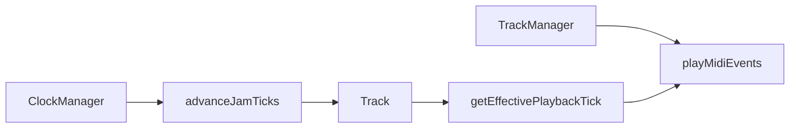

# Jam / bar-step plan — current state (snapshot)

## Where the “plan” lives

- The feature plan you used in Cursor was **not** stored as a file under this project (no `*plan`* / jam-phase doc in [README.md](README.md) or `docs/` for this work).
- **Phase 2 is finished** in the sense that the items below are present in the codebase ([Track.h](include/Track.h), [Track.cpp](src/Track.cpp), [TrackManager](src/TrackManager.cpp), [ClockManager](src/ClockManager.cpp), [BarStepButtonHandler.cpp](src/BarStepButtonHandler.cpp), [DisplayManager.cpp](src/DisplayManager.cpp)).

---

## Phase 1 (jam state on Track) — done

- **Jam state:** `jamStartTick`, `jamLength`, `isJamming()`, `setJam()` / `clearJam()` — display window decoupled from `loopLengthTicks` so notes/LEDs stay correct.
- **Bar select (HOLD_ONE):** long press enters zoom + **independent playback** (`setJamPlayback(true)`).
- **HOLD_TWO:** range uses jam state + `isHoldTwoJam`; no mutating `loopLengthTicks` for display.
- **Faders:** allowed in jam mode ([LoopEditManager](src/LoopEditManager.cpp) per earlier change).

---

## Phase 2 (jam tick / per-track playback) — done

| Item                                                                    | Status      |
| ----------------------------------------------------------------------- | ----------- |
| `jamTick`, `jamPlaybackActive` on `Track`                               | Implemented |
| `advanceJamTick`, `setJamTick`, `getEffectivePlaybackTick`, etc.        | Implemented |
| `TrackManager::advanceJamTicks` + use effective tick for playback/LEDs  | Implemented |
| Clock drives `advanceJamTicks` (internal + MIDI clock path)             | Implemented |
| HOLD_TWO enables jam playback; bar/16th navigate jam; triple-press exit | Implemented |
| Display uses effective playback tick                                    | Implemented |

---

## Post–Phase 2 behavior fixes (also in current code)

These were **not** separate “phases” but bug/UX passes on top of Phase 2:

- **Ghost jam / double seek:** `potentialHoldTwo` on NoteOn; jam navigation deferred to `SHORT_PRESS` where it conflicts with HOLD_TWO; **non-jam** global seek restored on **NoteOn** for responsiveness; **removed** duplicate global seek from `SHORT_PRESS` to avoid the ~quarter-note “restart.”
- **Same-bar exit** still on NoteOn for bar select.

---

## Optional next work (not part of original Phase 2)

- **Multi-loop / “Jam 1–8” on a track** and recording jams into new loops — discussed as future architecture, **not** implemented in this phase.
- **Note-edit mode** using jam state — reserved in design, may need follow-up when Note Edit uses bar/16th buttons.

---

## Quick architecture reference

If you want a **single markdown file in the repo** that always shows this snapshot, say where you prefer it (e.g. `docs/JAM_BARSTEP_PLAN.md`) and we can add it after you leave Plan mode.