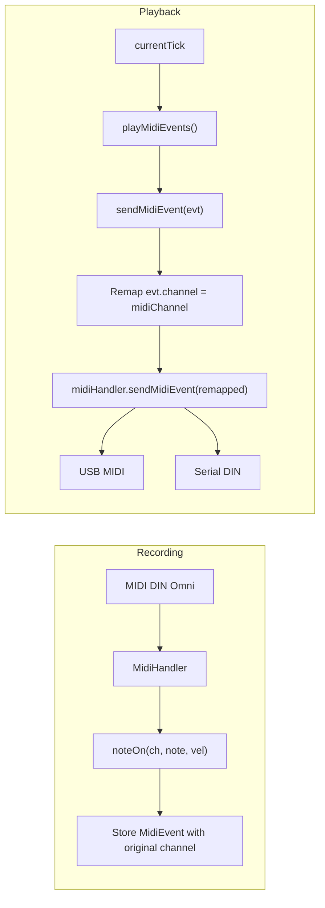

# MIDI Channel Display and Per-Track Default Channel

## Summary

1. **Display**: Add "CHN: XX" after "LOOP: XX" with fixed 2-digit width so both labels never shift.
2. **Per-track default channel**: Track 1 = channel 1, Track 2 = channel 2, etc.
3. **Playback remapping**: Send all MIDI output for a track on that track's channel so notes are heard regardless of input channel.

---

## 1. Display: Add CHN field with absolute spacing

**File**: [src/DisplayManager.cpp](src/DisplayManager.cpp)

Current `drawInfoArea` layout (around line 327):

- Position string (11 chars)
- `loopX = x + 12 * 6` — "LOOP" + ":" + value
- `undoX = DISPLAY_WIDTH - 4 * 6` — right-aligned "U:99"

**Changes**:

- Use fixed 2-digit values for both LOOP and CHN: `%02lu` / `%02u` so widths stay constant.
- Compute `chnX` immediately after the LOOP field: `loopX + (4+1+2)*6` = 42 px after LOOP (for "LOOP:XX").
- Add `drawInfoField("CHN", chnStr, chnX, y, false, 5)`.
- Channel value: `trackManager.getSelectedTrackIndex() + 1` (or use the track's `getMidiChannel()` once that exists).
- LOOP value: keep bar count but format as `snprintf(loopLine, sizeof(loopLine), "%02lu", bars)` with clamp for 99+ if desired, or `%02lu` with `min(bars, 99)` for display.

**Spacing**:

- LOOP: 4-char label + ":" + 2-digit value = 7 chars = 42 px.
- CHN: 3-char label + ":" + 2-digit value = 6 chars = 36 px.
- `chnX = loopX + 42` (or define constants for clarity).

---

## 2. Per-track default MIDI channel

**File**: [include/Track.h](include/Track.h)

- Add `uint8_t midiChannel` (1–16).
- Add `uint8_t getMidiChannel() const` and `void setMidiChannel(uint8_t ch)`.

**File**: [src/Track.cpp](src/Track.cpp)

- Constructor: initialize `midiChannel` to 1 (default).
- Implement getter/setter.

**File**: [src/TrackManager.cpp](src/TrackManager.cpp)

- In `setup()` (or constructor): `for (uint8_t i = 0; i < Config::NUM_TRACKS; i++) { tracks[i].setMidiChannel(i + 1); }`.

---

## 3. Remap playback to track channel

**File**: [src/Track.cpp](src/Track.cpp)

In `sendMidiEvent` (around line 596):

- Create a copy of `evt` with `channel` set to `midiChannel`.
- Pass that modified event to `midiHandler.sendMidiEvent()`.

`MidiEvent` is a struct; you can copy it and then set `evtCopy.channel = midiChannel` before sending. For channel voice messages (NoteOn, NoteOff, CC, PitchBend, etc.), remap channel. System messages (Clock, Start, Stop) keep channel 0 and need no change.

**File**: [include/MidiEvent.h](include/MidiEvent.h)

- No changes required; `channel` is a public field.

---

## 4. Storage (optional)

**File**: [src/StorageManager.cpp](src/StorageManager.cpp) (if track state is persisted)

- If you save/load track config, include `midiChannel` in serialization. If not, the `setup()` defaults (track N = channel N) are enough for now.

---

## Data flow (playback)

---

## 5. "No MIDI returning" checklist

Playback depends on:

- `outputUSB` and `outputSerial` both true (default in [MidiHandler.cpp](src/MidiHandler.cpp) line 37).
- Track not muted.
- Track in PLAYING or OVERDUBBING.
- Clock running and `loopLengthTicks > 0`.
- Synth listening on the correct channel (now fixed by per-track remapping).

---

## Files to modify

| File                                             | Changes                                                            |
| ------------------------------------------------ | ------------------------------------------------------------------ |
| [include/Track.h](include/Track.h)               | Add `midiChannel`, `getMidiChannel()`, `setMidiChannel()`          |
| [src/Track.cpp](src/Track.cpp)                   | Init `midiChannel`, remap channel in `sendMidiEvent`               |
| [src/TrackManager.cpp](src/TrackManager.cpp)     | Set `midiChannel = i+1` per track in setup                         |
| [src/DisplayManager.cpp](src/DisplayManager.cpp) | Add CHN field, fixed-width LOOP/CHN values, use `getMidiChannel()` |

