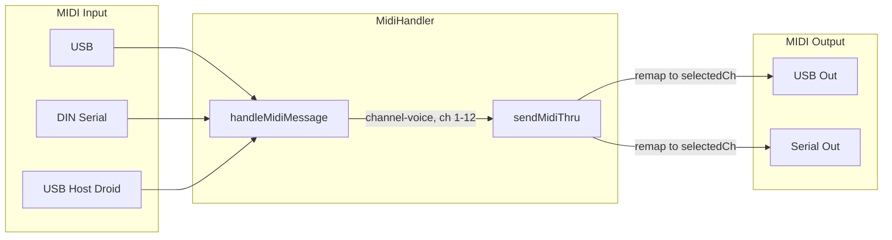

# MIDI Thru in All States

## Current Behavior

- **No MIDI thru exists** in the current codebase. `MidiHandler::handleMidiMessage` only dispatches to handlers (recording, buttons, faders, clock); it never sends live input to USB/Serial output.
- **Recording path**: `Track::noteOn` only runs when `TRACK_RECORDING` or `TRACK_OVERDUBBING`. It stores events in `midiEvents` for later playback; it does not send immediate thru.
- The user expects to hear their playing as a preview at all times (EMPTY, ARMED, STOPPED, PLAYING, etc.), not only when recording.

## Required Behavior

- **Omni input**: Accept channel-voice messages on any MIDI channel (1–12; exclude 13–16 which are Droid control).
- **Output remap**: Send thru on the **selected track's channel** only, so the user can audition the selected track's output channel.
- **State-independent**: Thru must run in every state (EMPTY, ARMED, STOPPED, RECORDING, STOPPED_RECORDING, PLAYING, OVERDUBBING).

## Implementation

### 1. Add `sendMidiThru` helper in MidiHandler

**File**: [include/MidiHandler.h](include/MidiHandler.h)

- Add private method: `void sendMidiThru(byte type, byte channel, byte data1, byte data2);`
- This sends only to USB and Serial (respecting `outputUSB`/`outputSerial`), not to USB Host/Droid.

**File**: [src/MidiHandler.cpp](src/MidiHandler.cpp)

- Implement `sendMidiThru` for: NoteOn, NoteOff, ControlChange, PitchBend, AfterTouchChannel, ProgramChange.
- Send directly to `usbMIDI` and `MIDIserial` (same pattern as existing `sendMidiEvent` switch).

### 2. Invoke thru in `handleMidiMessage` before the switch

**File**: [src/MidiHandler.cpp](src/MidiHandler.cpp)

Insert at the start of `handleMidiMessage`, immediately after logging and before the `switch (type)`:

```cpp
// MIDI Thru: always pass through channel-voice (except control ch 13-16) to USB/Serial on selected track channel
uint8_t outCh = trackManager.getSelectedTrack().getMidiChannel();
bool isChannelVoice = (type == midi::NoteOn || type == midi::NoteOff || type == midi::ControlChange ||
                      type == midi::PitchBend || type == midi::AfterTouchChannel || type == midi::ProgramChange);
if (isChannelVoice && !isControlChannel(channel)) {
  sendMidiThru(type, outCh, data1, data2);  // Remap to selected channel
}
```

Notes:

- `isControlChannel(channel)` excludes channels 13–16 (Droid buttons/faders).
- `outCh` is the selected track's MIDI channel; all thru is remapped to it.
- No state check; runs on every channel-voice message.

### 3. PitchBend handling in `sendMidiThru`

For `midi::PitchBend`, `data1` and `data2` are the 7-bit LSB and MSB. Convert to signed and send:

```cpp
case midi::PitchBend: {
  int16_t pitchValue = ((data2 << 7) | data1) - 8192;
  // send to usbMIDI and MIDIserial
  break;
}
```

## Data Flow




## Files to Modify


| File                                           | Change                                                                   |
| ---------------------------------------------- | ------------------------------------------------------------------------ |
| [include/MidiHandler.h](include/MidiHandler.h) | Add `sendMidiThru` declaration in private section                        |
| [src/MidiHandler.cpp](src/MidiHandler.cpp)     | Add thru block at start of `handleMidiMessage`; implement `sendMidiThru` |


## Testing

- With track 1 selected (ch 1): play notes on ch 5 → hear on ch 1 out.
- With track 2 selected (ch 2): same input → hear on ch 2 out.
- Verify thru works when track is EMPTY, STOPPED, PLAYING, RECORDING, OVERDUBBING.
- Verify channels 13–16 (Droid control) are not thru'd.

