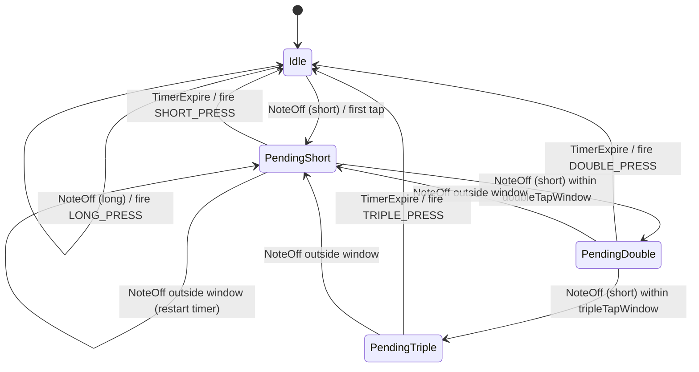

# MidiButtonProcessor State Machine Refactor

## Goal

Replace the implicit state (multiple `pending*` flags) with an explicit `TapState` enum. Centralize transition logic so the tap sequence and timer behaviour are easier to follow and extend.

## Current vs target behaviour

**Current:** State encoded as `pendingShortPress`, `pendingDoublePress`, `pendingTriplePress` plus timestamps. Logic split across `handleButtonRelease` (on release) and `processPendingPresses` (on timer expiry).

**Target:** Single `TapState` enum per button. Explicit transitions: Release event → new state (or fire); Timer event → fire + reset.

## State diagram

## Implementation

### 1. Add TapState enum and update ButtonState

**File:** [include/MidiButtonProcessor.h](include/MidiButtonProcessor.h)

- Add `enum class TapState { Idle, PendingShort, PendingDouble, PendingTriple }`
- Replace `pendingShortPress`, `pendingDoublePress`, `pendingTriplePress` and their expire times with:
  - `TapState tapState`
  - `uint32_t tapStateExpireTime` (single expire time; meaning depends on state)
  - Keep `lastTapTime`, `secondTapTime` for tap-window checks
- Keep `isPressed`, `pressStartTime`, `lastReleaseTime` unchanged

### 2. Add transition helper

**File:** [src/MidiButtonProcessor.cpp](src/MidiButtonProcessor.cpp)

- Add `void transitionToIdle(ButtonState& state)` to clear tap-related state
- Add `void onShortRelease(...)` to encapsulate the current short-press branch: evaluate second/third tap, update state and expire time
- Keep `handleButtonRelease` as the main entry; it branches on long vs short, then calls `onShortRelease` for short presses

### 3. Refactor handleButtonRelease

- Long press: call `transitionToIdle`, fire LONG_PRESS (unchanged)
- Short press: call `onShortRelease(state, now, effectiveDoubleTap, effectiveTripleTap)` which:
  - If `tapState == PendingDouble` and third tap in window → fire TRIPLE_PRESS, transition to Idle
  - Else if second tap in window → set `tapState = PendingDouble`, `tapStateExpireTime = now + tripleTap`
  - Else → set `tapState = PendingShort`, `tapStateExpireTime = now + doubleTap`

### 4. Refactor processPendingPresses

- Replace the three `if (state.pending* && now >= state.*ExpireTime)` blocks with one `switch (state.tapState)`:
  - `PendingShort` and expired → fire SHORT_PRESS, transition to Idle
  - `PendingDouble` and expired → fire DOUBLE_PRESS, transition to Idle
  - `PendingTriple` and expired → fire TRIPLE_PRESS, transition to Idle
- Use a single `state.tapStateExpireTime` for all expiry checks
- Preserve existing debug logging (periodic pending, specific button checks)
- **Bug fix:** In the iteration, `channel = i / 128` is 0-based (MIDI ch 16 → 15). `triggerButtonPress` expects 0-based channel. All three fire cases must pass this channel; the TRIPLE_PRESS path currently uses `channel - 1`, which is wrong for 0-based channel.

### 5. Testing

- Manually test: single tap, double tap, triple tap, long press on REC/PLAY, MUTE/DE, Edit Mode
- Verify Global Transport double-tap (RESET_TO_LOOP_START) still works
- Confirm no regression in timing (debounce, double/triple windows)

## Files to modify

| File                                                           | Changes                                                                 |
| -------------------------------------------------------------- | ----------------------------------------------------------------------- |
| [include/MidiButtonProcessor.h](include/MidiButtonProcessor.h) | Add TapState enum; simplify ButtonState                                 |
| [src/MidiButtonProcessor.cpp](src/MidiButtonProcessor.cpp)     | Refactor handleButtonRelease and processPendingPresses; fix channel bug |

## Risk

Low. Behaviour stays the same; structure and correctness improve. No config or callback changes.