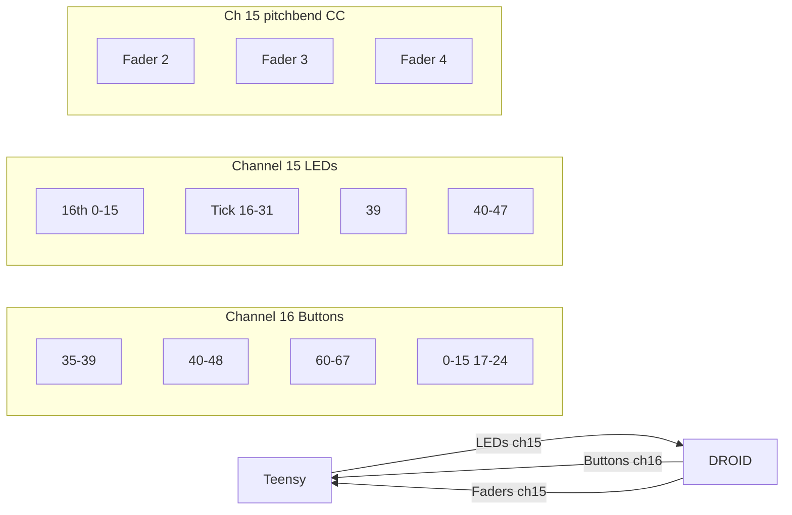

# MidiConfig.h Refactor Plan

## Current State

- **Summary table**: Inconsistent "Notes/CC" column (e.g. "3, 36-39" mixes single note with ranges; "notes 0-31" vs "notes 40-47")
- **LengthEdit**: `LengthEdit::NOTE = 3` — DROID ini already sends **note 35** for B2.32 (NOTELEN); firmware expects 3, causing a mismatch
- **LEDs**: Split across ch3 (16th content 0-15, tick 16-31, bar 40-47) and ch4 (main controls LED note 39)
- **Record exclusion**: 13-16 (broad)
- **LED All Notes Off exclusion**: Channels 1-4

## Target State


| Change            | From                                | To                                                      |
| ----------------- | ----------------------------------- | ------------------------------------------------------- |
| LengthEdit note   | 3                                   | 35 (matches DROID ini, groups with main controls 36-39) |
| LED channel       | 3 (content/tick/bar), 4 (transport) | **15** (all LEDs)                                       |
| Record exclusion  | 13-16                               | **16 only** (buttons)                                   |
| LED All Notes Off | 1-4                                 | **15 only**                                             |


## Implementation

### 1. [include/MidiConfig.h](../../include/MidiConfig.h)

**Summary table** — Buttons and LEDs (notes):

```
| Role                | Button press note (ch 16) | LED feedback note (ch 15) | Reference           |
|---------------------|---------------------------|---------------------------|---------------------|
| Main controls       | 35-39                     | 39                        | Transport, LengthEdit |
| Extended transport  | 40-48                     | —                         | ExtendedTransport   |
| Track select        | 60-67                     | —                         | TrackSelect         |
| Bar select          | 17-24                     | 40-47                     | BarStepButton       |
| 16th select         | 0-15                      | 0-15                      | BarStepButton       |
| Current position    | —                         | 16-31                     | Led (tick)          |
| Loop edit           | CC 100,101, pitchbend     | —                         | LoopEdit            |
```

Record exclusion: channel 16 not recorded (buttons/control traffic). See `RECORD_EXCLUDE_*` in MidiConfig.

**Faders** (separate — pitchbend/CC, two channels for high-resolution position/move):

```
| Role                | Fader input (ch)          | Fader output (ch)         | Reference           |
|---------------------|---------------------------|---------------------------|---------------------|
| Fader input         | ch16: pitchbend; ch15: pitchbend, CC 2,3 | —                 | Fader               |
| Fader output        | —                         | ch16: pitchbend; ch15: pitchbend, CC 2,3 | Fader               |
```

Two channels (15 and 16) so the first two faders get pitchbend each — 14-bit vs 7-bit CC for precise position/move control. Fader 1 on ch16, Faders 2–4 on ch15. Fader output = Teensy drives the motorized fader.

**Channels namespace**:

- `LED_FEEDBACK = 15` (was 3)
- `MAIN_CONTROLS_LED = 15` (was TRANSPORT=4) — main controls LED feedback (play/stop, etc.) same channel as other LEDs
- `RECORD_EXCLUDE_MIN = 16`, `RECORD_EXCLUDE_MAX = 16`

**Led namespace**:

- `CHANNEL = 15`
- Add explicit range constants: `CONTENT_BASE`, `CONTENT_COUNT`, `TICK_OFFSET`, `TICK_COUNT`, `BAR_BASE`, `BAR_COUNT`, `TRANSPORT_NOTE`

**LengthEdit namespace**:

- `NOTE = 35`

**LED_CHANNEL_MIN/MAX**: `15` for both (All Notes Off exclusion)

**Explicit range constants** — Add to existing namespaces or as new:

- Main controls: 35-39 (LengthEdit 35, Record 36, Play 37, Edit 38, Redo/Global 39)
- TrackSelect: 60-67 with NOTE_COUNT
- BarStepButton: already has SIXTEENTH_BASE/COUNT, BAR_BASE/COUNT
- Led: 16th content 0-15, tick 16-31, main controls 39, bar 40-47

### 2. [droid/midilooper_v1.ini](../../droid/midilooper_v1.ini)

- Change all LED-related `channel = 3` → `channel = 15` (16th content midiin, tick midiin, bar midiin)
- Change main controls LED (play/stop) `channel = 4` → `channel = 15` ([midiin] with note1=39)

### 3. Dependent code (minimal changes)

- [include/MidiLedManager.h](../../include/MidiLedManager.h): Uses `Led::CHANNEL` — no change needed if Led::CHANNEL becomes 15
- [include/Utils/MidiButtonConfig.h](../../include/Utils/MidiButtonConfig.h): `Channels::MAIN_CONTROLS_LED` (or keep TRANSPORT as alias) — will pick up 15 from MidiConfig
- [src/MidiButtonActions.cpp](../../src/MidiButtonActions.cpp): Uses `Channels::TRANSPORT` for play/stop LED feedback — update to `MAIN_CONTROLS_LED` = 15
- [src/Utils/MidiButtonConfig.cpp](../../src/Utils/MidiButtonConfig.cpp): Uses `LengthEdit::NOTE` — will become 35 (matches DROID)
- [src/MidiHandler.cpp](../../src/MidiHandler.cpp): Uses RECORD_EXCLUDE_*, LED_CHANNEL_MIN/MAX — will use new values

### 4. [docs/MIDI_CONFIG_GUIDE.md](docs/MIDI_CONFIG_GUIDE.md)

Update config summary table, LED channel references (3,4 → 15), record exclusion (13-16 → 16), and note 3 → 35 in the main controls table.

### 5. Note 3 in NoteEditManager

[src/NoteEditManager.cpp](../../src/NoteEditManager.cpp) line 891 sends `note 3` on ch15 as a fader-update trigger (separate from LengthEdit). That stays as-is — it is a different use (motorized fader sync), not the LengthEdit button.

---

## Data flow (after change)




## Files to touch

1. `include/MidiConfig.h` — Main refactor
2. `droid/midilooper_v1.ini` — channel 3,4 → 15 for LED blocks
3. `docs/MIDI_CONFIG_GUIDE.md` — Config summary and references

