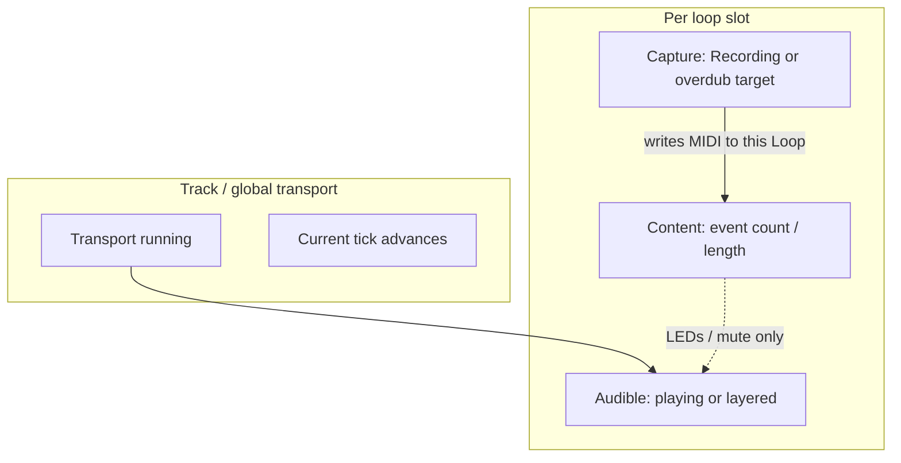

# Multi-loop playback + arm/recording refactor

## Implementation status (done)

| Item                                                                                   | Where                                                                                                                                                                                                                                    |
| -------------------------------------------------------------------------------------- | ---------------------------------------------------------------------------------------------------------------------------------------------------------------------------------------------------------------------------------------- |
| Slot button uses `hasDataInSlot(slotIndex)`; playing + empty target queues or punch-in | `[src/MidiButtonActions.cpp](../../src/MidiButtonActions.cpp)` `handleToggleRecordForSlot`                                                                                                                                                     |
| Single bar-boundary pending record                                                     | `[src/TrackManager.cpp](../../src/TrackManager.cpp)` `updateAllTracks` → `handleQuantizedStart`                                                                                                                                                |
| Quantize gate                                                                          | `[include/ClockManager.h](../../include/ClockManager.h)` / `[src/ClockManager.cpp](../../src/ClockManager.cpp)` `shouldQuantizeRecordStart()` (currently aliases `isClockRunning()`); used by `MidiButtonActions` and `startRecordingTrack` arm path |
| Derived slot capture helpers                                                           | `[include/Track.h](../../include/Track.h)` `SlotOpState`, `getSlotOpState`, `getRecordingFocusSlot`; `[src/Track.cpp](../../src/Track.cpp)`                                                                                                          |
| Slot change during record/overdub                                                      | `[TrackManager::finalizeCaptureAndSelectSlot](../../src/TrackManager.cpp)`; also invoked from `[setActiveLoopIndex](../../src/TrackManager.cpp)` when switching slot while capturing                                                                 |

Persisted save/load still uses one `TrackState` per track; slot op is derived at runtime, not a new on-disk schema.

---

## Root causes (historical — pre-fix)

1. `**hasData()` is active-slot-only** (`[include/Track.h](../../include/Track.h)` → `getActiveLoop().hasData()`). `**handleToggleRecordForSlot`** called `**setActiveLoopIndex` before the `if` chain**, so for an **empty pressed slot** while the track was still `**TRACK_PLAYING`** (content in another slot), `**!track.hasData()**` was evaluated **before** `**track.isPlaying()`** and drove record/queue as if the whole track were empty.
2. **Single `TrackState` per track** cannot express “slot A playing + slot B armed + slot C recording” without `pendingRecord`* / `heldLayerSlot*` in `[TrackManager](../../include/TrackManager.h)`. “Armed” for next bar remains **queue flags**, not `TRACK_ARMED`, while transport keeps playing.
3. `**handleQuantizedStart` was dead** — duplicated logic lived only inside `updateAllTracks`. **Fixed:** one implementation in `handleQuantizedStart`, called at the start of `updateAllTracks`.
4. **Quantize vs immediate record** gated on `isClockRunning()`. **Centralized** as `shouldQuantizeRecordStart()` so future rules (e.g. tick advance without `sequencerRunning`) stay in one place.

---

## Target model (direction of travel)

Split concerns so `**hasData` is not the primary control flag** for record vs play:

| Layer              | Responsibility                                                                                                                       |
| ------------------ | ------------------------------------------------------------------------------------------------------------------------------------ |
| **Transport**      | Whether time advances and bar boundaries apply (`ClockManager`, `shouldQuantizeRecordStart()`). Not “does this slot have notes”.     |
| **Slot content**   | `Loop::midiEvents`, `loopLengthTicks` — use `**hasDataInSlot(i)`** for emptiness.                                                    |
| **Slot operation** | Which slots **play** (active + `heldLayerSlot`), and **pending record per slot** (`pendingRecordSlot[][]`) for arm / next-bar start. |

**Track-level `TrackState`** remains for playback/recording/overdub and persistence. **Recording focus** is the **active loop** during `TRACK_RECORDING` / `TRACK_OVERDUBBING`; `**getRecordingFocusSlot()`** / `**getSlotOpState(i)**` expose that without duplicating storage.

---

## Minimal fix path (completed)

1. Reorder `**handleToggleRecordForSlot**`: use `**hasDataInSlot(slotIndex)**` and handle `**track.isPlaying()**` with **empty target slot** → queue / punch-in (same as stopped + empty when transport quantizes).
2. `**handleQuantizedStart`** is the only place that applies `**pendingRecord***` on bar boundaries; `**updateAllTracks**` calls it once per tick.
3. `**shouldQuantizeRecordStart()**` wraps the “should we queue vs record immediately?” decision.

---

## Fuller refactor (optional follow-ups)

1. **LEDs / UI**: show arm explicitly via `**trackManager.isRecordingQueued(track, slot)`** (and related flags), not only `TrackState == TRACK_ARMED`.
2. **Main record button** (`[handleToggleRecord](../../src/MidiButtonActions.cpp)`): **aligned** — uses `hasPublishedEventsInSlot(selectedSlot)` and delegates empty-slot arm/record to `handleToggleRecordForSlot`.
3. **TrackStateMachine shrink**: only if you collapse global FSM into explicit transport + capture; needs save-format plan.
4. **Storage**: if you add per-slot op state on disk, bump format version and map load → `TrackState` + queues.

---

## Files touched by implementation

- `[src/MidiButtonActions.cpp](../../src/MidiButtonActions.cpp)`
- `[src/TrackManager.cpp](../../src/TrackManager.cpp)`, `[include/TrackManager.h](../../include/TrackManager.h)`
- `[src/ClockManager.cpp](../../src/ClockManager.cpp)`, `[include/ClockManager.h](../../include/ClockManager.h)`
- `[include/Track.h](../../include/Track.h)`, `[src/Track.cpp](../../src/Track.cpp)`

---

## Risk note

`[StorageManager](../../src/StorageManager.cpp)` still assumes one `**TrackState`** per track. Volatile capture and queue state are cleared or normalized on load as before. A full per-slot FSM on SD would need a **versioned schema** and migration.