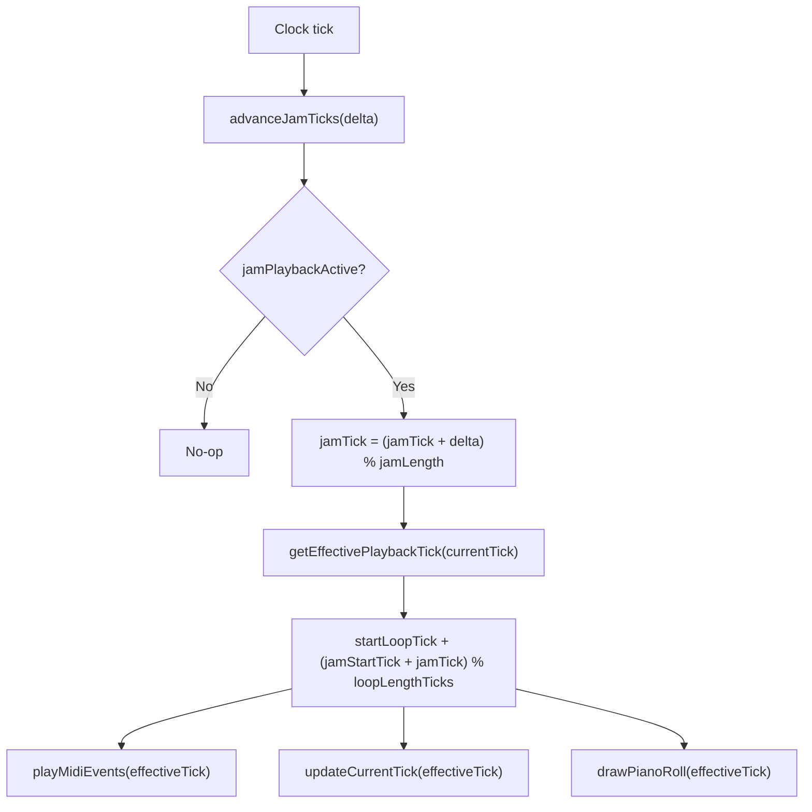

# Phase 2: Jam Tick — Independent Per-Track Playback

## Architecture




When `jamPlaybackActive` is false, `getEffectivePlaybackTick` returns `currentTick` unchanged — zero overhead for normal playback.

## Behavioral Change from Phase 1

HOLD_TWO jam short-press behavior changes: instead of exiting the jam, short press now **navigates** (moves jam region + playback). Triple press remains the exit gesture. Bar select (HOLD_ONE) is unchanged — same bar exits, different bar switches.

## File Changes

### 1. [include/Track.h](include/Track.h) — Add jam playback state

Add private members alongside existing `jamStartTick`/`jamLength`:

```cpp
volatile uint32_t jamTick;      // Position within jam region (0 to jamLength-1)
bool jamPlaybackActive;          // True = track uses jamTick for playback
```

Add public methods after existing `clearJam()`:

```cpp
void advanceJamTick(uint32_t delta = 1);
uint32_t getJamTick() const;
void setJamTick(uint32_t tick);
bool isJamPlaybackActive() const { return jamPlaybackActive; }
void setJamPlayback(bool enabled);
uint32_t getEffectivePlaybackTick(uint32_t currentTick) const;
```

### 2. [src/Track.cpp](src/Track.cpp) — Implement methods

**Constructor:** Init `jamTick(0)`, `jamPlaybackActive(false)`.

`**setJam`:** Add interrupt-safe playback state reset:

```cpp
void Track::setJam(uint32_t startTick, uint32_t length) {
    noInterrupts();
    jamStartTick = startTick;
    jamLength = length;
    jamTick = 0;
    nextEventIndex = 0;
    lastTickInLoop = UINT32_MAX;
    interrupts();
    logger.log(CAT_TRACK, LOG_INFO, "Jam set: start=%lu, length=%lu", jamStartTick, jamLength);
}
```

Setting `lastTickInLoop = UINT32_MAX` ensures the first `playMidiEvents` call after entering jam triggers a clean wrap (no event burst from the position jump).

`**clearJam`:** Also clear playback state:

```cpp
void Track::clearJam() {
    noInterrupts();
    jamStartTick = UINT32_MAX;
    jamLength = 0;
    jamPlaybackActive = false;
    jamTick = 0;
    nextEventIndex = 0;
    lastTickInLoop = UINT32_MAX;
    interrupts();
    logger.log(CAT_TRACK, LOG_INFO, "Jam cleared");
}
```

**New methods:**

```cpp
void Track::advanceJamTick(uint32_t delta) {
    if (!jamPlaybackActive || jamLength == 0) return;
    jamTick = (jamTick + delta) % jamLength;
}

uint32_t Track::getJamTick() const {
    noInterrupts();
    uint32_t t = jamTick;
    interrupts();
    return t;
}

void Track::setJamTick(uint32_t tick) {
    noInterrupts();
    jamTick = (jamLength > 0) ? (tick % jamLength) : 0;
    nextEventIndex = 0;
    lastTickInLoop = UINT32_MAX;
    interrupts();
}

void Track::setJamPlayback(bool enabled) {
    noInterrupts();
    jamPlaybackActive = enabled;
    if (enabled) {
        nextEventIndex = 0;
        lastTickInLoop = UINT32_MAX;
    }
    interrupts();
}

uint32_t Track::getEffectivePlaybackTick(uint32_t currentTick) const {
    if (!jamPlaybackActive || jamLength == 0) return currentTick;
    uint32_t storagePos = (jamStartTick + jamTick) % loopLengthTicks;
    return startLoopTick + storagePos;
}
```

### 3. [include/TrackManager.h](include/TrackManager.h) — Add advanceJamTicks

Add to public section under "Track Updates":

```cpp
void advanceJamTicks(uint32_t delta);
```

### 4. [src/TrackManager.cpp](src/TrackManager.cpp) — Implement advanceJamTicks, use effective tick

**New method:**

```cpp
void TrackManager::advanceJamTicks(uint32_t delta) {
    for (uint8_t i = 0; i < Config::NUM_TRACKS; i++) {
        tracks[i].advanceJamTick(delta);
    }
}
```

`**updateAllTracks` (line 253-282):** Use effective tick for playback and LEDs:

```cpp
// In the track loop:
uint32_t playTick = tracks[i].getEffectivePlaybackTick(currentTick);
tracks[i].playMidiEvents(playTick, audible);

// For LEDs:
Track& selTrack = getSelectedTrack();
uint32_t selTick = selTrack.getEffectivePlaybackTick(currentTick);
updateLeds(selTick);
if (ledManager && selTrack.getLoopLength() > 0) {
    ledManager->updateCurrentTick(selTrack, selTick);
}
```

### 5. [src/ClockManager.cpp](src/ClockManager.cpp) — Drive jamTick from clock

`**updateInternalClock()` (line 100-107):** Add before `updateAllTracks`:

```cpp
trackManager.advanceJamTicks(1);
trackManager.updateAllTracks(currentTick);
```

`**onMidiClockPulse()` (line 109-147):** Add before `updateAllTracks` (but only when tick advances, not on first pulse):

```cpp
if (firstPulseAfterStart) {
    firstPulseAfterStart = false;
} else {
    currentTick += Config::TICKS_PER_CLOCK;
    trackManager.advanceJamTicks(Config::TICKS_PER_CLOCK);
}
trackManager.updateAllTracks(currentTick);
```

### 6. [src/BarStepButtonHandler.cpp](src/BarStepButtonHandler.cpp) — Navigate during HOLD_TWO jam

`**handleNoteOn` jam exit logic (lines 199-207):** Change HOLD_TWO behavior from "exit on any press" to "navigate on any press":

```cpp
Track& trackRef = trackManager.getSelectedTrack();
if (trackRef.isJamming()) {
    if (isHoldTwoJam) {
        // Navigate jam: move region and/or seek jamTick
        if (info.type == BarStepButtonType::BAR) {
            uint32_t newStart = (trackRef.getLoopStartTick() + info.stepIndex * Config::TICKS_PER_BAR) % trackRef.getLoopLength();
            trackRef.setJam(newStart, trackRef.getJamLength());
            trackRef.setJamTick(0);
        } else {
            uint32_t seekPos = info.stepIndex * Config::TICKS_PER_16TH_STEP;
            if (seekPos < trackRef.getJamLength()) {
                trackRef.setJamTick(seekPos);
            }
        }
        trackManager.forceLedUpdate(trackRef.getEffectivePlaybackTick(clockManager.getCurrentTick()));
    } else if (info.type == BarStepButtonType::BAR && info.stepIndex == selectedBarIndex) {
        exitBarSelect();
    }
}
```

**Immediate seek block (lines 209-225):** Skip global seek when HOLD_TWO jam is active:

```cpp
if (isLoopEdit && !(trackRef.isJamming() && isHoldTwoJam)) {
    // ... existing global seek ...
}
```

`**executeLoopEditAction` SHORT_PRESS (line 433):** Skip global seek during HOLD_TWO jam:

```cpp
case BarStepPressType::SHORT_PRESS: {
    if (track.isJamming() && isHoldTwoJam) break;
    // ... existing seek logic ...
}
```

**HOLD_TWO case (line 467):** Enable jam playback after `setJam`:

```cpp
track.setJam(rStartStorage, rLen);
track.setJamPlayback(true);
isHoldTwoJam = true;
```

`**enterBarSelect`:** Ensure bar select does NOT enable jam playback:

```cpp
track.setJamPlayback(false);
```

### 7. [src/DisplayManager.cpp](src/DisplayManager.cpp) — Use effective tick

`**update()` (line 500-522):** Compute display tick:

```cpp
uint32_t currentTick = clockManager.getCurrentTick();
Track& selTrack = trackManager.getSelectedTrack();
uint32_t displayTick = selTrack.getEffectivePlaybackTick(currentTick);
// Pass displayTick to drawPianoRoll, drawInfoArea, drawNoteInfo
```

## Interrupt Safety

- `jamTick` is `volatile` and accessed with `noInterrupts()/interrupts()` guards from the main loop (button handlers, display)
- `advanceJamTick` runs in interrupt context (clock ISR) and accesses `jamTick` directly (safe since ISR cannot be preempted by another ISR on single-core ARM)
- `setJam`/`clearJam` use `noInterrupts()` to ensure atomic multi-field updates

## Clean Playback Transitions

Setting `lastTickInLoop = UINT32_MAX` and `nextEventIndex = 0` in `setJam`/`clearJam`/`setJamTick`/`setJamPlayback` ensures that the first `playMidiEvents` call after any jam state change triggers a clean wrap, avoiding event bursts from position jumps.