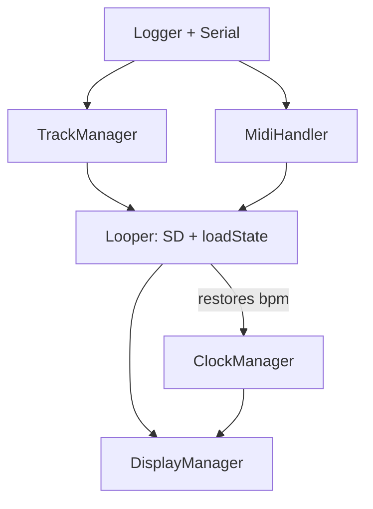

# Setup Order Fix – Logical Init Order

## Problem

The `skipLedUpdate` flag was added because `loadState` (inside `looper.setup()`) calls `setSelectedTrack()` → `forceLedUpdate()` before `midiHandler.setup()` has run, causing a boot hang when sending MIDI.

## Dependency Constraints




- **loadState** restores `bpm` from SD; **clockManager.setup()** reads `bpm` for `microsPerTick`. So **loadState must run before clockManager**.
- **setSelectedTrack** (during loadState) triggers **forceLedUpdate** → sends MIDI. So **midiHandler must run before looper**.
- **loadState** uses **trackManager** (setSelectedTrack, getTrack, etc.). So **trackManager.setup()** must run before looper.

## Proposed Logical Order


| Phase | Component      | Purpose                                      |
| ----- | -------------- | -------------------------------------------- |
| 1     | Logger         | Serial, logging – base layer                 |
| 2     | MidiHandler    | MIDI I/O – ready before any LED/track output |
| 3     | TrackManager   | Default MIDI channels per track              |
| 4     | Looper         | SD.begin + loadState (restores bpm, tracks)  |
| 5     | ClockManager   | Uses restored bpm, starts interval timer     |
| 6     | DisplayManager | UI – uses tracks, clock                      |
| 7     | Final          | clearLeds, forceLedUpdate                    |


**Note:** Looper cannot be last because the clock needs the restored BPM from loadState. The order `logger → midi → track → looper → clock → display` follows the dependency flow.

## Changes

### 1. Reorder setup in main.cpp

In [src/main.cpp](src/main.cpp), restructure setup into the order above. Keep the early block (pinMode, midiButtonManager, midiFaderManager, barStepButtonHandler, noteEditManager, Serial, logger) as the “input layer” at the top. Then apply:

```
logger.setup() + config
midiHandler.setup()
trackManager.setup()
looper.setup()           // SD + loadState; setSelectedTrack now safe (midi ready)
clockManager.setup()
displayManager.setup()
logger.info("Performance monitoring...")
trackManager.clearLeds()
trackManager.forceLedUpdate(clockManager.getCurrentTick())
```

Remove the duplicate `looper.setup()` call (line 80) – it currently runs twice.

### 2. Revert the skipLedUpdate flag

- **TrackManager.h**: Restore `void setSelectedTrack(uint8_t index);`
- **TrackManager.cpp**: Restore original body (no skipLedUpdate branch)
- **StorageManager.cpp**: Revert to `setSelectedTrack(selectedTrackIdx)` and `setSelectedTrack(0)`

## Risk

Low. The order respects all dependencies; midiHandler is ready before any MIDI send.