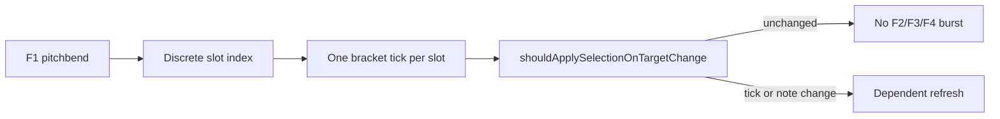

# Handoff — NOTE_EDIT fader feedback: Option D aggressive refresh

**Date:** 2026-07-01  
**Branch:** `load-save-sets-loops`  
**OpenSpec change:** [`openspec/changes/note-edit-fader-feedback-regression/`](../../openspec/changes/note-edit-fader-feedback-regression/)  
**Prior handoff:** [`docs/Plans/note_edit_fader_feedback_empty_step_handoff.md`](note_edit_fader_feedback_empty_step_handoff.md)  
**Cursor plan:** `.cursor/plans/option_d_fader_handoff_aeba362f.plan.md`  
**Build env:** `teensy41-capture-serial`  
**Capture port:** `/dev/cu.usbmodem154944801`

---

## Status summary

| Milestone | Status |
|-----------|--------|
| Stall-fix steps 1–4 (dirty flags + partial plans) | **Shipped** (`6e1dacf`) |
| RC-A empty-step F2/F3 send | **Shipped** (`ec4678f`) |
| Option A bracket-tick apply gate | **Shipped** (`23c2391`) — **insufficient** for same-slot dwell |
| RC-B pipeline always `DONE` | **Partial** — 11 orphaned `BEGIN` in `session_20260701_120425` |
| Option D aggressive refresh (D1–D4) | **Superseded** — [`note_edit_fader_feedback_selection_driven_refactor.md`](note_edit_fader_feedback_selection_driven_refactor.md) |
| RC-D5 continuous F1 outbound | **Parked** — design session if D1–D4 insufficient |

**Recent commits (fader track):**

| Commit | Summary |
|--------|---------|
| `6e1dacf` | Dirty flags + `planForSelectDependent` |
| `ec4678f` | RC-A empty-step F2/F3 send |
| `23c2391` | Bracket-tick apply gate + RC-B partial (`completeOutboundPipelineAtDone`, `SKIP_SEND`) |

---

## Capture check — why it feels unchanged

**Post-fix capture:** [`captures/session_20260701_120425.log`](../../captures/session_20260701_120425.log) (after commit `23c2391`, flashed ~12:04)  
**Pre-fix baseline:** [`captures/session_20260701_115014.log`](../../captures/session_20260701_115014.log) (before bracket-tick gate)

| Metric | Pre (`115014`) | Post (`120425`) | Verdict |
|--------|----------------|-----------------|---------|
| `select_apply apply=1` | 0 (feature absent) | **299** | Option A **is running** |
| `select_apply reason=unchanged` | 0 | **1151** | Most F1 motion is **same slot/tick** |
| Same-`idx` `select_slot` events | 1604 | 1123 | Still dominant (~77% of selects) |
| Max inter-`SEND_F2` gap | **2.71s** | **1.52s** | ~44% better — easy to miss perceptually |
| `QUIET_REFRESH` | 0 | 0 | 400ms quiet path **never fired** |
| `dependent_refresh_skip` | 0 | 0 | Dirty flags not blocking |
| `BEGIN` / `DONE` | 336 / 324 | 299 / 288 | 11–12 orphaned `BEGIN` remain |
| HITL `clusters_missing_f2_within_3s` | 1 | 1 | Still **FAIL** |
| Opening F2 lag (analyzer) | large delta at 432s | F2 **0%** at 61.369s until 61.389s | Pitch/position motors still **trail F1** |

**Root cause (capture-proof):** `resolveFader1SelectTarget` maps pitchbend → **discrete nav slot** → one `absoluteTargetTick` per slot. Within a slot, bracket tick does not change:

```
[61.369] #DBG select_apply bracket_tick=837 slot=34 apply=1 reason=bracket_or_note
[61.389] #DBG select_apply bracket_tick=837 slot=34 apply=0 reason=unchanged
```

Option A only helps when **bracket tick or noteIdx** changes (slot cross or multi-note same 16th). It does **not** address **RC-E same-slot slow crawl** — the main perceived gap.



**Analyze:**

```bash
rg 'select_apply|QUIET_REFRESH|outbound_step=' captures/session_20260701_120425.log
.venv/bin/python scripts/analyze_fader2_select_feedback.py captures/session_20260701_120425.log
```

---

## RC-D1 — Shorten or remove F1 quiet gate

**File:** [`include/Utils/NoteEditFaderOutboundPlan.h`](../../include/Utils/NoteEditFaderOutboundPlan.h) — `kFader1QuietMs` (400)

**Change:** Reduce to **100ms** (or **0** with capture A/B). Enables `processFaderSelectQuiet` during micro-pauses in slow sweeps.

**Risk:** More `QUIET_REFRESH` bursts; monitor for stall spam (`session_20260630_222821` baseline).

**Capture gate:** `QUIET_REFRESH` > 0 during slow sweep; no duplicate same-`pb` `SEND_F2` storms.

---

## RC-D2 — Relax stale-echo lockout (RC-F)

**File:** [`src/NoteEditManager.cpp`](../../src/NoteEditManager.cpp) — `applyNoteSelectFromFader1Pitchbend` ~1540

When `absoluteTargetTick != editManager.getBracketTick()` **and** mapped slot index changed, **do not** block apply on small `pitchValue` delta during `positionEditLockout` window.

Keep lockout when bracket tick unchanged (true motor echo).

---

## RC-D3 — Dirty-flag rollback lever (only if stalls return)

If D1+D2 reintroduce duplicate bursts: revert `requestDependentFaderRefreshFromSelection` dirty skip → always schedule full plan on apply (keep partial-plan routing for coalesce safety).

Do **not** revert RC-A empty-step send or RC-B `Done` completion.

---

## RC-D4 — Finish RC-B

**File:** [`src/NoteEditManager.cpp`](../../src/NoteEditManager.cpp) — `processFaderOutbound`

Ensure every `BEGIN` reaches `DONE` (including preempt/cancel paths). Target: `BEGIN` count == `DONE` count in capture.

---

## RC-D5 — Optional follow-up (if D1–D4 still insufficient)

**Not in literal Option D** — document as **parked design session** if capture still shows >1s gaps:

- **Continuous F1 outbound:** during `SelectPhase::UserMovingFader1`, map live F1 pitchbend → loop-relative tick → coarse F2 (and F4 when note resolved) **without** `applySelectNav` on every pb event; apply selection only on slot cross or quiet.

Requires user approval for new behavior name (avoid `preview`/`live layer` per vocabulary rule — e.g. `sendCoarseFaderPositionFromSelectPitchbend`).

---

## Recommended order

| Step | Action |
|------|--------|
| 1 | Confirm this handoff |
| 2 | **RC-D4** — finish RC-B (`BEGIN` == `DONE`) |
| 3 | **RC-D1** — quiet ms → capture |
| 4 | **RC-D2** — stale-echo relax → capture |
| 5 | If stalls: **RC-D3** dirty rollback |
| 6 | If gaps remain: **RC-D5** design session |

---

## Primary files

| Area | Files |
|------|--------|
| Quiet / apply | [`NoteEditFaderOutboundPlan.h`](../../include/Utils/NoteEditFaderOutboundPlan.h), [`NoteEditManager.cpp`](../../src/NoteEditManager.cpp) |
| Stale echo | `applyNoteSelectFromFader1Pitchbend` |
| Pipeline | `processFaderOutbound`, `completeOutboundPipelineAtDone` |
| Tests | [`test/test_note_edit_fader_feedback/test_note_edit_fader_feedback.cpp`](../../test/test_note_edit_fader_feedback/test_note_edit_fader_feedback.cpp) |
| OpenSpec | [`openspec/changes/note-edit-fader-feedback-regression/tasks.md`](../../openspec/changes/note-edit-fader-feedback-regression/tasks.md) — §7.10 |

---

## Verification gates

```bash
pio test -e native
pio run -e teensy41-capture-serial
# ask user before upload
pio run -e teensy41-capture-serial -t upload

.venv/bin/python scripts/capture_session.py --port /dev/cu.usbmodem154944801
# slow F1 sweep + opening pitch test in NOTE_EDIT
rg 'select_apply|QUIET_REFRESH|outbound_step=' captures/<session>.log
.venv/bin/python scripts/analyze_fader2_select_feedback.py captures/<session>.log
```

**Pass criteria (Option D):**

| Check | `120425` | Target |
|-------|----------|--------|
| Max inter-`SEND_F2` gap | 1.52s | < 1.0s |
| `clusters_missing_f2_within_3s` | 1 | 0 |
| `QUIET_REFRESH` | 0 | > 0 on slow sweep with pauses |
| `BEGIN` == `DONE` | 299 / 288 | equal |
| Stall regression | n/a | no duplicate same-tick `SEND_F2` spam |

**Regression:** note-slot fast crossings stay 100% schedule + F2; same-slot dwell must not reintroduce `session_20260630_222821`-class duplicate bursts.

---

## Architecture checkpoint

| Question | Answer |
|----------|--------|
| Ownership change? | No for D1–D4 |
| State transition change? | D1/D2 minor; D5 would need design session |

---

## Session notes

- Option A (bracket-tick gate) shipped and verified in capture — metric improvement real but perceptually subtle; same-slot dwell remains dominant failure mode.
- Do **not** implement D1–D4 until user confirms this handoff.
- **2026-07-01:** D1–D4 implemented (`kFader1QuietMs` 100, stale-echo slot bypass, RC-B DONE pairing); flash + capture to verify pass criteria.
- Skip-when-feedback-current (plan step 8) remains parked after Option D; see OpenSpec §7.11 when scoped.
