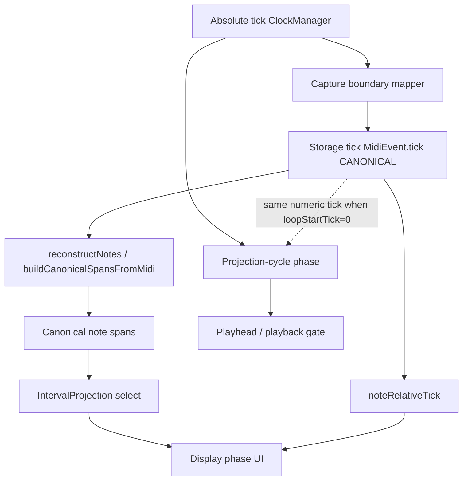

# Capture coordinate system — canonical decision (before implementation)

**Status:** Architecture gate — **diagnostics first**, then decision, then code  
**Trigger:** [`session_20260713_134558.log`](../captures/session_20260713_134558.log) — wrap lag, wrong display pairing, notes recorded off playhead  
**Blocks:** Any change to `Track::capturePhaseTick()` until Phase 2 decision is recorded

**Related:** [`capture_projection_phase_fix`](../../.cursor/plans/capture_projection_phase_fix_05b55c08.plan.md), UIP [`unified_interval_projection_enhancement.md`](unified_interval_projection_enhancement.md), linear storage [`openspec/changes/linear-loop-tick-storage/specs/linear-loop-tick-storage/spec.md`](../../openspec/changes/linear-loop-tick-storage/specs/linear-loop-tick-storage/spec.md)

---

## Architectural principle (existing authority)

From UIP and linear-loop-tick-storage:

> **Storage is global; projection is local.**  
> Loop wrapping never mutates storage at read time; projection selects intervals for consumers.

| Layer | Owns | Mutates `MidiEvent.tick`? |
|-------|------|---------------------------|
| Capture / commit | Writes **canonical storage** | **Yes** — at append + macro normalize |
| `reconstructNotes` / `buildCanonicalSpansFromMidi` | Derives **DisplayNote** spans from storage | **No** |
| `IntervalProjection` | Derives playback/display intervals from spans | **No** |
| Playback hot path | Schedules by **projection-cycle phase** | **No** |

**Canonical for persisted events:** `MidiEvent.tick` in loop-relative **storage** space (0 … loopLength−1 for note-ons; note-offs may be linear past loopLength per linear-loop-tick-storage invariant 5).

**Not canonical in storage:** absolute tick, projection-cycle phase, display phase — these are **derived views** used at capture boundaries and by consumers.

---

## Time domains (current codebase)

| Domain | Owner / API | Purpose | Authoritative? |
|--------|-------------|---------|----------------|
| **Absolute tick** | `ClockManager` | Monotonic transport time | **Source** for live input timing; **never stored** on `MidiEvent` |
| **Storage tick** | `MidiEvent.tick` in capture store / passes | Canonical event positions | **Yes** — persistence, materialize, reconstruct input |
| **Legacy loop phase** | `tickPhaseInLoop(abs, startLoopTick, len)` | Brownfield record origin mapping | **Derived** — mapping only; `startLoopTick` is migration anchor |
| **Projection-cycle phase** | `tickPhaseInProjectionCycle(abs, projectionCycleStartTick, len)` | Playback playhead, slot scheduling, active-slot display when transport active | **Derived** — transport scheduling frame |
| **Display phase** | `noteRelativeTick(storagePhase, loopStartTick, len)` | Piano roll / OLED visual alignment (downbeat offset) | **Derived** — UI frame |



---

## Decision questions (must answer before code)

### 1. Which coordinate system is canonical for stored events?

**Answer (from specs — not optional):**

- **Canonical:** loop-relative **storage tick** on `MidiEvent` (`0 <= NoteOn.tick < loopLength`; linear note-offs may exceed loopLength).
- **Not stored:** absolute, projection-cycle, or display coordinates.

Capture does **not** choose between “storage vs transport” as two persistence formats. It chooses the **mapping** from absolute → storage at input time.

### 2. Which systems are derived?

| Derived | From |
|---------|------|
| Projection-cycle phase | `absTick`, `projectionCycleStartTick`, `loopLength` |
| Display phase | `noteRelativeTick(storageOrProjPhase, loopStartTick, loopLength)` |
| Playback sort/send phase | `playbackEventPhase(storageTick, loopLength)` |
| DisplayNote list | storage events → reconstruct → optional projection filter |

**Reconstruction does not convert between coordinate systems.** It reads storage ticks only. If storage ticks are wrong at capture, reconstruction cannot fix pairing — it faithfully pairs what was stored.

### 3. Should capture write canonical or transport coordinates?

**Write canonical storage ticks only.**

At the capture boundary, use a **single mapper** `absoluteTick → storageTick`:

| Capture mode | Mapper (candidate) | Notes |
|--------------|-------------------|--------|
| Punch-in record (not playing) | `absTick - startLoopTick` (linear, may grow unbounded pre-stop) | Existing record path |
| Overdub / record while playing | **TBD after diagnostics** — candidates below | Must match musician/playhead intent |

**Candidates for transport-active mapper (diagnostics will pick):**

| ID | Mapper | Writes to storage |
|----|--------|-------------------|
| **A** | `tickPhaseInLoop(abs, startLoopTick, len)` | Legacy brownfield — current `capturePhaseTick` |
| **B** | `tickPhaseInProjectionCycle(abs, projectionCycleStartTick, len)` | Aligns with playhead / `playMidiEvents` |
| **C** | Map via display chain: `noteRelativeTick(tickPhaseInProjectionCycle(...), loopStartTick, len)` | Aligns with OLED when `loopStartTick != 0` |

**Hypothesis (134558):** playhead uses **B** (or **C** when downbeat offset); capture uses **A** → stored tick ≠ seen tick → wrong pairing on live display merge.

### 4. Should reconstruction convert between them?

**No.** Reconstruction is storage-authoritative. Fix belongs at **capture boundary mapper** (+ seal/finalize using same mapper), not in `NoteUtils`.

Optional **display-only** projection (`projectDisplayNotes`) already filters/projects for UI — keep out of capture hot path.

---

## Phase 0 — Diagnostics first (mandatory before any fix)

Add SESSION_CAPTURE log on **every overdub NoteOn/NoteOff append** (and finalize append):

```
#CAP_COORD abs=%u storage=%u proj=%u display=%u startLoop=%u projStart=%d loopStart=%u ch=%u note=%u
```

Where:

| Field | Computation |
|-------|-------------|
| `abs` | `currentTick` passed to `recordMidiEvents` / finalize |
| `storage` | tick actually written to `MidiEvent.tick` |
| `proj` | `tickPhaseInProjectionCycle(abs, projectionCycleStartTick, loopLength)` |
| `display` | `noteRelativeTick(proj, loop.loopStartTick, loopLength)` |
| `startLoop` | `loop.startLoopTick` |
| `projStart` | `projectionCycleStartTick` |
| `loopStart` | `loop.loopStartTick` |

Also log **reconstruct sanity** at overdub stop (existing SEVT dump window):

- For note 12 (or active HITL pitch): list `(storageOn, storageOff)` pairs from capture store
- List `DisplayNote` `(start, end)` from `reconstructDisplayNotes(captureFlat)` for same pitch
- Mark which pairing matches MI grid intent

**Do not change `capturePhaseTick` in Phase 0.**

---

## Phase 1 — HITL decision gate

Re-run base HITL / manual overdub (same as 134558). From capture log:

1. For 3–5 captured notes (including one held across wrap), record all four phases.
2. Compare to MI input timing and playhead position on OLED.
3. Answer explicitly:

> **Which storage tick column would have produced correct reconstruct/display pairing?**
> - storage as recorded (A)
> - if storage had equaled `proj` (B)
> - if storage had equaled `display` (C)

Record decision in this doc § **Decision record** before Phase 2.

---

## Phase 2 — Implementation (shipped 2026-07-13)

Mapper **B** implemented in [`Track::capturePhaseTick`](../../src/Track.cpp): transport-active overdub/record → `tickPhaseInProjectionCycle`; punch-in → linear offset; stop `closeTick` unified via same helper. Guide: [`LOOP_MIDI_STORAGE_AND_VALIDATION.md`](../Guides/LOOP_MIDI_STORAGE_AND_VALIDATION.md) invariant #4.

Tests: `test_transport_active_capture_phase_matches_projection_cycle`, `test_transport_active_capture_post_wrap_phase_from_log`.

---

## Phase 3 — Follow-ups (unchanged scope)

| Issue | Action after Phase 2 |
|-------|---------------------|
| ch4 wrap lag (MO 3753) | Re-measure BAR/MO; separate playback-wrap plan if persists |
| Duplicate SEVT rows | Use `#CAP_COORD` + MI correlation; trace double append |

---

## Architecture compliance checklist (implementation review)

Before merge, confirm:

- [ ] Capture writes **storage ticks only** (no second persisted format)
- [ ] Reconstruct/display remain **read-only** on storage
- [ ] Playback remains **read-only** for capture (no `playMidiEvents` mutation)
- [ ] One mapper owns absolute → storage at capture boundary
- [ ] Finalize and seal use **same mapper** as live overdub
- [ ] `#CAP_COORD` logs removed or gated after decision validated
- [ ] Native test encodes chosen mapper (prevents regression to `startLoopTick`/`projectionCycle` drift)

---

## Decision record

| Field | Value |
|-------|--------|
| Date | 2026-07-13 |
| Evidence log | [`session_20260713_135824.log`](../captures/session_20260713_135824.log) |
| **Default hypothesis** | **B** — `tickPhaseInProjectionCycle` (user confirmed; Phase 1 log validates) |
| **Chosen mapper** | **B** — storage should equal `proj` (not `display`) |
| **Example row (note 12, post-wrap)** | `ABS 2432 · storage 128 · proj 128 · display 1136` → write **128** |
| **Example row (loopStart offset)** | `ABS 960 · storage 960 · proj 960 · display 1968` → write **960**; display derived at reconstruct |
| **Reconstruct verified** | **Yes** — `#CAP,DNTE` rows show consistent storage→display (e.g. `12,1344,48,96`) |
| **COORD stats** | 62 rows; storage==proj in 61/62; 1 row NoteOff bump (`1705` vs `1704`, pair rule) |
| **Not chosen** | **C (display)** — display is UI frame via `noteRelativeTick`; not canonical storage |
| **Open** | MO 3658 (lag vs 115434); non-canonical stop `check=2`; wrap pairing SEVT unchanged |

---

## Pre-implementation review

### Ready

- Canonical vs derived roles documented from UIP + linear-loop-tick-storage
- Diagnostics spec defined; no firmware behavior change until Phase 1

### Blocked until Phase 1

- Modifying `capturePhaseTick`
- Choosing B vs C vs A without log evidence

### Proceed?

**Phase 0** — `#CAP,COORD` diagnostics added (2026-07-13). Rebuild, upload, HITL capture, fill decision record.
