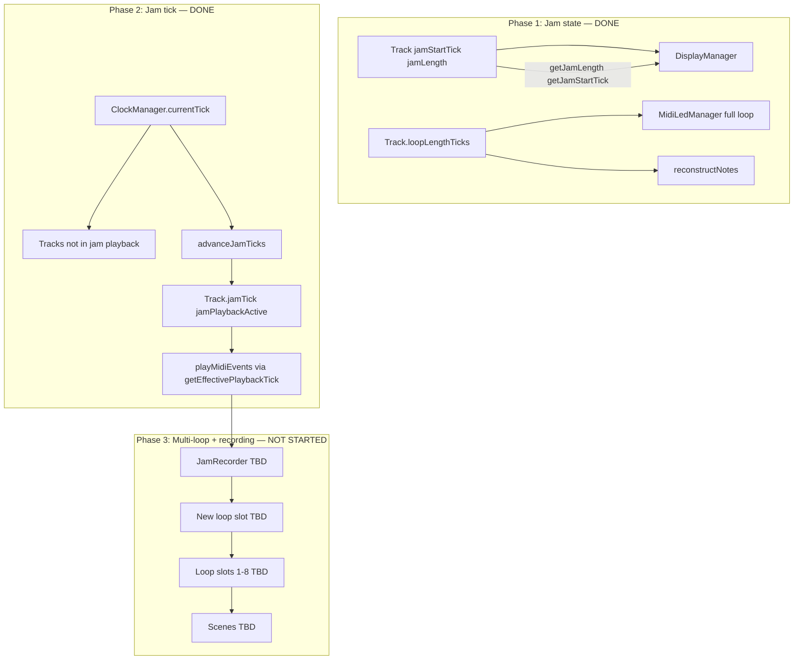

# Dual-Tick Architecture: Jam State + Jam Tick (+ Phase 3)

**Document status (repo reality, 2025):** Phases **1** and **2** are **implemented** in code. **Phase 3** is **not** — see **[phase-3-multi-loop.md](phase-3-multi-loop.md)** for the requirements spec.

## Original problem (fixed)

Bar select used to mutate `loopLengthTicks` / `loopStartTick`, which caused:

1. **Wrong notes on display** — `reconstructNotes(..., loopLength)` dropped everything outside one bar.
2. **Wrong bar LEDs** — `MidiLedManager` saw a 1-bar loop length.

**Fix:** jam is **state** (`jamStartTick`, `jamLength`); the stored loop is unchanged during bar select / HOLD_TWO zoom.

## Architecture: three phases

**Principle:** `loopLengthTicks` and `loopStartTick` are **not** mutated for bar select / HOLD_TWO windowing; jam state drives the **display window**; optional **jam playback** uses `jamTick` mapped into the full loop.

---

## Phase 1: Jam state — **implemented**

- **Track:** `jamStartTick`, `jamLength`, `setJam()`, `clearJam()`, `isJamming()`, getters. `UINT32_MAX` / `0` = inactive.
- **BarStepButtonHandler:** `enterBarSelect` / `exitBarSelect` / `switchBarSelect`; HOLD_TWO uses same jam state + `isHoldTwoJam`; no `savedLoopStartTick` / `savedLoopLength`.
- **DisplayManager:** Piano roll / notes use jam window; full `getLoopLength()` for wrapping and note cache.
- **MidiLedManager / NoteUtils:** Full loop length for LEDs and reconstruction.
- **LoopEditManager:** Faders **not** blocked during jam.

**Seek behaviour (evolved beyond original one-paragraph spec):**

- Global `currentTick` seek on **NoteOn** when **not** `jamPlaybackActive` and not `potentialHoldTwo` (two same-type buttons).
- **Jam navigation** (bar slide / bar switch / 16th in jam) largely on **SHORT_PRESS** so HOLD_TWO gesture is not confused with navigation.
- Same-bar **NoteOn** can exit bar select (`exitBarSelect`).

---

## Phase 2: Jam tick — **implemented**

- **Track:** `volatile jamTick`, `jamPlaybackActive`, `advanceJamTick()`, `setJamTick()`, `getEffectivePlaybackTick(currentTick)`, `setJamPlayback(bool)`.
- **ClockManager:** Calls `trackManager.advanceJamTicks(...)` on internal clock and MIDI clock advance paths.
- **TrackManager::updateAllTracks:** `playMidiEvents` and selected-track LED updates use `getEffectivePlaybackTick(currentTick)` per track.
- **DisplayManager::update:** Playhead / info use effective tick for selected track.
- **BarStepButtonHandler:** HOLD_TWO and bar select enable `setJamPlayback(true)` where independent loop playback is desired.

**Note:** Original Phase 1 text said `playMidiEvents` always used global tick over the full loop; Phase 2 **supersedes** that for tracks with `jamPlaybackActive`.

---

## Phase 3: Multi-loop + jam recording — **not implemented**

UX and data-model direction remains as sketched below; **authoritative requirements** (open decisions, storage, MIDI mapping) are in **[phase-3-multi-loop.md](phase-3-multi-loop.md)**.

- Up to **8 loop slots** per track (`Loop` struct + `loops[8]`, `activeLoopIndex` — TBD).
- **Dedicated loop buttons** (separate from bar/16th) — TBD mapping.
- **Jam recording** into a new slot while switching sources / overdub — TBD semantics.
- **Scenes** — TBD persistence.

---

## Reference: files touched for Phases 1–2

| Area | Files |
|------|--------|
| Jam state + jam tick | `include/Track.h`, `src/Track.cpp` |
| Bar / 16th / gestures | `include/BarStepButtonHandler.h`, `src/BarStepButtonHandler.cpp` |
| Clock | `src/ClockManager.cpp` |
| Playback / LEDs | `include/TrackManager.h`, `src/TrackManager.cpp`, `src/MidiLedManager.cpp` (as wired) |
| Display | `src/DisplayManager.cpp` |
| Faders in jam | `src/LoopEditManager.cpp` |

Line numbers in older snippets are stale; use repo search for symbols above.
