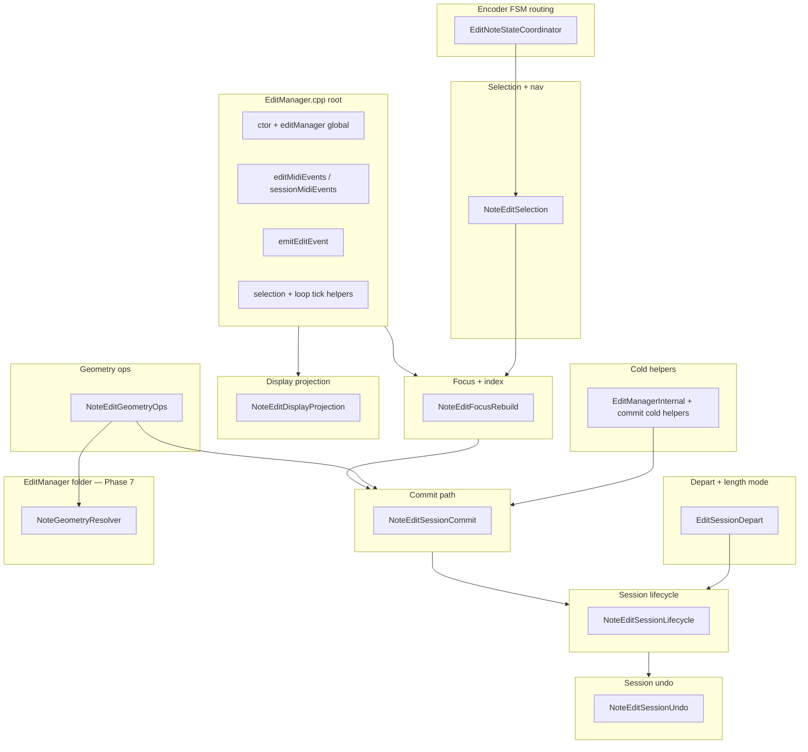

# EditManager translation-unit extraction

**Kind:** refinement  
**Branch:** `refactor/editmanager` (from `dev`)  
**Parent context:** [note_edit_control_surface_split_refinement.md](note_edit_control_surface_split_refinement.md) (control-surface split — **shipped** PR #11), [codebase_hygiene_technical_debt_review.md](codebase_hygiene_technical_debt_review.md), [runtime_process_building_blocks_overview.md](runtime_process_building_blocks_overview.md)  
**Naming authority:** [NAMING.md](../Authority/NAMING.md), [refactor_priority_backlog.md](refactor_priority_backlog.md)  
**Pattern reference:** [controlsurface TU split](.cursor/plans/controlsurface_tu_split_e4d3f1d8.plan.md) (shipped), [storagemanager_translation_unit_extraction_refinement.md](storagemanager_translation_unit_extraction_refinement.md), [displaymanager_translation_unit_extraction_refinement.md](displaymanager_translation_unit_extraction_refinement.md)

---

## One-line goal

Shrink [`src/EditManager.cpp`](../../src/EditManager.cpp) from a ~2602-line monolith into a thin session coordinator (`editMidiEvents` router, ctor, global, small getters) by moving cohesive NOTE_EDIT session domains into [`src/EditManager/*.cpp`](../../src/EditManager/), **one phase per PR**, behavior-preserving, **no ownership or lifecycle changes**.

---

## Baseline (2026-08-06)

| Artifact | LOC / status |
|----------|----------------|
| [`src/EditManager.cpp`](../../src/EditManager.cpp) | **~2602** (root TU) |
| [`include/EditManager.h`](../../include/EditManager.h) | **~326** — `EditSession`, `NoteEditSessionState`, FSM state instances stay here |
| `EditManagerInternal.h` | **does not exist yet** |
| [`src/RunEditSessionGeometryPipeline.cpp`](../../src/RunEditSessionGeometryPipeline.cpp) | **~181** — already extracted; **Phase 7** becomes `src/EditManager/NoteGeometryResolver.cpp` |
| [`src/EditApply.cpp`](../../src/EditApply.cpp) | **~9473 bytes** — apply-owned rows; out of scope |
| [`src/EditSessionActionBuilder.cpp`](../../src/EditSessionActionBuilder.cpp) | shipped sibling |
| [`src/EditSessionInteraction.cpp`](../../src/EditSessionInteraction.cpp) | shipped sibling |
| [`src/EditSessionLiveStoreSpan.cpp`](../../src/EditSessionLiveStoreSpan.cpp) | shipped sibling |
| [`src/EditSessionStoreInvariant.cpp`](../../src/EditSessionStoreInvariant.cpp) | shipped sibling |
| [`src/EditStates/*.cpp`](../../src/EditStates/) | FSM state bodies — stay; root keeps `setState` / routing only |

### Target end state

| Artifact | Target |
|----------|--------|
| `EditManager.cpp` | **~250–400** — ctor, `editManager` global, `editMidiEvents` / `sessionMidiEvents`, `emitEditEvent`, loop-tick helpers, selection getters/setters |
| New TUs (this plan) | **~2200** moved out in Phases 0–9 |
| Ownership / transitions | **unchanged** — hygiene only; honor [note_edit_control_surface_split_refinement.md](note_edit_control_surface_split_refinement.md) ownership law |

---

## Rules (every phase)

1. **Behavior-preserving** — no changes to session open/close, commit, undo, focus rebuild, or display-cache semantics.
2. **Architecture checkpoint** — ownership change **NO**, state transition change **NO** ([architecture-checkpoint-bugfix](../../.cursor/rules/architecture-checkpoint-bugfix.mdc)).
3. **Pre-implementation review** — trace symbols with `rg`; post gate table in PR description ([Plan-Pre-Implementation-Review](../../.cursor/rules/Plan-Pre-Implementation-Review.mdc)).
4. **Verification gate** — `pio test -e native` (828/828); `pio run -e teensy41-capture-serial`; phase-appropriate HITL edit smoke when commit/focus/display paths touched ([HITL-Edit-Test-Flow](../../.cursor/rules/HITL-Edit-Test-Flow.mdc)).
5. **One phase per session / PR** — do not mix unrelated extractions.
6. **State stays on `EditManager`** — move **method bodies** only; do **not** introduce `NoteEditCommitManager` / parallel FSM classes without user approval ([NAMING.md](../Authority/NAMING.md) § Module suffix).
7. **Headers** — declare moved file-static helpers in new [`include/EditManagerInternal.h`](../../include/EditManagerInternal.h); keep [`include/EditManager.h`](../../include/EditManager.h) public surface stable unless a phase explicitly owns a rename.
8. **Member access** — extracted TUs implement `EditManager::method` out-of-line; preserve `EDIT_MANAGER_IMPL_MEM` / `NOTE_EDIT_MEM` on moved hot-path methods ([`include/Utils/NoteEditMem.h`](../../include/Utils/NoteEditMem.h)).
9. **Instance class, not static façade** — unlike `StorageManager`, member fields remain on `EditManager`; only **anonymous-namespace / file-static helpers** move to internal header + cold TUs.

### Naming alignment ([NAMING.md](../Authority/NAMING.md))

| Concept | Use in this plan | Avoid |
|---------|------------------|-------|
| Live edit RAM | **EditSession** / **session store** | layer, working store |
| Stored rows | **editPass** / **passes** | EditOp, span as stored row |
| Overlap scratch | **overlapNotes** on **focus** | ledger, victim |
| Display reconstruction | **DisplayNote** / **projected** display | audible, view type |
| Geometry apply orchestration | **`NoteGeometryResolver::resolve`** (Phase 7) | Mechanical `*Geometry*` → `*NoteGeometry*` everywhere; `EditSessionGeometryResolver` |
| Deferred UI paint | **Deferred** (existing `processDeferredNoteEditDisplayRefresh`) | Queue for synchronous algorithms |

**Phase 7 naming (bundled with geometry ops — [NAMING.md](../Authority/NAMING.md) § Geometry resolution, [architecture_naming_authority_refinement.md](architecture_naming_authority_refinement.md) § C):** introduce **`NoteGeometryResolver`** (static `resolve` / `resolveForCausingNote`), relocate TU under `src/EditManager/`, delete `RunEditSessionGeometryPipeline*`, update call sites — **same PR** as `NoteEditGeometryOps.cpp` extraction. Zero behavior change; `#CAP,GEOM_APPLY,*` log strings unchanged unless a matcher explicitly keys on the old C++ symbol name (none today). **Private phase-method decomposition** (`validate`, `prepareEvaluationScope`, …) is **optional follow-up** — not required in Phase 7a.

### Do not split (yet)

| Area | Reason |
|------|--------|
| `RunEditSessionGeometryPipeline.cpp` | **Phase 7** — relocate + replace with `src/EditManager/NoteGeometryResolver.cpp` (not a body move from root TU) |
| `EditApply.cpp`, `EditSessionActionBuilder.cpp`, `EditSessionInteraction.cpp`, … | Existing siblings — link, do not duplicate |
| `EditStates/*.cpp` FSM state bodies | State pattern implementations stay per-state |
| Capture stop / `foldLiveCaptureIntoNoteEditSession` **behavior** | Protected — move **body** only in Phase 4 with gate; no logic edits |
| `ControlSurfaceManager` | Shipped split (PR #11) — `EditManager` emits `EditEvent`; do not move surface feedback back |

### Protected paths (extra scrutiny)

Any edit under these areas requires architecture gate **even for hygiene**:

| Area | Owner methods |
|------|----------------|
| Session open / close | `openNoteEditSession`, `closeNoteEditSession`, `reopenNoteEditSession`, `revertNoteEditSessionForLoopClear` |
| Commit | `commitAllPendingNoteEditActions`, `commitEditAction`, `bakeNoteEditSessionStoreToPasses` |
| Capture fold | `foldLiveCaptureIntoNoteEditSession` |
| Undo | `sessionUndo`, `sessionRedo`, `restoreSessionUndoEntry`, `pushSessionUndoOnKindChange` |
| Depart / slot | `commitEditSessionOnDepart`, `beforeSelectedSlotChange`, `onSelectedSlotChanged` |

Read [LOOP_MIDI_STORAGE_AND_VALIDATION.md](../Guides/LOOP_MIDI_STORAGE_AND_VALIDATION.md) before moving commit or fold paths.

---

## Domain map (current root TU)



---

## Phase map (highest ROI first)

```text
Phase 0  EditManagerInternal + commit cold helpers     (~280 LOC)
Phase 1  NoteEditDisplayProjection + deferred refresh  (~220 LOC)
Phase 2  NoteEditFocusRebuild + index sync             (~380 LOC)
Phase 3  NoteEditSessionCommit (commitEditAction…)     (~320 LOC)  ← protected
Phase 4  NoteEditSessionLifecycle (open/close/fold)    (~280 LOC)  ← protected
Phase 5  NoteEditSessionUndo + kind-boundary warm      (~250 LOC)
Phase 6  NoteEditSelection + nav inventory             (~320 LOC)
Phase 7  NoteEditGeometryOps + NoteGeometryResolver (rename + relocate)   (~290 + ~180 LOC)
Phase 8  EditNoteStateCoordinator (encoder FSM)        (~310 LOC)
Phase 9  EditSessionDepart + length mode sync          (~260 LOC)
         ─────────────────────────────────────────────
         EditManager.cpp  2602 → ~250–400
```

Milestone after **Phase 1**: root TU **~2100 LOC** (display cache isolated — display refresh coupling reduced).  
Milestone after **Phase 3–4**: root TU **~1500 LOC** (commit + lifecycle isolated — highest risk reduced).  
Milestone after **Phases 0–9**: root TU within target band.

**Suggested PR stack:** **0 → 1 → 2** sequential (internal + display + focus). **3 → 4** sequential (commit before lifecycle depart hooks). **5** after 3. **6** after 2. **7** after 3+6 (geometry ops + **`NoteGeometryResolver`** + relocate TU under `src/EditManager/`). **8** can run after 6 (parallel-safe). **9** last (track/slot depart touches lifecycle + length mode).

---

## Phase 0 — `EditManagerInternal` scaffold (~280 LOC)

**New files**

| File | Role |
|------|------|
| [`include/EditManagerInternal.h`](../../include/EditManagerInternal.h) | Declarations for file-static helpers moved from root anonymous namespace |
| [`src/EditManager/NoteEditCommitColdHelpers.cpp`](../../src/EditManager/NoteEditCommitColdHelpers.cpp) | Pre-commit overlap helpers, durable checkpoint id list, parity logging |

### Move (anonymous namespace today, ~lines 56–334)

| Symbol | Role |
|--------|------|
| `collectEditPassIdsPendingDurableCheckpoint` | Durable EditPass id diff for checkpoint |
| `markOverlapDeleteRowsEmitted` / `clearCommittedOverlapScratchExceptHidden` | Overlap pre-commit scratch |
| `collectCommittedOverlapDeleteIds` / `collectCommittedOverlapUpdateBaselines` | Post-commit focus cleanup inputs |
| `logChangeLengthCommitTrace` / `logPreCommitEditPassRows` / `logApplyOwnedCommitParity` | `#CAP` / commit trace |
| `editPassRowsEqualForParity` / `addedEventsEqual` | Test parity helpers |
| `materializePassesExcludingEditPasses` | Pass materialize helper for focus rebuild |
| `logGeomApplyUndo` / `logGeomApplyFocus` / `logGeomApplyPipeline` | `#CAP,GEOM_APPLY,*` (SESSION_CAPTURE) |

### Keep in root

- `EDIT_MANAGER_IMPL_MEM` macro definition (or move macro to `EditManagerInternal.h` in same PR)
- `editManager` global

### Verify

- `pio test -e native`; `pio run -e teensy41-capture-serial`

**PR title:** `refactor(editmanager): internal scaffold and commit cold helpers`

---

## Phase 1 — `NoteEditDisplayProjection.cpp` (~220 LOC)

**Priority:** Lower coupling — safe early extract; unblocks display-only changes.

### Move

| Symbol | Role |
|--------|------|
| `filteredSelectableDisplayNotesForNoteEdit` | Cached selectable inventory |
| `projectedNoteEditDisplayNotes` / `selectableDisplayNotesAtEditSelect` | Display projection entry points |
| `invalidateProjectedNoteEditDisplayCache` / `invalidateNoteEditDerivedCaches` | Cache epochs |
| `markNoteEditDisplayPainted` | Paint epoch ack |
| `scheduleDeferredNoteEditDisplayRefresh` / `processDeferredNoteEditDisplayRefresh` / `flushDeferredNoteEditDisplayRefresh` | Deferred display refresh |
| `materializedLoopEventsForNoteEditFocus` | Loop pass materialize for focus baseline |
| `liveEditDisplayNoteAtSelect` | Live mover display note |

### Verify

- Native `test_noteutils_reconstruct`, `test_edit_apply`; manual NOTE_EDIT display refresh after move

**PR title:** `refactor(editmanager): extract note edit display projection`

---

## Phase 2 — `NoteEditFocusRebuild.cpp` (~380 LOC)

### Move

| Symbol | Role |
|--------|------|
| `rebuildNoteEditFocusAtSelect` / `rebuildNoteEditFocusForDisplayNote` | Focus rebuild from passes + live store |
| `ensureNoteEditFocusForLiveEdit` | Focus guard before geometry |
| `syncNoteEditFocusLastFromSessionStore` | focus.last from session store |
| `syncSelectedNoteIdxToFilteredInventory` | Index remap after commit / geometry |
| `cancelPendingDeleteForSelectNote` | Apply-owned Delete row cancel on F1 nav |

### Dependencies

- Phase 0 internal helpers (baseline map population stays in focus TU or internal — trace `populateBaselineMapForEditClosure` call sites)

### Verify

- Native `test_edit_apply`, `test_note_edit_session_state`; HITL edit: F1 reselect after move/length

**PR title:** `refactor(editmanager): extract note edit focus rebuild`

---

## Phase 3 — `NoteEditSessionCommit.cpp` (~320 LOC) — protected

### Move

| Symbol | Role |
|--------|------|
| `commitAllPendingNoteEditActions` | Macro pre-commit → `commitEditAction` |
| `commitPendingOverlapNoteEdits` | Overlap flush alias |
| `commitEditAction` | EditPass row commit + durable checkpoint |
| `bakeNoteEditSessionStoreToPasses` (private) | Store → passes bake |

### Architecture gate required

Post [OpenSpec phase gate](../../.cursor/rules/OpenSpec-Phase-Gate.mdc) table for commit owner before first edit.

### Verify

- Native `test_note_edit_session_undo`, `test_edit_apply`; HITL edit undo after geometry commit

**PR title:** `refactor(editmanager): extract note edit session commit`

---

## Phase 4 — `NoteEditSessionLifecycle.cpp` (~280 LOC) — protected

### Move

| Symbol | Role |
|--------|------|
| `openNoteEditSession` / `reopenNoteEditSession` / `closeNoteEditSession` | Session boundaries |
| `closeNoteEditPass` / `markCurrentEditBatchDurable` | Pass batch close + durable mark |
| `revertNoteEditSessionForLoopClear` / `rematerializeNoteEditSessionAfterWorkspaceReload` | Loop clear + workspace reload |
| `persistActiveNoteEditSession` (private) | Persist on depart |
| `foldLiveCaptureIntoNoteEditSession` | Overdub fold into session store |

### Verify

- Native persistence/session tests; HITL: enter/exit NOTE_EDIT, overdub fold while editing

**PR title:** `refactor(editmanager): extract note edit session lifecycle`

---

## Phase 5 — `NoteEditSessionUndo.cpp` (~250 LOC)

### Move

| Symbol | Role |
|--------|------|
| `sessionUndo` / `sessionRedo` | Session undo stack |
| `restoreSessionUndoEntry` / `applyUndoRedoLanding` | Restore + UI landing |
| `pushSessionUndoOnKindChange` | Kind-boundary undo push |
| `scheduleKindBoundaryUndoWarm` / `processKindBoundaryUndoWarm` | Idle kind-boundary warm |

### Verify

- Native `test_note_edit_session_undo`, `test_global_undo_stack_persistence`; HITL edit undo/redo

**PR title:** `refactor(editmanager): extract note edit session undo`

---

## Phase 6 — `NoteEditSelection.cpp` (~320 LOC)

### Move

| Symbol | Role |
|--------|------|
| `applySelectNav` / `applySelectionFromGeometryEdit` / `syncGeometrySelectionToUi` | Selection + geometry bracket sync |
| `selectableDisplayNotesForEditUi` / `buildSelectNavigationSlots` | Nav inventory |
| `syncReferenceStepFromSelectedTick` | Reference step for fine/coarse |
| `enterDefaultNoteEditSessionState` / `syncNoteEditSessionStateToUi` | Session state → UI |
| `applyCycleEditKind` / `applyGeometryKindFromControl` / `beginGeometryMutation` | Kind transitions |
| `resetNoteEditSessionState` | Session state reset |

### Verify

- Native `test_select_navigation`; HITL edit F1 bracket navigation

**PR title:** `refactor(editmanager): extract note edit selection and navigation`

---

## Phase 7 — `NoteEditGeometryOps.cpp` + `NoteGeometryResolver` (~290 + ~180 LOC)

**Priority:** Bundles [P1 geometry resolver rename](refactor_priority_backlog.md) with geometry-op extraction ([NAMING.md](../Authority/NAMING.md) § Geometry resolution). One PR — rename is not a standalone pass.

### Design (approved)

Promote **note geometry** as a first-class architectural concept ([NAMING.md](../Authority/NAMING.md) § Note geometry). Phase 7 introduces the resolver; broader **NoteGeometry** promotion elsewhere is **incremental** (touch-and-rename), not a mechanical repo-wide pass.

Replace implementation-oriented **Pipeline** naming with responsibility-oriented **`NoteGeometryResolver`**:

- **Domain noun:** **note geometry** — spatial note properties before mutations are applied.
- **Boundary rule:** **NoteGeometry** on public types and cross-module APIs; concise **Geometry** inside the resolver and sibling implementation code.
- **Owner type:** `NoteGeometryResolver` — resolves note geometry into valid note mutations; callers own edit-session context.
- **Public API:** static `resolve(...)` and `resolveForCausingNote(...)` — single high-level entry per call shape today.
- **Not** `EditSessionGeometryResolver` — scopes the type to today's caller, not the stable domain.
- **Future callers** (quantization, overlap repair, import correction) can reuse the resolver without edit-session coupling.

**Phase 7a scope (required):** `NoteGeometryResolver` + delete `*Pipeline*` symbols only.

**Evaluate in Phase 7+ (optional, same PR only if low churn):** `EditedGeometry` → `EditedNoteGeometry`; `ResolveConstrainedGeometry` → `ResolveConstrainedNoteGeometry`. Default: defer to touch-and-rename when those TUs are next refactored.

**Out of scope for Phase 7:** ControlSurface geometry driver rename (`NoteGeometryDriver`), loop geometry (`UndoLoopGeometry`), display/piano-roll geometry.

**Algorithm phases** (documentation + optional future private methods — not mandatory in 7a):

```text
validate → prepareEvaluationScope → projectBaseline → analyzeInteractions
         → resolveConstraints → buildActions → applyActions
```

Verb conventions: `validate` / `prepare` / `project` / `determine` / `analyze` / `group` / `resolve` / `build` / `apply` — see [NAMING.md](../Authority/NAMING.md) § Geometry resolution.

### 7a — Introduce `NoteGeometryResolver` and relocate TU (zero behavior change)

| From | To |
|------|-----|
| `src/RunEditSessionGeometryPipeline.cpp` | `src/EditManager/NoteGeometryResolver.cpp` |
| `include/RunEditSessionGeometryPipeline.h` | `include/NoteGeometryResolver.h` |
| `include/RunEditSessionGeometryPipelineDriver.h` | **merged into** `include/NoteGeometryResolver.h` |
| `runEditSessionGeometryPipeline` | `NoteGeometryResolver::resolve` |
| `runEditSessionGeometryPipelineForCausingNote` | `NoteGeometryResolver::resolveForCausingNote` |

**Implementation note:** Phase 7a may keep the existing function body structure inside `NoteGeometryResolver::resolve` (or as file-local helpers). Splitting into private phase methods is a **separate optional slice** after green rename + extract.

**Call sites to update (trace with `rg` before edit):**

| File | Notes |
|------|-------|
| [`src/EditManager.cpp`](../../src/EditManager.cpp) | `applyCreatedNoteOverlapGeometry`, `applyDeleteNoteOverlapRestore` |
| [`src/Utils/NoteMovementUtils.cpp`](../../src/Utils/NoteMovementUtils.cpp) | move / length / pitch apply paths (~4 calls) |
| Native / interaction tests | Any direct include of old headers |

**Out of scope for symbol rename in this phase:** archived OpenSpec paths, historical plan prose, `#CAP` log tokens (`GEOM_APPLY` unchanged). Update **normative** `openspec/specs/` only if CI or agents treat them as authority for current code names.

**Verify after rename-only slice within PR:** `pio test -e native`; `pio run -e teensy41-capture-serial` — must be green before extracting `NoteEditGeometryOps.cpp`.

### 7b — Extract `NoteEditGeometryOps.cpp`

| Symbol | Role |
|--------|------|
| `moveNoteToPosition` / `changeNoteEndWithOverlapHandling` | Geometry apply entry (calls `NoteGeometryResolver::resolveForCausingNote`) |
| `deleteSelectedNote` / `applyDeleteNoteOverlapRestore` | Delete + overlap restore |
| `applyCreatedNoteOverlapGeometry` | Post-create overlap |

### 7c — Optional follow-up (not Phase 7 gate)

Private phase methods on `NoteGeometryResolver`; relocate `ResolveConstrainedGeometry` under `src/NoteGeometry/` with **NoteGeometry**-prefixed public names per [NAMING.md](../Authority/NAMING.md) § Note geometry; evaluate `EditedNoteGeometry`. Public `NoteGeometryResolver::resolve` remains stable.

### Dependencies

- Phases 3 + 6
- Phase 7a completes before 7b so new TU includes `NoteGeometryResolver.h` only

### Verify

- Native `test_edit_apply`, interaction tests touching resolution; HITL edit move/length/pitch; playing-transport defer (`#CAP,GEOM_APPLY,*`)

**PR title:** `refactor(editmanager): NoteGeometryResolver and extract geometry operations`

---

## Phase 8 — `EditNoteStateCoordinator.cpp` (~310 LOC)

### Move

| Symbol | Role |
|--------|------|
| `setState` / `onEncoderTurn` / `onButtonPress` | FSM routing |
| `enterEditMode` / `exitEditMode` / `switchToNextState` | Mode entry/exit |
| `selectClosestNote` / `selectNoteAtBracket` / `moveBracket` / `stepSelectNavSlot` | Bracket + nav |
| `moveBracket` (overload) / `selectNextNote` / `selectPrevNote` | Encoder bracket |
| `enterPitchEditMode` / `exitPitchEditMode` / `cycleNoteEditType` | Pitch + kind cycle |
| `sendEditModeProgram` | MIDI program for edit mode |

### Keep in root

- Public state instance fields on `EditManager` (header unchanged)

### Verify

- Manual encoder/button NOTE_EDIT smoke; native suites that touch `EditSelectNoteState`

**PR title:** `refactor(editmanager): extract edit note state coordinator`

---

## Phase 9 — `EditSessionDepart.cpp` (~260 LOC)

### Move

| Symbol | Role |
|--------|------|
| `cycleEditSession` / `sendEditSessionChange` / `emitSessionOpenedToSurface` | Session type cycle + surface notify |
| `commitEditSessionOnDepart` / `reenterEditSessionForFocusChange` | Depart commit |
| `beforeSelectedTrackChange` / `onTrackChanged` | Track switch hooks |
| `beforeSelectedSlotChange` / `onSelectedSlotChanged` | Slot switch hooks |
| `toggleLengthEditMode` / `clearLengthEditingMode` / `clearLengthEditingModeOnNoteSelect` | Length mode (session-side) |
| `getDisplayUndoCount` / `isSessionUndoDisplayActive` | Sidebar undo display |

### Verify

- Slot switch HITL; length mode toggle; session open motor path via `EditEvent`

**PR title:** `refactor(editmanager): extract edit session depart and length mode`

---

## Optional follow-up (not in ROI order)

| Item | Notes |
|------|-------|
| Collapse `#CAP` commit trace helpers | After root &lt; 400 LOC |
| Move `EDIT_MANAGER_IMPL_MEM` to shared header only | Mechanical cleanup |
| Further split `EditApply.cpp` | Separate track — not part of this plan |

---

## Per-phase checklist (copy into PR)

```markdown
## Architecture gate
- Owner: EditManager (unchanged)
- Invariant: NOTE_EDIT session store, focus, commit, and undo semantics unchanged
- Ownership change: NO
- Transition change: NO
- Reuse: YES — move method bodies to `src/EditManager/<Phase>.cpp`

## Pre-implementation review
- [ ] `rg <symbol>` — all call sites listed
- [ ] No new session fields on EditManager without design approval
- [ ] `EditManagerInternal.h` updated (Phase 0+)
- [ ] `EDIT_MANAGER_IMPL_MEM` preserved on moved methods
- [ ] Protected paths (Phases 3–4) — LOOP_MIDI guide read

## Tests
- [ ] `pio test -e native`
- [ ] `pio run -e teensy41-capture-serial`
- [ ] Manual / HITL edit: <phase-specific smoke>
```

---

## References

- [NAMING.md](../Authority/NAMING.md) — EditSession, editPass, overlapNotes, Deferred
- [architecture_naming_authority_refinement.md](architecture_naming_authority_refinement.md) § C — `NoteGeometryResolver` rename table (Phase 7)
- [refactor_priority_backlog.md](refactor_priority_backlog.md) — P1 geometry resolution (scheduled Phase 7)
- [note_edit_control_surface_split_refinement.md](note_edit_control_surface_split_refinement.md) — ownership law
- [LOOP_MIDI_STORAGE_AND_VALIDATION.md](../Guides/LOOP_MIDI_STORAGE_AND_VALIDATION.md) — commit/fold constraints
- [legacy_api_retirement_tu_extraction_refinement.md](legacy_api_retirement_tu_extraction_refinement.md) — optional **Phase LR** after structural split (e.g. `commitPendingOverlapNoteEdits` alias)
- [controlsurface TU split](.cursor/plans/controlsurface_tu_split_e4d3f1d8.plan.md) — shipped template (PR #11)
