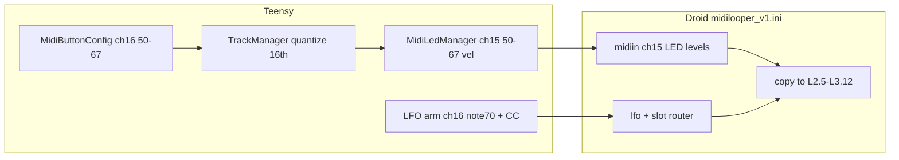

**Canonical copy:** edit this file under [`docs/Plans/`](README.md) in the repo. A copy may also exist under `~/.cursor/plans/`; treat this path as source of truth for iteration.

This plan merges [phase-3-multi-loop.md](phase-3-multi-loop.md) with Droid LED/LFO implementation. §0 below gives the combined **deliverables** (small chunks) and **to refine** (TBDs).

---

# 0. Deliverables and refinements (combined view)

## 0.1 Deliverables (ordered, small chunks)

| ID | Deliverable | Depends on | Notes |
|----|-------------|------------|-------|
| **D1** | **Constants** — `MAX_LOOPS_PER_TRACK`, MidiConfig Led 50–57/60–67, LFO note 70 (+ CC) | — | Config/header only. |
| **D2** | **activeLoopIndex** — Add to Track/TrackManager; slot 0 = current data; slots 1–7 unused. | D1 | No `Loop` struct yet; phase-3 3a subset. |
| **D3** | **Storage v3** — Bump version; persist `activeLoopIndex[NUM_TRACKS]`; migrate v2 → 0. | D2 | §1b. |
| **D4** | **Track buttons ch16** — Register 60–67: short=SELECT, double=MUTE, long=SOLO. | — | §4.1; [Tracks row guide](../Guides/control-surface/Tracks.md). |
| **D5** | **Loop select ch16 (switch-only)** — Register 50–57; short = `pendingActiveLoopIndex`; 16th commit in updateAllTracks. | D2 | Switch between filled slots only; no record/overdub yet. §4.2 subset. |
| **D6** | **Droid ini: ch15 track/loop LEDs** — midiin + copy for notes 50–67 → L2.5–L3.12. | — | §3; requires D7 to send. |
| **D7** | **MidiLedManager: track/loop velocities** — `updateTrackAndLoopSelectLeds`, clearAllLeds 50–67, MidiHandler logging. | D2 | §5. |
| **D8** | **Droid ini: LFO patch** — ch16 note 70 notegate; lfo square; routing to loop LED. | — | §3; requires D9. Verify BPM/8th sync per Droid manual. |
| **D9** | **Teensy: LFO arm** — NoteOn/Off 70 + slot CC on ARMED/RECORDING/OVERDUBBING transitions. | D2 | §6. |
| **D10** | **Loop struct + loops[8]** — Full per-slot storage (phase-3 3a); migration: slot 0 from current. | D2 | phase-3 §2.1–2.2. |
| **D11** | **Button A per slot** — handleToggleRecord/Clear/Undo/Redo scoped to slot; switch-only vs toggle precedence. | D5, D10 | §4.2 full; phase-3 §4. |
| **D12** | **Record/overdub target slot** — Recording writes to active slot; playback from active. | D10, D11 | phase-3 3c. |
| **D13** | **Arrangement mode: capture** — LoopInputMode, recordTargetSlot; loop presses record switches into target. | D12 | §4.3 slice 2; phase-3 3d. |
| **D14** | **Arrangement mode: playback** — Resolve §2.3; tests per phase-3 §6. | D13 | §4.3 slice 3. |
| **D15** | **Scenes** — Snapshot activeLoopIndex per track; trigger + persistence. | D12 | phase-3 §7; optional. |

**Suggested slices for first ship:** D1–D9 (LEDs + switch-only + LFO + storage indices). D10–D12 (full multi-slot record/overdub). D13–D15 deferred.

## 0.2 To refine (TBD / open decisions)

From [phase-3-multi-loop.md](phase-3-multi-loop.md) §9 and gaps:

| ID | Item | Where | Action |
|----|------|-------|--------|
| **R1** | **§2.3 merge model** — A (flattened stream) vs B (structural refs). | phase-3 §2.3 | Lock before D14. |
| **R2** | **Playback channel** — `Track::midiChannel` vs per-event `channel` precedence. | phase-3 §2.5 | Lock before D12. |
| **R3** | **Track-level REC** — Deprecate, alias slot 0, or keep alongside slot buttons. | phase-3 §3.2 | Affects D11. |
| **R4** | **Recording stop quantization** — Bar vs 16th. | phase-3 §4 | Affects D11. |
| **R5** | **Filled + long press** — Overdub vs clear (phase-3 §4: double/long = overdub; triple = clear). | phase-3 §4, §4.2 | Align gesture map. |
| **R6** | **Droid LFO BPM sync** — Exact ini syntax for 8th-note rate from MIDI clock. | §3 | Verify against Droid manual. |
| **R7** | **Scene trigger + persistence** | phase-3 §7 | If D15 in scope. |
| **R8** | **Slot state enum** — empty \| recording \| playing \| overdubbing \| muted. | phase-3 §2.1 | Affects LED logic. |

---

# Phase 3: Track/loop selection LEDs, ch16 input, 16th-quantized loop switch, Droid LFO pulse

## Context (verified in repo)

- **[droid/midilooper_v1.ini](../../droid/midilooper_v1.ini)** already exposes **track** buttons as **ch16 notes 60–67** and **loop** buttons as **ch16 notes 50–57** via `[midiout]` + `[buttongroup]` (lines ~644–734). **LED wiring for those rows is not yet driven from Teensy**; the buttongroup still owns `led1`–`led8` directly without the bar-style `[midiin]` + `[copy]` path.
- **Bar LED feedback pattern** (same file, ~500–559): `[midiin]` on **ch15** with `notegate` + `notegatevelocity`, then `[copy]` `input = _BARLEDn * _BAR_GATEn` → `L2.17`–`L3.20`. This is the template for track/loop LEDs.
- **Teensy** sends bar/step LEDs from [src/MidiLedManager.cpp](../../src/MidiLedManager.cpp) and constants in [include/MidiConfig.h](../../include/MidiConfig.h) (`Led::BAR_BASE = 40`, etc.). **Ch16 notes 50–67 are not registered** in [src/Utils/MidiButtonConfig.cpp](../../src/Utils/MidiButtonConfig.cpp) `loadConfiguration()` — only **ch2** `48+i` for track select. Incoming Droid presses on **ch16 60–67** therefore do not run `SELECT_TRACK` today.
- **Default track index** is already **0** ([include/TrackManager.h](../../include/TrackManager.h); `selectedTrack = 0`).
- **16th quantization** already appears for seek in [src/BarStepButtonHandler.cpp](../../src/BarStepButtonHandler.cpp) (`seekTick` aligned with `Config::TICKS_PER_16TH_STEP`).
- **Note 70 on ch1** is used for “Back Bar” in `loadConfiguration()`; **ch16 note 70 is unused** in the current button table — suitable for an **LFO arm** gate if you standardize on **ch16** for Droid control-plane messages (avoids collision with ch1 navigation).

## Product rules (from your spec)

| Signal             | Meaning                                                                                      |
| ------------------ | -------------------------------------------------------------------------------------------- |
| **ch15 note 60–67** | **Track** LED feedback (8 tracks)                                                          |
| **ch15 note 50–57** | **Loop** LED feedback for **currently selected track** (8 slots)                             |
| Velocity **127**   | Recording/overdubbing slot (active capture target) + selected track (60–67)            |
| Velocity **64**    | Enabled slot playing (`enabled && !muted`)                                                  |
| Velocity **32**    | Slot has content but not currently audible                                                  |
| Velocity **16**    | Muted slot (static placeholder; LFO flashing 0–32 will be wired later)                      |
| Velocity **0**     | Empty slot                                                                                   |
| **ch16 60–67**     | **Track row:** short=select, double=mute, long=solo. Per [Tracks.md](../Guides/control-surface/Tracks.md). |
| **ch16 50–57**     | **Per-slot copy of Button A** (see §4); **switch-only** changes commit on **next 16th boundary** |
| **ch16 note 70**   | **NoteOn** starts Droid LFO pulse; **NoteOff** stops it when leaving armed/recording/overdub |

## Multi-slot playback semantics (slot toggles)
- **Multi-hold selection:** holding one or more slot buttons beyond the long-press+50ms threshold builds a **pending enabled set**; when all held buttons are released, that set is **committed on the next 16th boundary** and all enabled+unmuted slots start playback together.
- **Short press (filled + playing):** focuses the pressed slot and **toggles mute/unmute for that slot** (only if the slot is part of the enabled set). If only one slot is currently enabled, a short press on a different filled slot **replaces** the enabled set on the next 16th boundary.
- **Long press (filled + playing):** selects a **single** slot at **loop-end** (replacing the enabled set). Long-press on the currently selected slot clears that slot.

## 1. Data dependency (Phase 3 core)

Per [phase-3-multi-loop.md](phase-3-multi-loop.md), **meaningful** loop LEDs (empty vs filled per slot) require **`activeLoopIndex` per track** and **per-slot emptiness** (`Loop` storage or equivalent). Recommended order:

1. **Minimal data**: `MAX_LOOPS_PER_TRACK` (8), `activeLoopIndex` on [Track](../../include/Track.h), slot 0 mirrors current `midiEvents` / `hasData()`; slots 1–7 empty until recording targets those slots (Phase 3a/3c).
2. **Then** LED + input wiring reads real slot state instead of faking “only slot 0”.

If you implement **LEDs before** the full `Loop` split, the only honest mapping is: **all non-zero slots show empty** until multi-slot storage exists.

## 1b. Save / restore selected track and active loop index

**Already implemented today:** [src/StorageManager.cpp](../../src/StorageManager.cpp) writes and reads **`selectedTrackIdx`** as the **last byte(s)** of the file after all track payloads (`saveState` ~107–113, `loadState` ~287–299). No change required for track selection beyond keeping that call after any new fields are written.

**To add:** persist **`activeLoopIndex` per track** (recommended: **8 × `uint8_t`**, one per `NUM_TRACKS`), clamped to **`0 .. MAX_LOOPS_PER_TRACK - 1`**, aligned with [phase-3-multi-loop.md](phase-3-multi-loop.md) (scenes / per-track “which loop was last active”). Storing only the loop index for the **currently selected** track is weaker: switching tracks would forget the other tracks’ last loop.

**Format change:**

- Bump **`STORAGE_VERSION`** (currently **2** in `StorageManager.cpp`) to **3**.
- After **`selectedTrackIdx`** (or immediately before it — pick one order and document it), write **`uint8_t activeLoopIndex[NUM_TRACKS]`** (or write each index inside the per-track loop once multi-slot data lives on `Track`; order must stay consistent between save and load).

**Load migration:**

- **`version == 2`:** no loop indices on disk → set **`activeLoopIndex = 0`** for every track after load (matches today’s single-loop behavior).
- **`version == 3`:** read the array; if **`sizeof` remaining bytes** is too small (partial file), fail or fall back like the existing selected-track tail check.

**Apply after load:** call **`setSelectedTrack`** (already done) and, for each track, set **`activeLoopIndex`** (setter on `Track` or `TrackManager`) **before** `forceLedUpdate` / UI so LEDs match restored state. Trigger **`forceLedUpdate`** once after all tracks + selection are applied.

## 2. [include/MidiConfig.h](../../include/MidiConfig.h)

**D1 actions (in order):**

1. Add `MAX_LOOPS_PER_TRACK = 8` — place in `Config` namespace ([Globals.h](../../include/Globals.h)) or a new `Loop` namespace in MidiConfig.
2. Add to `Led` namespace (next to existing constants):
   - `TRACK_SELECT_LED_BASE = 60`, `TRACK_SELECT_LED_COUNT = 8`
   - `LOOP_SELECT_LED_BASE = 50`, `LOOP_SELECT_LED_COUNT = 8`
   (Matches Droid + [Globals.h](../../include/Globals.h) `NUM_TRACKS == 8`.)
3. Add LFO constants (new namespace `LfoPulse` or under `Transport`):
   - `LFO_PULSE_ARM_CHANNEL = 16`
   - `LFO_PULSE_ARM_NOTE = 70`
   - `LFO_PULSE_SLOT_CC = 80` — **strongly recommended** for Droid routing: **0–7** = which loop LED receives the LFO, **127** = none. Without a slot index, the ini cannot route the square wave to the correct LED.
4. Update the CONFIG SUMMARY table in the header block (lines 11–19) with:
   - **Track select** — LED feedback notes 60–67 (ch15)
   - **Loop select** — Button notes 50–57 (ch16), LED feedback notes 50–57 (ch15)

## 3. Droid: [droid/midilooper_v1.ini](../../droid/midilooper_v1.ini)

**D6:** Use **channel 15** `[midiin]` to set LED state via **note number + velocity**, same pattern as bar (40–47) and 16th (0–15) content: Teensy sends NoteOn with velocity (127=selected, 32=has content, 0=empty); Droid `notegate` + `notegatevelocity` → `[copy]` to physical LEDs.

**Track row (L2.5–L3.8)**

- Remove or override default LED driving for that row if the manual requires it (match how 16th/bar use `states = 1` and MIDI-driven `[copy]`).
- Add **`[midiin]` ch15** for **notes 60–67** with `notegate1..8` + `notegatevelocity1..8` (same structure as bar block ~529–555).
- Add **eight `[copy]`** blocks: `input = _TRKVELn * _TRKGATEn` → `L2.5` … `L3.8` (names illustrative).

**Loop row (L2.9–L3.12)**

- Same pattern: **`[midiin]` ch15** for **notes 50–57**, `notegate1..8` + `notegatevelocity1..8` → `[copy]` to `L2.9` … `L3.12`.

**LFO pulse (Droid-side)**

- **`[midiin]`** on **ch16**, **note 70**: map **notegate** to a bus (e.g. `_LFO_RUN`) so **NoteOn** runs the LFO, **NoteOff** clears it (exact gate semantics per your Droid firmware doc).
- **`[lfo]`** (or the firmware’s BPM-synced oscillator / clock divider your manual recommends): produce a **square** in the **0–1** range, scaled in `[math]` / `[copy]` so the **modulated LED brightness** alternates between **~0.25 and 1.0** (maps to MIDI vel **32** and **127** at the `[midiout]` or LED driver stage — exact scaling depends on how your patch converts CV to LED).
- **Sync**: tie LFO rate to **MIDI clock** (Teensy already advances transport from MIDI clock in [src/ClockManager.cpp](../../src/ClockManager.cpp)) or to Droid’s **BPM** source so the period is **one 8th note**. The repo does **not** contain a BPM-synced `[lfo]` example; the only `[lfo]` reference found externally uses `hz = pot * 30` (unsynced). **Implementation details must be taken from the current Droid manual** for your hardware revision.
- **Routing**: use the **recommended CC** (slot index 0–7) to select **one** of eight `[copy]` paths that feed **only** that loop LED with `(_STATIC_LOOP_LEVEL * (1 - _LFO_RUN)) + (_LFO_SQUARE * _LFO_RUN)` or an equivalent **max/mixer** so that when `_LFO_RUN` is 0, brightness returns to Teensy-driven static levels only.

Document new buses in the ini header comment block (same style as existing controller legend).

## 4. Teensy: MIDI input

### 4.1 Track row (ch16 notes 60–67)

**Select-primary** mapping (mute as short felt irrational in practice):

| Gesture | Action |
|---------|--------|
| **Short** | Select track |
| **Double** | Mute / unmute track |
| **Long** | Solo / unsolo track |

**D4 (done):** [src/Utils/MidiButtonConfig.cpp](../../src/Utils/MidiButtonConfig.cpp) track row: `onShortPress(SELECT_TRACK)`, `onDoublePress(MUTE_TRACK)`, `onLongPress(SOLO_TRACK)`. Droid ini: track and loop rows use individual `[button] states=1` (not buttongroup) so loop LEDs do not switch with track select.

### 4.2 Loop row (ch16 notes 50–57) — same addButton pattern, different gesture map

**Structural pattern:** Use the same `addButton` pattern as the track row — `for` loop, ch16, `withParameter(i)`. Gesture mapping differs by slice.

| Gesture | D5 (slice 1) | D11 (slice 2) |
|---------|--------------|---------------|
| Short   | `SET_PENDING_LOOP` (switch only) | `TOGGLE_RECORD` (or switch when only changing loop) |
| Long    | — | `CLEAR_TRACK` |
| Double  | — | `UNDO` |
| Triple  | — | `REDO` |

**D5 action:** In [src/Utils/MidiButtonConfig.cpp](../../src/Utils/MidiButtonConfig.cpp) `loadConfiguration()`, add loop buttons (ch16 notes 50–57) after the track row. New `ActionType::SET_PENDING_LOOP` (or `SELECT_LOOP`) with parameter `i`. Wire in [MidiButtonActions](../../src/MidiButtonActions.cpp) and [MidiButtonManager](../../src/MidiButtonManager.cpp).

```cpp
// Loop select (ch16 notes 50-57) - D5 switch-only
for (uint8_t i = 0; i < MAX_LOOPS_PER_TRACK; i++) {
    addButton(ButtonConfig(MidiConfig::Led::LOOP_SELECT_LED_BASE + i, ch16, ("Loop " + std::to_string(i + 1)).c_str())
              .onShortPress(ActionType::SET_PENDING_LOOP)
              .withParameter(i));
}
```

**D11 action:** Add `.onDoublePress(UNDO).onTriplePress(REDO).onLongPress(CLEAR_TRACK)` (slot-scoped variants) so the loop row matches Button A with parameter `i`. Use `TOGGLE_RECORD_FOR_SLOT` or equivalent with switch-only precedence (see “Interaction with switch loop” below).

**Reference implementation today:** note **36** on ch16 is configured as “Record/Overdub” with the gesture map that D11 will replicate per slot ([`loadConfiguration()`](../../src/Utils/MidiButtonConfig.cpp) ~128–133):

- **Short** → `TOGGLE_RECORD`
- **Double** → `UNDO`
- **Triple** → `REDO`
- **Long** → `CLEAR_TRACK`

**Requirement (D11):** For each **loop index** `i` (0–7), the **target slot is `i`** on the **currently selected track** (not the whole-track single buffer once multi-slot data exists).

**Logic source of truth:** Factor or parallel these functions in [src/MidiButtonActions.cpp](../../src/MidiButtonActions.cpp) so slot-scoped versions follow the same branches as today:

- [`handleToggleRecord()`](../../src/MidiButtonActions.cpp) — empty → start recording; recording → stop + play; overdubbing → stop overdub; playing → start overdub; else toggle play/stop.
- [`handleClearTrack()`](../../src/MidiButtonActions.cpp) — clear when slot has data (per-slot `clear` once storage exists).
- [`handleUndo()`](../../src/MidiButtonActions.cpp) / [`handleRedo()`](../../src/MidiButtonActions.cpp) — undo/redo overdub for **that slot**’s history (per-slot undo stacks when Phase 3 storage supports it).

Until per-slot `TrackUndo` / events exist, slot 0 can delegate to current track-level APIs; slots 1–7 remain no-ops or empty-only as in §1.

**Interaction with [phase-3-multi-loop.md](phase-3-multi-loop.md) §4 (“switch loop”):** When a **short press** would *only* change which loop is heard/shown (e.g. **filled** slot `j` while **not** recording/overdubbing on the selected track, and `j != activeLoopIndex`), treat it as **switch active loop**: set **`pendingActiveLoopIndex = j`** instead of running the full `handleToggleRecord` path for `j`. When a short press **does** start/stop record or overdub on slot `i`, use the **same** state machine as Button A for **that slot**.

**16th-note quantization:** Apply **`pendingActiveLoopIndex` → `activeLoopIndex`** on **global** `currentTick` when `currentTick % Config::TICKS_PER_16TH_STEP == 0` (see [include/ClockManager.h](../../include/ClockManager.h)), in [TrackManager::updateAllTracks](../../src/TrackManager.cpp) (or a helper invoked from the same tick path). **Record / stop / overdub** timing follows existing `TrackManager` / Phase 3 stop-quantization decisions (not necessarily 16th).

On commit of a pending loop switch: **`forceLedUpdate`** (and any jam/view refresh needed for browse-while-overdub per Phase 3 §5).

Wire any **new** `ActionType` values in [include/Utils/MidiButtonConfig.h](../../include/Utils/MidiButtonConfig.h), [src/MidiButtonActions.cpp](../../src/MidiButtonActions.cpp), and [src/MidiButtonManager.cpp](../../src/MidiButtonManager.cpp) (string table). Prefer **one parameterized family** (e.g. `TOGGLE_RECORD_FOR_SLOT` with parameter `i`) over six unrelated enums if it keeps `MidiButtonProcessor` unchanged.

### 4.3 Arrangement / live-switch record (deferred phase)

Covers [phase-3-multi-loop.md](phase-3-multi-loop.md) **§5** (view vs record target), **§6 mode 3** (live switch record), **§2.3** (storage merge model). **Not in the first implementation slice** of this document; depends on multi-slot data + Normal loop UX (§4.2) working first.

**Problem:** One loop-button gesture must map to different effects depending on context (switch audible loop vs arm slot vs append “switched to slot K @ tick T” into another slot). That requires **explicit mode / state** (`LoopInputMode` or equivalent flags with a **precedence table**), not ad-hoc `if` chains.

**Requirements (when implemented):**

| ID | Requirement |
|----|-------------|
| R-A1 | **`recordTargetSlot`** — slot that receives new capture (MIDI and/or automation). |
| R-A2 | **View / playback slot** may differ from R-A1 during recording (jam + audible source follow view; capture targets R-A1). |
| R-A3 | **`LoopInputMode`**: at least **Normal** (§4.2) and **ArrangementRecord** (loop buttons change view / schedule switch and write into **R-A1**; do not apply Button A to the **pressed** slot while in this mode). |
| R-A4 | **Enter/exit** arrangement mode and **arm** behaviour defined (which gesture or transport edge toggles mode; optional separate Arm substate). |
| R-A5 | **Playback:** implement exactly one of [phase-3-multi-loop.md](phase-3-multi-loop.md) **§2.3** options — **A** flattened stream at record time or **B** structural refs resolved at play time. Arrangement clips depend on this choice. |
| R-A6 | **Bar/16th / jam** events that must appear in the new clip are either folded into the same event stream (A) or referenced explicitly (B); document which. |

**Implementation phases:**

1. **Slice 1 (this plan):** Only **Normal** `LoopInputMode`. §4.2 + LEDs + LFO + storage. No R-A1–R-A6.
2. **Slice 2:** Add `LoopInputMode`, `recordTargetSlot`, mode entry/exit, and **ArrangementRecord** routing for loop buttons; append **switch/automation** records into target slot; keep playback minimal or offline-verify with logging.
3. **Slice 3:** Playback + tests per phase-3 **§6** checklist; extend save format if arrangement data must persist.

**Artifacts:** State transition list + **gesture × (mode, track state)** matrix in code comments or `docs/`; link to §2.3 decision in the same place.

## 5. Teensy: MIDI output (static LEDs)

Extend [include/MidiLedManager.h](../../include/MidiLedManager.h) / [src/MidiLedManager.cpp](../../src/MidiLedManager.cpp):

- Add `lastTrackSelectVelocity[8]` and `lastLoopSelectVelocity[8]` (same `0xFF` sentinel pattern as `lastBarVelocity`).
- New method e.g. `updateTrackAndLoopSelectLeds(...)` called from [TrackManager::updateLedsDeferred](../../src/TrackManager.cpp) (so it runs with the rest of Droid LED traffic):
  - **Tracks**: for each `t` in `0..NUM_TRACKS-1`, velocity = **127** if `t == selectedTrack`, else **32** if track `t` has data (existing [Track::hasData()](../../include/Track.h)), else **0** (use **NoteOn vel 0** or **NoteOff** — match whatever Droid `[midiin]` expects for “empty”; bar logic uses **NoteOff** for “inactive” segments).
  - **Loops**: for each slot `s`, velocity = **127** if `s == activeLoopIndex` **for the selected track**, else **32** if slot `s` non-empty, else **0**.
- Update [MidiLedManager::clearAllLeds](../../src/MidiLedManager.cpp) to **NoteOff** notes **50–57** and **60–67** and reset cached velocities.
- Extend [MidiHandler::sendMidiEvent](../../src/MidiHandler.cpp) debug logging guard for ch15 to include **50–67** (same pattern as notes ≤31 and 40–47 today).

## 6. Teensy: LFO arm (note 70 + optional CC)

Add a small helper (e.g. on `TrackManager` or `MidiLedManager`) called whenever **track state** changes:

- **On** `TRACK_ARMED`, `TRACK_RECORDING`, or `TRACK_OVERDUBBING`: send **ch16 NoteOn 70** with velocity **127** (if Droid gate is velocity-sensitive, document; otherwise use 127).
- **On** transitions to `TRACK_PLAYING`, `TRACK_STOPPED`, `TRACK_EMPTY`, `TRACK_STOPPED_RECORDING` (and **transport stop** via [TrackManager::handleTransportStop](../../src/TrackManager.cpp)): send **ch16 NoteOff 70**.
- Whenever pulse should be **active**, send the **slot CC** (0–7) for the **armed/recording/overdub target** loop index; when inactive, CC **127** or **0** per Droid patch convention.

Avoid spamming: track **last sent** arm state / slot and only send on change (same philosophy as bar velocities).

## 7. Testing checklist

- Cold boot: **track 1 + loop 1** show **127** on ch15 **60** and **50**; others **0** or **32** per data.
- Droid **ch16** presses: track change immediate; **loop switch-only** visible at **16th** boundary; loop **short/long/double/triple** match Button A (36) for that slot once multi-slot recording exists.
- Start **arm/record/overdub**: note **70** On + CC slot; LED pulses at **8th** rate on Droid; stop → note **70** Off, static velocities resume.
- No regression: bar (40–47), 16th content (0–15), tick cursor (16–31), [MidiHandler](../../src/MidiHandler.cpp) record-exclude / `isControlChannel` behavior unchanged.
- **Persistence:** save project, power cycle, reload → **same selected track** and **same per-track active loop indices** as before save (v3); old v2 cards still load with **loop 0** on every track.
- **Slice 2+ (§4.3):** ArrangementRecord: capture loop switches + jam/bar into `recordTargetSlot`; replay per locked §2.3 model (phase-3 §6 checklist).


