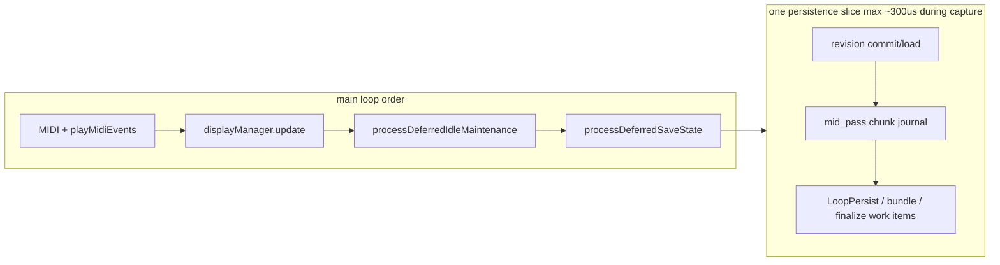

# Multi-track PLAYING pressure — closure refinement

**OpenSpec:** [`runtime-derived-representation-heap`](../../openspec/changes/runtime-derived-representation-heap/) · **M6**  
**Authority:** DEC-016 derived-representation policy · [`DerivedViews.md`](../Authority/Architecture/DerivedViews.md)  
**Supersedes investigation sections in:** [`long_record_capture_heap_investigation_refinement.md`](long_record_capture_heap_investigation_refinement.md)  
**Handoff (H6):** [`next_session_handoff_overdub_uip_architecture.md`](next_session_handoff_overdub_uip_architecture.md)

---

## M6 framing — completion of DEC-016, not a new playback model

Investigation shows much of the deferred/windowed playback architecture **already exists** (Phase A→C, M1–M5). Remaining failures come from **legacy callsites that still bypass** the approved policy — not from a missing streaming design.

**M6 answers one question:**

> Has the previously approved deferred/windowed derived-representation architecture been fully implemented across all runtime callsites?

If no: complete the remaining migration gaps and validate impact **before** considering any new iterator/streaming playback design.

Investigation indicates that `ensurePlaybackWindowBuilt()` and related runtime paths still bypass the deferred/windowed derived-representation policy defined by DEC-016. M6 **completes** the approved architecture by removing remaining eager materialization paths and validating that playback windows are constructed through deferred/windowed mechanisms where appropriate.

### Project sequence

| Milestone | Role |
|-----------|------|
| **M1–M5** | Establish derived-representation architecture (extmem published flat, admission, load spike, idle seed, display bar-slices) |
| **M6** | Audit + complete remaining legacy callsites that bypass DEC-016 |
| **Future (only if required after M6 PASS)** | Evaluate additional streaming or iterator-based playback — not in M6 scope |

---

## Review summary (2026-07-14)

| Decision | Rationale |
|----------|-----------|
| **M6 = DEC-016 completion work** | Deferred/windowed infra exists; legacy eager paths remain |
| **Phase 0 audit before edits** | Map every materialization callsite; avoid speculative architecture changes |
| **Cancel DIAG heap firmware** | `teensy41-capture-serial` link fails RAM1 ~−50 KB variables |
| **Use existing telemetry** | `RECS,stage`, `ODUB,stage`, `[Memory]`, `RING,overflow`, `PERS,result` |
| **One stacked PR, manual verify per phase** | User gates after Phase 0 audit sign-off, then Phases 1–3 |
| **HITL 64+64 after manual PASS** | HITL adds MO/timing pressure; complete migration first |

---

## Evidence matrix

| Log | Config | Outcome | Key signal |
|-----|--------|---------|------------|
| [`174731`](../../captures/session_20260714_174731.log) | 64-bar record + overdub, light multi-track | **PASS** | 0 `RING,overflow`; heap 20→16 KB min |
| [`175327`](../../captures/session_20260714_175327.log) | ~79-bar loop, tracks 1/4/5/6, overdub | **FAIL reboot** | 7121 MO; 412 `RING,overflow`; 16s overflow-only tail |
| [`163446`](../../captures/host_midi_automation_serial_20260714_163446.log) | HITL 64+64 record | **FAIL ~bar 9** | 28 KB at arm; silence (RECORDING) |
| [`162017`](../../captures/host_midi_automation_serial_20260714_162017.log) | HITL 64+64 | **FAIL ~bar 9** | Same class as 163446 |

**Conclusion:** Same root family (derived-data + main-loop starvation), different trigger points. HITL stalls during **RECORDING**; manual stress fails during **OVERDUBBING** under heavy MO.

---

## Implementation gap (confirmed — not a new architecture)

Phase A handoff marks chunk-ref playback **Done**, but production code still eager-materializes on hot paths. This is an **implementation gap** between DEC-016 and shipped code — the strongest finding from investigation.

### Primary gap

[`ensurePlaybackWindowBuilt`](../../src/Track.cpp) still performs full materialization through `loop.midiEvents()` for every non-capture PLAYING track on each `playbackRevision` bump — bypassing `gatherPublishedFlatForDerivedView` / `mergeActiveCapturePasses` policy already implemented in [`Loop.cpp`](../../src/Loop.cpp):

```cpp
} else if (!loop.captureActive()) {
  const SessionMidiEventVec& materialized = loop.midiEvents();
  runtime.primaryWindow.mergedEvents.assign(materialized.begin(), materialized.end());
```

### Secondary gaps (Phase 0 audit targets)

- **Display OVERDUBBING** — excluded from `deferVisualRebuild`; per-frame full flatten ([`DisplayManager.cpp`](../../src/DisplayManager.cpp))
- **MidiLedManager** — `mergeMaterializedPassesWithCapture` on hot path ([`MidiLedManager.cpp`](../../src/MidiLedManager.cpp))
- **Capture-active playback window** — still uses full `mergeMaterializedPassesWithCapture` instead of chunk merge + capture layer

Policy reference already shipped: [`gatherPublishedFlatForDerivedView`](../../src/Loop.cpp) — M6 aligns remaining callsites to it.

---

## Phase 0 — Implementation audit (**complete 2026-07-14**)

**Verdict:** DEC-016 infrastructure is largely shipped. **No new playback architecture required.** M6 scope is **3 phases + 2 additional callsites** found in audit (Display capture-active merge ×2, MidiLedManager bar refresh). Original Phases 1–3 remain correct; Phase 2 scope expanded slightly.

### Audit conclusion

| Question | Answer |
|----------|--------|
| Full DEC-016 migration complete? | **No** — 5 production callsites still eager-materialize on hot or bar-rate paths |
| New streaming/iterator model needed? | **No** — policy exists in `gatherPublishedFlatForDerivedView`, PLAYING defer, bar-slice idle |
| More rework than planned? | **Minor** — 2 DisplayManager `mergeMaterializedPassesWithCapture` sites + MidiLedManager bar hook; not a scope explosion |
| Stop-path / edit / SD paths OK? | **Yes** — remain materialized by design |

### Production callsite matrix (complete)

| Callsite | When it runs | Deferred | Windowed | Full materialize today | Expected (DEC-016) | M6 phase | Priority |
|----------|--------------|----------|----------|------------------------|-------------------|----------|----------|
| [`ensurePlaybackWindowBuilt`](../../src/Track.cpp) — `!captureActive()` | Every `playbackRevision` bump per **background PLAYING track** | Revision cache on `primaryWindow` | — | **`loop.midiEvents()`** → lazy full materialize | `gatherPublishedFlatForDerivedView` / `mergeActiveCapturePasses` | **1** | **P0** |
| [`ensurePlaybackWindowBuilt`](../../src/Track.cpp) — `captureActive()` | Capture track playback window rebuild | Revision cache | — | **`mergeMaterializedPassesWithCapture`** | Chunk merge sealed passes + capture layer merge | **1** | **P0** |
| [`DisplayManager::resolveDisplayNotes`](../../src/DisplayManager.cpp) — overdub block (~540–626) | **Every display frame** during OVERDUBBING | — | — | Per-frame `ensureVisualCacheBuilt` + capture flatten/reconstruct | Stale `visualCache` + `capturePreview` + playhead tails | **2** | **P0** |
| [`DisplayManager::resolveDisplayNotes`](../../src/DisplayManager.cpp) — `captureActive()` merge (~773–774, ~807–808) | PLAYING display when loop has open capture (record+play, overdub) | PLAYING defer exists for non-capture | Long-loop window uses chunk merge when `!captureActive` | **`mergeMaterializedPassesWithCapture`** when `captureActive` | Chunk merge + capture layer; revision-gated buffer | **2** | **P1** |
| [`DisplayManager::resolveDisplayNotes`](../../src/DisplayManager.cpp) — PLAYING idle path (~717–732) | PLAYING, not overdubbing | **Stale-while-revalidate** | Long-loop window via `mergeActiveCapturePasses` | Only when cache cold / not deferring | **Already migrated** | — | OK |
| [`Loop::rebuildVisualCacheFromPasses`](../../src/Loop.cpp) | `ensureVisualCacheBuilt` / idle slice completion | Bar-slice idle rebuild | — | Uses **`gatherPublishedFlatForDerivedView`** (chunk merge when no edit passes) | Policy owner — correct | — | OK |
| [`Track::processDeferredIdleMaintenance`](../../src/Track.cpp) | Idle / PLAYING bar-slice | **Bar-slice visual**; defers on `hasDeferredSaveWork` | — | `ensurePassesMaterializedStore` when transport idle | Defer materialize/visual on **non-selected** tracks when any capture active | **3** | **P1** |
| [`MidiLedManager::prepareLedNoteLookup`](../../src/MidiLedManager.cpp) | **Once per bar** (or bar wrap) when `visualCacheDirty` | Uses `visualCache.notes` when clean | — | **`mergeMaterializedPassesWithCapture`** when dirty | `mergeActiveCapturePasses` + existing capture scan | **2** | **P2** |
| [`TrackManager::prewarmSelectedDisplayVisualCache`](../../src/TrackManager.cpp) | Slot switch / prewarm when not PLAYING | Skips when PLAYING | — | Sync `ensureVisualCacheBuilt` | Idle-only prewarm — acceptable | — | OK |
| [`Track::legacyMidiEventsFromPublished`](../../src/Track.cpp) | Edit boundary; revision-keyed scratch | Once per `playbackRevision` | — | `ensurePassesMaterializedStore` + `midiEvents()` | Edit-path boundary — **remain** | — | OK |
| [`Track::getCachedNotes`](../../include/Track.h) | Jamming / note-edit display via `editAwareMidiEvents` | Edit session store when active | — | Materialize when edit inactive | Edit path — **remain** | — | OK |
| [`Track::getCachedEventIndex`](../../include/Track.h) | Note edit / movement when index invalid | Cached after first build | — | `loop.midiEvents()` on miss | Edit-adjacent; low frequency | — | Monitor |
| [`EditManager`](../../src/EditManager.cpp) | Note edit open / commit | Session store live | — | `materializeToEventVector` when edit active | **Remain materialized** | — | OK |
| [`shouldRestorePublishedOverlapOnOverdubStop`](../../src/Track.cpp) | Overdub stop overlap restore | — | — | Full `materializeToEventVector` | Stop-path — **remain** | — | OK |
| [`Track::findLastEventTick` / `validateAndCleanupMidiEvents`](../../src/Track.cpp) | Stop / idle validate | — | — | `mergeActiveCapturePasses` | Chunk merge — **already correct** | — | OK |
| [`Track::emitStoredMidiVerification`](../../src/Track.cpp) | Overdub stop telemetry | Heap-gated | — | `mergeActiveCapturePasses` | **Already correct** | — | OK |
| [`StorageManager` SD writer](../../src/StorageManager/) | Deferred slices | Chunk-bounded batches | — | Bounded per slice | M2 — **remain** | — | OK |
| [`Loop::midiEvents()`](../../src/Loop.cpp) | Called from hot-path callers above | Lazy when store fresh | — | `materializeEditViewFromPasses` when stale | **Keep**; remove hot-path callers | **1–2** | — |

**Unused but risky API (no production callers today):** `Track::getCachedNotesForSlot` / `getVisualNotesForSlot` call `midiEvents()` / `ensureVisualCacheBuilt` — document as do-not-use on hot path; no M6 change unless callers appear.

### Phase 0 deliverables

- [x] `rg` sweep: all `midiEvents()`, `materializeToEventVector`, `mergeMaterializedPassesWithCapture`, `ensureVisualCacheBuilt` production callsites documented
- [x] Matrix completed with **Expected** column and M6 phase assignment
- [x] **No new architecture** — all gaps map to existing DEC-016 policy
- [x] Investigation shift documented: heap telemetry abandoned → code audit

### Rework vs original plan

| Original scope | Audit finding |
|----------------|---------------|
| Phase 1: `ensurePlaybackWindowBuilt` non-capture path | **Confirmed P0** — primary multi-track pressure source |
| Phase 1: capture-active path | **Confirmed P0** — still uses full `mergeMaterializedPassesWithCapture` |
| Phase 2: overdub per-frame display | **Confirmed P0** — worst display hot path |
| Phase 3: idle gating non-selected tracks | **Confirmed P1** — idle maintenance only touches selected track today |
| *(not in original plan)* | **Add to Phase 2:** DisplayManager `captureActive()` branches at ~773 and ~807 still full-materialize |
| *(not in original plan)* | **Add to Phase 2 (P2):** MidiLedManager bar-rate `mergeMaterializedPassesWithCapture` when cache dirty |

**Legacy path discovery (OpenSpec record):** During implementation review, additional legacy materialization paths were identified beyond the initial H6 handoff (`ensurePlaybackWindowBuilt` + overdub display). These are now included within the M6 audit scope — DisplayManager capture-active PLAYING merge sites (~773, ~807) and `MidiLedManager::prepareLedNoteLookup` — to ensure all runtime consumers consistently follow the approved derived-representation policy. This documents why M6 Phase 2 expanded slightly without reopening architectural design.

**Implementation note (Phase 1):** expose `gatherPublishedFlatForDerivedView` as a public `Loop` method (or duplicate minimal policy in `ensurePlaybackWindowBuilt`) — policy already exists in anonymous namespace in [`Loop.cpp`](../../src/Loop.cpp); this is extraction, not new design.

### Cancelled diagnostics (Phase 0 evidence)

Phase 0 heap telemetry (`#CAP,DIAG,heap` / `HeapInvestigationTelemetry`) was investigated but **abandoned** because additional instrumentation exceeded available RAM1 budget (~50 KB increase), preventing `teensy41-capture-serial` firmware builds. **Distinct from M6 Phase A metrics** — lightweight `Diagnostics::Counter` integers (~tens of bytes) — see § Incremental architecture metrics.

---

## Architecture gate (M6 — all phases)

| Question | Answer |
|----------|--------|
| Owner | `ensurePlaybackWindowBuilt`, `resolveDisplayNotes`, `processDeferredIdleMaintenance` |
| Invariant | Playback MIDI correct before send; display may lag (DEC-016) |
| Ownership change? | **NO** |
| Transition change? | **NO** |
| Stop/capture FSM? | **NO** touch in M6 |

**Regression anchor:** [`record_stop_playback_hang_bugfix.md`](record_stop_playback_hang_bugfix.md)

### Architectural invariant (DEC-016 — preserve after M6)

> **Runtime consumers do not choose their own data representation. Representation selection remains owned by the derived-view layer.**

Playback, display, LED lookup, and edit boundaries MUST obtain derived views through the policy owners (`gatherPublishedFlatForDerivedView`, `visualCache`, `capturePreview`, edit session store) — not by calling `Loop::midiEvents()` or `mergeMaterializedPassesWithCapture` for convenience on hot paths.

---

## Incremental architecture metrics (Phases A–D)

The full Architecture Performance Metrics Framework remains valuable **long-term** but MUST NOT delay M6. Instrumentation supports implementation — it does not block it.

**Not the cancelled `#CAP,DIAG,heap` work:** that approach added ~50 KB RAM1 and failed to link. M6 metrics extend the existing [`Diagnostics::Counter`](../../include/Utils/Diagnostics.h) facade (`sCounters[]`, extmem trace ring) — integer counters + accumulated µs timings only; negligible RAM1/CPU.

### Phase A — Minimal verification counters (implement at start of M6 firmware)

Add permanent regression counters before playback fixes land, so before/after is objective.

| Counter | Purpose | Hook site (initial) |
|---------|---------|---------------------|
| `LegacyMidiEvents` | Unapproved `Loop::midiEvents()` on hot path | `Loop::midiEvents()` when called outside idle seed / edit / stop |
| `PlaybackFullMaterialize` | Full pass materialize on playback build | `ensurePlaybackWindowBuilt` legacy branches |
| `PlaybackDeferredReuse` | Revision hit — no rebuild | `ensurePlaybackWindowBuilt` early return |
| `PlaybackWindowRebuild` | Window rebuilt (maps existing `PlaybackMergeRebuild`) | `ensurePlaybackWindowBuilt` rebuild path |
| `PlaybackWindowReuse` | Alias intent for deferred reuse (or merge with above) | same early-return path |
| `DisplayFullRebuild` | Sync full visual / flatten rebuild | overdub `rebuildLiveDisplayNotes`, `ensureVisualCacheBuilt` hot path |
| `DisplayIncrementalUpdate` | `capturePreview` / stale-while-revalidate path | overdub revision-gated compose |

**Timing accumulators** (sum + count for mean; optional max):

| Metric | Hook |
|--------|------|
| `PlaybackBuildTime` | `ensurePlaybackWindowBuilt` rebuild path — `elapsedMicros` |
| `DisplayBuildTime` | `resolveDisplayNotes` compose path — `elapsedMicros` |

**Serial (capture builds):** emit counter snapshot on phase transitions or idle (`#CAP,DIAG,counter,<name>,<value>` or extend existing diag flush) — design at Phase A implementation; no new RAM1 ring structures.

**Existing counters retained:** `PlaybackMergeRebuild`, `VisualCacheRebuild`, `Materialize` — map or alias to new names during M6; do not duplicate semantics.

### Phase B — M6 playback fixes (Phases 1–3 below)

Complete deferred/windowed migration. Metrics should show immediate shift, e.g.:

```text
Before: PlaybackFullMaterialize = 84   LegacyMidiEvents = 120
After:  PlaybackFullMaterialize = 0    LegacyMidiEvents = 0   (hot path)
        PlaybackDeferredReuse ↑        DisplayIncrementalUpdate ↑
```

Intentional materialize (edit active, stop-path) may still increment counters on **documented** paths — exit criteria require hot-path counters at zero, not global zero.

### Phase C — Validate with existing HITL + manual gates

Normal regression matrix (174731, 175327, optional 2+2, M4 64+64). M6 likely complete when:

- 64-bar recording succeeds
- multi-track playback stable (no sustained `RING,overflow`)
- **legacy hot-path counters remain at zero** during PLAYING/OVERDUBBING stress

No full metrics framework required if these hold.

### Phase D — Expand only if necessary (post-M6)

Full Architecture Performance Metrics Framework (per-bar timing, deferred scheduling stats, representation size, runtime summaries) — **only if** Phase C leaves performance/memory questions unanswered.

### Permanent regression detectors

Counters in Phase A remain in firmware after M6 (SESSION_CAPTURE / `teensy41-capture-serial`). Future changes can detect accidental reintroduction of legacy paths without re-profiling.

### Metrics success criteria (supports M6 exit criteria)

| Question | Answered by |
|----------|-------------|
| Are legacy playback paths still executing on hot paths? | `LegacyMidiEvents`, `PlaybackFullMaterialize` → 0 during stress |
| Are deferred paths reused? | `PlaybackDeferredReuse`, `DisplayIncrementalUpdate` ↑ |
| Rebuilds only on revision change? | `PlaybackWindowRebuild` rate vs MO/transport rate |
| Did M6 eliminate unintended eager materialize? | Before/after counter snapshot + audit matrix |

---

## M6 implementation (stacked PR)

**Prerequisite:** Phase 0 audit **complete** (see § Phase 0).

### Phase A — Architecture metrics (first firmware edit)

**Files:** [`include/Utils/Diagnostics.h`](../../include/Utils/Diagnostics.h), [`src/Utils/Diagnostics.cpp`](../../src/Utils/Diagnostics.cpp), hook sites in [`Track.cpp`](../../src/Track.cpp), [`DisplayManager.cpp`](../../src/DisplayManager.cpp), [`Loop.cpp`](../../src/Loop.cpp)

- Extend `Diagnostics::Counter` enum + `DIAG_COUNTER_INC` hooks per table above
- Add timing accumulators + optional `#CAP,DIAG,counter` serial snapshot
- Native: extend [`test/test_diagnostics`](../../test/test_diagnostics/) for new counter IDs
- **Gate:** capture baseline counter snapshot **before** Phase 1 behaviour change (manual or HITL verify-only on current firmware)

### Phase 1 — Playback window (H6 — complete DEC-016 migration)

**File:** [`src/Track.cpp`](../../src/Track.cpp) — `ensurePlaybackWindowBuilt`

| Condition | Build via |
|-----------|-----------|
| Note-edit preview | `editManager.sessionMidiEvents()` (unchanged) |
| Live capture | Chunk merge sealed passes + capture layer (**replace** `mergeMaterializedPassesWithCapture`) |
| No active edit passes | **`gatherPublishedFlatForDerivedView` policy** → `mergeActiveCapturePasses` or extmem materialize when store fresh |
| Active edit passes | `loop.midiEvents()` (remain — edit requires full materialized view) |

**Also Phase 1:** expose or share `gatherPublishedFlatForDerivedView` from [`Loop.cpp`](../../src/Loop.cpp) so playback and display use one policy owner.

**Manual gate:** 174731-style — 64-bar + overdub, 1–2 background tracks; `OVERDUBBING→PLAYING`; no ring flood.

### Phase 2 — Display defer (complete OVERDUBBING migration to existing PLAYING policy)

**File:** [`src/DisplayManager.cpp`](../../src/DisplayManager.cpp)

#### What stops (expensive today)

Overdub currently calls `rebuildLiveDisplayNotes()` **every frame** (even when `needsFullLiveRebuild` is false). That path:

1. Sync `ensureVisualCacheBuilt()` when `visualCacheDirty`
2. Full `capture.store.flatten()` + `reconstructDisplayNotes()` for the whole capture buffer
3. Re-inserts all capture notes into `liveDisplayNotes`

That is the cost Phase 2 removes — not live MIDI visibility.

#### What still runs (live overdub notes)

Overdub display is a **two-layer composite**; only layer refresh is throttled:

| Layer | Source | Update trigger |
|-------|--------|----------------|
| **Committed loop** (pre-overdub passes) | `loop.visualCache.notes` | Stale-while-revalidate: refresh when `visualCacheDirty` / idle bar-slice, **not** every frame |
| **Live capture** (mid overdub events) | `loop.capturePreview.notes` | Incremental on each `Loop::appendCaptureEvent` via `applyCaptureEventToPreview` (already wired in capture hot path) |
| **Open note at playhead** | `applyCapturePlayheadTails` | Every frame (unchanged) — extends note length to playhead for note-ons without note-off yet |

**Key fix:** align overdub with **recording**, which already uses `capturePreview` (lines 583–584), instead of full flatten every frame (lines 564–579). On `captureDisplayRevision` change only: recompose `liveDisplayNotes = visualCache + capturePreview`; between revisions reuse last composed list + playhead tails.

```text
liveDisplayNotes = visualCache.notes          // committed; may lag 1–N frames (DEC-016)
                 + capturePreview.notes        // mid events; updated on each appendCaptureEvent
                 + applyCapturePlayheadTails   // growing tails at playhead; per frame
```

Recording path unchanged. PLAYING stale-while-revalidate pattern (lines 717–732) is the model for the committed layer during overdub.

#### Acceptance (display correctness)

- New note-ons appear on the **same frame** as capture append (via `capturePreview`, not full rebuild)
- Note-offs and completed capture notes appear when `captureDisplayRevision` bumps
- Playhead tail grows smoothly for held notes (existing tail path)
- Committed pre-overdub content may lag briefly under load — acceptable per DEC-016

**Manual gate:** 175327-style repro; no 16s `RING,overflow`-only tail; visually confirm overdub notes appear while playing.

#### Phase 2 additions (from audit)

- **`resolveDisplayNotes` capture-active PLAYING paths** (~773–774, ~807–808): replace `mergeMaterializedPassesWithCapture` with chunk merge + capture layer (same revision-gated buffer pattern as non-capture long-loop path)
- **`MidiLedManager::prepareLedNoteLookup`** (P2): when `visualCacheDirty`, use `mergeActiveCapturePasses` instead of full materialize; capture note scan already exists in `hasNoteOnInRangeForLed`

### Phase 3 — Idle gating during capture

**Files:** [`src/Track.cpp`](../../src/Track.cpp), [`src/TrackManager.cpp`](../../src/TrackManager.cpp)

When any track RECORDING/OVERDUBBING: skip full materialize/visual rebuild on **non-selected** tracks in idle maintenance. Background `playMidiEvents` unchanged (Phase 1 makes it cheap).

**Manual gate:** Full 5-track stress (175327 config); heap at overdub enter ≥ ~16 KB target.

### Phase 4 — Close

- Ship [`scripts/hitl/persistence_rows.py`](../../scripts/hitl/persistence_rows.py) + test (done, uncommitted)
- Update OpenSpec [`tasks.md`](../../openspec/changes/runtime-derived-representation-heap/tasks.md)
- Optional: HITL 2+2, then 64+64 matrix

---

## Persistence integration (verified 2026-07-14)

**Related:** [`current_set_persist_work_item_queue_enhancement.md`](current_set_persist_work_item_queue_enhancement.md) (B1–B5 shipped) · [`DEFERRED_RUNTIME_PERSISTENCE.md`](../Guides/DEFERRED_RUNTIME_PERSISTENCE.md)

M6 does **not** change the persistence scheduler. It reduces main-loop and heap competition so existing cooperative persistence (~300 µs capture slices) can run more reliably.



### Already integrated (no M6 code required)

[`StorageManager::processDeferredSaveState`](../../src/StorageManager.cpp) runs every main-loop turn (after display + idle maintenance in [`main.cpp`](../../src/main.cpp)) with **~300 µs** budget when any track is RECORDING/OVERDUBBING ([`Config::maxPersistenceMicrosActive`](../../include/Globals.h)).

| Writer | During capture | Notes |
|--------|----------------|-------|
| **`mid_pass`** | Yes, when [`PersistenceQueue`](../../include/PersistenceQueue.h) has sealed chunks | Admitted at seal in [`LoopEventStore::admitSealedChunk`](../../src/LoopEventStore.cpp); drained by [`stepMidPassChunkPersist`](../../src/StorageManager/MidPassChunkPersist.cpp) |
| **`LoopPersist` work items** | Yes, one slice per loop if heap floor passes | Chunk-bounded SD write via [`stepLoopPersistWorkItem`](../../src/StorageManager/PersistenceWorkItemPersist.cpp) |
| **Runtime bundle / `FinalizeWorkspace`** | Deferred during active transport | [`deferFlushForTransport()`](../../src/StorageManager/PersistenceWorkItemPersist.cpp) requeues until transport idle (unless urgent) |
| **Workspace footer admission** | Blocked during capture/transport/armed | [`maybeAdmitDeferredWorkspaceFooter`](../../src/StorageManager.cpp) |

Revision commit/load break early when capture is active (after one slice). **175327:** overdub crash window is dominated by `MO` + `RING,overflow`, not mid_pass flood — persistence loses iterations when playback/display/materialize starve the loop.

### Deferral hooks M6 must preserve

| Hook | Location | Effect |
|------|----------|--------|
| [`StorageManager::hasDeferredSaveWork()`](../../src/StorageManager.cpp) | Wraps `hasPersistenceWorkPending()` | True when workspace save pending **or** [`PersistenceWorkQueue`](../../src/PersistenceWorkQueue.cpp) has items |
| [`Track::processDeferredIdleMaintenance`](../../src/Track.cpp) | REVT slice 64→8; visual bars 4→2; skips `ensurePassesMaterializedStore` | Defers heavy materialize when save work pending |
| [`DisplayManager::shouldDeferFullDisplayVisualRebuild`](../../src/DisplayManager.cpp) | Early return when `hasDeferredSaveWork()` | Avoids full visual rebuild during save |

**M6 rule:** Phases 1–3 are scheduling/cost only — **do not** change persistence admission, budgets, or FSM. Extend the same deferral *pattern* for capture-active idle gating (Phase 3), not duplicate competing logic.

### How M6 helps persistence (indirect)

1. **Main-loop time** — Phase 1 removes per-track full `loop.midiEvents()` materialize; Phase 2 stops per-frame overdub display rebuild → more loops reach `processDeferredSaveState` within budget.
2. **Internal heap** — Less materialize/reconstruct during PLAYING/OVERDUBBING → [`hasInternalHeapHeadroomForNonCriticalWork`](../../src/LoopEventStore.cpp) passes more often → mid_pass and LoopPersist proceed.
3. **Chunk pool** — Faster mid_pass drain → fewer sealed chunks in RAM → lower pool pressure (`PERS,queue_alarm`).

### Optional gap (default: no change)

[`hasDeferredSaveWork()`](../../src/StorageManager.cpp) **does not** include [`PersistenceQueue::queueDepth()`](../../include/PersistenceQueue.h) (mid_pass chunk backlog).

| Option | Scope | Recommendation |
|--------|-------|----------------|
| **A — default** | No change | Rely on indirect relief + existing mid_pass during capture |
| **B — optional add-on** | Extend `hasDeferredSaveWork()` or add `hasPersistenceBackpressure()` including chunk queue depth > 0 | Only if manual gate shows `PERS,queue_alarm` + pool pressure alongside MO flood; needs native test + user approval |
| **C — out of scope** | [`continuous-runtime-persistence`](../../openspec/changes/continuous-runtime-persistence/) (DEC-020) | Broader scheduler unification — not M6 |

**Stale note:** [`tasks.md`](../../openspec/changes/runtime-derived-representation-heap/tasks.md) parked item ("transport gate blocks all slices") is outdated — mid_pass + work items already run during capture. Do not reopen transport-gate patches inside M6.

### Phase-by-phase persistence touchpoints

| M6 phase | Persistence impact |
|----------|-------------------|
| **Phase 1** | None on scheduler. Reduces heap/CPU before mid_pass. Regression: record stop still admits LoopPersist / mid_pass. |
| **Phase 2** | None on scheduler. Preserve `hasDeferredSaveWork()` branch when adding overdub stale-while-revalidate. |
| **Phase 3** | Align non-selected-track defer with `deferHeavyDerivedView` pattern. Do **not** block persistence slices. Option B only if approved. |
| **Phase 4** | Ship `persistence_rows.py`; correlate `PERS,mid_pass`, `PERS,work`, `PERS,queue_alarm`, `PERS,diag` with `RING,overflow` and `ODUB,stage,enter` in manual gates. |

### Persistence-aware manual gates

| Gate | Persistence signals |
|------|---------------------|
| 174731-style (Phase 1) | `PERS,mid_pass` or `PERS,work` during/after record; no sustained `PERS,queue_alarm` during light overdub |
| 175327-style (Phase 2–3) | Overdub enter heap ≥ ~16 KB; no 16s `RING,overflow`-only tail; if reboot persists, check `queue_alarm` / pool pressure before crash |
| Post-M6 HITL 64+64 | `PERS,result,...,ok` after overdub stop; parser row for chunk pool / record-stop heap |

### M6 persistence non-goals

- Changing [`resolvePersistenceSliceBudgetUs`](../../src/StorageManager/Internal.cpp) or `maxPersistenceMicrosActive`
- Merging [`PersistenceQueue`](../../include/PersistenceQueue.h) + [`PersistenceWorkQueue`](../../src/PersistenceWorkQueue.cpp)
- Stop-path / capture-commit / ownership changes
- Implementing [`continuous-runtime-persistence`](../../openspec/changes/continuous-runtime-persistence/) phases

If M6 manual PASS but 64+64 still starves on `PERS`: track on DEC-020, not M6.

---

## M6 exit criteria (definition of done)

M6 is **complete** when all of the following are true. This prevents scope creep into future architectural work (streaming playback, iterator models, etc.).

| Criterion | Verification |
|-----------|--------------|
| **Audit complete** | Phase 0 matrix signed off; all playback-related production callsites documented |
| **Intentional materialize documented** | Every remaining `midiEvents()` / full materialize callsite has justified **Expected** row (edit, stop-path, idle seed, SD) |
| **No unintended hot-path materialize** | No unapproved `Loop::midiEvents()` or full flatten on PLAYING / RECORDING / OVERDUBBING hot paths (`rg` + review) |
| **Architecture metrics** | `LegacyMidiEvents` + `PlaybackFullMaterialize` hot-path counters → 0 during manual/HITL stress; deferred reuse counters ↑ |
| **DEC-016 policy consistent** | Complete implementation of approved derived-representation policy across runtime playback and display paths — behaviour verified, not a prescribed implementation strategy |
| **Manual gates PASS** | 174731-style light multi-track; 175327-style heavy stress; no sustained `RING,overflow` tail |
| **Native tests PASS** | `pio test -e native` after each phase |
| **HITL regression** | 64-bar multi-track HITL (M4 gate) passes without architectural regression |
| **Archive ready** | OpenSpec tasks checked off; `/opsx:archive` when HITL gate passes |

**Acceptance wording (architecture-neutral):**

> Complete implementation of the approved DEC-016 derived-representation policy across runtime playback paths.

**Avoid:** "Implement streaming playback" or other implementation-strategy language — M6 validates behaviour against DEC-016, not a specific internal mechanism.

**Post-M6 future work:** Additional playback optimizations (streaming, iterators) evaluated **only if required** after measuring completed architecture under production workloads — not assumed in M6.

---

## Cancelled diagnostics (retain — do not repeat)

Comprehensive heap diagnostics were investigated but **abandoned** because instrumentation exceeded available RAM1 budget (**~50 KB additional RAM1**), preventing successful `teensy41-capture-serial` firmware builds. M6 uses **lightweight architecture counters** (Phase A) + callsite audit + existing telemetry — not new `#CAP,DIAG,heap` infrastructure. **Do not repeat the heavy heap approach** without a RAM1 budget solution.

| Item | Reason |
|------|--------|
| `#CAP,DIAG,heap` / `HeapInvestigationTelemetry` | RAM1 link overflow ~−50 KB; investigation shifted to callsite audit |
| Extmem fallback counter firmware | Use existing stage lines + manual captures |
| HITL 64-bar matrix before M6 manual PASS | Wrong order |
| New streaming / iterator playback model | Deferred until M6 exit criteria met and measured under production workloads |

---

## Verification (no new firmware telemetry)

| Source | Use |
|--------|-----|
| `RECS,stage,seal` / `ODUB,stage,enter` | Heap at record stop / overdub enter |
| `RING,overflow` count | Main-loop stall symptom |
| `[Memory] heap free` / `Low heap` warnings | Min-ever trend |
| `PERS,result` / `PERS,diag` | Persistence + chunk pool (parser fixed) |

Native: `pio test -e native` after each phase.

---

## Pre-implementation review

### Ready

- Failure modes classified with capture evidence
- Code owners and fix paths traced
- HITL parser fix implemented (scripts only)
- DIAG firmware explicitly cancelled with reason

### Proceed?

**YES** — M6 is implementation-ready. Phases 1–3 + expanded Phase 2 items; exit criteria above define done. **NO** for streaming architecture or DIAG heap firmware.
