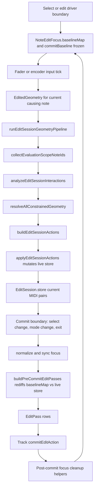
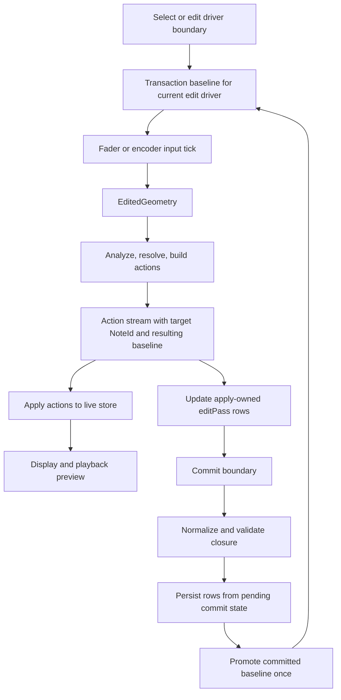

# Note edit commit stream review

**Kind:** refinement (architecture review — no behavior change in this slice)  
**Evidence:** `captures/session_20260805_134610.log`  
**OpenSpec:** `openspec/changes/edit-session-action-geometry/`  
**Status:** Review complete — diagnostics + native regression specified; single-stream refactor queued

---

## Problem statement

Live geometry and macro commit are **two derivation paths**:

| Path | Owner | Output |
|------|-------|--------|
| Live | `runEditSessionGeometryPipeline` → `applyEditSessionActions` | Mutated session store + `changedOverlapNoteIds` |
| Commit | `commitAllPendingNoteEditActions` → `buildPreCommitEditPasses` | `EditPass` rows from `baselineMap` vs live store |
| Cleanup | Post-`commitEditAction` helpers | Promote / erase `baselineMap`, `overlapNotes`, `changedOverlapNoteIds` |

Recent D19c–D19e fixes patched symptoms in the pre-commit diff and post-commit cleanup. The split ownership remains: the live action stream already states what changed, but commit rediscovers it from focus + store after normalization.

### Evidence from `session_20260805_134610.log`

At 72.041 the geometry pipeline applied:

- `ShortenNote` **noteId=87** start=192 end=239 pitch=22
- `MoveNote` **noteId=71** start=240 end=431 pitch=22

At 75.030 macro commit logged only:

```
Edit committed ChangeLength start=192 baselineEnd=479 newEnd=239
commitEditAction incoming ChangeLength note=22 start=192 baselineEnd=479 newEnd=239
```

The row ticks (192→239) match overlap **87**, but the log printed **pitch 22** and **mover commitBaseline.end 479** — not `targetNoteId`. Commit identity was unprovable from serial.

A second overlap sweep at 82.674 produced `HideNote` **noteId=87** + `MoveNote` **noteId=71**, then selection changes, but **no further `commitEditAction` line** appears in the capture. Without row-level logging we cannot tell whether commit was skipped (empty pre-commit diff) or ran with unlogged rows.

---

## Current flow



---

## Target single stream



---

## Authority decision

| Question | Decision |
|----------|----------|
| **Who owns commit intent today (code)?** | `buildPreCommitEditPasses` / `buildPreCommitBaselineLiveDiffOverlapPasses` in `NoteEditFocus.cpp`, plus mover rows from `focus.last` vs `commitBaseline`. |
| **Who should own commit intent (design)?** | `EditSessionAction` stream from `buildEditSessionActions` — same objects that mutate the live store. |
| **Interim commit source** | Keep `buildPreCommitEditPasses` until apply-owned `editPass` rows ship. Do **not** add more pre-commit diff heuristics without row-level HITL proof. |
| **Authority transition** | Phase 5.x: write apply-owned `EditPass` rows inside `applyEditSessionActions`; macro commit validates closure and persists those rows only. |

**Rationale:** `applyEditSessionActions` already writes `changedOverlapNoteIds` — partial duplication of action authority. Pre-commit rediff re-derives the same geometry from `baselineMap` vs normalized store and needs separate cleanup (D19d/D19e). A single stream removes the second derivation and the cleanup patch chain.

---

## Refactor scope decision

| Phase | Scope | Ship when |
|-------|--------|-----------|
| **A — diagnostics (this slice)** | Row-level `NOTE_EDIT pre-commit row` logging before `commitEditAction`; fix misleading `ChangeLength` logs that printed pitch instead of `targetNoteId`; native regression `test_session_134610_shortened_overlap_commit_rows`. | Now |
| **B — apply-owned editPass rows** | Append normalized `EditPass`-shaped rows in `applyEditSessionActions`; `commitAllPendingNoteEditActions` drains those rows plus mover boundary rows only. | After HITL shows row logs match action stream for overlap + mover |
| **C — retire pre-commit overlap diff** | Remove `buildPreCommitBaselineLiveDiffOverlapPasses` overlap loop; keep mover `commitBaseline` diff or fold into apply-owned rows. | After B passes native + HITL matrix |

**Explicitly out of scope for Phase A:** further `changedOverlapNoteIds` / baseline cleanup patches without serial proof from new logs.

---

## Row-level commit logging contract

Emitted under `SESSION_CAPTURE` (e.g. `teensy41-capture-serial`) immediately before `commitEditAction`:

```
NOTE_EDIT pre-commit row: idx=N source=overlap_baseline_diff|mover_focus
  targetNoteId=U action=Create|Update|Delete property=Pitch|Length|NoteRange|...
  start=S end=E pitch=P moverNoteId=M
```

| Field | Purpose |
|-------|---------|
| `targetNoteId` | Prove which note the row persists (was missing in `session_20260805_134610.log`) |
| `source` | `overlap_baseline_diff` when `targetNoteId != movingNoteId`; `mover_focus` otherwise |
| `moverNoteId` | Context for overlap rows during multi-note edit |

---

## Native regression — `session_20260805_134610.log`

**Fixture:** mover **71**, overlap **87**, pitch **22**, loop length **1536** (project default in capture).

| Step | Live geometry | Expected pre-commit rows |
|------|---------------|--------------------------|
| 1 | `ShortenNote` 87 → 192–239; `MoveNote` 71 → 240–431 | `Update/Length` **targetNoteId=87**; `Update/NoteRange` **targetNoteId=71** |
| 2 | Simulate commit: `applyCommittedOverlapUpdateToFocus` for 87 | `changedOverlapNoteIds` cleared for 87; baseline 192–239 |
| 3 | `HideNote` 87; mover unchanged | `Delete` **targetNoteId=87** |

Test: `test_session_134610_shortened_overlap_commit_rows` in `test/test_note_edit_focus/`.

---

## Files reviewed

| Module | Role in flow |
|--------|----------------|
| `RunEditSessionGeometryPipeline.cpp` | Action stream creation |
| `EditSessionActionBuilder.cpp` | `RestoreNote` / `ShortenNote` / `HideNote` / mover semantics |
| `ApplyEditSessionActions.cpp` | Live mutation + `changedOverlapNoteIds` |
| `EditManager.cpp` | `commitAllPendingNoteEditActions`, logging, post-commit cleanup |
| `NoteEditFocus.cpp` | `buildPreCommitEditPasses`, overlap diff |

---

## Next steps

1. Flash `teensy41-capture-serial` and re-run the `session_20260805_134610` scenario; confirm `NOTE_EDIT pre-commit row` lines show **targetNoteId=87** on the first shorten commit.
2. If second hide still produces zero rows at select boundary, use row logs + `noteEditFocusHasPendingBaselineMapDiff` diagnostics to locate the gap — do not patch until proven.
3. OpenSpec task **4.9** — apply-owned `editPass` rows (Phase B above).
