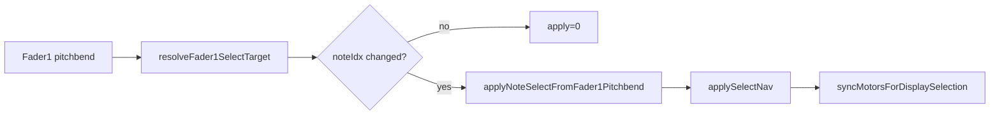

# Handoff — NOTE_EDIT fader feedback: selection-driven refresh

**Date:** 2026-07-01 (updated 2026-07-02 — Phase A HITL PASS)  
**Branch:** `load-save-sets-loops`  
**OpenSpec change:** [`openspec/changes/note-edit-fader-feedback-regression/`](../../openspec/changes/note-edit-fader-feedback-regression/)  
**Prior handoff:** [`docs/Plans/note_edit_fader_feedback_option_d_aggressive_refresh_handoff.md`](note_edit_fader_feedback_option_d_aggressive_refresh_handoff.md)  
**Phase A complete:** [`note_edit_stable_note_id_phase_a_handoff.md`](note_edit_stable_note_id_phase_a_handoff.md) — start next chat here for NoteId Phase B or fader Phase 8 RC11  
**Build env:** `teensy41-capture-serial`  
**Capture port:** `/dev/cu.usbmodem154944801`

> **2026-08 doc note:** `syncMotorsForDisplaySelection` and `drainDependentFaderOutboundUntilDone` were **removed** from `src/`. Current select motor path: `scheduleSelectDependentMotorSync` → `processDeferredFaderMotorSync` in `main.cpp` (see [`FADER_STATE_SYSTEM.md`](../Guides/FADER_STATE_SYSTEM.md) § Select-dependent motor sync).

---

## Status summary

| Milestone | Status |
|-----------|--------|
| Option D timing levers (quiet gate, stale-echo, dirty flags) | **Removed** — superseded by this refactor |
| Plan A: `sendDependentFaderFeedbackNow` on selection change | **Superseded** by Plan B |
| Pipeline for session/GPIO/length-mode F1-bracket paths | **Retained** |
| Plan B: pipeline for dependent refresh (`NoteSelectDependent`) | **Shipped** (local) |
| Plan C: restart-on-selection + delta partial plans | **Shipped** (local) |
| Sync drain after `NoteSelectDependent` apply | **Superseded** — live F1 uses `syncMotorsFromSelectTarget` |
| Nav-slot-index apply gate (`lastAppliedSelectNavSlotIndex_`) | **Shipped** (local) |
| Same-tick sibling select (`resolveNoteIdxAtSlot`) | **Shipped** (local) |
| Geometry driver F1 override | **Kind-scoped guard** (§7.24) — F1 select blocked during `isGeometryEditKind`; outbound geometry F1 motor unchanged |
| Inline motor sync on display selection index change | **Superseded** — ref-driven (`NoteRef` / `noteEditSelectionTargetChanged`) |
| Phase A NoteRef selection gates + windowed nav | **Shipped** (2026-07-02, `d3d5798`) |
| Capture verification | **PASS** — `phase_a_slow_fader_sweep_20260702_011229` — 59 slots, `select_ignored_rate=0`, sibling sync OK |

---

## Problem (capture-backed)

Slow fader-1 selection moves were swallowed because F2/F3/F4 outbound armed `selectFaderFeedbackIgnoreUntilMs_` (1500 ms) even though fader-1 motor was never moved. `shouldIgnoreFaderInput` then dropped incoming fader-1 input when `userDelta < SELECT_MOVEMENT_THRESHOLD` (100). Fast moves overrode; slow moves did not.

Layered compensations (quiet timer, dirty flags, coalesce, grace period, stale-echo lockout) added complexity without fixing the root cause.

---

## Solution

**Single rule (NoteRef-driven — 2026-07-02):** F2/F3/F4 motor sync fires when **`NoteRef` identity** changes via `EditManager::applySelectNav` (`syncMotorsForDisplaySelection`). Live F1 apply uses `shouldApplySelectionOnNoteRefChange` — not list index alone.

- NoteRef change → `apply=1` + `applyNoteSelectFromFader1Pitchbend` → `applySelectNav` → motor sync (`reason=display_note_changed`)
- Same NoteRef (inventory rebuild / index shift) → `apply=0`; no motor sync
- Empty step (bracket-only nav) → apply when bracket changes; motor sync on clear/empty-step bracket moves
- GPIO / session open → pipeline (`SessionOpen`, `NoteSelectWithFader1`) unchanged (`requestFaderSync=true`)



**Cross-talk guard:** value-based echo reject (`shouldIgnoreSelectFaderEcho`); `selectFaderFeedbackIgnoreUntilMs_` on inbound F1 after real fader-1 motor sends (`sendFader1BracketFeedback`, `sendFader1MotorTimedBurst`). Geometry motor echo guard: see [`note_edit_geometry_f1_selection_guard_bugfix.md`](note_edit_geometry_f1_selection_guard_bugfix.md) (echo window only; user F1 select allowed during geometry edit). No blanket time walls on F1 select in **Select** kind.

---

## Removed

| Item | File |
|------|------|
| `processFaderSelectQuiet`, `kFader1QuietMs`, `SelectPhase` | `NoteEditFaderOutboundPlan.h`, `NoteEditManager.cpp` |
| Dirty flags (`evaluateDependentFaderRefreshDirty`, `planForSelectDependent`, geometry snapshot) | `NoteEditManager.cpp/.h` |
| `sendDependentFaderFeedbackNow` synchronous burst (Plan A) | `NoteEditManager.cpp/.h` |
| Grace/stale-echo lockout in `applyNoteSelectFromFader1Pitchbend` | `NoteEditManager.cpp` |
| `armSelectFaderFeedbackIgnore` on F2/F3/F4 pipeline steps and `completeOutboundPipelineAtDone` tail | `NoteEditManager.cpp` |

---

## Primary files

| Area | Files |
|------|-------|
| Selection + send | [`src/NoteEditManager.cpp`](../../src/NoteEditManager.cpp) — `handleSelectFaderInput`, `requestFaderOutbound(NoteSelectDependent)`, `applyNoteSelectFromFader1Pitchbend` |
| Pipeline (F1-bracket family) | [`include/Utils/NoteEditFaderOutboundPlan.h`](../../include/Utils/NoteEditFaderOutboundPlan.h), `processFaderOutbound` |
| Tests | [`test/test_note_edit_fader_feedback/test_note_edit_fader_feedback.cpp`](../../test/test_note_edit_fader_feedback/test_note_edit_fader_feedback.cpp) |

---

## Verification gates

```bash
pio test -e native
pio run -e teensy41-capture-serial
# ask user before upload
pio run -e teensy41-capture-serial -t upload

.venv/bin/python scripts/capture_session.py --port /dev/cu.usbmodem154944801
# slow F1 sweep + note select in NOTE_EDIT
rg 'select_apply|outbound_step=' captures/<session>.log
.venv/bin/python scripts/analyze_fader2_select_feedback.py captures/<session>.log
```

**Pass criteria (outcome-based — not log-only `SEND_F*`):**

| Check | Target |
|-------|--------|
| **Dwell motor gap** | Same `select_slot idx`, F1 pitch span ≥ 200 → `MO,224,14` changes within 300 ms |
| **DNTE–motor coupling** | `DNTE` selectedIdx change → F2 or F4 MO change within 50 ms |
| **Slow F1 sweep** | `fader_select_dwell_gap_ok` = true; `select_ignored_rate` ≈ 0 (echo-only) |
| `QUIET_REFRESH` / `COALESCE` on live F1 | Absent |
| `select_apply reason=nav_slot` | When `prior_slot != slot` |
| `#DBG outbound_ctx f2 mode=SELECT_SYNC` | On inline motor sync (live F1 path) |
| Manual HITL | Slow 3-note glide — all three motors move visibly |

---

## Architecture checkpoint

| Question | Answer |
|----------|--------|
| Ownership change? | No |
| State transition change? | Yes — select path uses `NoteSelectDependent` pipeline; quiet/dirty timing removed; user approved |
