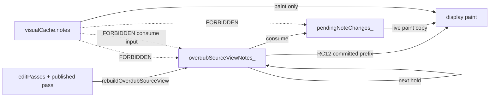

# Overdub lifecycle and representation authority

**Kind:** design / debugging artifact (not implementation spec)  
**Date:** 2026-08-17  
**Use:** trace one overdub note across a wrap; decide which representation is authoritative at each moment; spot forbidden consumer edges before patching.  
**Shipped consumer:** [`overdub_overlap_hold_display_cache_bugfix.md`](overdub_overlap_hold_display_cache_bugfix.md) — RC11 + RC12 **FROZEN**, HITL PASS [`140355`](../../captures/session_20260817_140355.log). Wrap-shaped consume: [`overdub_wrap_crossing_hold_head_consume_bugfix.md`](overdub_wrap_crossing_hold_head_consume_bugfix.md) HITL PASS [`155450`](../../captures/session_20260817_155450.log).  
**Queued successor:** [`overdub_loop_length_during_overdub_enhancement.md`](overdub_loop_length_during_overdub_enhancement.md) (length preview vs source-view length)  
**Participant-discovery successor:** [`overdub_participant_loop_content_architecture.md`](overdub_participant_loop_content_architecture.md) — notes present at tick `S` from loop content, independent of MIDI send and mute; Phase 0b done. Does not change this consume → seal → rebuild spine.

**Not this document's job:** introduce a runtime state machine, new owners, or drive refactors. It names **authority** and **allowed derivation** so RC layers stop circular fixes.

---

## The question this answers

Looper mode (`PLAYING`, `OVERDUBBING`, …) is not the hard part. The recurring bug class is:

> **What is authoritative at each point in time, and which representation is allowed to derive from it?**

Track **one overdub note** from session start through wrap *N*, into wrap *N+1*. Every RC in the occupied-lane chain is a violation of one edge in the diagrams below.

---

## Lifecycle — one note across a wrap

Each box is a **representation stage**, not a `TrackState` enum. Time flows downward; there is only one forward chain.

```text
                    OVERDUB SESSION (wrap N)
                         │
                         ▼
                 ┌─────────────────┐
                 │ SOURCE VIEW @ S │
                 │ overdubSource   │
                 │ ViewNotes_      │
                 │ authoritative   │
                 │ sounding state  │
                 └────────┬────────┘
                          │ note-on (hold start @ S)
                          ▼
                 ┌─────────────────┐
                 │ HOLD            │
                 │ overlapNoteIds  │
                 │ = sounding @ S  │
                 └────────┬────────┘
                          │ note-off
                          ▼
                 ┌────────────────────────┐
                 │ COMPLETE CONSUME SET   │
                 │                        │
                 │ hold IDs               │
                 │      +                 │
                 │ source-view overlaps   │
                 │ (same pitch, window)   │
                 │ wrap-shaped off:       │
                 │ [S, L) ∪ [0, E)        │
                 │ one hold, one Add      │
                 └───────────┬────────────┘
                             │
                             ▼
                 ┌────────────────────────┐
                 │ CONSTRAINED GEOMETRY   │
                 │ resolveConstrained     │
                 │ Geometry             │
                 │ Hide / Shorten / Add   │
                 └───────────┬────────────┘
                             │
                             ▼
                 ┌────────────────────────┐
                 │ PENDING CHANGES        │
                 │ pendingNoteChanges_    │
                 │ not yet persistent     │
                 └───────────┬────────────┘
                             │ live paint (in-bar)
                             ├──────────────────► DISPLAY (paint copy only)
                             │
                             │ wrap / stop
                             ▼
                 ┌────────────────────────┐
                 │ SEALED EDIT PASSES     │
                 │ sealPendingNoteChanges │
                 │ ToEditPasses           │
                 │ Hide / Shorten rows    │
                 └───────────┬────────────┘
                             │
                             ▼
                 ┌────────────────────────┐
                 │ PUBLISHED PREPARED     │
                 │ publishPreparedOverdub │
                 │ Pass + new capture pass│
                 └───────────┬────────────┘
                             │
                             ▼
                 ┌────────────────────────┐
                 │ REBUILT SOURCE VIEW    │
                 │ rebuildOverdubSource   │
                 │ View                   │
                 │ authoritative for      │
                 │ NEXT wrap              │
                 └───────┬─────────┬──────┘
                         │         │
                    next hold    display (RC12)
                         │         │
                         ▼         ▼
                      HOLD      DISPLAY
```

### Single forward progression (invariant spine)

Everything else is a **consumer** of one of these stages — never a parallel authority.

```text
source view
    ↓  consume (note-off)
pending changes
    ↓  seal (wrap / stop)
sealed edit passes + published pass
    ↓  rebuild
new source view
    ↓  next consume + display (after RC12)
```

**Owners (symbols, not line numbers):**

| Stage | Primary owner |
|-------|----------------|
| Source view establish | `Loop::establishOverdubSourceView` |
| Source view rebuild | `Loop::rebuildOverdubSourceView` |
| Hold IDs | capture / overlap observation → `PendingNote.overlapNoteIds` |
| Consume set + geometry | `Loop::accumulatePendingNoteChangesForIncomingNote` |
| Pending buffer | `Loop::pendingNoteChanges_` |
| Seal | `Loop::sealPendingNoteChangesToEditPasses` |
| Wrap commit | `Track::commitOverdubWrapAtSessionStart` |
| LCR publish | `LoopContentResolution::publishPreparedOverdubPass` |
| Live display paint | `Loop::applyPendingNoteChangesToDisplayNotes` → `resolveDisplayNotesLiveCapture` |
| Idle display slice | `Loop::rebuildVisualCacheIdleSlice` |

---

## Authority table — who may read whom

| Moment | Authoritative representation | Allowed consumers | Forbidden as input to consume |
|--------|------------------------------|-------------------|-------------------------------|
| Overdub enter / post-rebuild | `overdubSourceViewNotes_` | overlap hold, note-off consume, display (RC12) | `visualCache`, LCR flatten alone |
| Hold start @ S | `overdubSourceViewNotes_` + `overlapNoteIds` (sounding @ S) | hold bookkeeping only | treating IDs ≡ full source view |
| Note-off | source view + hold IDs → **complete consume set** (wrap-shaped off: `[S, L) ∪ [0, E)`, one Add) | `resolveConstrainedGeometry` → `pendingNoteChanges_` | `visualCache`, stale cache; head as a second hold |
| In-bar (before seal) | `pendingNoteChanges_` on top of source view | live paint copy (`applyPendingNoteChangesToDisplayNotes`) | persist, next hold consume |
| After wrap / stop seal | `editPasses` (companions) + committed overdub pass | LCR prepare, persistence, source rebuild | independent display reconstruct |
| After `rebuildOverdubSourceView` | `overdubSourceViewNotes_` | **next** hold, **next** consume, display (RC12) | `appendOverdubPassDisplayNotes` beside LCR picture |
| Visual cache | **derived** | OLED / LED paint, idle slice output | consume, source view fill, overlap selection |

**Hold IDs ≠ source view.** IDs answer “what was sounding at hold start S”. Source view answers “what is the current resolved geometry in the overdub window”. Consume must union both (RC11).

---

## Forbidden transitions

These edges caused RC8–RC12 regressions. If a fix implies one of these arrows, stop and re-read authority.

```text
source view ───────────────→ consume              OK
source view ───────────────→ next hold            OK
source view ───────────────→ display              OK (RC12: committed prefix from source view)

visual cache ──────────────→ consume              FORBIDDEN
visual cache ──────────────→ source view          FORBIDDEN (except historical 3b LCR-miss fallback — not overlap authority)
LCR flatten ───────────────→ independent display  FORBIDDEN (RC12: no second reconstruct after LCR slice)
hold IDs alone ─────────────→ complete consume set  FORBIDDEN when view has more overlaps (RC11)
pending paint copy ─────────→ next source view    FORBIDDEN
```



---

## Red box — wrap boundary invariant

> **`overdubSourceViewNotes_` must represent the resolved committed state that the next overdub operation will consume.**

Therefore:

```text
wrap N committed
        ↓
rebuildOverdubSourceView
        ↓
wrap N+1 MUST consume that view
```

If debugging produces the sentence *“but this other cache has the note…”*, ask:

1. Is that cache on the authority table row for this moment?
2. Is the bug before seal (consume / pending), after seal (rebuild), or display-only (derived)?

Usually the cache is **not** authoritative. Fix the stage upstream, not the derivative.

---

## Debugging — map symptom → stage

Use this before opening a new RC layer.

```text
overdub occupied lane wrong
        → complete consume set at note-off?     NO → RC11 (source-view completion)
        → Hide/Shorten in pendingNoteChanges_?  NO → consume / geometry
        → sealed companion EditPass(es)?        NO → seal path / wrap commit
        → rebuildOverdubSourceView correct?     NO → seal + LCR publish + rebuild
        → display matches rebuilt source?       NO → RC12 (derivative parity)
        → PASS
```

| Log / telemetry anchor | Stage |
|------------------------|-------|
| `merged=0` at hold, Add-only at note-off | consume set incomplete (RC11) |
| `#CAP,DIAG,overlap_hold` hide/shorten = 0 at stop | seal input empty |
| `DIAG,lcr,src,why=wrap,notes=N` | rebuilt source view |
| `slice_clean notes=N` vs LCR `notes=N+1` | display second reconstruct (RC12) |
| `DNTE` stacked same pitch | display ≠ source view |

---

## Relationship to other docs

| Doc | Relationship |
|-----|----------------|
| [`DerivedViews.md`](../Authority/Architecture/DerivedViews.md) | General play / display / analyze consumers; overdub overlap is the analyze-adjacent path on `overdubSourceViewNotes_`, not NOTE_EDIT `selectedTick` |
| [`Display.md`](../Authority/Architecture/Display.md) | Display is derivative; RC12 aligns live capture with source view instead of competing cache paths |
| [`overdub_overlap_hold_display_cache_bugfix.md`](overdub_overlap_hold_display_cache_bugfix.md) | **FROZEN** RC11/RC12 — consume completion + display from source view; HITL [`140355`](../../captures/session_20260817_140355.log) |
| [`overdub_wrap_crossing_hold_head_consume_bugfix.md`](overdub_wrap_crossing_hold_head_consume_bugfix.md) | Wrap-shaped off occupies `[S, L) ∪ [0, E)` as one hold; HITL [`155450`](../../captures/session_20260817_155450.log) |
| [`overdub_loop_length_during_overdub_enhancement.md`](overdub_loop_length_during_overdub_enhancement.md) | Queued: keep `loop.loopLengthTicks` and `overdubSourceViewLoopLengthTicks_` aligned on LOOP_EDIT length change |
| [`overdub_playback_observation_overlap_refinement.md`](overdub_playback_observation_overlap_refinement.md) | Hold ID collection; does not replace source-view authority |
| DEC-037 / LCR plans | Prepared window feeds **rebuild**, not parallel consume owner |

---

## Session usage (agents)

1. Read this diagram **before** proposing a consume or display patch on the overdub overlap path.
2. State which **stage** the fix touches and which **forbidden edge** it avoids.
3. Do not add a new representation layer to “make display easier” — extend the owner for that stage per [architecture-checkpoint](../../.cursor/rules/architecture-checkpoint-bugfix.mdc).
4. One RC per spine segment: consume (RC11) before display parity (RC12). Both shipped. Do not reopen those owners for length-during-overdub work.
