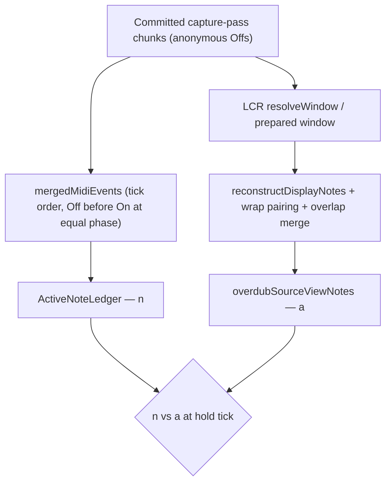

# Occupy unmatched Off vs ledger — observability before identity RC

**Status:** Observability complete. Geometry proven. Successor DEC-042 nested HITL **MET** [`095902`](../../captures/session_20260819_095902.log): [`overdub_occupy_active_note_ledger_cardinality_refinement.md`](overdub_occupy_active_note_ledger_cardinality_refinement.md). Extra-open (`n>a`) unmasked — new RC, not this file.  
**Date:** 2026-08-19  
**Kind:** investigation  
**Parent (shipped):** [`overdub_occupy_clock_same_tick_off_before_on_bugfix.md`](overdub_occupy_clock_same_tick_off_before_on_bugfix.md) — HITL **PASS** [`001021`](../../captures/session_20260819_001021.log)  
**Pin (residuals):** [`235314`](../../captures/session_20260818_235314.log) L4750 interior `192–288` @ `hs=240`; L4294 interior `240–384` @ `hs=352`  
**Does not reopen:** clock equal-phase Off before On; occupy repairing clock when `occupyPhase == lastTick`; `playMidiEvents` from occupy; folding capture into `mergedMidiEvents`. Catch-up two-pass vs stack: [`overdub_occupy_catchup_open_note_stack_bugfix.md`](overdub_occupy_catchup_open_note_stack_bugfix.md).

---

## Why this stage exists

The proposed RC assumed pitch-12 notes `144–240` and `192–288` coexist and that `Off@240` clears the continuing note, then proposed FIFO-stamping `noteId` onto paired Offs. Two problems blocked implementation:

1. **FIFO is not this repo's pairing rule** and is not a general identity resolver — rejected, see below.
2. **The assumed geometry is not proven** and does not reproduce the observed source view under the rule that actually runs — see the contradiction below.

This stage adds the missing evidence only. It changes no behavior.

---

## Invariant (one sentence)

Occupy diagnostics must record, at every ledger-vs-source-view disagreement, the committed events and derived spans that could have written the lane — so the next RC targets a proven geometry rather than an inferred one.

---

## Architecture checkpoint

| Question | Answer |
|----------|--------|
| **Ownership change?** | NO — extends the existing diagnostic block inside `Track::snapshotOverlapHoldCandidates`. No new owner, no new writer, no state mutated. |
| **State transition change?** | NO — observation only. `CommittedPlaybackLedgerCatchUp::shouldApply` bound unchanged; occupy stays a reader. |
| **Reuse** | YES — same `#if defined(SESSION_CAPTURE) && defined(ARDUINO)` emitter that already writes `DIAG,lcr,part`, and the same file-local static pattern as `logCaptureAppendDeny` in [`TrackCaptureInput.cpp`](../../src/Track/TrackCaptureInput.cpp). Reads via existing accessors (`ActiveNoteLedger::forEachActive`, `Loop::overdubSourceViewNotes`, `TrackPlaybackRuntime::mergedMidiEvents`). No new public API. |

## Debugging boundary

```
… → clock equal-phase Off before On ← trust (HITL PASS 001021)
 → USB occupy ledger catch-up (lastTick, occupyPhase] ← successor [`overdub_occupy_catchup_open_note_stack_bugfix.md`](overdub_occupy_catchup_open_note_stack_bugfix.md)
 → occupy interior mismatch geometry ← this investigation (observability complete)
 → Off identity assignment ← rejected (DEC-042)
```

Do not implement an identity fix from this file until § Results is filled from a device capture.

---

## Verified: committed Offs carry no identity, and nothing upstream created it

`MidiEvent::noteId` is documented as identity **on note-on only** ([`MidiEvent.h`](../../include/MidiEvent.h)). Every assigner is guarded on `isNoteOn()`:

- `LoopEventStore::assignMissingNoteIdsToNoteOns`
- `LoopEventStore::assignMissingNoteIdsToNoteOnsInChunkIds`
- both `Loop::assignMissingNoteIds` overloads

The playback gather does **not** lose identity — it never had it. `ensurePlaybackMergedMidiEventsBuilt` → `Loop::gatherCommittedEventsForDerivedView` → `LoopPasses::materializeToEventVector` → `LoopEventStore::appendChunkRefEvents` copies stored chunk events verbatim.

There is **no canonical NoteSpan entity in committed storage**. Spans are *derived* by `appendCanonicalSpansFromMidiRange` ([`NoteUtils.cpp`](../../src/Utils/NoteUtils.cpp)); `LoopContentResolution::StateCheckpoints::appendSpansFromNotes` builds its spans from `NoteUtils::reconstructDisplayNotes` output, so LCR is not an independent identity source either.

**Consequence:** "preserve the canonical originating `noteId` on each committed Off" has no source to preserve from for record/overdub passes. Only edit paths produce identity-bearing Offs — `ApplyEditSessionActions`, `EditSelectNoteState`, `EditSessionStoreInvariant`.

## Rejected: FIFO stamping

FIFO contradicts four existing owners. The established rule for untagged Offs is **LIFO**:

```
// Pass 2 — untagged pairs: each note-off claims the nearest preceding unpaired note-on on its
// own lane, which is the LIFO order NoteUtils::orderSamePitchNoteOffsForLifo establishes.
```
— [`LoopEventValidation.cpp`](../../src/Utils/LoopEventValidation.cpp)

Same rule in `appendCanonicalSpansFromMidiRange`, `stampNoteIdsOntoPairedNoteOffs`, `NoteUtils::orderSamePitchNoteOffsForLifo`, `findLinearOffForNoteOnLifo`, `findCorrespondingNoteOff`, `pairedNoteOnTickForOffAtIndex`. FIFO appears nowhere.

Neither FIFO nor LIFO is a general identity resolver for overlapping same-pitch notes, and the existing stamper concedes it: `stampNoteIdsOntoPairedNoteOffs` is documented "Safe only on non-overlapping same-pitch stores (canonical MIDI)" ([`NoteEditFocus.h`](../../include/NoteEditFocus.h)).

## Contradiction that blocked the RC — resolved by [`090050`](../../captures/session_20260819_090050.log)

The reasoning below is why the assumed geometry could not be trusted. § Results replaces it: the
real shape is a **nested** pair (`240–480` with `288–336` inside it), which LIFO pairs correctly.
Kept for the record; do not re-derive from it.

If the merged committed events were `On144, On192, Off240, Off288`, then the canonical span builder's LIFO rule pairs `Off240`→`On192` and `Off288`→`On144`, yielding spans `192–240` and `144–288`. The source view would then report the span covering hold 240 as `as=144,ae=288`. [`235314`](../../captures/session_20260818_235314.log) L4750 reports `as=192`:

```
#CAP,89187597,DIAG,lcr,part,why=on,from=ledger,pitch=12,n=0,a=1,b=1,eq=1,ao=0,bo=0,as=192,ae=288,hs=240,us=292
```

The two cited pitch-12 spans are also ~10 s and many wraps apart — L4369 `as=144,ae=240` at `78940598` versus L4750 `as=192,ae=288` at `89187597` — and the source view is rebuilt per wrap (`lcr,src,why=wrap`), so their coexistence in one source view is unproven.

Source-view spans in that capture carry non-grid ends (`ae=64`, `ae=376`, `ae=431`), so `a` is post-overlap-merge geometry while `n` is the ledger over raw merged committed MIDI. The mismatch may be identity, gather-window bounds, or the overlap merge reshaping spans. The diagnostic must distinguish these.



---

## Observability added

Owner: `Track::snapshotOverlapHoldCandidates` ([`TrackCaptureInput.cpp`](../../src/Track/TrackCaptureInput.cpp)), file-local static `logOccupyLedgerMismatch` under `SESSION_CAPTURE && ARDUINO`, `TRACK_COLD_MEM` so it stays in flash.

Gated on `n != a` only. Capped emission: one header line, up to 6 span lines, up to 8 event lines.

| Line | Fields |
|------|--------|
| `DIAG,lcr,mismatch` | `pitch`, `ch`, `hs`, `n`, `a`, `led` (lane active), `lid` (`Entry.noteId`), `lst` (`Entry.startTick`), `ltick` (`lastTickInLoop`), `cu` (`shouldApply` at `hs`), `win` / `wlen` / `rev` (merged gather window), `dus` (diagnostic cost) |
| `DIAG,lcr,mmspan` | `pitch`, `i`, `s`, `e`, `id`, `p` (present at hold) — every source-view span on the lane, not only the first covering one; spans covering the hold are emitted first so the cap cannot drop the counted participant |
| `DIAG,lcr,mmevt` | `pitch`, `i`, `t` (raw stored tick), `ph` (phase), `k` (`on` / `off`), `id` (`noteId`), `ech` (stored `evt.channel`) — committed events on the **pitch** within one bar of the hold |

`mmevt` matches on pitch alone, not on the track channel: the ledger keys lanes through
`remappedPlaybackChannel`, which collapses every channel message onto the track's `midiChannel`,
while stored capture events keep the channel they arrived on. `ech` records the stored channel so
that difference stays visible.

`t` and `ph` are both emitted because overdub-pass events are stored linearly and may exceed `loopLength`.

**What each outcome would mean**

- Off with `id=0` clearing a lane whose `lid` belongs to a still-present span → identity fault; the deferred identity question opens.
- No Off on the lane in `(ltick, hs]` with `cu=1` → not an Off at all; look at gather window or catch-up interval.
- Lane events absent from `mmevt` while a span covers the hold → `win` / `wlen` bounds fault, not identity.
- Span geometry in `mmspan` disagreeing with `mmevt` pairing → the overlap merge reshaped the span; `n` and `a` are comparing different representations.

---

## Verification

- `pio test -e native` — **1359/1359**, unchanged (no logic touched).
- `pio run -e teensy41-capture-serial` — links; RAM1 recorded below against baseline code 425852 / locals 4768.
- HITL base preset with the default second overdub pass (where pitch-12 overlap arises).
- `test_nested_same_pitch_note_lost_at_second_note_on_090050_pitch12` in
  [`test_playback_midi_output`](../../test/test_playback_midi_output/test_playback_midi_output.cpp)
  pins the proven geometry: it asserts the outer note's identity is gone at the **inner NoteOn**,
  before any Off, which is what eliminates option A. It replaced the earlier hypothetical
  `..._235314_l4750` test.

**Reproduce risk:** `n=0 a=1` was **0** in [`001021`](../../captures/session_20260819_001021.log), so the residual may not appear in a single run. The diagnostic is permanent and mismatch-gated, so repeated runs accumulate evidence. Also note `b=0,eq=0` on every `001021` `lcr,part` line — the prepared-span path returned false for that whole capture. That is a second observability gap; recorded here, not fixed in this stage.

---

## Results — [`090050`](../../captures/session_20260819_090050.log)

RAM1 code **425852** / locals **4768** — unchanged from baseline; the diagnostic stayed in flash.

`DIAG,lcr,part` outcomes over 105 occupies:

| `n`,`a` | Count | Reading |
|---------|------:|---------|
| `1,1` | 75 | agree |
| `0,0` | 25 | agree (empty lane) |
| `1,2` | 3 | structural, see below — not a fault |
| `0,1` | 2 | **the residual reproduced** |

`eq=1` on all 105 lines, and `b` equals `a` on every mismatch. The LCR prepared spans and the
source view agree with each other everywhere, so the disagreement is **on the ledger side** —
not the gather window and not the overlap merge. The `b=0,eq=0` gap seen in
[`001021`](../../captures/session_20260819_001021.log) did not recur.

### Proven geometry: nesting, not staggered overlap

`DIAG,lcr,mismatch` at pitch 12 (capture L6388-6391):

```
mismatch,pitch=12,ch=1,hs=336,n=0,a=1,led=0,lid=0,lst=0,ltick=336,cu=0,win=0,wlen=768,rev=177
mmspan,pitch=12,i=0,s=48,e=144,id=4817,p=0
mmspan,pitch=12,i=1,s=288,e=336,id=4814,p=0
mmspan,pitch=12,i=2,s=240,e=480,id=4819,p=1
```

The lane holds an outer note `240–480` (id 4819) and an inner note `288–336` (id 4814)
**fully nested inside it**. The hold tick 336 is the inner note's end.

This geometry **is** consistent with the LIFO rule that actually runs, unlike the geometry the
parent RC assumed. For events `On240(4819), On288(4814), Off336, Off480`,
`appendCanonicalSpansFromMidiRange` pairs `Off336`→`On288` and `Off480`→`On240`, reproducing both
observed spans exactly. **The contradiction that blocked the RC is resolved:** the real shape is
nesting, where LIFO is the correct pairing.

### Decisive: Off identity alone cannot fix this

`ActiveNoteLedger` is `std::array<Entry, 16 * 128>` — **one `Entry` per (channel, note)** — and
`noteOn` overwrites it unconditionally ([`ActiveNoteLedger.h`](../../include/ActiveNoteLedger.h)).
Walking lane (1, 12):

| Event | Lane state |
|-------|------------|
| `On@240` id 4819 | holds 4819 |
| `On@288` id 4814 | **overwritten to 4814 — 4819 is lost here** |
| `Off@336` | cleared → `led=0` |

This matches the observed `led=0, lid=0` at `hs=336`. The outer note's entry is destroyed by the
**second NoteOn**, before any Off arrives. So a guard of the form "clear only when the Off's
`noteId` matches `Entry.noteId`" would compare 4814 against 4814 at `Off@336`, match, clear, and
leave `n=0`.

**Option A as scoped does not fix the proven geometry.** Representing nested same-pitch notes
requires either more than one active entry per lane, or option B.

### `n=1 a=2` is structural — confirms the parent plan's exclusion

Pitch 24 at `hs=24` (capture L7426-7430) lists `648–71 id=4816 p=1`, `0–71 id=4816 p=1`,
`744–767 id=4822 p=0`, `0–168 id=4822 p=1`. Two distinct ids cover the hold while the single lane
entry holds `lid=4822`. The same id also appears as two display rows across the wrap (4816 as
`648–71` and `0–71`). Same one-entry-per-lane cause, expected, not a fault.

### Two diagnostic defects found and fixed

1. **`mmevt` emitted zero lines** in all five mismatches. The filter required
   `evt.channel == channel`, where `channel` is the track's `midiChannel` (1 here), but stored
   capture events keep their **input** channel (4 in this run, per the `MI` note lines). The ledger
   keys by `remappedPlaybackChannel`, which collapses every channel message onto the track channel,
   so the stored channel is not a lane key at all. Now filtered by pitch only, with the stored
   channel emitted as `ech=`.
2. **The span cap dropped the covering span.** At pitch 24 `hs=168` the part line reports
   `as=72,ae=264`, but all four logged spans were non-covering (`p=0`), so the participant being
   counted was invisible. Spans covering the hold are now emitted first, cap raised to 6.

Until `mmevt` lands, `On@240` and `On@288` are inferred from the span ids and start ticks rather
than read from the events. Closed by [`092336`](../../captures/session_20260819_092336.log) below.

---

## Results — [`092336`](../../captures/session_20260819_092336.log)

Firmware with the two diagnostic fixes (pitch-only `mmevt`, covering spans first, cap 6). `ech=4`
on every event line — stored capture channel, as predicted. `RING,overflow` 3 (was 1 on 090050);
more lines per mismatch, still mismatch-gated.

`DIAG,lcr,part` outcomes over 104 occupies:

| `n`,`a` | Count | Reading |
|---------|------:|---------|
| `1,1` | 56 | agree |
| `0,0` | 40 | agree |
| `0,1` | 4 | residual; two nested, two other shapes |
| `1,2` | 2 | structural nesting, event-backed |
| `1,0` | 2 | **new** — exclusive-end vs equal-tick On; not DEC-042 |

`b=0,eq=0` on **all 104** part lines. The prepared-span path missed this entire run (same as
[`001021`](../../captures/session_20260819_001021.log), unlike 090050). Recorded, not fixed here.

`mmevt` iterates `merged.mergedEvents` in vector order, not `playbackOrder`. Equal-tick On/Off
pairs in the log are storage order; they do not prove clock apply order.

### Nested geometry now event-backed (closes the 090050 inference)

Pitch 12 at `hs=288` (capture L4595–4609):

```
mismatch,pitch=12,ch=1,hs=288,n=0,a=1,led=0,lid=0,lst=0,ltick=288,cu=0
mmspan,pitch=12,i=0,s=96,e=336,id=5052,p=1
mmspan,pitch=12,i=3,s=144,e=192,id=5047,p=0
mmevt On@96 id=5052; On@144 id=5047; Off@192; Off@336
```

LIFO pairs `Off@192`→`On@144` and `Off@336`→`On@96`, reproducing both spans. Walk: `On@96` holds
5052; `On@144` overwrites to 5047; `Off@192` clears → `led=0`. Hold 288 is 96 ticks later, still
inside `96–336`. Same one-entry overwrite as 090050, now read from events.

Pitch 23 at `hs=288` (L3846–3860) is the same shape: `On@192 id=4996`, `On@240 id=4990`, `Off@288`
at the hold, covering span `192–336`. The outer Off is not in the 8-event cap (8th line is
`Off@288`); the inner Off at the hold is enough to prove the overwrite.

Pitch 12 at `hs=240` (L3395–3409 and L3661–3675), `n=1 a=2`: covering `240–256 id=5009` and
`160–336 id=5015`; ledger `lid=5009 lst=240`. Events `On@160 id=5015`, `On@240 id=5009`, `Off@256`.
Two spans cover the hold; the one-entry ledger holds only the inner On. Structural, as DEC-042
already states.

### Separate residuals — do not fold into DEC-042

**Abutting replacement interior.** Pitch 12 at `hs=352` (L3349–3363), `n=0 a=1`, covering
`336–432 id=4997`. Events include equal-tick `On@336 id=4997` and `Off@336` (vector On then Off)
plus `160–336 id=5015` ending at 336. Hold is 16 ticks inside the new note. `cu=0`, `ltick=352`.
No nested inner ending at 352. Cause not proven from this log: catch-up did not run, and `mmevt`
is not playback order.

**Interior with no Off at the hold.** Pitch 24 at `hs=360` (L4278–4287), `n=0 a=1`, covering
`216–408 id=5041`. Events on the lane: `On@216 id=5041`, `Off@408`, and the previous/next notes
`72–215` / `456–648`. Three spans total, none nested at 360. `cu=0`, `ltick=360`. Same shape as
parked L4294 — empty ledger inside a span with no Off in `(start, hold]`.

**`n=1 a=0` at equal-tick On.** Pitch 12 at `hs=48` twice (L3945–3958, L4749–4761). Ledger
`led=1 lid=5027 lst=48`. Source view `as=0,ae=0`. Neighbour span `0–48 id=5033` has `p=0` because
`displayNotePresentAtHold` is inclusive start, **exclusive end** (`s < linearEnd`). Events:
`On@48 id=5027` and `Off@48`. A 48–48 span is not present at 48 (`48 < 48` is false), so `a=0`
while the ledger last-wrote the On. Representation disagreement at a point, not nested
cardinality.

---

## Decision — [DEC-042](../DECISION_LOG.md#dec-042-same-pitch-active-note-identity-is-a-cardinality-problem-not-an-off-identity-problem)

**Direction accepted: C — allow more than one active entry per `(channel, pitch)`, with NoteOff
identity selecting which active note to resolve. Design session required before any code.**

- **A** (stamp Off identity, guard `applyPlaybackEvent`) — **eliminated** by the evidence above: the
  outer note is lost at the inner NoteOn, before any Off.
- **B** (ledger consults the derived canonical spans) — **rejected**: conflates "what is sounding"
  with "how source geometry is represented", and risks derived-resolution work on a hot path.
- **C** — accepted as direction. The defect is **cardinality**, not identity-on-Offs: one lane can
  carry several logically active notes, and cross-loop overdub makes that a product scenario.

**This supersedes [DEC-041](../DECISION_LOG.md#dec-041-occupy-present-at-s-jit-not-full-loop-lcr-mat)
point 9 only once implemented.** That point already states the ledger holds "at most one active
`Entry` per `(channel, pitch)`" and "does not resolve stored same-pitch overlap" — so until the
design session lands, the observed `n=0 a=1` is **expected ledger behavior**, not a regression.

**Not authorized:** turning `Entry` into a vector, or any `applyPlaybackEvent` / `noteOn` /
`noteOff` change. The architectural question to settle first is *what the authoritative identity
model is for multiple simultaneously sounding notes on one `(channel, pitch)`* — see DEC-042
§ Design session must answer. L4294 (wrap + mid-span interior) stays a separate residual.
