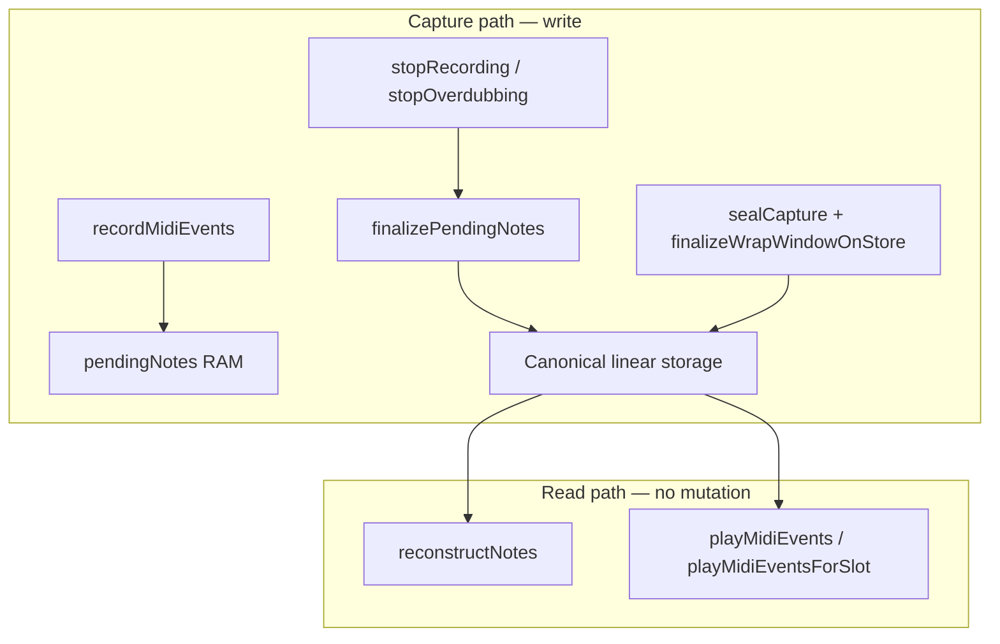

# Overdub wrap note-off capture bugfix

**Plan path (ship copy):** [`docs/Plans/overdub_wrap_note_off_capture_bugfix.md`](docs/Plans/overdub_wrap_note_off_capture_bugfix.md) — copy on implementation start.

**Review:** Architecture review suggestions incorporated (ownership invariants, incremental phases, pending lifetime tests).

---

## Evidence (reverted `bc98491` build — lag fixed, capture bug remains)

[`captures/session_20260713_125437.log`](captures/session_20260713_125437.log) after revert commit `901c4d9`:

| Check | Result |
|-------|--------|
| ch4 MO flood (lag regression) | **Fixed** — ch4 MO 698 vs 3620 bad; ~1 ms-gap events 420 vs 3422 |
| ch5 active track MO | Unchanged (289 vs 223) |
| Committed overdub pass note 12 | **8 on / 9 off** — orphan `F@2208` with no matching on |
| ch4 playback note 12 during PLAYING 35–37.5 s | Spurious bare `OFF` events (stored orphan replays) |
| Overdub #2 start | `NoteOff for note 12 on ch 4 with no matching NoteOn` — live off rejected because `pendingNotes` empty while pass-1 orphan still plays back |

User-visible symptoms share one root cause: **bad linear storage in the capture pass**, not `playMidiEventsForSlot` playback scheduling. The reverted `19aa47a` approach tried to fix symptoms in the playback hot path and reintroduced measurable wrap lag.

---

## Runtime invariants (document before coding)

These are architectural rules, not implementation details. Add to [`docs/Guides/LOOP_MIDI_STORAGE_AND_VALIDATION.md`](docs/Guides/LOOP_MIDI_STORAGE_AND_VALIDATION.md) and [`docs/Authority/Architecture/Playback.md`](docs/Authority/Architecture/Playback.md) in the docs phase.

### Invariant 1 — Playback is read-only

Playback (`Track::playMidiEvents`, `Track::playMidiEventsForSlot`) may:

- advance playback indices
- update scheduling / projection cycle state
- invalidate derived projections
- emit playback MIDI events

Playback must **never**:

- append MIDI events to capture or passes
- synthesize `NoteOff` events into storage
- remove captured `NoteOff` events
- modify `pendingNotes`
- mutate committed capture data

### Invariant 2 — Linear storage is not playback order

Example — **valid** wrapped note in loop-relative storage:

```text
NoteOff @ 20
NoteOn  @ 1900
```

Sorted event order does not imply playback order. `NoteOff@head < NoteOn@tail` in linear tick space is the canonical wrapped representation. Playback order is **derived** at emit time; storage order is **canonical**. Do not “repair” valid wrapped pairs during capture.

### Invariant 3 — Single owner for closing open notes

Exactly one pipeline closes open notes at commit boundaries:

```text
Capture (live noteOn/noteOff)
    ↓
PendingNotes (RAM — keys still held by musician)
    ↓
Stop (record / overdub)
    ↓
finalizePendingNotes (playhead closeTick)
    ↓
sealCapture → finalizeWrapWindowOnStore (still-open tail notes, same closeTick)
    ↓
Canonical storage (passes)
    ↓
reconstructNotes → DisplayNote
    ↓
Playback (read-only emit)
```

Today **three subsystems disagree** about when and where to close notes (playback wrap, live capture repair, stop/seal). The fix is **not** to synchronize them — it is to **remove** playback and repair owners so only stop + seal remain.

---

## Ownership problem (root cause)

| Owner today | Function | Violation |
|-------------|----------|-----------|
| Playback wrap | `closeOpenNotesAtLoopWrap()` from `playMidiEvents` | Appends synthetic `NoteOff@L-1` mid-pass; does not clear `pendingNotes` — breaks Invariant 1 |
| Live capture repair | `recordMidiEvents` note-off: bump + `removeCaptureNoteOffAt` | Compensates for playback synth; produces orphan offs (e.g. `F@2208`) |
| Stop | `flushPendingNotesIntoCapture` vs `finalizePendingNotes` | Different close-tick policies (overdub vs record) |
| Seal | `Loop::sealCapture` → `finalizeWrapWindowOnStore` (default `openTailCloseTick = UINT32_MAX` → L-1) | Ignores stop playhead |

**Target owners after refactor:** stop pipeline (`finalizePendingNotes`) + seal pipeline (`finalizeWrapWindowOnStore` with agreed `closeTick`). Live capture records musician input only; playback emits only.

**Out of scope:** playback wrap `double_on` ([`session_20260709_224935.log`](captures/session_20260709_224935.log)); `playMidiEventsForSlot` / `projectionCycleStartTick` changes.

---

## Canonical wrapped-note model (display authority)

**Authority:** [`src/Utils/NoteUtils.cpp`](src/Utils/NoteUtils.cpp) — `buildCanonicalSpansFromMidi` + `NoteUtils::reconstructNotes`; tests in [`test/test_noteutils_reconstruct/test_noteutils_reconstruct.cpp`](test/test_noteutils_reconstruct/test_noteutils_reconstruct.cpp).

Held across loop boundary → linear pair:

```text
NoteOn@tailTick   (e.g. 1920)
NoteOff@headTick  (e.g. 55)   ← head < tail in linear space
```

`reconstructNotes` → two display segments: `[tail … L-1]` + `[0 … head]`.

Helpers: `tryPairWrappedTailOn`, `shouldDeferLoopEndOff` (skips `off@L-1` when head off expected).

**Storage must not contain:** orphan note-offs; mid-pass synthetic offs at wrap (not this model).



---

## Pre-implementation ownership audit

Complete before Phase 2 firmware edits. Grep targets and **current capture-relevant hits** (2026-07-13):

| Symbol / pattern | Capture-relevant sites | Post-refactor role |
|------------------|------------------------|-------------------|
| `closeOpenNotesAtLoopWrap` | [`src/Track.cpp`](src/Track.cpp) — `playMidiEvents` wrap, `stopOverdubbing` in-edit | **Remove** from playback; replace in-edit stop with `finalizePendingNotes` |
| `flushPendingNotesIntoCapture` | `stopOverdubbing`, `stopOverdubbingToStopped` | **Remove** after unify on `finalizePendingNotes` |
| `finalizePendingNotes` | `stopRecording`, `stopRecordingToStopped` | **Keep** — single stop close owner |
| `removeCaptureNoteOffAt` | `recordMidiEvents` note-off branch | **Remove** (Phase 5 repair) |
| `appendCaptureEvent` / `NoteOff` synth | `closeOpenNotesAtLoopWrap`, `recordMidiEvents`, `LoopStopFinalize` | Only live input + stop/seal |
| `finalizeWrapWindowOnStore` | [`src/Loop.cpp`](src/Loop.cpp) `sealCapture`; [`src/EditManager.cpp`](src/EditManager.cpp) edit fold | **Keep** — pass `openTailCloseTick` from seal |
| `loopLength - 1` / `UINT32_MAX` close | `flushPendingNotesIntoCapture`, `stopRecording` closeRel, `LoopStopFinalize` | Unify on playhead `closeTick` |

Re-audit after each phase; any new NoteOff synthesis outside stop/seal is a blocker.

---

## Architecture gate

| Question | Answer |
|----------|--------|
| Owner module | `Track::finalizePendingNotes`, `Track::stopRecording` / `stopOverdubbing`, `Loop::sealCapture`, `Track::recordMidiEvents` (live input only) |
| Primary invariant | Playback read-only; single close pipeline; linear wrapped storage matches `buildCanonicalSpansFromMidi` |
| Ownership change? | **YES** — approved (playback loses capture mutation) |
| State transition change? | **YES** — remove mid-overdub wrap capture transition |
| Behavior-preserving? | **NO** record-stop held-note close (L-1 → playhead); **YES** playback slot scheduling |
| Reuse | Extend `finalizePendingNotes`; pass `closeTick` into `sealCapture` |
| Phase scope | Capture + stop/seal — **not** `playMidiEvents` tail replay fix |

---

## Implementation phases (incremental — safer order)

Each phase: `pio test -e native` green before next phase.

### Phase 1 — Regression tests only (no behavior change)

Create [`test/test_capture_note_off_rules/test_capture_note_off_rules.cpp`](test/test_capture_note_off_rules/test_capture_note_off_rules.cpp); register in [`platformio.ini`](platformio.ini) `[env:native]`.

**Storage / reconstruct tests** (may **fail** on current firmware — documents expected behavior):

| Test | Asserts |
|------|---------|
| `held_across_wrap_records_head_off` | on@tail + off@head → `reconstructNotes` yields 2 segments |
| `linear_storage_off_before_on_is_valid` | `NoteOff@20, NoteOn@1900` reconstructs as wrapped note — not invalid |
| `no_orphan_off_after_wrap_cycle` | Grid like note-12 HITL → equal on/off per pitch in materialized pass |
| `stop_closes_pending_at_playhead` | Open note at stop → off at `closeTick` phase |
| `seal_wrap_window_respects_close_tick` | `finalizeWrapWindowOnStore` with non-`UINT32_MAX` closeTick |

**Pending note lifetime tests** (ownership — may need test hooks or integration-style harness):

```text
start overdub → press note → wrap → keep holding → pendingNotes == 1
release note → pendingNotes == 0
commit → pendingNotes == 0
seal → pendingNotes == 0
```

Leaked `pendingNotes` after commit/seal indicates ownership bug not visible in SEVT alone.

Reuse helpers from [`test/test_noteutils_reconstruct`](test/test_noteutils_reconstruct/test_noteutils_reconstruct.cpp).

### Phase 2 — Unify stop pending-note close (playback unchanged)

**Files:** [`src/Track.cpp`](src/Track.cpp), [`include/Track.h`](include/Track.h)

| Stop path | Today | Target |
|-----------|-------|--------|
| `stopOverdubbing` / `stopOverdubbingToStopped` | `flushPendingNotesIntoCapture(closeTick)` | `finalizePendingNotes` at playhead absolute tick |
| `stopRecording` / `stopRecordingToStopped` | `finalizePendingNotes(startLoopTick + loopLength - 1)` | `finalizePendingNotes` at playhead from `currentTick` |

`closeTick` = `tickPhaseInLoop(currentTick, loop.startLoopTick, loop.loopLengthTicks)` for overdub; record uses `currentTick - loop.startLoopTick` (or equivalent phase).

**Do not** remove `closeOpenNotesAtLoopWrap` from playback yet — Phase 4.

### Phase 3 — Seal agrees with stop closeTick

**Files:** [`src/Loop.cpp`](src/Loop.cpp), [`include/Loop.h`](include/Loop.h)

- In `Loop::sealCapture(sealedAtTick)`: compute `openTailCloseTick` from `sealedAtTick` (same phase rule as stop).
- Call `LoopStopFinalize::finalizeWrapWindowOnStore(store, loopLengthTicks, openTailCloseTick)`.

Stop and seal must use the same close tick for still-open tail notes.

### Phase 4 — Remove playback mutation

**File:** [`src/Track.cpp`](src/Track.cpp)

- Delete `closeOpenNotesAtLoopWrap()` call from `playMidiEvents` wrap block (keep index reset + projection advance).
- `stopOverdubbing` in-edit: replace `closeOpenNotesAtLoopWrap()` with `finalizePendingNotes` (Phase 2 pattern).
- Deprecate or delete `closeOpenNotesAtLoopWrap` if no call sites remain.
- Update [`include/Track.h`](include/Track.h) comment.

New stop/seal pipeline is already active before playback goes read-only.

### Phase 5 — Remove repair logic

**File:** [`src/Track.cpp`](src/Track.cpp) — `recordMidiEvents` note-off branch

Remove:

- `removeCaptureNoteOffAt(channel, note, loop.loopLengthTicks - 1)`
- `tickRelative <= prior.tick → prior.tick + 1` bump

Keep:

- `wrappedHeadOff` — allow head off with `tickRelative < prior.on.tick` when key still in `pendingNotes`
- Overflow clamp `tickRelative >= loopLength` → `loopLength - 1`

Remove `flushPendingNotesIntoCapture` if Phase 2 made it unused. Consider removing `Loop::removeCaptureNoteOffAt` if no callers remain.

### Phase 6 — Docs

- [`docs/Guides/LOOP_MIDI_STORAGE_AND_VALIDATION.md`](docs/Guides/LOOP_MIDI_STORAGE_AND_VALIDATION.md) — Invariants 1–3, capture pipeline diagram, wrapped linear storage
- [`docs/Authority/Architecture/Playback.md`](docs/Authority/Architecture/Playback.md) — Invariant 1 (playback read-only)
- [`docs/Runtime/CURRENT_WORK.md`](docs/Runtime/CURRENT_WORK.md) — status on ship

---

## Verification gates

| Gate | Pass criteria |
|------|---------------|
| `pio test -e native` | All suites; Phase 1 tests pass after Phases 2–5 |
| Pending lifetime | `pendingNotes` empty after commit and seal in tests |
| Serial replay | No orphan `F@2208`-style tail; note 12 balanced in SEVT |
| ch4 playback | No bare OFF without preceding ON between overdubs |
| Lag regression | ch4 ~1 ms-gap MO stays ~278–420, not 3000+ |
| HITL (user) | Base preset, 2 overdubs + wrap; undo/redo unchanged |

**Non-goals:** playback wrap `double_on`; slot `projectionCycleStartTick` changes; stop FSM reorder beyond close-tick unification.

---

## Risk notes

- **Record-stop close tick** (L-1 → playhead): intentional; verify `computeRecordStopLengthTicks` + partial-bar records.
- **Spanning notes during live overdub** after Phase 4: tail may sound across wrap until musician releases — pre-`19aa47a` behavior; playback-only tail fix is a separate plan.
- **Phase 1 failing tests:** expected until Phases 2–5 land; do not “fix” tests to match broken behavior.

---

## Confidence

This plan addresses **ownership** rather than playback symptoms. Incremental phases (tests → stop → seal → remove playback mutation → remove repair) keep each step independently verifiable and reduce risk of reintroducing wrap lag.
