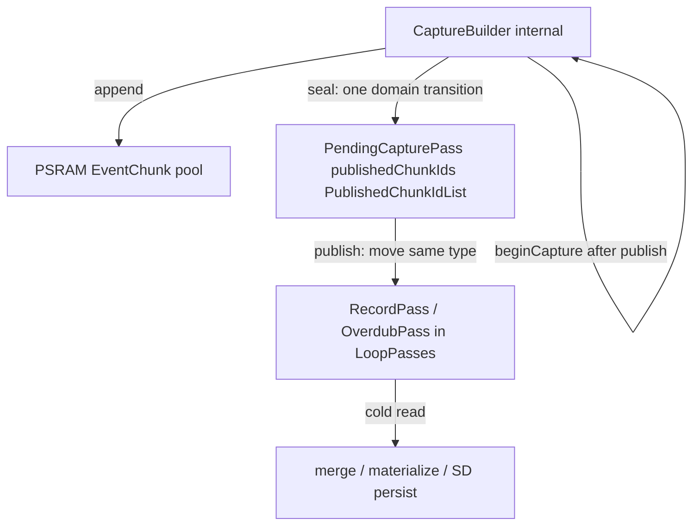

# Published pass / capture builder split — refinement

**Kind:** refinement  
**Date:** 2026-07-15  
**Branch:** `feature/memory-pressure-reclaim` (or follow-on)  
**Parent:** [`memory_pressure_reclaim_refinement.md`](memory_pressure_reclaim_refinement.md)  
**Supersedes approach:** Phase 2A typedef swaps ([`memory_pressure_phase2_pass_metadata_extmem_refinement.md`](memory_pressure_phase2_pass_metadata_extmem_refinement.md) — **reverted**)  
**OpenSpec:** [`runtime-derived-representation-heap`](../../openspec/changes/runtime-derived-representation-heap/)  
**Guides:** [`INTERNAL_HEAP_AND_EXTERNAL_MEMORY.md`](../Guides/INTERNAL_HEAP_AND_EXTERNAL_MEMORY.md), [`LOOP_MIDI_STORAGE_AND_VALIDATION.md`](../Guides/LOOP_MIDI_STORAGE_AND_VALIDATION.md)

---

## Problem

Long multi-track capture grows **internal-heap pass metadata** independently of PSRAM chunk payload:

| Consumer | Scales with | Allocator today |
|----------|-------------|-----------------|
| `OverdubPassVec` | Overdub count per slot | `InternalHeapFirstAllocator` |
| `ChunkIdList` on each published pass | Chunks per pass | Internal (via shared typedef) |
| `LoopEventStore::chunkIds_` / `barFirstIndices_` on **active capture** | Append hot path | Internal (must stay) |

Chunk **bodies** are already in the PSRAM pool. Phase 2A failed because a **single** `ChunkIdList` typedef moved **both** published refs and active capture refs to extmem-first — violating the hot-path rule and causing `abort()` on dual exhaustion ([`memory_pressure_reclaim_conclusions_refinement.md`](memory_pressure_reclaim_conclusions_refinement.md)).

**Out of scope (this plan):** `EditPassVec`, `EditPassIdList`, `VisualBarVec` — split-tier 2A showed NOTE_EDIT sluggishness; defer unless capture-only gate passes first.

---

## Design intent

This change is primarily an **ownership refactor**, not a memory optimization.

The objective is to permanently separate **mutable capture-builder state** from **immutable published pass state** so they can evolve independently.

Internal heap reduction is an **expected secondary benefit**, not the primary success criterion. Establishing this ownership boundary enables future cold metadata migrations without risking the capture hot path.

The expected memory benefit is **incremental rather than transformational**. The architectural boundary is valuable regardless of eventual RAM savings because it simplifies future ownership decisions and enables additional cold-data migrations without repeating the Phase 2A typedef mistake.

---

## Architectural invariants

These are **normative** for this change and future capture/storage work.

| Invariant | Rule |
|-----------|------|
| **Capture is mutable and latency-sensitive** | Append, bar-index maintenance, and tail-chunk growth use **capture types** on the **internal heap** only. |
| **Published passes are immutable and storage-oriented** | Sealed chunk ids on committed passes use **published types** in the **external memory pool**. No append, no in-place mutation. |
| **Type system reflects the distinction** | Capture and published chunk-id containers are **different typedefs**; the compiler must reject cross-domain use without an explicit cold-path transfer. |
| **Capture append: zero allocator-domain transitions** | `appendCaptureEvent` → `CaptureBuilder` → PSRAM chunk pool. No extmem metadata alloc per event. |
| **Published pass creation: at most one allocator-domain transition** | Internal capture chunk ids → published chunk ids **once**, on the stop path (at **seal**, see below). Publish into `LoopPasses` is a **move** within the published domain (no second transition). |
| **No published → capture conversion** | Published chunk ids **never** flow back into capture types except when **intentionally starting a new capture session** (empty builder; new internal store). Undo disable, reclaim, SD load, and clone paths stay in the published domain or release refs — no repatriation into `CaptureChunkIdList`. |

**Prose names (no new class required in Phase 1):**

- **CaptureBuilder** — `Capture.store` (`LoopEventStore` with capture chunk ids). Mutable pre-commit writer.
- **Published pass row** — `RecordPass` / `OverdubPass` in `LoopPasses` after commit.

---

## Design north star

> **Never share one chunk-id list typedef between CaptureBuilder and published passes.**

### Target stop path (preferred)



**Seal** performs the **only** internal→published chunk-id transition.  
**Publish** assigns metadata (`PassId`, `mergeSequence`, …) and moves `PublishedChunkIdList` into `LoopPasses` — **no allocator-domain change**.

### Not this (rejected for this plan)

```text
CaptureBuilder → Pending(CaptureChunkIdList) → transfer → PublishedChunkIdList → publish
```

A pending row holding **capture** chunk ids forces a **second** domain transition at publish and keeps sealed data on the internal heap between seal and publish.

---

## Naming (approved direction)

Stay close to existing `ChunkIdList` vocabulary:

| Type | Typedef | Allocator | Used by |
|------|---------|-----------|---------|
| **`CaptureChunkIdList`** | `std::vector<uint16_t, InternalHeapFirstAllocator<uint16_t>>` | Internal | `LoopEventStore::chunkIds_` (CaptureBuilder only) |
| **`PublishedChunkIdList`** | `std::vector<uint16_t, ExternalMemoryFirstAllocator<uint16_t>>` | External memory pool | `RecordPass`, `OverdubPass`, `PendingCapturePass`, SD rows |
| **`PublishedOverdubPassVec`** | `std::vector<OverdubPass, ExternalMemoryFirstAllocator<OverdubPass>>` | External memory pool | `LoopPasses::overdubPasses` |

**Field / prose aliases:** members may be named `captureChunkIds` / `publishedChunkIds`; singular **CaptureChunkId** / **PublishedChunkId** remain `uint16_t` chunk pool indices (unchanged).

**Deprecate:** monolithic `ChunkIdList` typedef — replace with capture vs published types at call sites.

**Bar indices:** `LoopEventStore::barFirstIndices_` stays internal (`CaptureBarIndexVec` rename optional for clarity).

---

## Role of `PendingCapturePass`

`PendingCapturePass` is **not** a second capture builder. It is a **recoverable commit staging** slot between seal and publish.

| Property | Role |
|----------|------|
| **When set** | After successful `sealCapture`, before `publishPendingCapturePass` returns |
| **Chunk ids** | **`PublishedChunkIdList`** — sealed, immutable, external memory pool (same representation as committed passes) |
| **Mutability** | Metadata only (`PassId`, phase, `mergeSequence`, `sealedAtTick`); **no** MIDI append |
| **Append gate** | `hasPendingCapturePass()` blocks `appendCaptureEvent` (existing guard) |
| **Discard** | `discardPendingCapturePass` releases published chunk refs without adding a row to `LoopPasses` (edit cancel, load adopt, publish failure cleanup) |
| **Lifetime** | Usually **same stop call** as publish (`commitCapturePass`); may persist briefly if publish fails or tests call seal/publish separately |

**Design decision (this plan):** `PendingCapturePass` adopts the **published** chunk-id representation **at seal**, not at publish. That satisfies the single-transition invariant and matches the preferred flow above.

**Not a role:** holding mutable capture state, accepting append, or staging internal `CaptureChunkIdList` for later conversion.

---

## Lifecycle (semantics preserved)

1. **Capture** — `Loop::appendCaptureEvent` → `CaptureBuilder.append` only; **zero** domain transitions.
2. **Seal** — detach internal ids → **`transferCaptureChunkIdsToPublished`** → `pendingCapturePass_.publishedChunkIds`; seal chunks in pool; set `hasPendingCapturePass_`.
3. **Publish** — move `publishedChunkIds` into `RecordPass` / `OverdubPass`; clear pending; `CaptureBuilder.clear()`; begin next session on next `beginCapture`.
4. **Overdub** — published rows remain immutable; new events go only through a fresh CaptureBuilder.

---

## What stays internal (non-negotiable)

Per [`INTERNAL_HEAP_AND_EXTERNAL_MEMORY.md`](../Guides/INTERNAL_HEAP_AND_EXTERNAL_MEMORY.md):

- `LoopEventStore::chunkIds_` → **`CaptureChunkIdList`**
- `LoopEventStore::barFirstIndices_` → internal allocator
- All capture append / bar-index / tail-chunk paths

---

## Phase 0 — Design gate (doc-only) — **COMPLETE 2026-07-15**

**Deliverables**

- [x] Type naming direction (`CaptureChunkIdList`, `PublishedChunkIdList`, `PublishedOverdubPassVec`)
- [x] Pending role: published representation at seal
- [x] OpenSpec delta [`specs/published-capture-pass-split/spec.md`](../../openspec/changes/runtime-derived-representation-heap/specs/published-capture-pass-split/spec.md)
- [x] [`ARCHITECTURE-REVIEW.md`](../../openspec/changes/runtime-derived-representation-heap/ARCHITECTURE-REVIEW.md) M7 phase gates
- [x] Design § M7 + tasks § M7 in `runtime-derived-representation-heap`

**Architecture checkpoint**

| Question | Answer |
|----------|--------|
| Ownership change? | **NO** — same owners (`Loop` seal/publish, `LoopPasses` storage) |
| Transition change? | **Minimal** — domain transition moves from publish to **seal**; pending holds published type |
| Hot path touched? | **NO** — capture append unchanged |
| Invariants | See § Architectural invariants |

---

## Phase 1 — Type split + seal transfer

**Files (primary)**

| File | Change |
|------|--------|
| `include/LoopEventStore.h` | `CaptureChunkIdList`, `PublishedChunkIdList`; capture-only vs published-only `appendChunkRefEvents` overloads |
| `include/LoopPasses.h` | `PendingCapturePass.publishedChunkIds` (`PublishedChunkIdList`); `RecordPass` / `OverdubPass` same; rename member from `chunkRefs` where helpful |
| `src/LoopEventStore.cpp` | `detachChunksTo(CaptureChunkIdList&)`; **`transferCaptureChunkIdsToPublished(PublishedChunkIdList& dest, CaptureChunkIdList& src)`** — sole internal→published transition |
| `src/Loop.cpp` | `sealCapture` → transfer to pending published list; `publishPendingCapturePass` → move within published domain; `discardPendingCapturePass` releases published refs |

**Transfer helper contract**

- Invoked **only** from `sealCapture` (and SD load if ever constructing published ids from wire — direct to published, not via capture).
- On extmem failure: seal returns `SealOutcome::FailedValidation` or dedicated pool outcome; **no** `abort()` on stop path.
- Retains chunk ref counts (`retainChunkReference` / `releaseChunkRefs`).

**Transfer helper invariant**

Converting `CaptureChunkIdList` → `PublishedChunkIdList` performs **at most**:

- one allocation,
- one linear copy of chunk ids,
- and **no** intermediate temporary vectors.

Implementations that repeatedly allocate or copy during seal should be rejected in review. (The plan does not prescribe a specific API shape beyond this bound.)

**Native tests**

| Suite | Assert |
|-------|--------|
| `test_loop_event_store` | Transfer preserves ids; capture list empty after transfer |
| `test_loop_take_survival` | Seal → pending published → publish |
| `test_loop_size_probe` | Sizes of new typedefs |

**Gate:** `pio test -e native` green.

---

## Phase 2 — `PublishedOverdubPassVec` + call-site pass

Migrate `LoopPasses::overdubPasses` to **`PublishedOverdubPassVec`**. Fix compile errors across cold-path iteration sites.

| Area | Functions / files |
|------|-------------------|
| Merge / materialize | `LoopPasses.cpp` |
| Loop lifecycle | `Loop.cpp` |
| Track | `Track.cpp` |
| Persistence | `StorageLoopIo.cpp`, `WorkspaceSave.cpp`, `RevisionCommit.cpp`, `PersistenceSyncDrainBudget.cpp` |
| Reclaim | `PassReclaim.cpp` |
| Tests | `test_edit_apply`, `test_note_edit_session_undo`, `test_sd_load_adopt`, … |

**Gate:** `pio test -e native`; compile `teensy41-capture-serial`.

**Future only (not this iteration):** sorted overdub index cache or other merge micro-optimizations — **only if profiling after ship shows regression**.

---

## Phase 3 — SD load / snapshot / undo alignment

| Path | Rule |
|------|------|
| `StorageLoopIo` | Read/write `PublishedChunkIdList`; no format bump if wire layout unchanged |
| `deepClonePasses` / undo | Clone **published → published**; no round-trip through CaptureBuilder |
| `adoptPersistedSnapshot` | Loaded passes use published types directly |
| `reclaimDisabledCapturePass` | Release `PublishedChunkIdList`; free pool chunks when unreferenced |
| **Forbidden** | `PublishedChunkIdList` → `CaptureChunkIdList` except new empty capture session |

**Gate:** `test_storage_loop_io`, `test_sd_load_adopt`, `test_global_undo_slot_scope`, `test_loop_take_survival`.

---

## Phase 4 — HITL manual gates

Run with **`teensy41-capture-serial`** after user upload confirmation.

| Gate | Pass criteria |
|------|----------------|
| **Baseline** | `host_midi_hitl.py run --preset base` |
| **Long capture** | 215312 profile — 0× append failed; overdub stop publishes; no reboot on stop |
| **Persistence** | `LoopPersist,done,ok` + `SAVE,completed`; reboot restores correct slot |
| **NOTE_EDIT smoke** | No sluggishness vs baseline |
| **Telemetry** | `AllocatorFailure=0`; no extmem FATAL |
| **Exit measurement** | Record heap at overdub publish + session end for § Exit criteria comparison vs pre-change 215312 baseline |

---

## Phase 5 — Docs + OpenSpec archive

- Update [`memory_pressure_reclaim_conclusions_refinement.md`](memory_pressure_reclaim_conclusions_refinement.md)
- Update [`INTERNAL_HEAP_AND_EXTERNAL_MEMORY.md`](../Guides/INTERNAL_HEAP_AND_EXTERNAL_MEMORY.md) — invariants + typedefs
- Parent plan: `phase-2d-published-pass-split`
- `/opsx:sync` + archive when gates pass

---

## Expected internal-heap impact (estimate)

Gains are **modest per pass** (chunk-id vectors and overdub row storage); cumulative effect scales with overdub count and session length. Do **not** expect this change alone to recover large amounts of RAM.

| Item | Effect |
|------|--------|
| Per overdub | `OverdubPass` row + `PublishedChunkIdList` → extmem |
| Pending at seal | Sealed ids off internal heap **immediately** (not waiting for publish) |
| `OverdubPassVec` realloc | Extmem during long sessions |
| **Not moved** | Active CaptureBuilder lists, `EditPassVec`, RAM1 pool metadata |

### Success metrics

**Primary (ownership)**

- Published pass metadata no longer contributes to **long-lived internal-heap ownership**.
- Capture append path uses **capture types only**; published types appear only on cold paths (verified by tests + HITL).
- 0 new append failures; stop path completes (215312 profile).

**Secondary (memory)**

- Internal heap floor improves measurably during long overdub sessions.
- Even a modest improvement (for example a few KiB) counts as success **because the ownership boundary enables future cold-data migrations**, not because KiB alone justify the refactor.

**Behavioral (unchanged)**

- Baseline HITL transitions, persistence restore, NOTE_EDIT smoke — no regression.

---

## Exit criteria for this migration

Not every ownership cleanup produces meaningful RAM savings. After Phase 1 + Phase 4 HITL (215312 workload), evaluate:

If **both** are true:

- published metadata migration recovers **less than ~5 KiB** of internal heap under the 215312 workload, **and**
- long-session memory pressure is **not** measurably improved,

then **no further published-metadata migration work** should be pursued on this track. The architectural split (Phase 1 typedefs + invariants) still ships; Phase 2–3 (`PublishedOverdubPassVec` call-site pass) may be **scoped down or stopped** if measurement shows diminishing returns before merge.

Future optimization effort should instead target larger consumers, for example:

- LoopPool placement (Phase 2B — shipped)
- Allocator fragmentation / high-water break behavior
- Persistence state and deferred-save backlog
- Fixed per-loop metadata outside published chunk ids
- Other long-lived internal allocations

Document the measurement method (compare pre/post `#CAP` heap at overdub publish and session end; same capture script as 215312) in Phase 4 session notes.

---

## Risks and mitigations

| Risk | Mitigation |
|------|------------|
| Extmem `abort()` on seal | Graceful seal failure; never extmem on append path |
| PSRAM latency on merge | Merge is cold; HITL timing gate |
| Type / clone bugs | Published-only clone; compiler separation of typedefs |
| Accidental published→capture | Invariant + code review; no `adoptChunkIds` from published into builder |

---

## Explicit non-goals

- `EditPassVec` / `EditPassIdList` extmem (004415 UX cost)
- Merge sorted-index cache (future profiling only)
- Chunk pool layout changes
- Full flatten on stop
- New top-level manager
- Global softening of `ExternalMemoryFirstAllocator` FATAL

---

## Pre-implementation review

### Resolved

| Topic | Decision |
|-------|----------|
| Naming | **`CaptureChunkIdList`**, **`PublishedChunkIdList`**, **`PublishedOverdubPassVec`** |
| CaptureBuilder | Prose/architectural name for `Capture.store`; no new class in Phase 1 |
| Pending role | **Recoverable commit staging** with **`PublishedChunkIdList` at seal** |
| Domain transitions | **One** at seal; **zero** on append; **no** published→capture |
| Phase 2b merge cache | **Removed** from this iteration |
| Primary goal | **Ownership refactor first**; memory gain secondary (see § Design intent) |

### Open before coding

1. Publish-time extmem failure telemetry: extend `SealOutcome` vs reuse `PoolExhausted` (implementer pin-down).

### Proceed?

- **YES** — Phase 1 ready to implement.

---

## Suggested PR order

1. **PR1 — Phase 1:** Typedefs + seal transfer + pending/publish move + native tests.
2. **PR2 — Phase 2–3:** `PublishedOverdubPassVec` + SD/undo/clone alignment.
3. **PR3 — Phase 4–5:** HITL + docs/OpenSpec.

Do **not** land Phase 2 before Phase 1 proves append never touches `PublishedChunkIdList`.

---

## Overall assessment

This plan is **stronger than the earlier allocator-typedef approach** (Phase 2A) because it:

- defines a clear **ownership model** (CaptureBuilder vs published pass rows)
- uses **compiler-enforced separation** between capture and published domains
- **isolates the hot path** (zero domain transitions on append)
- documents an **explicit lifecycle** (seal → pending → publish)
- allows **incremental rollout** (Phase 1 ownership split before vector migration)
- includes a **comprehensive testing strategy** and an **exit criterion** to avoid over-investing in low-yield RAM work

Treat RAM savings as a welcome side effect. The boundary itself is the deliverable that future contributors need.
