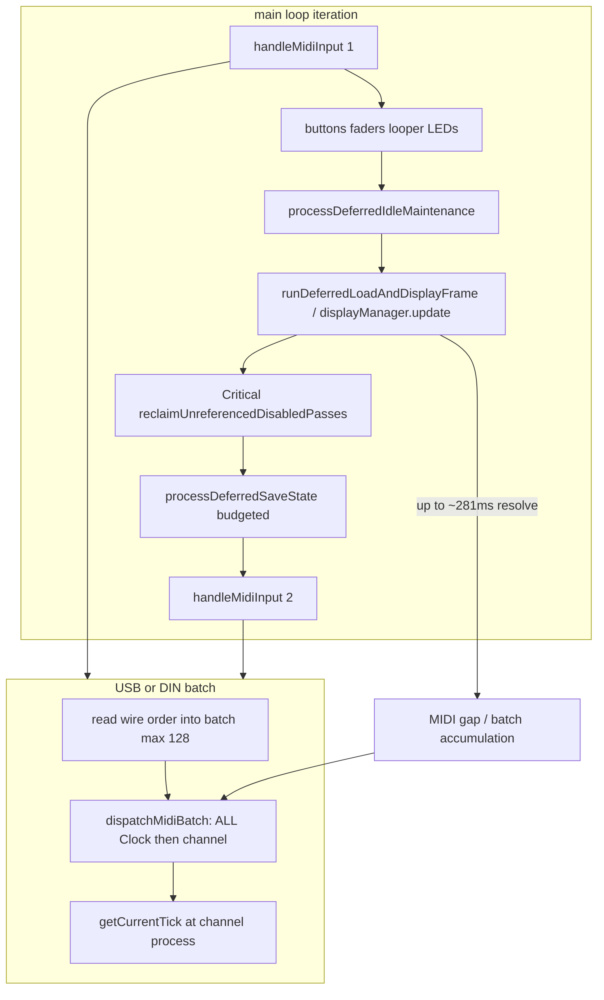

# Real-time incremental work during long RECORD / OVERDUB — architecture investigation

**Status:** RC-C A/B/C **shipped**; HITL [`115913`](../../captures/session_20260812_115913.log) timing PASS / display FAIL; dual-slice follow-up **regressed** timing [`122003`](../../captures/session_20260812_122003.log) — reverted to alternating single idle slice  
**Date:** 2026-08-12  
**Trigger evidence:** [`session_20260812_104104.log`](../../captures/session_20260812_104104.log)  
**Post-RC-C evidence:** [`session_20260812_115913.log`](../../captures/session_20260812_115913.log) (timing OK, display gaps) · [`session_20260812_122003.log`](../../captures/session_20260812_122003.log) (MIDI lag / clock lost after dual-slice follow-up)  
**Related:** [`long_record_onset_display_freeze_bugfix.md`](long_record_onset_display_freeze_bugfix.md) (RC-A shipped; RC-C promoted), Stage 5 persistence [`long_overdub_stage5_memory_persistence_bugfix.md`](long_overdub_stage5_memory_persistence_bugfix.md), scheduling admission follow-on [`runtime_scheduling_admission_model_architecture.md`](runtime_scheduling_admission_model_architecture.md)  
**Review amendments:** earlier review + **final review** incorporated — no further RC-C broadening required

---

## Objective

Make **long RECORD and OVERDUB timing-safe regardless of loop length**.

Loop length may increase total stored events, background work, and dirty regions — it must **not** increase the **maximum real-time blocking interval** of one main-loop scheduling slice.

This is **not** only a display bug. Display stalls (≈281–317 ms in `104104`) accumulate MIDI batches and expose incorrect tick assignment when Clocks are dispatched ahead of channel messages. The architectural goal is a shared **timing-critical capture** contract covering MIDI, display, persistence, and derived-state construction.

**HITL:** keep ≈100-bar RECORD + two OVERDUB as the primary long-loop regression. **Do not** add a 999-bar HITL test. Purpose: prove that increasing loop length does not cause synchronous operations to scale with the complete loop — not to prove 999 bars can be recorded.

---

## Architectural contract (concluding principle)

> **Long RECORD and OVERDUB are not allowed to accumulate loop-sized work and then catch up synchronously.**
>
> Display, persistence, derived-state construction, and maintenance must continuously make bounded progress while MIDI timing remains highest priority.
>
> Existing valid derived state should be reused. New work should be represented as bounded incremental work and processed across multiple scheduling opportunities.
>
> Loop length may increase total work and completion time, but must not increase the maximum real-time blocking interval.

This is the contract RC-C begins to enforce.

### Work-quantum principle

> **The amount of work performed in one scheduling slice must depend on the configured work quantum, not on total loop length.**

### Capture-critical predicate (conceptual)

Conceptually:

```text
timingCriticalCaptureActive =
    any track isRecording()
    || any track isOverdubbing()
```

This is a **scheduling/policy distinction**, not a requirement to introduce a new helper with exactly this name.

- Reuse existing helpers where semantics already match (`isRecording()` / `isOverdubbing()` / `isCaptureActiveForPersistence()` / local `captureActive` checks).
- Do **not** introduce a new helper solely for naming if an existing predicate expresses the same contract.
- Do **not** broaden existing `timingCriticalTrackActive` merely to avoid documenting the capture-specific distinction.

```text
timing-critical capture          timingCriticalTrackActive
  RECORD                           RECORD
  OVERDUB                          OVERDUB
      ↓                            PLAYING
  capture-specific                     ↓
    full-rebuild prohibition       broader runtime / memory /
    display policy                   flush policies
    persistence policy
```

This prevents implementations from accidentally applying capture-only restrictions to ordinary PLAYING.

---

## Work-proportionality classification

| Operation | Current behaviour | Desired behaviour |
|-----------|-------------------|-------------------|
| New capture event → display | O(delta) | **O(delta)** |
| Overdub → committed display | O(loop) ❌ | **O(delta/window)** |
| OLED visible roll | O(all notes) | **O(visible/window)** |
| Overview | O(loop) ❌ | **cached / incremental / deferred** |
| Mid-pass persistence | O(chunk) | **O(chunk), bounded** |
| STOP persistence | Current stop path is cooperative; remaining tail should stay bounded | Small bounded remaining tail; no loop-sized catch-up |
| MIDI dispatch | O(batch) | **O(batch), Clock/channel FIFO** |
| Critical reclaim | potentially O(all passes) | **bounded slices** |

Use this table during implementation review.

### Implementation review rule (north star)

> **The amount of work performed in one scheduling slice must depend on the configured work quantum, not on total loop length.**

Therefore:

- 10 bars may require less total work than 100 bars.
- 100 bars may require less total work than 999 bars.
- But the **maximum real-time work** in one timing-critical scheduling slice must remain **bounded**.

That is the property the ≈100-bar HITL regression is intended to expose and verify. **No 999-bar HITL test is required.**

Before accepting any implementation, ask:

> **"If the loop grows from 10 bars to 100 bars to 999 bars, does the maximum amount of work done in one timing-critical scheduling slice remain bounded?"**

If no, the architectural requirement is not met — even if the ≈100-bar HITL happens to pass.

---

## 1. Current-state timing map



| Stage | Owner | Typical class | Notes |
|-------|--------|---------------|-------|
| MIDI poll ×2 | `MidiHandler::handleMidiInput` | RT | Only two service points per `loop()` |
| USB/DIN dispatch | `dispatchMidiBatch` | RT (reorders) | Clock treated as transport |
| USB Host | callbacks on `read()` | RT, wire-ordered | No batch reorder |
| Clock advance | `ClockManager::onMidiClockPulse` → `TrackManager::updateAllTracks` | RT / Incremental | Stamp source for capture |
| Note capture | `Track::recordMidiEvents` | RT / Incremental | Tick from process time, not wire time |
| Display | `DisplayManager::update` → `resolveDisplayNotesLiveCapture` | **Violation when full rebuild** | 30 ms cadence ≠ compute budget |
| Idle visual slice | `Loop::rebuildVisualCacheIdleSlice` | Windowed / Deferred | OVERDUB/PLAYING; skipped during RECORD — **preferred pattern to extend** |
| Mid-pass persist | `stepMidPassChunkPersist` | Incremental | ~300 µs budget during capture |
| Work-item persist | `stepPersistenceWorkItem` | Incremental / Deferred | Can compete with mid-pass |
| SyncDrain | `drainPersistenceWorkBlocking` | Full blocking | Clear / SavedSet only — **not** normal STOP |
| Normal STOP | admit + deferred save | Cooperative | Must not regress to loop-sized SyncDrain catch-up |
| Critical reclaim | `reclaimUnreferencedDisabledPasses` | **Remaining violation** if unbounded | Runs mid-transport under Critical |

**Display cadence vs budget:** `LCD::DISPLAY_UPDATE_INTERVAL = 30 ms` schedules paint **opportunities**. `Diagnostics::kDisplayResolveBudgetMicros = 5000` is **measured only** — over-budget work still completes. Cadence must stay independent of reconstruction completion.

---

## 2. Violation inventory

Classification legend: **RT-safe** | **Incremental** | **Windowed** | **Deferred** | **Full rebuild** (architectural violation if reachable during RECORD/OVERDUB).

### MIDI

| Finding | Class | Complexity | Trigger | Already incremental? |
|---------|-------|------------|---------|----------------------|
| `dispatchMidiBatch` Clock-before-notes | **Ordering bug** (RT path) | O(batch) | USB/DIN poll | N/A — reorder intentional for Start but wrong for Clock |
| `kMidiInputBatchMax` = 128 | RT drain | Cap can be hit | Long gaps + clock flood | Host logs on cap; USB/DIN silent |
| Extra MIDI drain | Safety only | — | After display/save | Exists as second poll; **not** a substitute for bounding work |

**RC-C case:** wire `Clock, NoteOn, Clock` → dispatch `Clock, Clock, NoteOn` → note stamps tick after **both** advances (`MidiHandler::handleMidiMessage` → `getCurrentTick()`).

### Display

| Finding | Class | Complexity | Trigger | Notes |
|---------|-------|------------|---------|-------|
| `rebuildCommittedLayer` → `rebuildDisplayNotesInWindow(0, liveLoopLength)` | **Full rebuild** | O(E_committed + N_notes) | OVERDUB + `visualCacheDirty` + long loop | **Primary 281 ms spike** (`104104`); also invalid if it finished in 8 ms |
| `ensureVisualCacheBuilt` on hot path | **Full rebuild** | O(E_all) | OVERDUB dirty **≤16 bars** | Same class — “fast” full rebuild still forbidden |
| `replaceCaptureLayer` | Full capture suffix copy | O(N_committed + N_preview) | After committed rebuild / invalid sync | |
| `synchronizeCaptureLayer` | **Incremental** | O(Δ) | Capture revision | Prefer this |
| `applyCapturePlayheadTails` | **Incremental** | O(open notes) | Every live frame | ≤1 ms in `104104` |
| `drawPianoRoll` filter + overview | Full scan → windowed draw | O(N_frame) / O(N_overview) | Every paint | Soft violation; overview especially |
| `rebuildVisualCacheIdleSlice` | **Windowed** / Deferred / **resumable** | Bars per slice | OVERDUB/PLAYING idle maint | Investigate/extend **before** new display-job abstraction |
| Budget check | Measured only | — | After resolve | Bailout ≠ architecture; must not fall back to full rebuild |

**RECORD:** committed layer cleared (no full gather). Capture grows via preview sync. Paint still **O(N)** over growing `liveDisplayNotes` + overview.

**OVERDUB (first-class violation):**

```text
existing large derived state + small overdub mutation
  → large reconstruction (O(loop))   ❌
```

Required: work **proportional to affected delta/window**, not to complete pre-existing loop length.

### Persistence

| Finding | Class | During capture? | Notes |
|---------|-------|-----------------|-------|
| Mid-pass `.sealj` | **Incremental** | Yes | One sealed chunk / slice; Phase 3–4 shipped — **not a redesign** |
| Work-item LoopPersist | Incremental | Yes if queued | May defer mid-pass |
| Edit autosave | Deferred | No | Correct |
| Workspace footer | Deferred | No while capture | Correct |
| SyncDrain | Full blocking | Clear / SavedSet | **Not** the normal STOP path |
| Normal STOP | Cooperative admit | RECORD/OVERDUB stop | `admitLoopSlotPersist` + `requestDeferredSaveState` — budgeted slices |
| `shouldDeferHeavyDisplayRebuild` | Couples OLED to work-item pending | — | Does **not** include mid-pass queue |

**STOP — current vs target (do not conflate):**

| | Fact |
|--|------|
| **Current** | `drainPersistenceWorkBlocking` / SyncDrain is used for **Clear / SavedSet**. Normal STOP is **cooperative**. |
| **Target invariant** | STOP must **not become** a point where accumulated recording/persistence work is synchronously processed as a **loop-sized catch-up**. Progressive mid-pass durability keeps the STOP residual a **small bounded remaining tail**. |
| **RC-C scope** | Does **not** fix a currently blocking STOP path (there isn’t one via SyncDrain). Does **not** pull Clear/SavedSet SyncDrain behaviour into RC-C merely because SyncDrain exists. |

Keep the three-way distinction: **current-state finding** · **architectural target** · **RC-C implementation scope**.

**Doc drift:** `RUNTIME_STORAGE…` / `LOOP_MIDI…` still claim hard transport gate; code + `DEFERRED_RUNTIME_PERSISTENCE.md` match cooperative mid-pass. Align docs in follow-up — do not re-add hard gate.

### Critical reclaim

| Finding | Class | Notes |
|---------|-------|-------|
| `reclaimUnreferencedDisabledPasses` under Critical during capture | Potentially **O(all passes)** | Directionally: skip unless pressure requires it. **Emergency path itself must be bounded/sliced/resumable/minimal.** If current impl cannot provide bounded execution, document as **remaining architectural violation** — do not treat as timing-safe. |

### Derived state / other

| Finding | Class | During capture? |
|---------|-------|-----------------|
| `appendCaptureEvent` / seal | RT-safe | Yes |
| Short-loop `gatherCommittedEventsWithCapture` (playback merge / LED dirty) | **Full rebuild** | PLAYING+capture / LED if dirty |
| Long-loop playback window gather | **Windowed** | Overdub+play |
| Full `validateAndCleanupMidiEvents` | Deferred | Blocked during RECORD/OVERDUB |

---

## 3. Architecture proposal

### Shared model

```text
                MIDI CLOCK / MIDI EVENTS
                         │
                         │ highest priority
                         ▼
              ┌──────────────────────┐
              │ timing-critical work │
              └──────────┬───────────┘
                         │
             available CPU between
             timing-critical work
                         │
              ┌──────────┴───────────┐
              │                      │
          DISPLAY                 STORAGE
              │                      │
       bounded slices          bounded slices
       dirty regions           mid-pass + work-item
       cached reuse            resumable
              │                      │
              └──────────┬───────────┘
                         │
                  background / deferred
```

### Display — incremental materialization (goal), not budget bailout

Budget bailout is a **safety mechanism**, not the architectural solution.

**Target is not:** `"rebuild everything, but abort after 5 ms"`.

**Target is:** `"never rebuild everything synchronously; continuously materialize the required derived state in bounded slices."`

```text
dirty visual work
       │
       ▼
bounded slice
       │
       ├── progress made
       │
       ▼
next display opportunity
       │
       ▼
more bounded work
       │
       ▼
eventually materialized
```

If a slice cannot finish within its budget:

* do **not** perform a synchronous catch-up;
* do **not** start a full-loop rebuild;
* do **not** commit partially invalid derived state;
* retain the **last valid** display representation;
* preserve remaining work as **pending / resumable** (continuation point).

Investigate / extend **`Loop::rebuildVisualCacheIdleSlice`** before introducing any new display-job abstraction.

#### Absolute full-rebuild invariant

> **No synchronous full-loop visual reconstruction may occur anywhere on a timing-critical RECORD or OVERDUB path, regardless of whether the operation currently fits within the display budget.**

An 8 ms full rebuild of a 100-bar loop is still architecturally invalid. Work must be incremental, windowed, cached, resumable, or deferred.

#### OVERDUB delta-proportional invariant

> **An overdub mutation must perform work proportional to the affected delta/window, not proportional to the complete pre-existing loop length.**

```text
100-bar existing + small overdub
  → affected regions dirty
  → only affected/windowed visual state updated incrementally
```

Explicitly verified in ≈100-bar + two-overdub HITL.

#### Overview (lower priority, not free)

> **A small display region must not imply an unbounded computational scan of the entire loop.**

During `timingCriticalCaptureActive`:

1. Prefer a cached overview.
2. Update only affected regions incrementally where practical.
3. Otherwise rate-limit / defer overview rebuilding.
4. Keep last valid overview visible while newer work is pending.

### Persistence — outside RC-C; close remaining gaps (no redesign)

Incremental persistence **already exists** (sealed chunks + `PersistenceQueue` + mid-pass). Normal STOP is already cooperative.

Follow-up closes remaining gaps (not “unblock SyncDrain STOP”):

* mid-pass persistence priority under capture;
* persistence backlog behaviour;
* bounded work-item processing;
* crash-durability progress (progressive seal → less STOP residual);
* **preserve** cooperative STOP (target: small remaining tail — must not regress into SyncDrain catch-up);
* Clear / SavedSet SyncDrain policy (Stage 5b — separate);
* documentation drift.

Stage 5b / SyncDrain redesign remains **outside RC-C** unless evidence proves otherwise.

Do not introduce new SyncDrain on RECORD/OVERDUB or normal STOP paths.

### Cooperative scheduling

- Extra MIDI drain after heavy work = **safety net**, never the fundamental fix.
- Fundamental fix = **no unbounded lower-priority work** between MIDI service points.
- Prefer extending existing deferred/sliced patterns (LoadLoop budget, mid-pass budget, `rebuildVisualCacheIdleSlice`) rather than new Managers/ISRs.

### Memory / backpressure

```text
work arrival rate > processing rate
        ↓
bounded queue / backpressure policy
        ↓
never compromise MIDI timing
```

Reuse chunk reserve, pressure reclaim (**bounded**), PersistenceQueue depth alarms — no unbounded dirty/display/persist queues.

---

## 4. RC-C vs follow-up (final architectural position)

**No further broadening of RC-C is required.** The investigation has a clear separation.

### RC-C — immediate timing integrity + responsible display architecture

```text
RC-C A
MIDI Clock/channel ordering
        ↓
RC-C B
incremental/windowed display
+
eliminate synchronous full-loop rebuild
        ↓
RC-C C
optional MIDI safety drain
        ↓
≈100-bar RECORD + two OVERDUB HITL
```

### Architecture follow-up — same bounded-work contract, lower priority

Bring remaining work under the contract without expanding RC-C into a general runtime scheduler rewrite (unless evidence shows existing sliced/deferred mechanisms are insufficient):

* persistence (mid-pass priority, backlog, STOP residual, docs);
* overview;
* critical reclaim;
* derived-state paths;
* cooperative scheduling;
* backlog / backpressure.

**RC-C does not:** redesign ownership, move clock to ISR, timestamp USB arrival, Stage 5b SyncDrain (Clear/SavedSet), or a new global scheduler.

Evidence: external sequencer stable; looper UI BPM wobbles; **heard notes out of time**.

---

## 5. Persistence relationship (follow-up)

| Follow-up (bounded) | Out of scope |
|---------------------|--------------|
| Mid-pass priority under capture | New persistence owner / parallel FSM |
| Doc fix for transport-gate drift | Full CurrentSet rewrite |
| Avoid SyncDrain on capture UI | Phase 5 recovery redesign (OpenSpec) |
| Bounded work-item / backlog policy | Blocking save-more-often without budgets |

---

## 6. Testing / telemetry strategy

### Device (primary)

Reproduce `104104` shape (~100-bar RECORD + two OVERDUB + PLAYBACK control). **No 999-bar HITL.**

Native/unit tests + telemetry prove bounded scheduling; HITL proves the complexity violation is gone in the real path.

### Display acceptance (RC-C + regression)

* [ ] No synchronous full-loop visual reconstruction during RECORD
* [ ] No synchronous full-loop visual reconstruction during OVERDUB
* [ ] Overdub visual work proportional to affected delta/window
* [ ] Unfinished display work remains resumable/pending
* [ ] Budget exhaustion does **not** trigger full-loop fallback
* [ ] Last valid display state usable while incremental work pending
* [ ] Display continues receiving update opportunities at configured cadence
* [ ] Existing valid materialized state reused
* [ ] Overview does not perform unconditional O(loop) scan during capture
* [ ] `DisplayFullRebuild` remains **0** during ≈100-bar + two-overdub regression
* [ ] Heard grid in time with external sequencer through record tail + both overdubs
* [ ] `#CAP,BPM` when visible: no 56/258-class spikes
* [ ] `append,deny` = 0

### Persistence acceptance (broader follow-up)

* [ ] Capture can make incremental persistence progress
* [ ] Overdub can make incremental persistence progress
* [ ] Persistence work bounded per scheduling slice
* [ ] Persistence backlog cannot grow without bound
* [ ] MIDI timing takes priority over persistence
* [ ] STOP does not synchronously process the complete accumulated recording (architectural invariant; verify the existing cooperative stop path remains intact)
* [ ] Crash recovery preserves progressively persisted recording data
* [ ] No new blocking SyncDrain on RECORD/OVERDUB or normal STOP paths
* [ ] Clear / SavedSet SyncDrain policy remains Stage 5b scope (not RC-C) — do not pull into RC-C merely because SyncDrain exists

### Native

- Dispatch ordering: `[Clock, NoteOn, Clock]` preserves relative Clock/Note order; `[NoteOn, Start]` still Start-before-Note.
- Display policy stubs: no full-span gather when capture-critical (RECORD/OVERDUB) — reuse existing predicates; no new helper required for the name alone.

### Instrumentation

Keep Stage 0 counters (`DisplayResolveLiveCaptureTime`, `DisplayFullRebuild`, `DisplayResolveOverBudgetCount`). Add only if needed: main-loop gap / MIDI batch size peak under `SESSION_CAPTURE`.

---

## 7. Decision points — **APPROVED** 2026-08-12

| # | Decision | Answer |
|---|----------|--------|
| 1 | MIDI: Clock FIFO; Start/Stop/Continue transport-first | **YES** |
| 2 | Over-budget → reuse last valid frame (safety only; never full-rebuild fallback) | **YES** |
| 3 | Overview: cached/rate-limited/deferred; include in RC-C B **if cheap**; else defer | **YES** |
| 4 | Critical reclaim: skip/bound; full redesign follow-up | **YES** |
| 5 | Persistence: **out of RC-C** | **YES** |

**Hard constraint for RC-C B:** implement **incremental/windowed materialization** — not a 30 ms timeout around the existing full rebuild.

Implementation order: **RC-C A → B → optional C** → ≈100-bar RECORD + two OVERDUB HITL.

---

## 8. Recommended implementation sequence

```text
RC-C A
MIDI Clock/channel ordering
        ↓
RC-C B
incremental/windowed display
+
eliminate synchronous full-loop rebuild
        ↓
RC-C C
optional MIDI safety drain
        ↓
≈100-bar RECORD + two OVERDUB HITL
        ↓
architecture follow-up
persistence + overview + reclaim + derived-state + scheduling + backlog
```

Do **not** begin implementation until decisions in §7 are recorded.  
Do **not** expand RC-C into a general runtime scheduler rewrite unless sliced/deferred mechanisms prove insufficient.

---

## Acceptance (investigation)

- [x] Current-state timing map
- [x] Violation inventory with classifications
- [x] Work-proportionality table (STOP current vs target clarified)
- [x] Absolute full-rebuild + OVERDUB delta-proportional invariants
- [x] Incremental materialization model (bailout = safety only)
- [x] Capture-critical predicate documented as **conceptual** (not forced new helper)
- [x] Critical reclaim bounded-work note
- [x] RC-C narrow boundary — **no further broadening**
- [x] Persistence follow-up without redesign; SyncDrain Clear/SavedSet out of RC-C
- [x] Revised display / persistence acceptance criteria
- [x] Testing without 999-bar HITL
- [x] Final review rule (work quantum ≠ loop length)
- [x] Explicit user decision points
## 9. RC-C implementation status (2026-08-12)

| Slice | Status | Notes |
|-------|--------|-------|
| **A** MIDI FIFO Clock | **Shipped** | `MidiDispatchOrder::planDispatchOrder`; `MidiHandler::dispatchMidiBatch`; native `test_midi_dispatch_order` |
| **B** Incremental display | **Shipped** | Live-capture committed layer: window/neighborhood gather only — **no** `0..loopLength` / `ensureVisualCacheBuilt` on hot path; over-budget → reuse last valid frame; overview uses cache or window-filtered notes during capture |
| **C** Extra MIDI drain | **Shipped** | After `runDeferredLoadAndDisplayFrame` when RECORD/OVERDUB |
| HITL ≈100-bar + 2 overdub | **Partial PASS** [`115913`](../../captures/session_20260812_115913.log) | BPM 114–126 (stdev ~2.3) vs `104104` 56–258; DFRAME max ~13.6 ms. **FAIL display:** record-tail / post-wrap gaps (window-only + playhead-only idle). Second overdub still laggy (D3 — telemetry added). |

**Hard constraint met for B:** incremental/windowed materialization — not a timeout around full rebuild.

### 9.1 Post–RC-C display follow-up

**Attempt 1 (reverted):** dual idle slice + progressive overview + blanket Tier-A `DIAG` — [`122003`](../../captures/session_20260812_122003.log): heard notes lag after record stop; overdub half-tempo; external clock lost; CAP gaps 190 vs 40 in `115913`.

**Current (in tree):** MIDI-first scheduling — one `rebuildVisualCacheIdleSlice` per maintenance, alternating playhead ↔ loop-tail priority; overview uses clean `visualCache` only (RC-C B / RC4i); Tier-A `DIAG,timing_max` only.

| Change | Owner |
|--------|-------|
| Dirty committed layer: reuse progressive `visualCache` when gather window bars are clean; else bounded window gather | `resolveDisplayNotesLiveCapture` / `rebuildCommittedLayer` |
| Idle: **one** slice; alternate playhead vs tail priority bar | `Track::processDeferredIdleMaintenance` |
| Overview: clean `visualCache` only during capture; else bounded window | `drawPianoRoll` |
| Tier-A `DIAG,timing_max` only; rate-limited over-budget + `replaceCaptureLayer` CAP | `DebugSessionCapture`, live-capture resolve |

**Re-verify:** flash `teensy41-capture-serial`; ≈100-bar RECORD + overdub; heard grid in time after stop and through overdub; no external clock loss; display tail fill may be slower (acceptable vs half-tempo).

### 9.2 Scheduling admission follow-on (2026-08-12)

**Architecture:** [`runtime_scheduling_admission_model_architecture.md`](runtime_scheduling_admission_model_architecture.md) — timing envelope investigation and admission prerequisites (42 sections; audit complete).

RC-C slice C (extra MIDI drain) masked but did not bound the sum of work between service points. The [`122003`](../../captures/session_20260812_122003.log) regression proved that individually bounded slices plus an extra service point are insufficient when post-record PLAYING has fewer service points than RECORD/OVERDUB.

**Audit conclusion:** collective admission is the right goal; stateless `RuntimeWorkBudget::admit(WorkClass)` with assumed 2 ms / 5 ms MSI ceiling is **not sufficient**. The 2 ms / 5 ms proposal is withdrawn as an established contract until S0 device evidence.

**Hard constraint:** no runtime admission, reservation mechanism, service-density change, or scheduler until **S0 timing-envelope telemetry** establishes dominant paths and an evidence-based MSI ceiling.

**S0 (shipped 2026-08-12):** `RuntimeTimingEnvelope` + Tier-A `DIAG,msi` / `DIAG,midisvc` / `DIAG,clk` / `DIAG,tracks` / `DIAG,clockrate` (5 s rate limit). **S0b (attributed [`193645`](../../captures/session_20260812_193645.log)):** PLAYING/OVERDUB `midisvc` is `usbdev`. **S0c (attributed [`195240`](../../captures/session_20260812_195240.log)):** `usbdev` is `usbdisp`; `usbread` / `usbcap` / `usbthru` ruled out. **S0d (firmware shipped):** `usbclk` / `usbnote` / `usbcc` / `usbtrans` inside `usbdisp`. Observation only — no scheduling decisions. **Next:** device re-run vs [`195240`](../../captures/session_20260812_195240.log); do not start S1.
