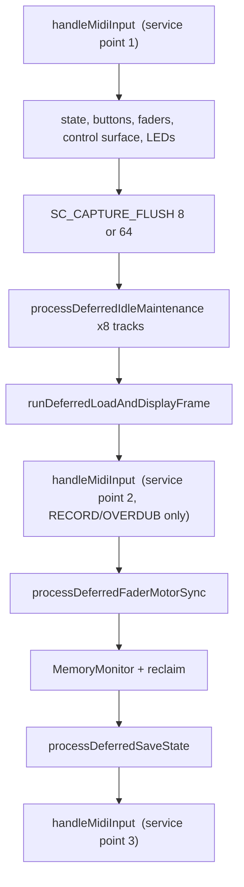
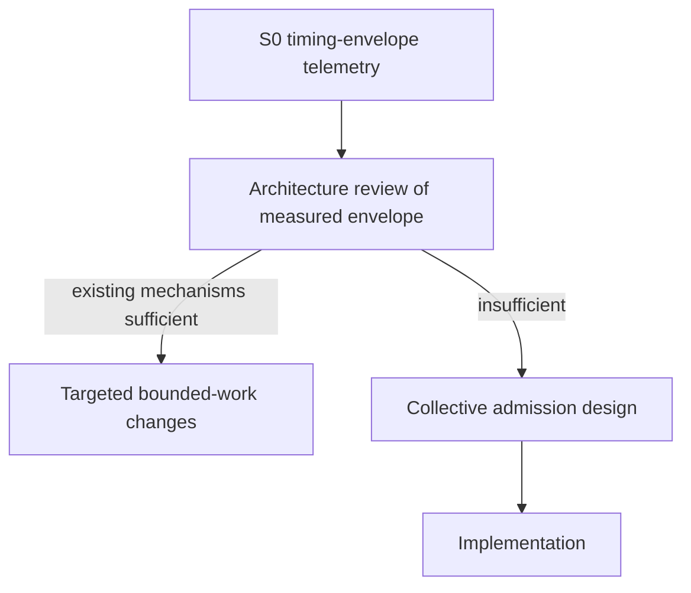

# Runtime Scheduling — Timing Envelope Investigation and Admission Prerequisites

**Status:** S0 timing-envelope telemetry **implemented** (observation only); admission still deferred  
**Date:** 2026-08-12  
**Decision:** Do not implement runtime admission or change MIDI service density until the timing envelope is measured  
**Parent:** [`realtime_incremental_work_capture_overdub_architecture.md`](realtime_incremental_work_capture_overdub_architecture.md)  
**Evidence:** [`115913`](../../captures/session_20260812_115913.log) (timing PASS / display FAIL) · [`122003`](../../captures/session_20260812_122003.log) (dual-slice timing FAIL) · [`104104`](../../captures/session_20260812_104104.log) (display stall)

---

## 1. Decision summary

The architectural goal is valid:

> **No lower-priority operation may cause the interval between timing-critical MIDI service opportunities to exceed an evidence-based real-time bound.**

However, the previously proposed stateless:

```text
RuntimeWorkBudget::beginServiceInterval()
RuntimeWorkBudget::admit(WorkClass)
RuntimeWorkBudget::exhausted()
```

model is **not sufficient** to guarantee that contract.

The review identified several reasons:

- `admit()` has no operation cost, reservation, or enforcement mechanism.
- Owner-level admission does not bound nested work.
- Several admitted operations contain allocation, full scans, callbacks, or variable-cost work.
- `MidiHandler::handleMidiInput()` itself can be substantial and is currently excluded from the proposed MSI budget.
- Clock dispatch synchronously enters `TrackManager::updateAllTracks()`.
- Internal-clock ISR execution is not serialized with main-loop work by the proposed budget.
- Transport transitions can synchronously perform substantial work.
- USB-host output can introduce blocking and callback re-entry.
- The proposed 2 ms target / 5 ms ceiling is not established by measurement.
- MSI gap telemetry alone cannot distinguish delayed service from expensive MIDI dispatch.

**Therefore:**

Do not implement `RuntimeWorkBudget` admission, do not change MIDI service density, and do not introduce a scheduler abstraction until the timing envelope has been measured.

The smallest safe next step is **S0: observation-only telemetry**.

S0 must measure both:

1. the gap between MIDI service points, and
2. the duration and internal cost of MIDI service itself.

No scheduling decision may depend on the new measurements during S0.

---

## 2. Architectural objective

The system uses a cooperative single-threaded `loop()` with timing-critical MIDI processing interleaved with display, persistence, maintenance, reclaim, and control-surface work.

The architectural objective is:

> Loop length may increase total background work and completion time, but must not increase the maximum real-time blocking interval of one timing-critical scheduling opportunity.

This is stronger than:

- "each operation has a local budget";
- "each display operation has a 5 ms bailout";
- "there is an extra MIDI drain";
- or "the 100-bar HITL happens to pass."

The required property is **collective**.

### 2.1 Work-quantum principle

> The amount of work performed in one timing-critical scheduling slice must depend on the configured work quantum, not on total loop length.

Therefore:

- 10 bars may require less total work than 100 bars.
- 100 bars may require less total work than 999 bars.
- But the maximum real-time work performed in one non-preemptible slice must remain bounded.

The approximate 100-bar HITL regression is intended to expose violations of this property. A 999-bar HITL is not required.

---

## 3. Current scheduling model

The cooperative main loop currently resembles:

```text
handleMidiInput()
    ↓
state / buttons / faders / control surface / LEDs
    ↓
capture flush
    ↓
idle maintenance × tracks
    ↓
load + display
    ↓
handleMidiInput()          ← RECORD/OVERDUB only (RC-C C)
    ↓
fader motor sync
    ↓
memory monitor / reclaim
    ↓
persistence
    ↓
handleMidiInput()
```

Verify exact call ordering against [`src/main.cpp`](../../src/main.cpp). The architectural problem is stable: multiple independent owners perform work between MIDI service opportunities, and their local budgets do not currently form one shared real-time contract.



Clock property ([`ClockManager::onMidiClockPulse`](../../src/ClockManager.cpp)): one processed Clock message advances tick by 8 with no resync. Unprocessed Clock bytes are permanently lost; sustained 50% loss presents as half tempo.

---

## 4. Timing-critical paths

Timing-critical work includes more than `handleMidiInput()`.

### 4.1 MIDI service

`MidiHandler::handleMidiInput()` may process:

- up to 128 USB-device messages;
- up to 128 DIN messages;
- USB-host callbacks;
- MIDI dispatch;
- Clock dispatch;
- channel-message processing;
- transport actions;
- button-triggered actions reached through MIDI processing.

The duration of this operation is itself part of the timing envelope. It must therefore not be treated as zero-cost when defining an MSI contract.

### 4.2 Clock dispatch

External MIDI Clock processing currently follows:

```text
MIDI Clock
    ↓
ClockManager::onMidiClockPulse()
    ↓
currentTick += TICKS_PER_CLOCK
    ↓
TrackManager::updateAllTracks(currentTick)
```

`updateAllTracks()` is synchronous. It can involve track loops, slot loops, playback event emission, playback-cache construction, slot commits, note output, stop processing, and playback-window work. Clock dispatch duration must be measured separately.

### 4.3 Internal clock

`ClockManager::updateInternalClock()` can invoke `TrackManager::updateAllTracks()` from `IntervalTimer`. This introduces a second timing-critical execution context.

The proposed main-loop budget cannot assume that main-loop background work and internal-clock work are serialized unless the implementation proves that property. The following must be established by measurement and code audit:

- whether ISR-triggered playback can overlap main-loop work;
- which state is shared;
- which state is protected;
- whether any non-atomic playback/capture structures can be concurrently accessed;
- whether the ISR path can itself become long.

A budget abstraction must not claim serialization that the runtime does not actually provide.

---

## 5. MIDI ordering and batching

USB-device and DIN input are read into bounded batches. The current dispatch machinery includes bounded batch size, dispatch-order planning, Clock handling, transport Start/Stop/Continue priority, and channel-message dispatch.

The architecture intentionally gives transport messages special ordering treatment. The following must remain distinct:

**Clock** — must preserve FIFO relationship with channel messages where tick-dependent event semantics require it. Example: wire `Clock, NoteOn, Clock` must not become `Clock, Clock, NoteOn` because the NoteOn's tick is then observed after both Clock advances.

**Start / Stop / Continue** — transport messages retain their required transport-first semantics. Native dispatch tests (`test_midi_dispatch_order`) already cover this distinction and must remain.

USB-host callbacks do **not** share the USB/DIN batch reorder contract.

---

## 6. USB-host timing

USB-host callbacks do not necessarily follow the same USB/DIN batch ordering model. USB-host output also introduces explicit pacing:

```text
paceDroidUsbHostBeforeSend()
    ↓
send
    ↓
serviceUsbHostAfterOutboundPacket()
```

One playback burst may produce multiple pacing operations and callback re-entry. A future admission model must not assume that one MIDI event equals constant execution time unless measured evidence establishes a safe bound.

---

## 7. Transport transitions

Transport transitions are not automatically bounded merely because they occur inside MIDI processing.

Important paths include RECORDING → `stopRecording()` → PLAYING and OVERDUBBING → `stopOverdubbing()` → PLAYING.

Alternate paths must also be included:

| Path | Owner |
|------|-------|
| RECORDING → STOPPED | `Track::stopRecordingToStopped` |
| OVERDUBBING → STOPPED | `Track::stopOverdubbingToStopped` |
| STOPPED_RECORDING → OVERDUBBING | State machine valid (not normal user flow) |
| OVERDUBBING → PLAYING (NOTE_EDIT) | `Track::handleNoteEditFold` — folds into `NoteEditSession` |

The state machine must not be reduced to the normal user flow.

### 7.1 `Track::stopRecording()`

The stop path may include capture preparation, pending-note finalization, event truncation, capture commit, cache invalidation, playback reset, All Notes Off, state transition, display refresh, and persistence requests. Even if individual operations are incremental, the complete transition duration must be measured.

### 7.2 `Track::stopOverdubbing()`

The overdub stop path additionally includes `SC_REC_FLUSH_PENDING_REVTS(256)` and may perform display refresh, display snapshot emission, verification-related work, capture finalization, and pass commit. Its complete duration must be measured.

### 7.3 `Track::startOverdubbing()`

`startOverdubbing()` can call `Loop::markDisplayCachesStale()` which performs work proportional to loop length: `dirtyBars.assign(totalBars, 1)`. This can involve allocation or resizing. **PLAYING → OVERDUBBING is not currently proven to be constant-cost.** This must be addressed before an MSI contract can claim loop-length independence.

---

## 8. Button and callback re-entry

Timing-critical MIDI dispatch can invoke actions that perform substantial synchronous work.

`MidiButtonProcessor::processPendingPresses()` scans a fixed-size button state array (2048 states) and can trigger record stop, overdub stop, undo, redo, load, and save.

`BarStepButtonHandler::handleNoteOn()` can call `ClockManager::setCurrentTick()` → `TrackManager::updateAllTracks()` — re-entry into the full playback path from MIDI dispatch.

A budget must account for nested work reached through callbacks, not only top-level function calls.

---

## 9. Current background work model

The following operations may execute between MIDI service points. Verify against [`src/main.cpp`](../../src/main.cpp).

| Owner / operation | Current characteristic | Timing concern |
|-------------------|------------------------|----------------|
| `processDeferredIdleMaintenance()` × tracks | Per-track local budgets | Budgets multiply |
| `rebuildVisualCacheIdleSlice()` | Bar-quantized | Actual cost contains loop/cache terms |
| `materializeEditViewFromPasses()` | Potential full-loop | Unbounded |
| `ensureVisualCacheBuilt()` | Potential full-loop | Unbounded |
| `validateAndCleanupMidiEvents()` | Full-loop merge | Unbounded once started |
| display update | Frame-sized | Full frame not capped |
| display resolve | 5000 µs measured bailout | Bailout does not make computation bounded |
| OLED draw/transfer | Frame dependent | Must be measured |
| load jobs | Local µs budgets | Must be included in shared envelope |
| persistence | Incremental | Local budget exists |
| fader motor sync | No shared cap | Potentially unbounded |
| LED refresh | Full refresh | Potentially unbounded |
| HITL serial | Drains available bytes | Unbounded |
| derived-cache reclaim | Can scan all tracks/slots | Potentially unbounded |
| disabled-pass reclaim | Can scan all passes | Potentially unbounded |

Two structural facts: `processDeferredIdleMaintenance` is invoked **per track (8×)**; `PerformanceMonitor::beginLoop`/`endLoop` are commented out in `main.cpp`.

---

## 10. Why local budgets are insufficient

A local budget such as display: 5000 µs, persistence: 300 µs, load: 1200 µs does **not** establish `total interval ≤ 5000 µs` because the operations are sequentially additive.

```text
MIDI service
    ↓
track maintenance × 8
    ↓
display
    ↓
reclaim
    ↓
persistence
    ↓
next MIDI service
```

Eight track maintenance calls can multiply a local budget. A display budget can coexist with reclaim work. A persistence budget can coexist with fader synchronization. A bounded unit can trigger an unbounded nested operation.

**Local budgets are necessary but not sufficient for collective timing safety.**

---

## 11. Non-preemptible operation rule

Admission cannot make an already-running operation safe. If an operation can take 20 µs sometimes and 20 ms in the worst case, then `admit(operation)` does not establish a 2 ms MSI ceiling.

The operation must first be:

1. inherently bounded;
2. made resumable;
3. assigned a measured/static worst-case cost;
4. or excluded from timing-critical intervals.

> No operation may be admitted solely because its caller has remaining budget. Its own worst-case execution cost must also be known or structurally bounded.

This is the central correction to the previous stateless `RuntimeWorkBudget` proposal.

---

## 12. Visual-cache timing hazards

`Loop::rebuildVisualCacheIdleSlice()` is resumable, but its nominal quantum is not equivalent to execution cost. A slice can include:

- `findNextDirtyBar()` — scans dirty state;
- `CommittedEventRange::appendTo()` — can scan all chunk IDs;
- event filtering and reconstruction;
- `removeDisplayNotesOverlappingBars()` — can scan the entire display-note vector;
- vector growth / allocation.

A "4-bar slice" can cost substantially more at a long loop than at a short loop. Required property:

> A slice's execution cost must be proportional to its declared quantum and the data it actually processes, not to total loop length or cache size.

---

## 13. Display frame timing

`LCD::DISPLAY_UPDATE_INTERVAL = 30 ms` controls when a paint opportunity occurs. It does not cap computation.

`Diagnostics::kDisplayResolveBudgetMicros = 5000` is currently a measured bailout mechanism. A bailout is not sufficient if the operation being measured has already performed substantial work or if a fallback performs a full rebuild.

**Architectural rule:** Never rebuild everything synchronously and rely on a timeout to make it safe.

```text
dirty work → bounded slice → progress → retain continuation → next opportunity
```

If the slice cannot complete: retain the last valid derived state; preserve the continuation; do not synchronously catch up; do not perform a full-loop fallback.

---

## 14. Absolute full-rebuild invariant

No synchronous full-loop visual reconstruction may occur anywhere on a timing-critical RECORD or OVERDUB path, regardless of whether the operation currently fits within a nominal display budget. An 8 ms full rebuild of a 100-bar loop is still architecturally invalid.

Required implementation: incremental, windowed, cached, resumable, or deferred.

---

## 15. Overdub delta-proportional invariant

An overdub mutation should not cause reconstruction proportional to the pre-existing loop.

```text
large existing loop + small overdub mutation
        ↓
affected region(s) dirty → delta/window work
```

Not:

```text
large existing loop + small overdub mutation → rebuild complete loop
```

Test using the existing approximately 100-bar + two-overdub scenario.

---

## 16. Persistence relationship

Persistence already has substantial incremental infrastructure: sealed chunks, `PersistenceQueue`, mid-pass persistence, local active budgets, deferred work. Normal STOP is already cooperative. This investigation does not assume that STOP currently performs a complete SyncDrain.

**Target invariant:** STOP must not become a catch-up point where accumulated recording/persistence work is synchronously processed as loop-sized work.

**Outside this architecture change:** Clear / SavedSet SyncDrain, Stage 5b, crash-recovery redesign, new persistence owner, parallel persistence FSM. Do not introduce SyncDrain into normal RECORD/OVERDUB or normal STOP paths as part of this work.

---

## 17. Critical reclaim

`reclaimUnreferencedDisabledPasses()` may scan tracks, slots, references, and passes. If it is not resumable, it remains an architectural timing violation even if only invoked under memory pressure.

Required direction: pressure → bounded reclaim unit → continuation → next scheduling opportunity. Emergency necessity does not make an unbounded scan timing-safe.

---

## 18. HITL serial processing

`processHitlSerialCommands()` drains available serial data. That creates an unbounded relationship between serial backlog and time spent between MIDI service points. Future timing-safe implementation must introduce count-bounded, time-bounded, or resumable command processing, or explicit exclusion during timing-critical capture. The precise solution is not part of S0.

---

## 19. Fader and LED work

`ControlSurfaceManager::processDeferredFaderMotorSync()` and `TrackManager::updateMidiLedsDeferred()` currently do not participate in a shared real-time admission contract. A future implementation must establish a bounded quantum or move them out of the timing-critical interval.

---

## 20. Proposed collective scheduling contract

The eventual scheduling contract should be based on a shared timing envelope:

```text
timing-critical MIDI service (duration measured)
        │
        ▼
shared interval
        │
        ├── bounded background unit
        ├── bounded background unit
        └── bounded background unit
        │
        ▼
next timing-critical service
```

Key property:

```text
MIDI service cost + all admitted non-MIDI cost + nested non-preemptible cost
        ≤ evidence-based interval ceiling
```

The exact numerical ceiling must not be selected before measurement.

### Contract clauses C1–C12 (design target — deferred)

| Clause | Statement |
|--------|-----------|
| C1 MIDI priority | Timing-critical MIDI processing has highest priority |
| C2 Bounded interval | Evidence-based ceiling from S0; **2 ms / 5 ms withdrawn as established contract** |
| C3 Collective admission | Interval reservation with declared per-unit worst-case cost; not `admit(WorkClass)` alone |
| C4 Quantum proportionality | Admitted unit costs O(quantum); S5 prerequisite for visual-cache work |
| C5 Pending is normal | Denied work stays pending; denial never loses work |
| C6 Reuse derived state | Existing materialized state usable while background work incomplete |
| C7 Symmetric capture | RECORD, OVERDUB, post-record PLAYING same policy; S3 is mitigation only |
| C8 STOP cooperative | STOP does not become catch-up point |
| C9 Fairness | Equal-priority classes must not starve indefinitely |
| C10 Transport transitions | Part of timing envelope; not assumed free |
| C11 Callback/re-entry | Nested callbacks and playback re-entry in cost model |
| C12 Evidence-based ceiling | Final MSI ceiling from device evidence, not theory alone |

---

## 21. Minimum future admission state

If collective admission is required, the minimum state is more than a stateless boolean `admit()`.

**Interval state:** active interval deadline or remaining budget; interval identity/generation; start timestamp.

**Fairness state:** per-class fairness cursor; rotation across equal-priority work; starvation prevention.

**Reservation state:** declared worst-case cost, measured upper-bound cost, reservation before execution, or statically bounded operation quantum. Exact mechanism remains an architectural decision after S0.

**Re-entry state:** execution depth; nested timing-critical work; callback re-entry; ISR interaction; reservation ownership.

Owner continuation cursors remain owner state.

---

## 22. Reservation principle

A future admission API must conceptually behave more like:

```text
canRun(unitCost) → reserve(unitCost) → run bounded unit
```

than:

```text
admit(class) → do arbitrary work
```

The second form cannot guarantee a shared deadline. Final API chosen after measurements establish actual operation costs, worst-case variation, nested call structure, allocator behaviour, USB-host timing, and playback burst behaviour.

---

## 23. Allocation is part of the cost

Operations involving `assign()`, `resize()`, `reserve()`, `push_back()`, temporary vectors, and sorting must include allocator behaviour in their timing contract. O(events) is insufficient if an operation can trigger allocation. Future bounded work must pre-establish capacity, use bounded storage, isolate allocation outside timing-critical paths, or measure and reserve for worst-case allocation cost.

---

## 24. Complexity requirements

The future implementation must eliminate or isolate operations whose cost contains terms proportional to total loop bars, total chunks, total display notes, all passes, all tracks/slots, arbitrary serial backlog, or arbitrary callback count.

O(loop), O(C), O(V), O(all passes) are forbidden when they can execute as one non-preemptible timing-critical scheduling unit. They may be transformed into O(quantum) repeated over multiple scheduling opportunities.

---

## 25. Telemetry prerequisite

The previous 2 ms / 5 ms proposal is **withdrawn as an established contract**.

| BPM | MIDI Clock period |
|-----|-------------------|
| 120 | ≈ 20.8 ms |
| 300 | ≈ 8.3 ms |

A 5 ms ceiling leaves only ≈ 3.3 ms at 300 BPM. The previous claim that 5 ms provides an "order of magnitude" of headroom was incorrect.

No numerical MSI ceiling should be accepted until device measurements establish MIDI service, Clock dispatch, playback, transport, USB-host, allocator, display, reclaim, persistence, load, and control-surface costs.

---

## 26. S0 — timing-envelope telemetry

**Status:** **Shipped** (2026-08-12) — observation only; device gate pending.

S0 is: observation only; behavior preserving; no admission; no service-density changes; no work reordering; no new scheduler; no timing-dependent decisions.

### 26.0 Implementation map

| Probe | Owner | Emission |
|-------|-------|----------|
| MSI gap | `RuntimeTimingEnvelope::noteMidiServiceEnter/Exit` via `MidiHandler::handleMidiInput` | `DIAG,msi,<maxUs>,<overCount>` |
| MIDI service duration | same | `DIAG,midisvc,<maxUs>,<overCount>` |
| Clock dispatch | `ClockManager::onMidiClockPulse` | `DIAG,clk,<maxUs>,<overCount>` |
| Track update | `TrackManager::updateAllTracks` | `DIAG,tracks,<maxUs>,<overCount>` |
| Clock rate | pulse count in `onMidiClockPulse` | `DIAG,clockrate,<pulsesPerSecond>` |

Emit path: `RuntimeTimingEnvelope::maybeEmit` from `main.cpp::loop()` every 5 s. Tier-A (survives `SC_CAPTURE_FLUSH`). `overCount` uses observational soft ceiling 5000 µs for counting only — **not** an MSI contract.

Native: `test_runtime_timing_envelope`.

### 26.1 Required measurements

| Category | What to measure |
|----------|-----------------|
| MIDI service | `handleMidiInput()` duration — USB/DIN dispatch, USB-host callbacks, batch size, callback count |
| Clock | `onMidiClockPulse()` duration including `updateAllTracks()` |
| Playback | `updateAllTracks()` duration and useful subcategories if practical |
| Transport | Start, Stop, Continue; `stopRecording()`, `stopOverdubbing()`, `stopRecordingToStopped()`, `stopOverdubbingToStopped()`, `startOverdubbing()` |
| Display | frame, resolve, drawing, OLED transfer, full rebuild occurrences |
| Maintenance | reclaim, persistence step, load step, fader sync, LED refresh, HITL serial, visual-cache slice |

### 26.2 Owners

[`src/main.cpp`](../../src/main.cpp) `loop()`; [`src/MidiHandler.cpp`](../../src/MidiHandler.cpp); [`src/ClockManager.cpp`](../../src/ClockManager.cpp); [`src/Utils/DebugSessionCapture.cpp`](../../src/Utils/DebugSessionCapture.cpp)

### 26.3 Instrumentation constraints

Must not: alter dispatch order; add extra MIDI service points; alter display cadence; change work admission; change capture state; change transport behaviour.

---

## 27. MSI vs MIDI service duration

These must be **distinct metrics**.

| Metric | Definition |
|--------|------------|
| **MSI** | Time between MIDI service opportunities |
| **MIDI service duration** | Time spent inside `handleMidiInput()` |

A long interval may be caused by background work. A short interval with long service duration may be caused by MIDI dispatch / playback / callback work. MSI alone cannot establish the timing contract.

---

## 28. Required S0 telemetry

Tier-A telemetry (survives `SC_CAPTURE_FLUSH(8)`), rate-limited to 5 s:

| Emission | Meaning |
|----------|---------|
| `DIAG,msi,<maxUs>,<overCount>` | Max gap between service points |
| `DIAG,midisvc,<maxUs>,<overCount>` | Max `handleMidiInput()` duration |
| `DIAG,clk,<maxUs>,<overCount>` | Max Clock dispatch duration |
| `DIAG,tracks,<maxUs>,<overCount>` | Max `updateAllTracks()` duration |
| `DIAG,clockrate,<pulsesPerSecond>` | Clock messages per second |

Additional useful measurements: MIDI input backlog, MIDI batch peak, USB-host callback count, USB-host task duration, nested callback depth, allocation failures/growth. Do not add broad telemetry without a reason.

---

## 29. Telemetry persistence

Most important timing telemetry must survive capture flushing. Use existing Tier-A diagnostic path. Telemetry itself must not become a new timing disturbance: rate-limited, bounded, cheap, non-blocking.

---

## 30. S0 implementation

Instrument `main.cpp` around MIDI service points:

```text
before handleMidiInput() → sample start
handleMidiInput()
after handleMidiInput() → record service duration
```

Separately measure time between service points and Clock/playback timing inside the existing Clock path.

---

## 31. S0 acceptance

S0 is successful when the standard approximately 100-bar scenario produces a usable timing profile through RECORD → record stop → PLAYING → OVERDUB → second OVERDUB.

The result must allow identification of:

1. maximum observed MSI;
2. maximum MIDI service duration;
3. maximum Clock dispatch duration;
4. maximum `updateAllTracks()` duration;
5. transport transition costs;
6. display frame cost;
7. reclaim cost;
8. persistence/load cost;
9. USB-host callback contribution;
10. whether Clock loss actually occurs.

S0 does **not** establish the final ceiling.

---

## 31a. S0 device runs — first results (2026-08-12)

**Status:** envelope partially measured; RECORD/OVERDUB window blocked by a capture-transport defect, now fixed and awaiting re-run.

### Capture delivery defect (RC-S0a) — fixed

[`141815`](../../captures/session_20260812_141815.log) and [`144323`](../../captures/session_20260812_144323.log) both lost **every** DIAG envelope window across the capture pass (21.9 s–318.6 s and 32.8 s–304.1 s respectively). No `#CAP` line of any tag survived those ranges; `RING,overflow` fired three times in each session.

Root cause: `isTierATextLine` in `DebugSessionCapture` skipped **two** commas when locating the tag in `#CAP,<micros>,<tag>,...`, so `tagStart` landed one field past the tag and every `strncmp` failed. Tier-A classification returned false for all lines, which made both protections inert since they were written:

- the drop-only path in `flushCaptureBuffer` (timing-critical budget of 8) dropped Tier-A along with everything else;
- the eviction guard in `appendCaptureRecord` never recognised a Tier-A head record.

Fixes: parse extracted to header-only `CaptureLineTier::isTierALine` with host coverage (`test_capture_line_tier`), and the eviction rule tightened so **Tier-A may only be displaced by Tier-A** — protecting the envelope from `SEVT`/`REVT`/`DFRAME` volume while keeping the newest windows and making it impossible to wedge the ring.

### RC-S0b — external memory pool walk, 593 ms, loses MIDI clock

`MemoryMonitor::logStatus()` called `getExternalMemoryPoolFreeBytes()` / `getExternalMemoryPoolUsedBytes()`, both of which run `sm_malloc_stats_pool` over the whole 8 MiB pool. Measured directly in [`141815`](../../captures/session_20260812_141815.log):

```
[330.989] [Memory] heap free=204 used=265 total=469 KB min_ever=204 KB
[331.582] [Memory] psram chip=8 MB free=4669 used=3522 pool=8191 KB
[331.585] MIDI clock lost, switching to internal at 118.4 BPM
```

593 ms of main-loop block, clock lost 3 ms later, repeating on the 60 s cadence (`msi` max 592893 / 592954 / 592994 µs at 334.1 s, 394.3 s, 454.4 s). External clock was still streaming — `BPM` lines run through 330.822 and the track went `PLAYING → STOPPED` from a local button, not a transport stop.

The `!timingCriticalTrackActive` gate could not prevent this: it is derived from track state only, so it cannot tell whether a clock is live. The exemption in `INTERNAL_HEAP_AND_EXTERNAL_MEMORY.md` that permitted the walk in "idle / stopped diagnostics" has been removed; the walk is now `setup()`-only via `logStatus(true)`, and runtime reports `pool_size` (O(1)).

### Measured so far

| Window | `msi` max | `midisvc` max | `clk` max | `tracks` max | `clockrate` |
|---|---|---|---|---|---|
| Boot slot restore (11.7 s) | 845 ms | 20 µs | 0 | 0 | 0 |
| Overdub stop (329.1 s) | 122.3 ms | **173.2 ms** | 3.37 ms | 3.36 ms | 48 |
| Memory-log windows | **592.9 ms** | 3.72 ms | 2.57 ms | 2.56 ms | 16 |
| Steady idle (66 windows) | 33.8 ms avg, 109.4 ms worst | ~34 µs | 0 | 0 | 0 |

Three conclusions already hold:

1. **MIDI service is itself a dominant path.** `midisvc` 173.2 ms against `clk` 3.37 ms and `tracks` 3.36 ms in the same window: overdub stop runs synchronously inside `handleMidiInput` via button dispatch (`ODUB,stop` stages — seal +101.6 ms, `set_state` +118.0 ms, flush +118.8 ms, display +121.7 ms). No admission over *background* work can bound MSI while a MIDI-dispatched control action is the largest in-service cost.
2. **Idle MSI is ~34 ms, not 2 ms.** `overCount` averages 212 per 5 s window (~42/s over 5 ms) with `midisvc` at ~34 µs and `clk`/`tracks` at 0, so essentially all of it is main-loop display work — `PlaybackBuildTime` 74.7 ms, `DisplayUpdateTotalTime` 43.7 ms, `DisplayBuildTime` 30.3 ms, `DisplayResolveLiveCaptureTime` 29.6 ms.
3. **`clockrate` is validated.** 48 pulses/s against 119.6 BPM external (expected 47.8).

### Still owed

The RECORD and OVERDUB windows — the point of S0. Re-run the ≈100-bar scenario on the rebuilt firmware and confirm DIAG windows are continuous from arm through the second overdub stop.

---

## 31b. S0 run [`145555`](../../captures/session_20260812_145555.log) — first capture-phase envelope

The Tier-A parse fix worked: envelope windows now survive **through RECORD, both OVERDUB passes, and the stops**, from 177.2 s to the end. The runtime pool walk is gone (`[265.666] [Memory] psram chip=8 MB pool=8191 KB`, no free/used) and no 593 ms `msi` sample appears.

**Transitions:** `RECORDING → STOPPED_RECORDING` 220.30 s · `→ PLAYING` 220.79 s · `→ OVERDUBBING` 223.09 s · `→ PLAYING` 247.39 s · `→ OVERDUBBING` 251.67 s · `→ PLAYING` 264.69 s · `→ STOPPED` 265.52 s.

### The envelope splits sharply by phase

| Phase | `msi` max | `midisvc` max | `clk` max | `tracks` max | `clockrate` |
|---|---|---|---|---|---|
| RECORD (182–217 s) | 37.8–57.7 ms | **0.9–1.1 ms** | 0.16–0.17 ms | 0.14–0.15 ms | 47–48 |
| Record stop → PLAYING (222.4 s) | 487.4 ms | 8.7 ms | 2.71 ms | 2.70 ms | 47 |
| Overdub entry (227.7 s) | 69.8 ms | **762.5 ms** | 8.63 ms | 8.62 ms | 46 |
| OVERDUB 1 + 2 (232.9–268.1 s) | 58.7–132.3 ms | **140.2–149.0 ms** | 3.46–8.83 ms | 3.44–8.82 ms | 47–48 |
| After stop (273.1 s) | 52.4 ms | 129.5 ms | 0 | 0 | 0 |
| Idle (278.1 s+) | 23.1–23.6 ms | 2 µs | 0 | 0 | 0 |

Three things follow directly.

**RECORD is clean.** `midisvc` around 1.1 ms, `clk` 0.17 ms, `tracks` 0.15 ms. Whatever the runtime problem is, it is not in the record capture path.

**PLAYING and OVERDUB cost ~140× more MIDI service than RECORD.** Every window from 232.9 s to 273.1 s carries a `midisvc` maximum between 129.5 ms and 149.0 ms, and it persists into the window *after* transport stopped. This is a per-window maximum, so it is one very expensive `handleMidiInput()` call per window rather than a sustained load.

**`clk` and `tracks` do not explain it.** They track each other within ~20 µs and peak at 8.83 ms, so `ClockManager::onMidiClockPulse` and `TrackManager::updateAllTracks` account for at most 6 % of the 149 ms. The cost is elsewhere inside `MidiHandler::handleMidiInput`.

The 762.5 ms sample sits in the window covering 222.4–227.7 s, which contains the `PLAYING → OVERDUBBING` entry at 223.09 s.

`DIAG,timing_max` corroborates the display side: `DisplayResolveLiveCapture` reads 7.76 ms during RECORD but 23.05 ms and 30.75 ms during the two overdub passes, with `DisplayUpdateTotalTime` at 48.0 ms and `PlaybackBuildTime` at 70.4 ms.

### Why nothing before 177 s survived (RC-S0c)

Not a classification failure this time — a transport failure, and the code is explicit about it:

```648:660:src/Utils/DebugSessionCapture.cpp
    while (dropped < maxRecords && sCaptureRing.used >= sizeof(CaptureRecordHeader)) {
      if (headRecordIsTierAText()) {
        break;
      }
      const size_t usedBefore = sCaptureRing.used;
      discardOldestRecord();
      if (sCaptureRing.used >= usedBefore) {
        break;
      }
      ++dropped;
    }
    return;
  }
```

Under the timing-critical budget (`SC_CAPTURE_FLUSH(timingCriticalTrackActive ? 8 : 64)`) this branch **drops records and returns without ever writing to Serial**. Tier-A is therefore never transmitted while a track is recording, overdubbing, or playing — it can only leave the ring by eviction. Every envelope window emitted between roughly 20 s and 265 s had to survive in a 96 KiB ring until the stop flush; only those from 177 s onward fit. Every window after `PLAYING → STOPPED` (278 s onward) survives, because the budget returns to 64 and the lines go straight out.

Making Tier-A un-droppable also introduced a second effect. A Tier-A record at the head is a barrier: the drop loop breaks on it, and `appendCaptureRecord` then refuses incoming Tier-B/C. The ring stalls until the next Tier-A evicts the head. The result is fragmented coverage with **true holes** — records never stored at all, not stored then evicted:

```
retained seconds, 170–270 s:
177  182-184  202-205  207-208  212  215  217-223  227-228
230  232  236  238-239  243-245  247-253  257-258  262-270
```

Zero records carry a timestamp in 185–202 s, and `RING,overflow` fires only three times (all at stops), confirming loss by refused append rather than eviction.

**Fix direction (not yet implemented):** give the timing-critical path a small, bounded Tier-A **transmit** allowance gated on `serialWriteRoom`, so Tier-A leaves the ring by being sent instead of accumulating as a barrier. This is the option deferred when RC-S0a was chosen. Pair it with counters for refused appends, Tier-A evictions, and Tier-A transmissions so the next run measures the delivery path instead of inferring it.

### S0 status

Partially complete. The capture-phase envelope now exists and is usable; the pre-177 s window and the delivery path are still owed. The dominant term is unambiguous — MIDI service — but the responsible segment inside it is not, so the next stage is S0b, not S1.

---

## 31c. S0b — segment the MIDI service interval (observation only)

`handleMidiInput` has four sequential segments, and S0 measures only their sum. `clk` already covers the Clock branch and accounts for at most 8.83 ms of a 149 ms call, so the cost is in one of the other three:

| Segment | Owner | Already measured? |
|---|---|---|
| USB device drain + `dispatchMidiBatch` | `usbMIDI.read()` loop | No |
| DIN drain + `dispatchMidiBatch` | `MIDIserial.read()` loop | No |
| USB host stack service | `usbHost.Task()` | No |
| USB host drain (callbacks into `handleMidiMessage`) | `usbHostMIDI.read()` loop | No |
| Clock dispatch within a batch | `ClockManager::onMidiClockPulse` | Yes — `DIAG,clk` |
| Track update within clock dispatch | `TrackManager::updateAllTracks` | Yes — `DIAG,tracks` |

Per-message work reached from `handleMidiMessage` also needs separating: `sendMidiThru` runs for every channel message, and `SC_MIDI_IN` appends to the capture ring, whose `appendCaptureRecord` eviction loop is not free while the ring is in the barrier state described in RC-S0c.

Constraints, unchanged from S0: `micros()` deltas and comparisons only, accumulate maxima into the existing 5 s window, emit as Tier-A `DIAG,` lines, take no scheduling decision. The phase split matters — report each segment separately for RECORD versus PLAYING/OVERDUB, since S0 already shows the two differ by ~140×.

**Exit criterion:** the 762.5 ms overdub-entry sample and the recurring 129–149 ms samples are each attributed to a named segment.

### What S0 already rules out

`midisvc` is measured across three call sites, all in `loop()`, with no nesting, so each sample is one complete call. Two candidates are therefore excluded by the data:

- **Not the RC-C extra MIDI drain.** That call fires only when a track is recording or overdubbing. During RECORD it is active and `midisvc` max is 1.1 ms. In the 268.1–273.1 s window the track had been `STOPPED` since 265.52 s, so the drain was inactive — and `midisvc` max is still 129.5 ms.
- **Not clock dispatch.** The same window reports `clk` 0, `tracks` 0, and `clockrate` 0, meaning no clock pulse was serviced at all.

The cost lives in the USB device drain, the DIN drain, `usbHost.Task()`, or the USB host drain, and it appears only once the loop holds committed content (absent during RECORD, absent again by 278.1 s).

---

## 31d. Regression vs [`9678c3d`](https://github.com/Lytrix/MidiLooper/commit/9678c3d) — display lag and transition feel

User report: at `9678c3d`, RECORD↔OVERDUB switching was smoother and there was no display lag during OVERDUB. Two changes in `6053b01` account for that, one of them measured directly in [`145555`](../../captures/session_20260812_145555.log).

### Display lag — new budget bailouts show stale frames

`resolveDisplayNotesLiveCapture` gained a soft budget with three bailouts that did not exist at baseline:

```504:517:src/DisplayManager/DisplayNoteResolveLiveCapture.cpp
    const bool reuseLastValidFrame =
        !cacheCold && budgetExceeded() && liveDisplayCacheCommittedNoteCount_ +
                                                  liveDisplayCacheCaptureNoteCount_ >
                                              0;

    if (reuseLastValidFrame) {
        // Keep liveDisplayNotes as last valid frame; unfinished committed/capture work stays
        // pending via visualCacheDirty / capturePreview.revision.
    } else if (committedLayerChanged) {
        const uint32_t displayBuildStartUs = micros();
        DIAG_COUNTER_INC(DisplayIncrementalUpdate);
        rebuildCommittedLayer();
        if (!budgetExceeded()) {
            replaceCaptureLayer();
```

The budget is `Diagnostics::kDisplayResolveBudgetMicros = 5000`. Measured `DIAG,timing_max,DisplayResolveLiveCapture` in the same session:

| When | Measured | Ratio to budget |
|---|---|---|
| RECORD (215.4 s) | 7 761 µs | 1.6× |
| Overdub 1 entry (223.2 s) | 23 054 µs | 4.6× |
| Overdub 2 entry (251.8 s) | 29 991 µs | 6.0× |
| Overdub 2 (257.0 s) | 30 747 µs | 6.1× |

Resolve is over budget for essentially the whole of both overdub passes. That makes `reuseLastValidFrame` the normal case, so the capture layer is not replaced and the playhead tails are skipped (`!reuseLastValidFrame && (isRecording() || isOverdubbing()) && !budgetExceeded()`). The display holds the previous frame — which is exactly the reported lag.

At `9678c3d` no bailout existed: resolve ran to completion every frame. It cost more, but the frame was current. The bailout converted a cost problem into a correctness-of-freshness problem without reducing the underlying work below budget.

This restates §33's existing rule — *never rebuild everything synchronously and rely on a timeout to make it safe* — with device evidence. A 5 ms budget on an operation that measures 30 ms does not bound anything; it only decides which frames get dropped.

### Transition feel — Clock is no longer dispatched transport-first

At baseline, `isMidiTransport` put `Clock` in the first dispatch pass, so the tick always advanced before channel messages in the same batch. `MidiDispatchOrder::isSequenceTransport` covers only `Start`/`Stop`/`Continue`, leaving Clock in wire order with channel messages. Notes in a batch can now be handled at the previous tick. This adds no measurable CPU — the reorder is three O(count) passes over a ≤128 batch — but it changes grid alignment at the RECORD↔OVERDUB boundary.

### Secondary, conditional

`skipFocusLoadForSlotSession` now paints the OLED during capture where the baseline skipped it, but only while `focusSlotRestoreWork && SlotLoadSession::isActive()`. `PianoRollDraw`'s bounded-window scan reduces cost on long loops and is ruled out as a cause. Overdub-entry invalidation (`startOverdubbing`, `markDisplayCachesStale`, `invalidateLiveDisplayCache`) is unchanged in this diff.

### Consequence for stage order

The display bailouts are the reported user-visible defect and are independent of the `midisvc` term. They are their own root-cause slice, not part of S0b.

### Compose sub-step instrumentation (shipped, observation only)

The existing telemetry could not name the slow step. `DisplayCaptureCompose` measured 30 736 µs of a 30 747 µs resolve, and `DisplayBuild` (33 244 µs) wraps `rebuildCommittedLayer` and `replaceCaptureLayer` together, while `rebuildCommittedLayer` has four distinct outcomes during overdub.

Two slots were declared but never recorded anywhere in the firmware, so their zero values were not evidence: the `DisplayCaptureGather` timing and the `DisplayCaptureFullGather` counter. Both are now wired to the gather branch.

Added, following the existing `DIAG_TIMING_RECORD` / `DIAG_COUNTER_INC` pattern:

| Slot | Covers |
|---|---|
| `DisplayCommittedRebuildTime` | `rebuildCommittedLayer` (timed at the call site — the lambda returns early on the overdub path) |
| `DisplayCaptureReplaceTime` | `replaceCaptureLayer` — full resize + insert of `capturePreview.notes` |
| `DisplayCaptureSyncTime` | `synchronizeCaptureLayer`, nesting the replace sample when the capture mirror is invalid |
| `DisplayCaptureGatherTime` | `rebuildDisplayNotesInWindow` (was dead) |
| `DisplayCommittedWindowFilter` | `filterDisplayNotesByWindowInclusion` branches — full scan of `visualCache.notes` plus a fresh vector |
| `DisplayCommittedFullAssign` | full `assign` of `visualCache.notes` (no paint window) |
| `DisplayCaptureFullGather` | gather branch (was dead) |

Both enums are append-only before `Count`, so existing indices are unchanged; `static_assert`s now bind `kCounterNames` / `kTimingNames` to their enums, and `test_diagnostics` pins the new indices. Native suite 1034/1034.

**Exit criterion:** one ≈100-bar RECORD + 2 OVERDUB run that attributes the 23–31 ms resolve to a named sub-step. The bailout semantics decision — stale frame, resumable, or always-complete — is deferred until that lands.

---

## 31e. Run [`152948`](../../captures/session_20260812_152948.log) — sub-step attributed, and a larger finding

Transitions: `RECORDING → STOPPED_RECORDING` 230.08 s · three OVERDUB passes ending 402.12 s · `PLAYING → STOPPED` 405.46 s.

### The resolve cost is the committed layer, and it splits in two

At the 402.1 s snapshot, `DisplayResolveLiveCaptureTime` max is 29 746 µs, `DisplayCommittedRebuildTime` max is 29 728 µs, and `DisplayCaptureGatherTime` max is 29 716 µs. The committed rebuild is 99.9 % of resolve and the gather is 99.96 % of that. `DisplayCaptureReplaceTime` max is 252 µs and `DisplayCaptureSyncTime` max is 3 740 µs — neither is a factor.

Splitting the sums between the 333.8 s and 402.1 s snapshots separates two distinct costs:

| Branch | Calls | Cost each |
|---|---|---|
| `rebuildDisplayNotesInWindow` (gather) | 22 | **25.7 ms** |
| `filterDisplayNotesByWindowInclusion` | 622 | **5.48 ms** |
| `replaceCaptureLayer` | 644 | 0.10 ms |
| `synchronizeCaptureLayer` | ~110 | 0.01 ms |

The branch counters confirm the split exactly: `DisplayCommittedWindowFilter` rose by 622 and `DisplayCaptureFullGather` by 22, together accounting for all 644 committed rebuilds. `DisplayCommittedFullAssign` stayed at 0 for the whole session, so the full-`assign` branch never runs.

So the rare gather produces the 25–30 ms spikes, while the *common* window filter costs 5.48 ms — just over the 5000 µs budget. That is why `DisplayResolveOverBudgetCount` reached 2 223 while the gather ran only 23 times: the sustained over-budget driver is a linear scan of `visualCache.notes` plus a fresh vector allocation, not the gather.

`rebuildCommittedLayer` runs on only 1 730 of 18 592 resolves (9 %), and mean resolve across all frames is 713 µs. The budget problem is confined to that 9 %.

### RC-D — the OLED repaints every loop iteration, ignoring the 30 ms cadence

`DisplayUpdateTotalTime` reports a mean of 13.1 ms over 24 497 samples. `DFRAME` gives the frame period directly, and it is stable across the entire session — before recording, during all three overdubs, and after stop:

```
 10.617  notes=342  frame_us=13272  -> 56.1 fps
 82.400  notes=342  frame_us=13282  -> 71.7 fps
380.075  notes=359  frame_us=12105  -> 76.8 fps
414.804  notes=364  frame_us=12007  -> 78.6 fps
```

A ~14 ms frame period against `LCD::DISPLAY_UPDATE_INTERVAL = 30 ms`, with ~13 ms spent inside the frame. The main loop is roughly 93 % inside `DisplayManager::update()`, from ten seconds after boot onward. This is the cost that S0 measured as ~34 ms idle MSI.

The cadence gate is not being reached, because one call path has no gate. The chain is closed and provable:

1. `DisplayManager::invalidateLiveDisplayCache` and `invalidateNoteEditDisplayCache` call `EditManager::invalidateProjectedNoteEditDisplayCache()` unconditionally — these are general display-cache paths with no note-edit precondition.
2. That setter raises `noteEditDisplayImmediatePaintRequested_` and bumps `noteEditDisplayInvalidateEpoch_`.
3. `shouldForceNoteEditDisplayUpdate()` reports true on either that flag or `paintedEpoch < invalidateEpoch` — again with no note-edit precondition.
4. `maybeUpdateDisplayForNoteEditSelection` in `main.cpp` calls `displayManager.update()` whenever step 3 is true, and is the **only** display call site with no `DISPLAY_UPDATE_INTERVAL` check.
5. The only clearer, `markNoteEditDisplayPainted()`, runs at the end of `DisplayManager::update()` **only when `editManager.isNoteEditActive()`**.

Once step 1 fires outside a note-edit session, nothing can clear the flag, so step 4 repaints on every loop iteration for the rest of the session. Session [`152948`](../../captures/session_20260812_152948.log) contains no note-edit markers at all, and the 70 fps behaviour is present from 10 s — before any capture — which is consistent only with the latch being set during boot slot restore.

**Scale:** at the intended 33 fps the same 13 ms frame would consume ~43 % of loop time instead of ~93 %. This dominates every term the admission model was written to bound, including the 129–149 ms `midisvc` samples.

**Owner:** the paint-epoch acknowledgement in `DisplayManager::update`.

**Fix (shipped):** `markNoteEditDisplayPainted()` is now called unconditionally at the end of the normal paint path. The flag records *a repaint is owed*, and `update()` performed one, so the acknowledgement was never the note-edit session's to withhold.

Behaviour during note edit is unchanged — `isNoteEditActive()` was true there, so the guard never fired. Only the non-note-edit case changes, which is the latch. The two consumers of `noteEditDisplayPaintedEpoch()` are both note-edit fader motor gates in `ControlSurfaceManager` (`processPendingSelectDependentMotorSync`, `processPendingGeometryDriverMotorSync`); they capture their required epoch at schedule time from note-edit drivers, so neither is reachable with a pending epoch outside a session.

**Residual — load/save overlay:** the overlay branch returns before the acknowledgement, and correctly so, since it draws `drawLoadSaveView` rather than the note-edit view; acknowledging there would claim a repaint that did not happen. While the overlay is open with the flag raised, the ungated path therefore still repaints every iteration at the cost of `_display.api.display()`. Bounded to a transient user mode, and not present in [`152948`](../../captures/session_20260812_152948.log). Correcting it belongs to the raise side or the call-site gate, not the acknowledgement.

### Consequence for stage order

RC-D outranks the resolve budget. The gather spike and the 5.48 ms window filter are real, but they affect 9 % of frames, whereas RC-D doubles the cost of all of them.

---

## 31f. Run [`155132`](../../captures/session_20260812_155132.log) — RC-D verified, MIDI service isolated

Transitions: `RECORDING → STOPPED_RECORDING` 272.79 s · `→ PLAYING` 273.08 s · `→ OVERDUBBING` 274.03 s · `→ PLAYING` 310.49 s · `→ OVERDUBBING` 316.50 s · `→ STOPPED` 330.78 s.

### RC-D fix confirmed

`DFRAME` reports **32.7 fps** across the session, against 70–78 fps before the fix. `DisplayUpdateTotalTime` gives 9 485 frames over 310 s at a 14.8 ms mean, so display now consumes **45 %** of loop time instead of ~93 %.

The envelope moved with it:

| Window | Before ([`152948`](../../captures/session_20260812_152948.log)) | After |
|---|---|---|
| Idle `msi` max | ~34 ms | **15.3 ms** |
| RECORD `msi` max | — | 19.0–24.5 ms |
| Idle `midisvc` max | ~34 µs | 2 µs |

### RECORD remains clean, and grows slowly

Across the 60 s of recording, `midisvc` max rises monotonically 604 → 628 → 646 → 652 → 661 → 694 → 709 → 771 → 850 → 888 → 905 µs, with `clk` 174–192 µs and `tracks` 153–172 µs flat. A real O(content) trend, but 300 µs over a full minute of capture — not a scheduling concern at this scale.

### The 126–146 ms MIDI service is unchanged, and is not clock dispatch

Every window from 276.9 s to 332.2 s carries a `midisvc` maximum between **126.0 ms and 145.8 ms**, exactly as in [`145555`](../../captures/session_20260812_145555.log). Halving display load did not touch it.

Clock dispatch cannot account for it, and the arithmetic is now unambiguous. In the 282.0 s window `midisvc` is 125 967 µs while `clk` is 4 584 µs, so explaining the call as buffered clock would need ~27 pulses drained in one `handleMidiInput`. At the measured `clockrate` of 46–49 pulses/s that is ~570 ms of accumulation, but the largest `msi` gap in the same window is 73.6 ms — about 3.5 pulses, or ~16 ms. At least 110 ms of that call is outside clock dispatch.

The same input traffic during RECORD costs 604–905 µs, so it is not message volume either. The cost is in the segments S0 does not measure: the USB device drain, the DIN drain, `usbHost.Task()`, the USB host drain, or per-message work reached from `handleMidiMessage`. **S0b is now the only open question on the dominant path.**

### Display resolve is under budget by margin, not by design

`DisplayResolveOverBudgetCount` fell from 2 223 to **86**. That is not a fix. `DisplayCommittedWindowFilter` ran 457 times and non-gather rebuilds average **4 595 µs** against the 5 000 µs budget — the same operation as before, now landing just under the threshold instead of just over. `DisplayCaptureGatherTime` still shows a single 26.3 ms sample, and `DisplayResolveLiveCapture` still peaks at 33.8 ms during the second overdub.

The branch cost has not changed; only its position relative to an arbitrary line has. Treat the low over-budget count as fragile.

### RC-E — the visual cache is marked complete while covering a fraction of the loop

This is the "piano roll not redrawn after stopping" report, and the piano roll is in fact being redrawn — there is almost nothing in the cache to draw.

`TICKS_PER_BAR` is 768 and `TICKS_PER_16TH_STEP` is 48, so the 59 136-tick loop is **77 bars** and the detailed paint window is 16 bars = 12 288 ticks.

Reading `DISP,4,…` across the stop:

```
330.913 STOPPED  visual=299  frame=298  wStart=16176  wNotes=298
331.807 PLAYING  visual=299  frame=1    wStart=0      wNotes=1
335.011 STOPPED  visual=299  frame=1    wStart=0      wNotes=1
337.736 PLAYING  visual=299  frame=1    wStart=0      wNotes=1
338.613 STOPPED  visual=299  frame=1    wStart=0      wNotes=1
```

At the overdub stop the window sits at tick 16 176 (bar 21) and holds **298 of the 299** cached notes. When transport restarts the playhead returns to tick 0, the window follows, and bars 0–15 contain **one** note. It never recovers across two further play/stop cycles.

Bars 0–15 are not empty in storage. The deferred `REVT` dump immediately after the stop walks a 16th-note grid from the beginning of the loop — `REVT,0,4,96`, `REVT,48,4,95`, `REVT,96,4,94`, … — so the record pass has roughly 256 notes in the first 16 bars alone.

`visual` holds at exactly 299 for eight seconds spanning two STOPPED periods, during which `processDeferredIdleMaintenance` runs its stopped-branch slice with priority bar 0. A dirty cache would grow. It does not, so **`visualCacheDirty` is false with a cache covering roughly 22 % of the loop** (bars 21–37 of 77). Nothing will ever backfill it.

The note density confirms the split rather than contradicting it: 298 notes in a 12 288-tick window is exactly a 16th-note grid, so the region that *is* cached is complete and the region that is not is absent entirely.

**Not yet attributed.** `rebuildVisualCacheFromPasses` does a full `gatherCommittedEvents` and only then sets `visualCacheDirty = false`, so on its own it cannot produce a partial-clean cache. The `visual` count also collapses at **both** commits — 977 → 368 at the first overdub, 1 218 → 299 at the second — and the second commit ends with *fewer* notes than the first. Two candidates, distinguishable by measurement and not yet separated:

1. the progressive idle slice over-counts during overdub and the post-commit full rebuild is the truth, in which case committed content is being lost at the second commit;
2. the post-commit full rebuild under-covers, and the progressive figure was closer to correct.

Either way the invariant *a cache may only be marked clean when it covers the whole loop* is violated. This is a storage/commit question, not a scheduling one.

### RC-E instrumentation (shipped, observation-only)

A Tier-A `VCACHE` line reports cached-note coverage at every boundary where the cache is rebuilt or declared stale:

```
#CAP,<us>,VCACHE,<phase>,ev,<gathered>,notes,<n>,first,<bar>,last,<bar>,total,<bars>,dsz,<dirtyBarsSize>,dcnt,<dirtyBars>,dirty,<flag>
```

`ev` is the gathered committed event count where the phase performed a gather and `-1` otherwise. Phases: `full` (`rebuildVisualCacheFromPasses`), `slice_clean` and `slice_nodirty` (the two points where `rebuildVisualCacheIdleSlice` clears the dirty flag), `stale` (`markPassDerivedStale`), `stale_all` (`markDisplayCachesStale`).

The readings separate the two candidates:

| Observation | Conclusion |
|---|---|
| `full` shows `ev` collapsing across the second commit | committed content is lost at commit |
| `full` shows `ev` intact but `notes` low and `first`/`last` spanning a fraction of `total` | reconstruction or coverage, not storage |
| `slice_clean` / `slice_nodirty` fires with `first`/`last` spanning a fraction of `total` | cache marked clean while partial — the invariant break |
| `stale` shows `dsz < total` or `dcnt` far below `total` | stale `dirtyBars` limits which bars later slices may revisit |

That last row is the specific asymmetry worth watching: `markPassDerivedStale` raises `visualCacheDirty` but leaves `dirtyBars` exactly as the previous rebuild left it, whereas `markDisplayCachesStale` marks every bar. `rebuildVisualCacheIdleSlice` only re-marks all bars when `dirtyBars.size() < totalBars`, so a same-length-but-mostly-clean `dirtyBars` would confine every subsequent slice to the bars that happened to hold notes at the last full rebuild. The capture-commit path takes the `markPassDerivedStale` route.

Coverage is measured as bounds only (`first`/`last` over note start and end bars) so the commit path allocates nothing.

---

## 31g-2. Run [`162230`](../../captures/session_20260812_162230.log) — RC-E root cause proven

Transitions: `RECORDING → STOPPED_RECORDING` 180.96 s · `→ PLAYING` 181.31 s · `→ OVERDUBBING` 183.73 s · `→ PLAYING` 225.68 s · `→ OVERDUBBING` 228.89 s · `→ PLAYING` 244.62 s · `→ STOPPED` 246.85 s. Loop is 84 bars.

### The collapse reproduces at both overdub stops

| Moment | Cached notes | Bars covered |
|---|---|---|
| First overdub commit, 225.614 s (`VCACHE,stale`) | 1 042 | 0–83 of 84 |
| 72 ms later, 225.686 s (`DISP`) | **385** | 1–30 (confirmed at 228.889 s) |
| Second overdub commit, 244.543 s (`VCACHE,stale`) | 1 298 | 1–83 of 84 |
| 248 ms later, 244.791 s (`DISP`) | **304** | — |

The cache then stops changing: 385 holds from 225.686 s to 228.889 s across 3.2 s of PLAYING, and 304 holds from 244.791 s to the end of the log at 253.4 s.

### Root cause — `DisplayManager::refreshViewportAfterOverdubStop`

The composed display frame — the bounded 16-bar detailed window plus tails, i.e. only what was on screen — is adopted wholesale as the loop's entire visual cache:

```cpp
loop.visualCache.setNotes(liveDisplayNotes);
loop.visualCache.dirtyBars.clear();
++loop.visualCache.revision;
loop.visualCacheDirty = false;
```

Every observation follows from those four lines. The post-stop note count is one window's worth (304 against `wNotes` 301; 385 against frame 305; 299 against `wNotes` 298 in [`155132`](../../captures/session_20260812_155132.log)). Coverage collapses to a band around the playhead. And because `visualCacheDirty` is set **false** with `dirtyBars` empty, `rebuildVisualCacheIdleSlice` returns on its first line forever after — nothing can ever backfill the rest of the loop.

This is the shipped **RC5c** behaviour from [`long_overdub_rc5_incremental_display_handoff_investigation.md`](long_overdub_rc5_incremental_display_handoff_investigation.md), whose intent was to avoid a synchronous full-loop gather on the overdub stop path. That intent is sound. The defect is that the adopt marks the cache **complete** rather than *this window is fresh, the rest is unknown*. It runs on all three overdub stop paths — `stopOverdubbing`, `stopOverdubbingToStopped`, and the in-edit fold.

The record-stop path does not do this. `refreshViewportAfterRecordStop` touches only `liveDisplayNotes`, which is why the cache rebuilt to full coverage after the record (689 notes over bars 0–83 at 183.728 s, growing to 1 042).

### Two earlier hypotheses are now dead

`VCACHE,full` never fires after boot, so `rebuildVisualCacheFromPasses` is not on the commit path at all and `ev` was never sampled. **Committed content is not being lost at commit** — §31g's first candidate is wrong, and the low post-commit counts were never a full-rebuild truth.

The `markPassDerivedStale` asymmetry is real but not the cause: it reported 19 of 84 dirty bars at the first commit and 11 of 84 at the second, and each was immediately followed by `markDisplayCachesStale` restoring all 84. Worth tidying, not load-bearing.

### Instrumentation gap this exposed

None of the four `VCACHE` probes fired on the adopt. It writes `loop.visualCache` directly, bypassing `markPassDerivedStale`, `markDisplayCachesStale`, and both rebuild functions. A probe belongs on the adopt itself and on `invalidateDisplayCaches`.

### Secondary: refill is unreachable beyond ±20 bars while the transport runs

Independent of the adopt, `processDeferredIdleMaintenance` limits the PLAYING/OVERDUBBING slice to `kPlayingVisualCacheNeighborhoodBars = kMaxDetailedWindowBars + 4 = 20` bars from the priority bar, alternating between playhead and loop tail. On this 84-bar loop with the playhead at bar 15 that reaches bars 0–35 and 63–83, leaving **bars 36–62 unreachable** while playing. The dead zone widens with loop length. **Shipped with RC-E fix:** neighborhood cap is dropped when the cache is in a mixed clean/dirty state so idle slices can reach any dirty bar.

### Fix shipped (RC-E)

`refreshViewportAfterOverdubStop` now calls `Loop::adoptComposedDisplayNotesFromViewport`, which copies the composed frame, marks bars touched by adopted notes clean and every other bar dirty, leaves `visualCacheDirty = true` while any bar remains dirty, and emits `VCACHE,adopt_partial`. Native tests: `test_adopt_partial_visual_cache_*` in `test_display_window_utils`. Device verify: re-run record → overdub → overdub → stop; expect `VCACHE,adopt_partial` with `dirty,1` and `visual` growing via `slice_clean` while PLAYING/STOPPED.

---

### Display during overdub — the §31d bailout, unchanged

`DIAG,timing_max,DisplayResolveLiveCapture` reads **33 595 µs** at 316.7 s and **33 844 µs** at 321.8 s, both inside the second overdub, against the 5 000 µs budget. At 6.8× over, `reuseLastValidFrame` holds the previous frame and both `replaceCaptureLayer` and the playhead tails are skipped, so notes being played into the overdub are not composed into the frame. This is the behaviour described in §31d and it is worse in the second pass because the committed layer is larger.

### MIDI drift grows with content, and is worse in the second overdub

| Pass | `msi` max | `midisvc` max |
|---|---|---|
| Overdub 1 (276.9–310.5 s) | 289.6 → 51.9 ms | 145.3 → 134.5 ms |
| Overdub 2 (316.5–330.8 s) | 98.5 → 48.9 ms | 141.4 → 145.8 → **223.4 ms** |

`midisvc` rises monotonically within each pass and starts higher in the second. The 223.4 ms sample sits in the window containing the stop. `clk` never exceeds 9.8 ms in any of these windows, so this remains the unattributed `handleMidiInput` term from §31f — **S0b**.

### Separate: a 140 ms post-stop stall

At 337.2 s and 342.2 s, after `PLAYING → STOPPED`, `msi` max is 140.6 ms and 140.2 ms while `midisvc` is 81–126 µs, `clk` is 0, and `clockrate` is 0. Whatever blocks the loop there is not MIDI service and not clock dispatch. `tracks` is 4.1–9.0 ms with `clk` at 0, which is the internal-clock ISR path rather than `onMidiClockPulse`. Not investigated.

---

## 32. Revised implementation dependency



The previous sequence S0 → S1 → … → S8 must **not** be treated as authorization to proceed automatically.

---

## 33. Revised stages

| Stage | Status | Summary |
|-------|--------|---------|
| **S0** | **Shipped**; partially measured | Timing-envelope telemetry; observation only. Capture-phase envelope obtained in [`145555`](../../captures/session_20260812_145555.log); pre-177 s window still owed (RC-S0c delivery path) |
| **S0b** | **Next — observation only** | Split `MidiHandler::handleMidiInput` into measured segments. S0 proved `midisvc` is the dominant term (762.5 ms peak, 129–149 ms per window during PLAYING/OVERDUB against `clk`/`tracks` ≤ 8.83 ms), but not *which* segment. No admission design can start until this is named. Pair with the RC-S0c Tier-A transmit allowance so the pre-177 s window is recoverable |
| **S1** | Not authorized | Admission design from S0/S0b evidence; interval/reservation/fairness/re-entry/ISR rules |
| **S2** | Not authorized | Coarse admission; owner-boundary checks alone cannot claim MSI invariant |
| **S3** | Not authorized | Service-density changes; mitigation for PLAYING blind spot, not proof of contract |
| **S4** | Not authorized | Per-unit bounded work inside owners |
| **S5** | Not authorized | Quantum proportionality — eliminate O(loop)/O(C)/O(V) from bounded units |
| **S6** | Not authorized | Remaining unbounded owners — reclaim, fader, LED, HITL, transport, playback rebuild |
| **S7** | Not authorized | Display completeness only after timing safety |
| **S8** | Not authorized | Documentation closeout — measured contract, DEC entry, HITL criteria |

---

## 34. Stage gating rules

1. **Native tests:** `pio test -e native` before each implementation stage.
2. **Device measurement:** ≈100-bar RECORD + two OVERDUB remains primary device gate.
3. **No 999-bar HITL:** purpose is work proportionality, not maximum recording capacity.
4. **No timing tuning without measurement:** do not tune around symptoms when dominant path is unknown.
5. **No automatic stage progression:** each stage requires review of its evidence.

---

## 35. Existing architecture to reuse

Prefer extending before introducing new abstractions:

- `PersistenceBudget`, `LoadLoopBudget`
- mid-pass persistence
- `Loop::rebuildVisualCacheIdleSlice`, dirty-bar bookkeeping
- deferred validation, capture preview incremental maintenance
- existing pressure/reclaim mechanisms where resumable

Do not create a new Manager merely to give the scheduling problem a new owner. Do not move Clock into an ISR as part of this investigation.

---

## 36. What this architecture does not propose

This document does **not** authorize: moving MIDI Clock to an ISR; timestamping USB arrival; changing MIDI transport semantics; changing capture/Loop/Track/persistence ownership; a new global scheduler by default; parallel execution; Stage 5b SyncDrain redesign; Clear/SavedSet persistence redesign; note-edit geometry changes; broad display architecture replacement.

---

## 37. Relationship to RC-C

RC-C remains narrow. Shipped: A (MIDI ordering), B (incremental display), C (optional extra MIDI drain).

| Capture | Outcome |
|---------|---------|
| [`115913`](../../captures/session_20260812_115913.log) | Timing substantially improved; display completeness imperfect |
| [`122003`](../../captures/session_20260812_122003.log) | Dual idle slice → excessive combined interval → Clock loss / half-tempo; reverted |

**122003 blind spot:** After record stop the track is PLAYING. RC-C mid-loop drain is capture-only, so post-record PLAYING has only service points 1 and 3.

**Current scheduling principle:** MIDI-first scheduling with bounded incremental display work is preferable to adding more display work merely because individual slices appear safe.

### 115913 vs 122003 mechanism

| Signal | 115913 (PASS) | 122003 (FAIL) |
|--------|---------------|---------------|
| External clock | held | `MIDI clock lost, switching to internal` |
| CAP gaps over 50 ms | 40 | 190 |
| Mid-session `ST` lines | present | 2 (ring starved) |
| User report | timing fine, display gaps | lag after record stop, half tempo from overdub |

Code-proven mechanism: second `rebuildVisualCacheIdleSlice` immediately after the first with no MIDI service point between them; maximal C and V after ~101-bar record; overview cost proportional to V; PLAYING has fewer service points than RECORD/OVERDUB.

---

## 38. Evidence interpretation

```text
104104 → large display stall → MIDI batch accumulation → timing degradation
115913 → single alternating slice → timing PASS → display incomplete
122003 → dual idle slice → larger combined interval → Clock loss / half-tempo
```

Evidence does **not** yet prove visual work is the only dominant cause. Other contributors: MIDI dispatch duration, playback bursts, USB-host callbacks, output pacing, allocator stalls, transport transitions, reclaim, persistence, callback re-entry. **S0 exists to distinguish these.**

---

## 39. Core architectural invariants

| ID | Invariant |
|----|-----------|
| A | MIDI priority — timing-critical MIDI processing has highest priority |
| B | Bounded non-preemptible work — no admitted operation with unknown or loop-sized worst-case cost |
| C | Collective admission — sum of admitted work fits measured interval budget |
| D | Reservation — admission accounts for actual cost of next unit |
| E | Pending work — denied work remains pending; denial never loses work |
| F | Resumability — work that cannot fit remains resumable |
| G | No full-loop catch-up — dirty state never forces synchronous full-loop reconstruction |
| H | Loop-length independence — longer loop increases completion time, not max blocking interval of bounded unit |
| I | Fairness — equal-priority background classes must not starve indefinitely |
| J | Transport transitions — part of timing envelope |
| K | Callback/re-entry accounting — nested callbacks in cost model |
| L | Evidence-based ceiling — final MSI ceiling from device evidence |

---

## 40. Final determination

| Question | Answer |
|----------|--------|
| Is collective-admission architecture sound? | **Yes** as an architectural goal |
| Is stateless `RuntimeWorkBudget::admit(WorkClass)` sufficient? | **No** — lacks cost, reservation, enforcement, nested-work accounting, ISR interaction |
| Is 2 ms / 5 ms an accepted MSI contract? | **No** — hypothesis requiring device validation |
| Smallest safe implementation? | **S0 telemetry only** — no admission, service-density, scheduler, or MIDI/Clock architecture change |
| What must S0 establish? | MIDI service, Clock dispatch, `updateAllTracks`, transport, MSI gap, display, reclaim, persistence/load, USB-host, allocation indicators |

---

## 41. Acceptance checklist

**Architecture:** collective admission goal; stateless `admit()` insufficient; reservation/cost required; non-preemptible work; nested/re-entry paths; internal-clock execution; USB-host pacing; transport transitions; alternate stop paths; NOTE_EDIT fold; allocation cost; critical reclaim; full display frame; MSI separated from MIDI service duration.

**Contract:** work-quantum principle; loop-length independence; full-loop catch-up prohibited; pending/resumable; fairness; evidence-based ceiling.

**Telemetry:** S0 observation-only; MSI, midisvc, clk, tracks, transport, display/reclaim/persistence/load, USB-host, clockrate, allocation indicators.

**Testing:** ≈100-bar + two OVERDUB primary HITL; no 999-bar HITL; native tests required; no automatic stage progression; timing regression causes revert not symptom tuning.

---

## 42. Immediate next action

**Only implement S0 telemetry.**

Before any `RuntimeWorkBudget`, shared admission, reservation mechanism, additional MIDI service point, PLAYING service-density change, or scheduler abstraction: measure the device timing envelope and review the evidence.

The resulting evidence determines whether existing deferred mechanisms can be extended sufficiently or whether a true collective admission mechanism is required.

**Measure the timing envelope first. Then design admission around the measured non-preemptible work.**

---

## Appendix A — Codebase audit findings (B1–B16)

| ID | Finding | Owner / path |
|----|---------|--------------|
| B1 | `admit(WorkClass)` cannot guarantee collective admission without cost/reservation/preemption | Proposed `RuntimeWorkBudget` |
| B2 | Owner-boundary admission insufficient; 8× track maintenance multiplies budgets | `main.cpp` |
| B3 | MSI excludes `handleMidiInput()` duration | `MidiHandler.cpp`, `ClockManager.cpp` |
| B4 | `updateInternalClock()` ISR can call `updateAllTracks()` concurrently with main loop | `ClockManager.cpp` |
| B5 | `updateAllTracks()` unbounded by content — playback rebuild, slot commits, output | `TrackManagerTransportTick.cpp` |
| B6 | `stopRecording()` exceeds any 2 ms / 5 ms ceiling | `TrackCaptureStopCommit.cpp` |
| B7 | `stopOverdubbing()` adds flush(256), display snapshot, verification | `TrackOverdubLifecycle.cpp` |
| B8 | `startOverdubbing()` → `markDisplayCachesStale()` O(loop bars) | `TrackOverdubLifecycle.cpp` |
| B9 | `rebuildVisualCacheIdleSlice()` O(C) + O(V) | `LoopVisualCache.cpp` |
| B10 | Whole-loop paths in idle maintenance | `TrackDeferredMaintenance.cpp` |
| B11 | Critical reclaim not resumable during capture | `main.cpp` |
| B12 | Full display frame not capped by resolve bailout | `DisplayManager` |
| B13 | HITL serial unbounded drain | `StorageManagerHitlSerial.cpp` |
| B14 | Bar step → `setCurrentTick()` → `updateAllTracks()` | `BarStepButtonHandler.cpp` |
| B15 | USB-host pacing blocks; callbacks re-enter | `MidiHandler.cpp` |
| B16 | Stateless budget insufficient; minimum state in §21 | Admission design |

### Already satisfied

`Track`/`Loop`/`StorageManager`/`DisplayManager` ownership; deferred full validation on stop; persistence FSM and load budgets; REVT/visual-cache resumability; USB/DIN transport ordering (RC-C A).

### Implementation details (not blocking S0)

USB/DIN batch bounded but copies + two scans; USB-host no batch reorder; `recordMidiEvents()` backward scans; `rebuildPlaybackOrder()` full sort; `processPendingPresses()` 2048 scan; semantic `admitLoopPersist` is intent not CPU admission.
