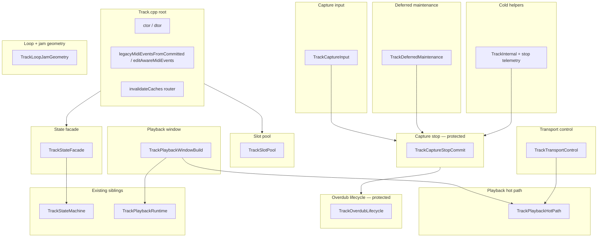

# Track translation-unit extraction

**Kind:** refinement  
**Branch:** `refactor/track` (from `dev`)  
**Parent context:** [codebase_hygiene_technical_debt_review.md](codebase_hygiene_technical_debt_review.md), [runtime_process_building_blocks_overview.md](runtime_process_building_blocks_overview.md), [unified_capture_stop_driver_refinement.md](unified_capture_stop_driver_refinement.md)  
**Naming authority:** [NAMING.md](../Authority/NAMING.md)  
**Pattern reference:** [editmanager_translation_unit_extraction_refinement.md](editmanager_translation_unit_extraction_refinement.md) (shipped PR #12), [displaymanager_translation_unit_extraction_refinement.md](displaymanager_translation_unit_extraction_refinement.md), [storagemanager_translation_unit_extraction_refinement.md](storagemanager_translation_unit_extraction_refinement.md)

---

## One-line goal

Shrink [`src/Track.cpp`](../../src/Track.cpp) from a ~2436-line monolith into a thin per-track coordinator (ctor, slot index, edit-aware MIDI router, cache invalidation entry) by moving cohesive capture / playback / transport domains into [`src/Track/*.cpp`](../../src/Track/), **one phase per PR**, behavior-preserving, **no ownership or lifecycle changes**.

---

## Baseline (2026-08-06)

| Artifact | LOC / status |
|----------|----------------|
| [`src/Track.cpp`](../../src/Track.cpp) | **~2436** (root TU) |
| [`include/Track.h`](../../include/Track.h) | **~411** — `Track` fields, inline cache accessors stay here |
| `TrackInternal.h` | **does not exist yet** |
| [`src/TrackStateMachine.cpp`](../../src/TrackStateMachine.cpp) | **~51** — transition table only; **do not duplicate** |
| [`src/TrackPlaybackRuntime.cpp`](../../src/TrackPlaybackRuntime.cpp) | **~114** — runtime allocation / slot reset; **do not duplicate** |
| [`src/TrackUndo.cpp`](../../src/TrackUndo.cpp) | global undo — out of scope |
| [`src/TrackDisplayState.cpp`](../../src/TrackDisplayState.cpp) | display state — out of scope |
| [`src/TrackManager.cpp`](../../src/TrackManager.cpp) | multi-track orchestration — out of scope |

### Target end state

| Artifact | Target |
|----------|--------|
| `Track.cpp` | **~200–350** — ctor/dtor, `legacyMidiEventsFromCommitted` / `editAwareMidiEvents`, `invalidateCaches` router, `TICKS_PER_BAR`, thin delegators if any |
| New TUs (this plan) | **~2100** moved out in Phases 0–10 |
| Ownership / transitions | **unchanged** — hygiene only; honor [LOOP_MIDI_STORAGE_AND_VALIDATION.md](../Guides/LOOP_MIDI_STORAGE_AND_VALIDATION.md) |

---

## Rules (every phase)

1. **Behavior-preserving** — no changes to record/overdub stop, commit, playback window, or deferred validate semantics.
2. **Architecture checkpoint** — ownership change **NO**, state transition change **NO** ([architecture-checkpoint-bugfix](../../.cursor/rules/architecture-checkpoint-bugfix.mdc)).
3. **Pre-implementation review** — trace symbols with `rg`; post gate table in PR description ([Plan-Pre-Implementation-Review](../../.cursor/rules/Plan-Pre-Implementation-Review.mdc)).
4. **Verification gate** — `pio test -e native` (828/828); `pio run -e teensy41-capture-serial`; phase-appropriate HITL when stop/playback paths touched ([HITL-Test-Flow](../../.cursor/rules/HITL-Test-Flow.mdc)).
5. **One phase per session / PR** — do not mix unrelated extractions.
6. **State stays on `Track`** — move **method bodies** only; do **not** introduce `CaptureManager` / `PlaybackEngine` top-level classes without user approval ([NAMING.md](../Authority/NAMING.md) § Module suffix).
7. **Headers** — declare moved file-static helpers in new [`include/TrackInternal.h`](../../include/TrackInternal.h); keep [`include/Track.h`](../../include/Track.h) public surface stable unless a phase explicitly owns a rename.
8. **Member access** — extracted TUs implement `Track::method` out-of-line; preserve `TRACK_COLD_MEM` / `TRACK_HOT_MEM` on moved methods ([`include/Utils/TrackMem.h`](../../include/Utils/TrackMem.h)).
9. **Instance class, not static façade** — member fields remain on `Track`; anonymous-namespace helpers move to internal header + cold TUs.

### Naming alignment ([NAMING.md](../Authority/NAMING.md))

| Concept | Use in this plan | Avoid |
|---------|------------------|-------|
| Live capture buffer | **capture** / **capture pass** | working buffer, layer |
| Committed rows | **passes** / **recordPass** / **overdubPass** | flatten as noun |
| Merged playback view | **merged MIDI events** / **playback window** | flat, golden |
| Stop orchestration | **`commitCaptureForStop`** / **`finalizeCommitSideEffects`** | new `*Helper` on stop path |
| Deferred work | **deferred** (existing `processDeferredIdleMaintenance`) | queue for synchronous algorithms |

### Do not split (yet)

| Area | Reason |
|------|--------|
| `src/Track/TrackStateMachine.cpp` | Transition table owner — colocated Phase 11; **do not duplicate** |
| `src/Track/TrackPlaybackRuntime.cpp` | Runtime allocation / `LoopPlaybackRuntime` lifecycle — colocated Phase 11 |
| `TrackUndo.cpp` | Global undo — stays at `src/` root (separate module) |
| `Loop::commitCapturePass` / seal logic | `Loop` owner — Track only orchestrates stop |
| `TrackManager.cpp` | Multi-track routing — separate plan |
| Behavioral DRY (`unified_capture_stop_driver`) | **Separate track** — [unified_capture_stop_driver_refinement.md](unified_capture_stop_driver_refinement.md); this plan is **body moves only** |

### Protected paths (extra scrutiny)

Any edit under these areas requires architecture gate **even for hygiene**:

| Area | Owner methods |
|------|----------------|
| Record stop | `stopRecording`, `stopRecordingToStopped`, `prepareRecordStop` |
| Overdub stop | `stopOverdubbing`, `stopOverdubbingToStopped`, `handleNoteEditFold` |
| Capture commit | `commitCaptureForStop`, `finalizeCommitSideEffects`, `finalizeLoopAtStop` |
| Pending note close | `finalizePendingNotes` (touched by stop paths) |
| Playback hot path | `playMidiEvents`, `playCommittedLoopMidi`, `ensurePlaybackMergedMidiEventsBuilt` |
| Deferred validate | `processDeferredIdleMaintenance`, `validateAndCleanupMidiEvents` |

Read [LOOP_MIDI_STORAGE_AND_VALIDATION.md](../Guides/LOOP_MIDI_STORAGE_AND_VALIDATION.md) before moving stop or commit paths.

---

## Domain map (current root TU)



---

## Phase map (highest ROI first)

```text
Phase 0  TrackInternal + stop telemetry cold helpers     (~220 LOC)
Phase 1  TrackMidiEventRouting (cache + edit-aware)      (~65 LOC)
Phase 2  TrackSlotPool (loop pool adapters)              (~130 LOC)
Phase 3  TrackStateFacade (state + predicates)           (~140 LOC)
Phase 4  TrackCaptureInput (record + noteOn/Off)         (~320 LOC)
Phase 5  TrackCaptureStopCommit                          (~480 LOC)  ← protected
Phase 6  TrackOverdubLifecycle + note-edit fold          (~300 LOC)  ← protected
Phase 7  TrackPlaybackWindowBuild                        (~380 LOC)
Phase 8  TrackPlaybackHotPath                            (~330 LOC)
Phase 9  TrackTransportControl + queued grid start       (~200 LOC)
Phase 10 TrackDeferredMaintenance + loop/jam + clear     (~470 LOC)
         ───────────────────────────────────────────────
         Track.cpp  2436 → ~200–350
```

Milestone after **Phase 1**: root TU **~2150 LOC** (cache / edit-aware routing isolated).  
Milestone after **Phase 5–6**: root TU **~1200 LOC** (capture stop + overdub isolated — highest risk reduced).  
Milestone after **Phases 0–10**: root TU within target band.

**Suggested PR stack:** **0 → 1 → 2** sequential (internal + routing + slots). **3** parallel-safe after 2. **4** before **5**. **5 → 6** sequential (protected stop paths). **7** before **8**. **9** after 3+8. **10** last (idle validate + loop/jam + `clear`).

---

## Phase 0 — `TrackInternal` scaffold (~220 LOC)

**New files**

| File | Role |
|------|------|
| [`include/TrackInternal.h`](../../include/TrackInternal.h) | Declarations for file-static helpers moved from root anonymous namespace |
| [`src/Track/TrackStopTelemetryColdHelpers.cpp`](../../src/Track/TrackStopTelemetryColdHelpers.cpp) | Stop-path stats, `#CAP` stage logging, overdub display snapshot helpers |

### Move (anonymous namespace today)

| Symbol | Role |
|--------|------|
| `isSamePitchSoundingAtTick` | Overdub overlap restore probe |
| `shouldRestoreCommittedOverlapOnOverdubStop` | Overdub stop overlap restore gate |
| `StopPathStorageStats` / `collectStopPathStorageStats` | Stop telemetry |
| `commitResultLabel` | `#CAP` outcome label |
| `logRecordStopStage` / `logOverdubStopStage` | `#CAP,REC_STOP_STAGE` / overdub stage |
| `emitOverdubStopDisplaySnapshot` / `logMemoryAfterOverdubStop` | Post-overdub-stop telemetry |
| `logOverdubCaptureCoordinate` | `#CAP` coordinate (SESSION_CAPTURE) |
| `resolveTrackIndexForPersistence` | StorageManager track index |

### Keep in root

- `TRACK_COLD_MEM` / hot-path mem macro includes (or move macro to `TrackInternal.h` in same PR)

### Verify

- `pio test -e native`; `pio run -e teensy41-capture-serial` — no behavior change

**PR title:** `refactor(track): Phase 0 internal scaffold and stop telemetry helpers`

---

## Phase 1 — `TrackMidiEventRouting.cpp` (~65 LOC)

### Move

| Symbol | Role |
|--------|------|
| `legacyMidiEventsFromCommitted` | Revision-keyed committed scratch for edit boundary |
| `editAwareMidiEvents` | Delegates to `EditManager::editMidiEvents` |
| `invalidateLoopDerivedCaches` | Loop + scratch invalidation |
| `invalidateCaches` | Note-edit vs committed cache router |

### Keep in root

- Optional: thin `invalidateCaches` forward if root stays orchestrator — prefer full move to Phase 1 TU

### Verify

- Native `test_edit_apply`, `test_note_edit_track_switch`; note-edit display refresh unchanged

**PR title:** `refactor(track): extract MIDI event routing and cache invalidation`

---

## Phase 2 — `TrackSlotPool.cpp` (~130 LOC)

### Move

| Symbol | Role |
|--------|------|
| `syncSlotRefsFromPool` / `ensureLoopsAllocated` | Loop pool init |
| `loopForSlot` / `loopIdForSlot` / `slotRef` / `getLoop` | Slot → Loop adapters |
| `hasDataInSlot` / `hasAnySlotData` | Slot data probes |
| `reconcileTransportStateAfterSlotMutation` | EMPTY vs STOPPED after slot clear |

### Keep in root

- `Track` ctor / dtor (pool not allocated in ctor — stays deferred)

### Verify

- Native slot/load tests; boot prewarm unchanged

**PR title:** `refactor(track): extract slot pool adapters`

---

## Phase 3 — `TrackStateFacade.cpp` (~140 LOC)

### Move

| Symbol | Role |
|--------|------|
| `getState` / `isValidStateTransition` / `setState` / `transitionState` / `forceSetState` / `getStateName` | State wrapper over `TrackStateMachine` |
| `getMidiChannel` / `setMidiChannel` | MIDI channel |
| `getActiveLoopIndex` / `setActiveLoopIndex` | Active slot |
| `getSlotOpState` / `getRecordingFocusSlot` | Per-slot capture focus |
| `isEmpty` / `isStopped` / `isArmed` / `isRecording` / `isStoppedRecording` / `isOverdubbing` / `isPlaying` / `isMuted` | Predicates |
| `toggleMuteTrack` | Mute toggle |

### Keep in root

- `trackState` field on `Track` (header unchanged)

### Verify

- State transition HITL markers unchanged; `test_slot_clear_state`

**PR title:** `refactor(track): extract track state facade`

---

## Phase 4 — `TrackCaptureInput.cpp` (~320 LOC)

### Move

| Symbol | Role |
|--------|------|
| `startRecording` | Record arm + capture init |
| `recordMidiEvents` | Live capture append (note id, sort, dedupe) |
| `noteOn` / `noteOff` | Pending-note buffer + capture dispatch |
| `quantizeStart` / `shiftMidiEvents` / `findLastEventTick` / `computeLoopLengthTicks` | Record helpers |
| `capturePhaseTick` / `appendCaptureNoteOffAtPhase` | Capture coordinate mapping |
| `finalizePendingNotes` | Open-tail close at stop (shared with stop path — move **body** only) |

### Dependencies

- Phase 0 (overlap restore helper used from `finalizePendingNotes`)

### Verify

- HITL record baseline (`record_notes_sent`, first-note offset); `test_capture_note_min_length`

**PR title:** `refactor(track): extract capture input path`

---

## Phase 5 — `TrackCaptureStopCommit.cpp` (~480 LOC) — protected

### Move

| Symbol | Role |
|--------|------|
| `prepareRecordStop` | Length compute + pending finalize + capture trim |
| `finalizeLoopAtStop` | Deferred full-validate schedule |
| `finalizeCommitSideEffects` | Post-`commitCapturePass` side effects |
| `commitCaptureForStop` | Seal + finalize wrapper |
| `stopRecording` | Record stop orchestration |
| `stopRecordingToStopped` | Record stop → STOPPED variant |

### Architecture gate (required)

| Question | Answer |
|----------|--------|
| Owner module | `Track` — stop orchestration; `Loop::commitCapturePass` seals |
| Primary invariant | Stop path uses wrap-window finalize only — no full validate on hot path |
| Ownership change? | NO |
| Transition change? | NO |
| Reuse | YES — move bodies to `TrackCaptureStopCommit.cpp` |

### Verify

- HITL record + overdub baseline; `#CAP,REC_STOP*` / stop stage lines; native `test_loop_stop_finalize`

**PR title:** `refactor(track): extract record stop commit path`

---

## Phase 6 — `TrackOverdubLifecycle.cpp` (~300 LOC) — protected

### Move

| Symbol | Role |
|--------|------|
| `startOverdubbing` | Overdub entry + display defer |
| `stopOverdubbing` | Overdub stop → PLAYING |
| `stopOverdubbingToStopped` | Overdub stop → STOPPED |
| `handleNoteEditFold` | NOTE_EDIT fold on overdub stop |

### Verify

- HITL overdub transitions (`OVERDUBBING -> PLAYING`); note-edit fold capture; `#CAP,ODUB,*`

**PR title:** `refactor(track): extract overdub lifecycle`

---

## Phase 7 — `TrackPlaybackWindowBuild.cpp` (~380 LOC)

### Move (includes anonymous playback helpers today ~L256–443)

| Symbol | Role |
|--------|------|
| `reanchorPlaybackIndex` / `rebuildPlaybackOrder` / `reanchorCaptureIndex` | Order + index maintenance |
| `ensurePlaybackMergedMidiEventsBuilt` | Merged MIDI window build |
| `mergedPlaybackStreamSize` / `mergedPlaybackStreamValid` / `mergedPlaybackStreamPhase` | Playback cursor streams |
| `capturePlaybackStreamSize` / `capturePlaybackStreamPhase` | Capture overdub stream |
| `resetPlaybackState` / `resetPlaybackStateForSlot` | Per-slot playback reset |
| `invalidatePlaybackMergedMidiEvents` | Runtime cache drop |
| `prewarmPlaybackForSlot` / `ensurePlaybackMergedEventsForSlot` | Slot prewarm / launch prep |
| `isPlaybackMergedMidiEventsReadyForSlot` | LoopEnd readiness |
| `releasePlaybackMergedMidiEventsMemory` / `tryReleasePlaybackMergedMidiEventsMemory` | Memory reclaim |
| `tryClearCommittedMidiScratch` | Edit scratch reclaim |

### Verify

- Multi-track playback pressure tests; `test_playback_cursor_advance`; boot prewarm logs

**PR title:** `refactor(track): extract playback window build`

---

## Phase 8 — `TrackPlaybackHotPath.cpp` (~330 LOC)

### Move

| Symbol | Role |
|--------|------|
| `playCommittedLoopMidi` | Per-slot merged playback + capture layer |
| `playMidiEvents` / `playMidiEventsForSlot` | Public playback entry |
| `playbackCursorAdvanceSend` / `playbackCursorAdvanceJamFilter` | Cursor advance callbacks |
| `isStorageTickInJamRegion` | Jam region filter |
| `sendMidiEvent` / `sendAllNotesOff` | MIDI out + channel remap |
| `rebuildPlaybackOrder` (member) / `reanchorPlaybackProjection` | Order rebuild hooks |

### Verify

- HITL clock/transition gates; wrap playback native tests; jam region if enabled

**PR title:** `refactor(track): extract playback hot path`

---

## Phase 9 — `TrackTransportControl.cpp` (~200 LOC)

### Move

| Symbol | Role |
|--------|------|
| `startPlaying` / `stopPlaying` / `togglePlayStop` | Transport PLAYING ↔ STOPPED |
| `queuePlaybackStartAtGrid` / `clearQueuedPlaybackStart` | Queued grid restart |
| `shouldCommitQueuedPlaybackStart` / `commitQueuedPlaybackStart` | Grid commit |

### Verify

- HITL `PLAYING` transitions; queued start if exercised in scenarios

**PR title:** `refactor(track): extract transport control`

---

## Phase 10 — `TrackDeferredMaintenance.cpp` + `TrackLoopJamGeometry.cpp` (~470 LOC)

Split into **10a** and **10b** if a single PR exceeds review comfort; otherwise one PR with two files.

### `TrackDeferredMaintenance.cpp`

| Symbol | Role |
|--------|------|
| `resetDeferredRecordRevts` / `queueDeferredRecordRevts` / `processDeferredRecordRevts` | Deferred REVT serial |
| `processDeferredIdleMaintenance` | Idle visual + validate + REVT slice |
| `validateAndCleanupMidiEvents` | Cold full-loop validate (log-only repair today) |
| `emitStoredMidiVerification` | Overdub-stop stored MIDI verify (`#CAP`) |

### `TrackLoopJamGeometry.cpp`

| Symbol | Role |
|--------|------|
| `setLoopLength` / `setLoopLengthWithWrapping` / `setLoopStartTick` / `setLoopStartAndEnd` | Loop geometry |
| `setJam` / `clearJam` / `advanceJamTick` / `getJamTick` / `setJamTick` | Jam region |
| `setJamPlayback` / `getEffectivePlaybackTick` | Jam playback tick |
| `hasCommittedPassesInSlot` / `quantizeTransportRecordLength` / `computeRecordStopLengthTicks` / `resetLoopSlotAfterEmptyCapture` | Cold record-stop helpers |
| `clear` | Full track clear |
| `getTicksPerBar` | Static tempo helper |

### Verify

- Deferred validate policy; slot clear; loop length edit smoke

**PR title:** `refactor(track): extract deferred maintenance and loop/jam geometry`

---

## Phase 11 — Colocate sibling TUs under `src/Track/` (shipped)

Mechanical `git mv` only — no behavior change.

| From | To |
|------|-----|
| `src/TrackStateMachine.cpp` | `src/Track/TrackStateMachine.cpp` |
| `src/TrackPlaybackRuntime.cpp` | `src/Track/TrackPlaybackRuntime.cpp` |
| `src/TrackDisplayState.cpp` | `src/Track/TrackDisplayState.cpp |

**Left at `src/` root:** `Track.cpp`, `TrackManager.cpp`, `TrackUndo.cpp` (same pattern as `EditManager.cpp` + `NoteEditSession` at root).

**PR title:** `refactor(track): colocate per-track sibling TUs under src/Track`

---

## Optional follow-up (not in ROI order)

| Item | Notes |
|------|-------|
| Unified capture stop driver | [unified_capture_stop_driver_refinement.md](unified_capture_stop_driver_refinement.md) — **behavior** DRY after root &lt; 400 LOC |
| `ensurePlaybackWindowBuilt` rename / policy | [multi_track_playback_pressure_closure_refinement.md](multi_track_playback_pressure_closure_refinement.md) |
| Collapse duplicate stop-path logging | After Phases 5–6 land |
| Move `TRACK_COLD_MEM` to shared header only | Mechanical cleanup |

---

## Per-phase checklist (copy into PR)

```markdown
## Architecture gate
- Owner: Track (unchanged); Loop owns commitCapturePass / seal
- Invariant: capture stop uses wrap-window finalize; full validate deferred only
- Ownership change: NO
- Transition change: NO
- Reuse: YES — move method bodies to `src/Track/<Phase>.cpp`

## Pre-implementation review
- [ ] `rg <symbol>` — all call sites listed
- [ ] No new fields on Track without design approval
- [ ] `TrackInternal.h` updated (Phase 0+)
- [ ] `TRACK_COLD_MEM` / hot mem preserved on moved methods
- [ ] Protected paths (Phases 5–6, 8) — LOOP_MIDI guide read

## Tests
- [ ] `pio test -e native`
- [ ] `pio run -e teensy41-capture-serial`
- [ ] HITL / manual: <phase-specific smoke>
```

---

## Related docs

- [CODE_STRUCTURE.md](../Guides/CODE_STRUCTURE.md) — update `src/Track/` row when Phase 0 lands
- [refactor_priority_backlog.md](refactor_priority_backlog.md) — P1 Track TU extraction entry
- [OpenSpec-Workflow](../../.cursor/rules/OpenSpec-Workflow.mdc) — no OpenSpec change required (hygiene-only)
