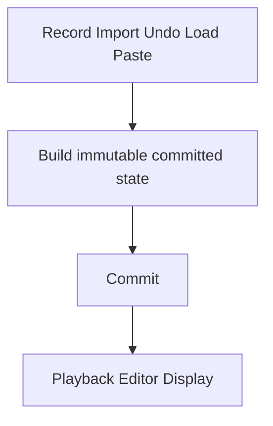
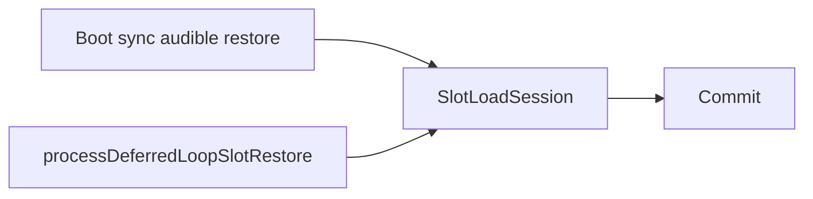
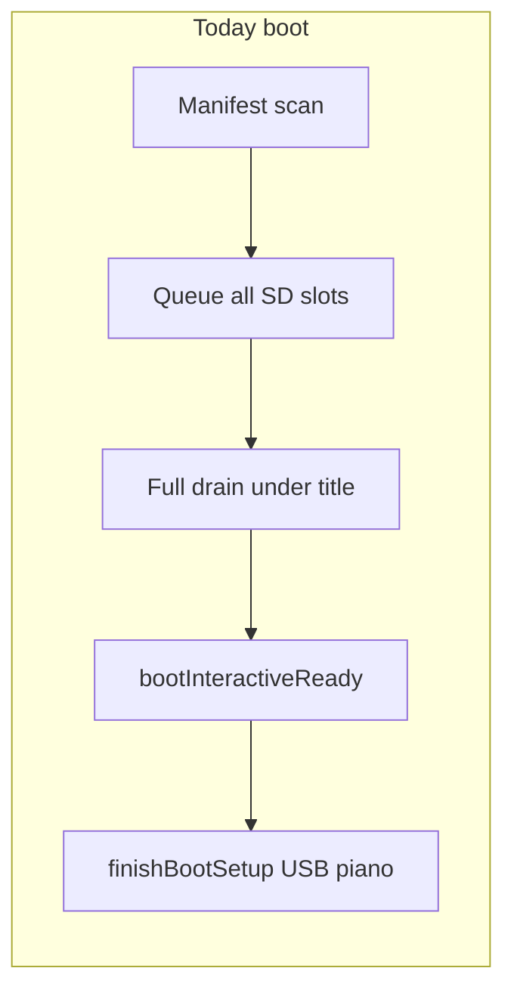
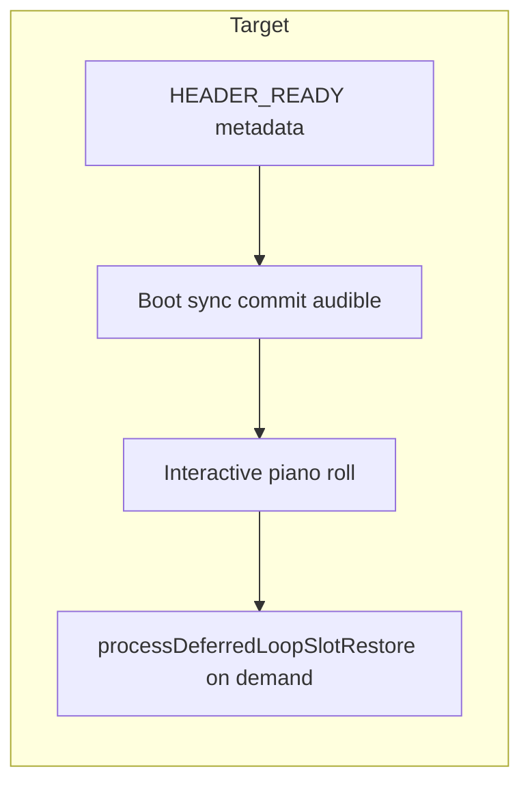

# Unified publish pipeline — deferred lazy loading

**Kind:** architecture (separate project)  
**Status:** Frozen (2026-07-18) — OpenSpec: `openspec/changes/unified-commit-lazy-slot-load/`  
**Priority:** High  
**Branch baseline:** `feature/memory-pressure-reclaim` @ `af1227c` (title-until-ready + full drain)  
**Depends on (already in tree):** committed passes (code: published chunk refs / `commitCapturePass`), chunk epochs, deferred save FSM, committed/derived separation, `SlotLoadSession`

**Refinements:**

- [`unified_publish_pipeline_bootstrap_vs_deferred_executor_refinement.md`](unified_publish_pipeline_bootstrap_vs_deferred_executor_refinement.md) — boot sync vs runtime budgeted scheduling  
- [`unified_publish_pipeline_final_review_refinement.md`](unified_publish_pipeline_final_review_refinement.md) — design rules, derived breadth, external lifecycle, naming vs PersistenceQueue  
- [`unified_publish_pipeline_commit_terminology_refinement.md`](unified_publish_pipeline_commit_terminology_refinement.md) — **Commit** over Publish; rename pass  
- [`unified_publish_pipeline_commit_as_verb_refinement.md`](unified_publish_pipeline_commit_as_verb_refinement.md) — Commit as **verb**; no “Commit Boundary” noun; semantic parity not one helper  
- [`unified_publish_pipeline_review_resolutions_refinement.md`](unified_publish_pipeline_review_resolutions_refinement.md) — review resolutions before OpenSpec  

**Not this project:** Phase 4 v7 SD chunk index (format bump); optional after lazy commit path exists.

Architecture docs are frozen for OpenSpec. Further model changes go through the change’s design/specs, not ad-hoc plan edits.

---

## Architectural center: Commit

This is a **commit** architecture. Loading is one producer of **committed** immutable state (canonical loop version), not a special visibility subsystem.

```text
Record / Import / Undo / Load / Paste
              │
              ▼
   Build immutable committed state
              │
              ▼
            Commit
              │
              ▼
   Playback / Editor / Display
```

```text
Transient / Staging → Build → Validate → Commit → Committed state → Derived state
```

Playback / editor / display never consume staging. Record already commits via `Loop::commitCapturePass`. Load (and other producers) must **Commit** with the same semantics — not necessarily the same helper function.

**Invariant:** All runtime-visible loop changes occur through **Commit**.

---

## Design rules (invariants)

1. Committed state is never modified in place.  
2. All runtime-visible loop changes occur through **Commit** (do not invent “Commit Boundary” / Gate / Pipeline nouns).  
3. Playback only observes committed immutable state.  
4. Scheduling is separated from loading and build logic.  
5. Derived state may be discarded and rebuilt at any time.

---

## Motivation (product)

Cold boot today restores **every** SD loop slot before the instrument is interactive:

| Evidence | Value |
|----------|--------|
| [`session_20260718_020628.log`](../../captures/session_20260718_020628.log) | ~10.5 s `load_ok` → `usb_host,begin`, 26 slots |
| Scheduling | Full drain under title — SD-bound |
| Phase 2 batch `ioRead` | Shipped; no wall-time win on device |

Goal: shorter audible-first startup **and** one commit model for all producers.

---

## Derived (intentionally broad)

**Derived** = anything reconstructible from **committed state**:

- playback merge windows  
- editor state  
- visual / piano-roll geometry  
- note lookup tables  
- display geometry  
- future helpers  

---

## External slot hydration states

Public / policy-facing only:

```text
UNLOADED → HEADER_READY → COMMITTED → DERIVED_READY
```

| State | Meaning |
|-------|---------|
| UNLOADED | No committed passes; may still need SD (`needsSlotLoad`) |
| HEADER_READY | Metadata (length, bars, …) without committed passes |
| COMMITTED | Immutable pass(es) are canonical; playback / editor / display may use; piano roll may build from committed passes |
| DERIVED_READY | Optional rebuilds finished — performance, not correctness |

**Internal** to `SlotLoadSession` only: file/chunk cursors, staging, validation.

**Code today:** `hasPublishedEvents()`, `SlotLoadSessionState::Publishing` implement COMMITTED until **Phase 1 rename pass**.

### Phase 0 pins (from [review resolutions](unified_publish_pipeline_review_resolutions_refinement.md))

| Topic | Decision |
|-------|----------|
| Commit vs helper | **Semantics** only — producers need not call `commitCapturePass()` |
| Piano roll / interactive UI | Allowed at **COMMITTED**; `DERIVED_READY` optional for correctness |
| Hydration state storage | Architectural lifecycle only — implementation may use enum, flags, or computed properties (no mandate) |
| Boot load path | MVP may keep **existing** sync `loadLoopSlotFromCurrentSetSd` for audible boot; cooperative `SlotLoadSession` advance is **not** a prerequisite for the new loading model |
| Background priorities | **(1)** audible slots, **(2)** explicitly requested slot — no speculative adjacent / Priority-3 fill |
| Load while PLAYING | MVP may queue and defer SD until transport idle; interactive mid-play load = later parent phase |
| Success metrics | Qualitative first; quantitative only after profiling |

---

## Scheduling: what vs when

**Resolved:** Audible boot does **not** use the runtime deferred scheduler.

| Concern | Owner (conceptual) | Naming note |
|---------|-------------------|-------------|
| **What** | `SlotLoadSession` (read → build → **commit**; cooperative advance) | Keep existing type |
| **When (boot)** | Sync restore of **audible set** before interactive | `process…` / `restore…` / `finish…` on `StorageManager` |
| **When (runtime)** | Budgeted slices after interactive | Extend `processDeferredLoopSlotRestore` (mirrors deferred save) |





Align new identifiers with `commitCapturePass`, PersistenceQueue, and `processDeferred*` before adding types. Do not land `*Executor` names without Phase 0 pin.

---

## Map onto current code

| Concept | Current owner / symbol | Gap |
|---------|------------------------|-----|
| Committed truth | `Loop` passes + chunk refs; today `hasPublishedEvents()` → rename Phase 1 | Load path separate from `commitCapturePass` |
| Record commit | `Loop::commitCapturePass` | — |
| Load session | [`SlotLoadSession`](../../include/SlotLoadSession.h) | Full-file read; `Publishing` → `Committing` in rename pass |
| Persistence admit/write | [`PersistenceQueue`](../../include/PersistenceQueue.h) | Vocabulary pattern for load scheduling |
| Runtime load process | `processDeferredLoopSlotRestore` | One whole slot per call; boot full-drains all |
| Audible set | `isAudibleBootSlot` | Ready waits for empty queue today |
| Interactive gate | `bootInteractiveReady()` | All slots, not audible-only |
| Focus load | `prioritizeLoopSlotRestoreForFocus` | Runtime admission |
| Deferred save | `processDeferredSaveState` / `stepPersistenceWorkItem` | Budget template |
| Main gate | `!timingCriticalTrackActive` | No load while PLAYING |





---

## Two-phase startup (product)

### A — Transport restore (boot, sync)

Metadata for all tracks; **sync-commit** audible boot set only (`isAudibleBootSlot`).  
Then `finishBootSetup` + USB + piano roll.  
`bootInteractiveReady` = audible **committed** (explicit flag; never remapped `getActiveLoopIndex()` — `012942`).

Do not auto-enqueue remaining SD slots.

### B — Runtime (budgeted)

After interactive: deferred process under budget for:

1. **Audible** (should be empty after boot A)  
2. **Explicitly requested** slot (select / focus / queue)

No speculative adjacent prefetch. Interactive load while PLAYING is a later parent phase; MVP may queue and wait for transport idle.

---

## Slot selection UX

```text
Select → HEADER_READY / Loading → deferred process → COMMITTED → derived paint
```

At **COMMITTED**, playback / editor / display (including piano roll from committed passes) may proceed. **DERIVED_READY** is optional optimization.

Until COMMITTED, do not half-play staging.

---

## Relationship to recording / undo / import

| Operation | Today | Target |
|-----------|--------|--------|
| Record/overdub | `commitCapturePass` | Unchanged owner |
| SD load | `loadLoopSlotFromCurrentSetSd` | **Commit** with same semantics (not required to call `commitCapturePass`); MVP may keep existing sync path; cooperative session later |
| Undo / import / paste | Various / future | Same Commit semantics |

Edition model: construct new pass → validate → commit → runtime observes new committed version (prior committed edition valid until then).

---

## Implementation phases

| Phase | Scope | Exit |
|-------|--------|------|
| **0** | Architecture review; freeze Commit vocabulary + rename table; exclusions vs PersistenceQueue / revision commit / `processDeferred*` | Signed ([review resolutions](unified_publish_pipeline_review_resolutions_refinement.md)) |
| **1** | **Rename pass** — Publish/Published → Commit/Committed with action+scope names ([detail](unified_publish_pipeline_commit_terminology_refinement.md#rename-pass-code--guides--openspec)) | Grep clean + native PASS |
| **2** | Audible-only boot ready using **existing** sync load path if needed; interactive at COMMITTED | Boot ≪ full-set; actives audible on Play |
| **3** | `SlotLoadSession` cooperative advance (internals); optional factor of load body | Native |
| **4** | Budgeted deferred restore for explicitly requested slots | Stopped select commits |
| **5** | No silent full-set hydrate | Capture evidence |
| **6** | Derived rebuild off commit critical path | UI before DERIVED_READY |
| **7** | Load while PLAYING (formal gate) | Mid-play select hydrates |
| **8** | Undo / import / paste on commit contract | Spec + native |

Phase order above is a **delivery guide**. Review resolution §4: cooperative session advance is **not** required before adopting audible-only boot (Phase 2 may precede Phase 3). Rename pass still before feature code that would add new publish identifiers.

---

## Explicit non-goals (v1)

- Boot audible restore through deferred scheduler  
- New `*Executor` / `*Manager` without naming review  
- Renaming revision/set `RevisionCommit` or seal/mid_pass APIs  
- Exposing internal chunk-staging as public API  
- v7 SD format; DEC-020 mid_pass ownership changes  
- Mandatory rename of historical `unified_publish_pipeline_*` filenames  

---

## Success criteria

- **Commit** is the documented convergence point for all producers.  
- Design rules held in reviews.  
- External hydration lifecycle: UNLOADED → HEADER_READY → COMMITTED → DERIVED_READY (architectural; storage flexible).  
- **Rename pass complete** — committed-pass APIs use Commit vocabulary with **action + scope/object** names.  
- Audible startup significantly faster than full-set load; playback/UI at COMMITTED before full hydration.  
- Derived rebuild outside critical startup path.  
- Scheduling ≠ loading logic (when deferred path exists).  
- Quantitative targets only after profiling representative projects.

---

## Suggested MVP

1. Branch from `af1227c` (e.g. `feature/deferred-lazy-load`).  
2. Phases 0–1: naming + **rename pass**.  
3. Phase 2: audible-only boot (existing sync load OK) → interactive at COMMITTED.  
4. Device gate vs `020628`.  
5. Then cooperative session / deferred on-demand (parent Phases 3–4).

---

## Key files

| File | Role |
|------|------|
| [`include/SlotLoadSession.h`](../../include/SlotLoadSession.h) | Load state machine → commit |
| [`include/PersistenceQueue.h`](../../include/PersistenceQueue.h) | Admit-queue naming pattern |
| [`src/StorageManager.cpp`](../../src/StorageManager.cpp) | Boot restore; deferred restore; ready |
| [`src/main.cpp`](../../src/main.cpp) | Deferred save + load process order |
| [`include/Utils/BootLoopSlotRestore.h`](../../include/Utils/BootLoopSlotRestore.h) | Audible set |
| [`src/Loop.cpp`](../../src/Loop.cpp) | `commitCapturePass` |

---

## Pre-implementation review

### Ready
- Audible helpers, `SlotLoadSession`, focus restore, timing baselines.  
- Commit-centered framing and design rules agreed.

### Resolved
| Topic | Decision |
|-------|----------|
| Center | **Commit** (verb/operation), not Publish / not Load; no “Commit Boundary” noun |
| Producer Commit | Same **semantics**; not required to share one helper with `commitCapturePass` |
| Boot vs runtime schedule | Sync audible boot; budgeted deferred process at runtime |
| External states | UNLOADED / HEADER_READY / **COMMITTED** / DERIVED_READY |
| COMMITTED vs DERIVED | COMMITTED = correctness for play/edit/display; DERIVED_READY = optional |
| Chunk staging | Internal only |
| Derived | Broad reconstructible-from-committed |
| Code “publish” identifiers | **Phase 1 rename pass** (required); Pass vs Events pinned |
| `*Executor` names | Not frozen |
| New Manager | No |
| Hydration storage | Flexible — enum / flags / computed (no mandate) |
| Boot load implementation | Existing sync load OK for MVP audible boot |
| Background priorities | Audible + explicitly requested only |
| Load while PLAYING | Later phase; MVP queue/defer until idle |
| OpenSpec | After architecture terminology stable |

### Open before coding
1. Public identifiers for boot sync restore and session advance (post-rename).  
2. OpenSpec change name (`/opsx:propose`) — after architecture freeze.  
3. Whether load-side queue type is needed beyond pending restore + `processDeferredLoopSlotRestore`.
