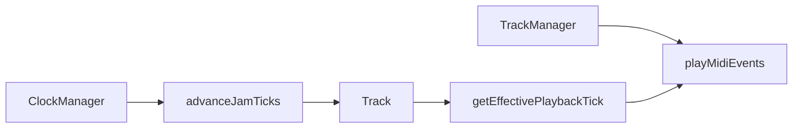

# Jam / bar-step plan — current state (snapshot)

**Last updated:** 2025-03-13 (repo snapshot)

Indexed in [FEATURE_PLANS.md](FEATURE_PLANS.md). Full Cursor plan export (dual-tick + Phase 3 multi-loop): [plans/dual-tick_view_override_architecture_856310b1.plan.md](../plans/dual-tick_view_override_architecture_856310b1.plan.md).

## Phase 1 (jam state on Track) — done

- **Jam state:** `jamStartTick`, `jamLength`, `isJamming()`, `setJam()` / `clearJam()` — display window decoupled from `loopLengthTicks` so notes/LEDs stay correct.
- **Bar select (HOLD_ONE):** long press enters zoom + **independent playback** (`setJamPlayback(true)`).
- **HOLD_TWO:** range uses jam state + `isHoldTwoJam`; no mutating `loopLengthTicks` for display.
- **Faders:** allowed in jam mode (`LoopEditManager`).

**Primary code:** `include/Track.h`, `src/Track.cpp`, `src/BarStepButtonHandler.cpp`, `src/DisplayManager.cpp`, `src/MidiLedManager.cpp`, `src/LoopEditManager.cpp`

---

## Phase 2 (jam tick / per-track playback) — done

| Item | Status |
|------|--------|
| `jamTick`, `jamPlaybackActive` on `Track` | Implemented |
| `advanceJamTick`, `setJamTick`, `getEffectivePlaybackTick`, etc. | Implemented |
| `TrackManager::advanceJamTicks` + use effective tick for playback/LEDs | Implemented |
| Clock drives `advanceJamTicks` (internal + MIDI clock path) | Implemented |
| HOLD_TWO enables jam playback; bar/16th navigate jam; triple-press exit | Implemented |
| Display uses effective playback tick | Implemented |

**Primary code:** `Track`, `TrackManager`, `ClockManager`, `BarStepButtonHandler`, `DisplayManager`

---

## Post–Phase 2 behavior fixes (current code)

These are bug/UX passes on top of Phase 2, not separate numbered phases:

- **`potentialHoldTwo` on NoteOn:** skip actions when two same-type buttons are held (HOLD_TWO in progress).
- **Jam navigation:** deferred to `SHORT_PRESS` where it conflicts with HOLD_TWO (cannot infer intent on NoteOn).
- **Non-jam global seek:** immediate on **NoteOn** for responsiveness when not jamming and not `potentialHoldTwo`.
- **No duplicate global seek:** removed second seek from `SHORT_PRESS` for non-jam (avoids ~quarter-note “restart”).
- **Same-bar exit (bar select):** still on NoteOn.

---

## Optional next work (not in Phase 2)

- **Multi-loop / “Jam 1–8”** on a track and recording jams into new loops — future architecture.
- **Note-edit mode** using jam state — follow-up when bar/16th apply there.

---

## Architecture (jam tick → playback)

