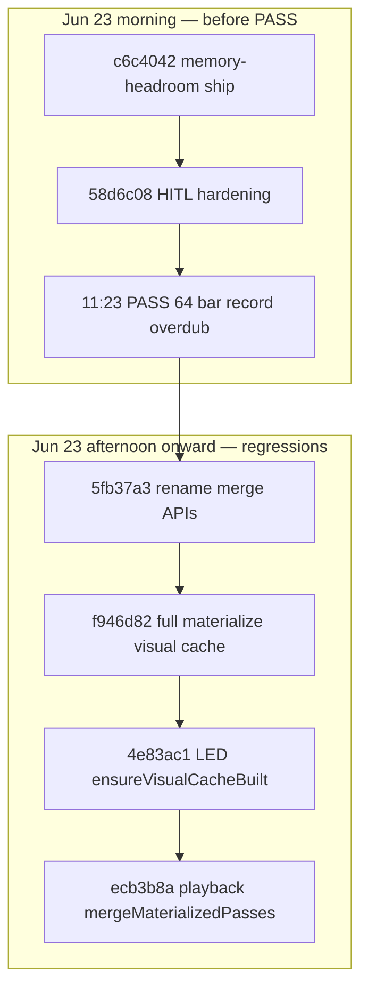
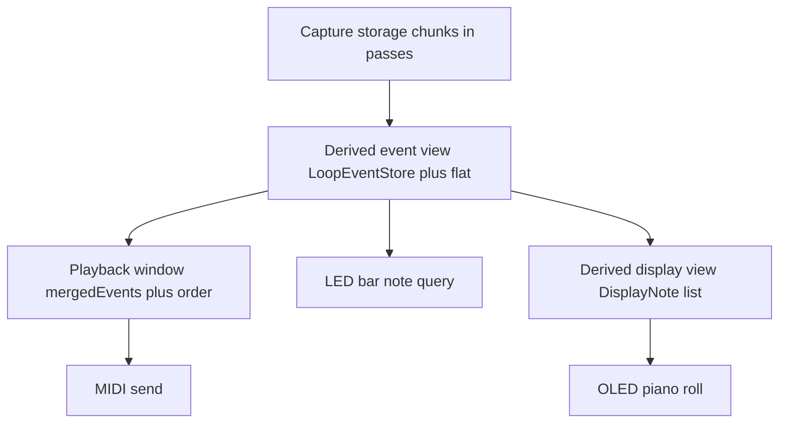
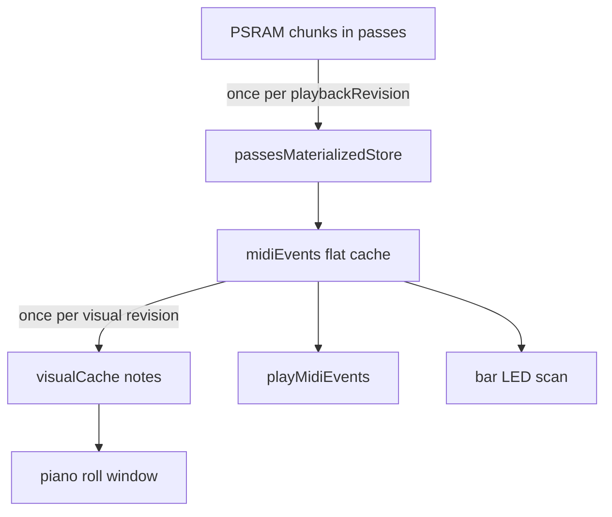
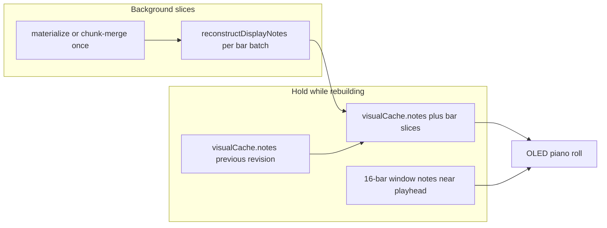

# Why 64+64 HITL Passed in June and Fails Now

## Execution order (2026-07-07 — active)

**Do not** flash-and-pray more partial hot-path patches before bisect. Direct 64-bar / UIP 5.5 gates are **blocked** until this sequence completes.

| Step | Todo | Action |
|------|------|--------|
| — | `architecture-review` | **Done** — [DEC-016](../../docs/DECISION_LOG.md), [RuntimeArchitecture.md](../../docs/00-authority/Architecture/RuntimeArchitecture.md) |
| 0 | `save-bypass-gate` | `teensy41-capture-bypass` + 64+64 HITL (track 6, slot 8) |
| 1 | `bisect-anchors` | HITL at `58d6c08`, `f946d82`, `4e83ac1`, `ecb3b8a` — stash uncommitted firmware first |
| 2 | `phase-a-invariants` | Playback chunk-ref / store-once; LED bar probe; REVT `!isPlaying()`; display defer + stale notes |
| 3 | `phase-b-derived-views` | One materialize per `playbackRevision`; display from flat |
| 4 | `phase-c-partial-display` | Bar-slice / window-first reconstruct in idle maintenance |
| 5 | `validate-64x64` | 64+64 HITL PASS vs `20260623_112324` |
| 6 | `uip-5.5-hitl` | `long_loop_display_window`, 152335, audition, queued slot |

**Handoff for next chat:** [`docs/plans/next_session_handoff_overdub_uip_architecture.md`](../../docs/plans/next_session_handoff_overdub_uip_architecture.md)

### Uncommitted WIP (partial Phase A only — not sufficient)

Branch has uncommitted display/LED defer + REVT slice bounds. **H6 still open:** `Track::ensurePlaybackWindowBuilt` calls `ensurePassesMaterializedStore` / `mergeMaterializedPassesWithCapture` on first PLAYING tick. Stash before bisect; fold into Phase A after anchor results.

---

## Baseline commits and artifacts

| | June PASS | Current FAIL |
|--|-----------|--------------|
| **Artifact** | [`captures/host_midi_automation_baseline_20260623_112324.json`](captures/host_midi_automation_baseline_20260623_112324.json) | [`captures/host_midi_automation_baseline_20260707_032321.json`](captures/host_midi_automation_baseline_20260707_032321.json) |
| **Firmware @ run time** | `58d6c08` (2026-06-23 **11:12**) — last commit before 11:23 run | `HEAD` + uncommitted overdub scheduling fixes (flashed 2026-07-07) |
| **HITL config** | track **5**, no `--loop-slot`, `second_overdub_bars=64` (64+64+64) | track **6**, `--loop-slot 8`, `second_overdub_bars=0` |
| **Overdub** | `PLAYING→OVERDUBBING` seen; `PERS,result,...,ok` | Stall ~12 `#CAP` lines after PLAYING; 0 `ODUB`; 0 inbound MIDI |

The PASS predates every regression commit listed below (all landed **after 11:23** on June 23).



---

## Architecture review (pre-implementation)

Design intent and **runtime invariants** — not a mandate to restore June’s exact call graph. Implementation may evolve if invariants hold.

### 1. Observations vs hypotheses vs verification

#### Observations (proven by commits, captures, or measurements)

| ID | Observation | Source |
|----|-------------|--------|
| O1 | June 23 HITL **PASS** — `PLAYING→OVERDUBBING`, `PERS,result,...,ok` | [`captures/host_midi_automation_baseline_20260623_112324.json`](captures/host_midi_automation_baseline_20260623_112324.json) |
| O2 | Current firmware **FAIL** — stall ~12 `#CAP` lines after `STOPPED_RECORDING→PLAYING`; 0 `ODUB`; 0 inbound MIDI after play | [`captures/host_midi_automation_baseline_20260707_032321.json`](captures/host_midi_automation_baseline_20260707_032321.json) |
| O3 | 64-bar **record completes** on current firmware (49152 ticks, note pairs verified) | Same FAIL artifact |
| O4 | Commits **after** 11:23 on June 23 changed materialization / consumer paths | Git: `f946d82`, `4e83ac1`, `ecb3b8a` (see flowchart above) |
| O5 | `markDisplayCachesStale()` sets `visualCacheDirty` but **does not clear** `visualCache.notes` | [`Loop::markDisplayCachesStale`](src/Loop.cpp) |
| O6 | Deferred save is **slice-based** (~300µs per loop iter while transport active), not one blocking write at stop | [`DEFERRED_RUNTIME_PERSISTENCE.md`](docs/Guides/DEFERRED_RUNTIME_PERSISTENCE.md) |

#### Hypotheses (believed contributors — **not proven** until verification)

| ID | Hypothesis | Verification experiment |
|----|------------|-------------------------|
| H1 | Full-loop `passes.materializeToEventVector` on the PLAYING transition window causes or worsens the stall | Commit bisect (`f946d82`, `ecb3b8a`); timing on `materializeEditViewFromPasses` / merge |
| H2 | Display derived-view rebuild (`reconstructDisplayNotes`) on the hot path adds latency when `visualCacheDirty` | Bisect `f946d82` / `4e83ac1`; `DIAG_COUNTER_INC(VisualCacheRebuild)` + µs capture |
| H3 | LED consumer triggering display derived-view build (`ensureVisualCacheBuilt`) amplifies cost | Bisect `4e83ac1`; compare bar-local query vs display-notes scan |
| H4 | Deferred persistence **amplifies** concurrent load but is not the sole blocker | Step 0 save bypass (`teensy41-capture-bypass`); June PASS had save **and** overdub |
| H5 | REVT emission during PLAYING adds serial/CPU pressure during the overdub-entry window | Gate REVT to `!isPlaying()`; compare `#CAP` volume and stall timing |
| H6 | Uncommitted scheduling patches are insufficient because playback still builds full derived view before MIDI send | Instrument `PlaybackMergeRebuild`; HITL after Phase A |

Wording elsewhere in this plan uses **hypothesis** / **observation** explicitly where applicable. Commit diffs support H1–H3 as *likely*; only bisect + timing make them facts.

### 2. Hot path (definition)

> **Hot path** = code executed every transport tick, on every display frame while transport is active, or during state transitions (`RECORDING→PLAYING`, overdub entry) where latency can affect **MIDI send timing** or USB responsiveness.

**Not hot path:** [`Track::processDeferredIdleMaintenance`](src/Track.cpp), [`StorageManager::processDeferredSaveState`](src/StorageManager.cpp) slices, deferred REVT when gated off PLAYING — provided they stay budgeted and do not block the main loop.

**Hard requirement on hot path:** playback derived view must be valid **before MIDI send** ([`Track::playMidiEvents`](src/Track.cpp) → [`MidiHandler`](src/MidiHandler.cpp)). Display and LED consumers may use stale or partial derived views; MIDI out must not.

### 3. Derived views (conceptual model)

Authoritative data: **capture storage** (PSRAM chunks in [`LoopPasses`](include/LoopPasses.h) / [`LoopEventStore`](include/LoopEventStore.h)).

Everything else is a **derived view** (revisioned, invalidatable):



Each derived view should document: **owner**, **revision key**, **invalidation**, **build trigger**, **build cost**, **consumers**.

### 4. Ownership (current codebase cross-check)

| Subsystem | Owns | Schedules | Must not |
|-----------|------|-----------|----------|
| **`Loop`** | Pass timeline, chunk refs, derived event store ([`passesMaterializedStore_`](include/Loop.h)), [`visualCache`](include/VisualCache.h), `playbackRevision` | Build methods: `materializeEditViewFromPasses`, `rebuildVisualCacheFromPasses`, `mergeActiveCapturePasses` | Be triggered by multiple consumers to rebuild the same view synchronously on hot path |
| **`Track`** | Per-slot [`LoopPlaybackRuntime`](include/TrackPlaybackRuntime.h) / [`PlaybackWindow`](include/PlaybackWindow.h), deferred REVT job state, maintenance scheduling | [`processDeferredIdleMaintenance`](src/Track.cpp), [`ensurePlaybackWindowBuilt`](src/Track.cpp) (today) | Own pass data (delegates to `Loop`) |
| **`DisplayManager`** | UI buffers (`liveDisplayNotes`), window state | Consumes `Loop` display derived view | Call full-loop materialize on [`update()`](src/DisplayManager.cpp) hot path |
| **Playback** (`Track::playMidiEvents`) | — | Consumes `primaryWindow.mergedEvents` | Trigger full-loop rebuild per tick |
| **`MidiLedManager`** | `lastBarVelocity[]` feedback state | Consumes lightweight note-presence query | Trigger `ensureVisualCacheBuilt` on bar scan |
| **`StorageManager`** | Deferred save FSM | `processDeferredSaveState` slices | Block state transitions |
| **`NoteUtils`** | — | Pure helpers: `reconstructDisplayNotes` | Own cached state |

**Today’s function names** (implementation detail — may change):

| Symbol | Role today | Long-term? |
|--------|------------|------------|
| `mergeActiveCapturePasses` | Low-cost derived **event list** from active pass chunk refs | **Invariant pattern** — keep concept, name may stay |
| `materializeEditViewFromPasses` / `passes.materialize` | Full derived **event store** (includes edit passes) | **Architectural** when edits exist |
| `mergeMaterializedPassesWithCapture` | Full materialize + live capture merge | Hot-path **anti-pattern** when capture inactive |
| `midiEvents()` | Lazy **flat** view over `passesMaterializedStore_` | Consumer accessor; triggers materialize if stale |
| `ensurePlaybackWindowBuilt` | Builds **playback window** if `builtFromRevision != playbackRevision` | Scheduler hook — should not do full materialize per call |
| `rebuildVisualCacheFromPasses` | Builds **display derived view** | Background/build owner on `Loop` |
| `ensureVisualCacheBuilt` | Sync build if dirty | Hot-path **anti-pattern** for PLAYING |
| `processDeferredIdleMaintenance` | **Scheduler** for REVT, visual rebuild, validate | Correct owner for sliced work |
| `processDeferredRecordRevts` | REVT **diagnostic emitter** (chunk-ref fast path) | Scheduler-owned |
| `reconstructDisplayNotes` | Pure transform events → `DisplayNote` | Helper, not a cache |

### 5. Invalidation rules (from code today)

| Derived view | Revision / dirty flag | Invalidated by (today) |
|--------------|----------------------|-------------------------|
| Pass timeline / chunk refs | `playbackRevision` on [`Loop`](include/Loop.h) | `commitCapturePass`, edit pass changes, undo restore, `++playbackRevision` paths in [`Loop.cpp`](src/Loop.cpp) |
| Materialized event store | `passesMaterializedStoreStale_` | `markDisplayCachesStale`, `discardPassesMaterializedCache`, `invalidatePlaybackCaches` (discards flat only) |
| Flat event cache (`midiEvents`) | lazy; dropped on `discardFlatCache` | `invalidatePlaybackCaches`, store rematerialize |
| Display notes (`visualCache`) | `visualCacheDirty`, `visualCache.revision` | `markDisplayCachesStale`, `invalidateDisplayCaches`; notes **not cleared** on stale |
| Playback window (`mergedEvents`) | `PlaybackWindow.builtFromRevision` vs `playbackRevision` | Mismatch triggers `ensurePlaybackWindowBuilt` |
| Playback order | `playbackOrderDirty` on `Loop` | `invalidatePlaybackCaches`, window rebuild |
| LED bar velocities | `lastBarVelocity[]` | Implicit — holds last sent velocity until recomputed |
| Capture preview | `capturePreview.revision` | Live capture paths only |

Gaps to close in implementation: explicit **visual revision** tied to `playbackRevision`; document whether flat invalidation implies store rematerialize or only lazy re-flatten.

### 6. Runtime invariants (target — implementation-independent)

Replace “restore June behaviour” with these properties:

| Domain | Invariant |
|--------|-----------|
| **Playback** | Consumer uses the **lowest-cost valid derived event view** for the current `playbackRevision`; full `passes.materialize` at most **once per revision** off hot path; window ready **before MIDI send** |
| **Display** | Consumer reads **display derived view**; may show **stale** `visualCache.notes` while dirty; no synchronous full-loop materialize + reconstruct on [`DisplayManager::update`](src/DisplayManager.cpp) during PLAYING |
| **LED** | Consumer answers bar note-presence with **lowest-cost query** (event scan or chunk/bar probe); must not trigger display derived-view rebuild |
| **REVT / serial** | Diagnostic emission **budgeted**; prefer chunk-ref walk; avoid competing with transport on hot path (hypothesis: gate while PLAYING) |
| **Persistence** | Remains slice-based; does not block overdub state transition |
| **Scheduling** | At most **one** builder per derived view per revision; builders run in [`processDeferredIdleMaintenance`](src/Track.cpp) or stop finalize, not in display/LED/playback entry |

**Historical note (observation O4):** At `58d6c08`, playback used chunk-ref merge and REVT was gated off PLAYING — consistent with these invariants, but **not** the only valid implementation.

### 7. Instrumentation (before optimising)

Hypotheses H1–H6 assume cost without full timing proof. Extend existing hooks:

| Operation | Existing hook | Add (temporary) |
|-----------|---------------|-----------------|
| `materializeEditViewFromPasses` | `DIAG_COUNTER_INC(Materialize)` in edit paths | µs + event count at call site; `trigger` enum (stop, idle, consumer) |
| `reconstructDisplayNotes` | — | µs + in/out note count in `rebuildVisualCacheFromPasses` |
| Playback window build | `DIAG_COUNTER_INC(PlaybackMergeRebuild)` | µs in `ensurePlaybackWindowBuilt`; log `playbackRevision` |
| Visual cache rebuild | `DIAG_COUNTER_INC(VisualCacheRebuild)` | µs + `visualCache.revision` (already partial via `#CAP,DFRAME`) |
| LED bar scan | — | Optional counter per `updateBarLeds` when query path runs |

Capture on 64-bar stop → PLAYING window; correlate with HITL serial tail. Use `teensy41-capture-serial` + [`scripts/parse_diag_trace.py`](scripts/parse_diag_trace.py) if binary trace enabled.

### 8. Editorial terms

| Prefer | Avoid |
|--------|-------|
| low-cost derived view | cheap, June path |
| consumer | reader, path, caller (inconsistent) |
| runtime characteristics / invariant | June behaviour |
| derived view | cache (unless `LoopEventFlatCache` literal) |
| observation / hypothesis | stating hypothesis as fact |

---

## Historical context: commit `58d6c08` runtime characteristics

*Observation O1/O4 — reference implementation that satisfied invariants; not the specification.*

At [`58d6c08`](58d6c08) the post-record PLAYING path avoided repeated full pass materialization:

**Playback** ([`src/Track.cpp`](src/Track.cpp) `ensurePlaybackWindowBuilt`):

```cpp
loop.mergeActiveCapturePasses(runtime.primaryWindow.mergedEvents);  // merge committed passes only
```

**Visual cache** ([`src/Loop.cpp`](src/Loop.cpp) `rebuildVisualCacheFromPasses`):

```cpp
mergeActiveCapturePasses(flat);  // not passes.materializeToEventVector
```

**Bar LEDs** ([`src/MidiLedManager.cpp`](src/MidiLedManager.cpp)):

```cpp
for (const auto& event : loop.midiEvents()) { ... }  // lazy flat from chunk store
```

**Deferred REVT** ([`src/Track.cpp`](src/Track.cpp)):

```cpp
const bool canEmitRecordRevts = !isPlaying() && !isRecording() && !isOverdubbing();
```

**Display** — only **2** `ensureVisualCacheBuilt()` call sites in [`DisplayManager.cpp`](src/DisplayManager.cpp); no per-frame DFRAME telemetry.

## Commit changes after PASS (hypothesis support — verify via bisect)

*These commits **support** H1–H3; first failing anchor confirms which hypothesis is primary.*

### 1. [`f946d82`](f946d82) — 2026-06-23 17:44 (same day, **after** PASS)

*Fix note-edit exit display and in-session undo regressions*

- `rebuildVisualCacheFromPasses`: `mergeActiveCapturePasses` → **`passes.materializeToEventVector`** (~1024 events + `reconstructDisplayNotes` on every dirty rebuild).
- `processDeferredIdleMaintenance`: REVT emission allowed **during PLAYING** (`processDeferredRecordRevts(64)`), adding hundreds of `#CAP,REVT` lines while waiting for overdub.

### 2. [`4e83ac1`](4e83ac1) — 2026-06-28

*Fix post–4.7 regressions: display freeze…*

- [`MidiLedManager.cpp`](src/MidiLedManager.cpp): bar-LED lookup switched from `loop.midiEvents()` to **`ensureVisualCacheBuilt()` + scan `visualCache.notes`** — up to **16 bars × every LED update frame** while cache is dirty after record stop.

This is the path the recent uncommitted fix only partially addressed (`visualCacheDirty` → return false).

### 3. [`ecb3b8a`](ecb3b8a) — 2026-07-05

*Implement unified interval projection Phases 1–4*

- [`src/Track.cpp`](src/Track.cpp) `ensurePlaybackWindowBuilt`: **`mergeMaterializedPassesWithCapture`** on every playback-window rebuild (full materialize on first PLAYING tick after stop).
- Projection-aware playback order adds per-rebuild sort work on ~1024 events.

### 4. Contributing load (not primary stall, but adds pressure)

| Commit | Effect |
|--------|--------|
| [`c9164c2`](c9164c2) | More `SESSION_CAPTURE` / serial volume on `teensy41-capture-serial` |
| [`d05e736`](d05e736) | `SC_DFRAME` every 30 display frames |
| [`b1260ce`](b1260ce) | PSRAM routing — helps heap, does not remove materialize calls |
| Uncommitted overdub plan | Defers display/LED rebuild, slices REVT — **still fails** because playback still calls `ensurePassesMaterializedStore()` (full materialize) on first PLAYING tick |

## Why current failure pattern matches hypotheses (not yet proven root cause)

Latest serial tail (`20260707_032321`) — **observation O2**:

- `STOPPED_RECORDING→PLAYING` at cap line 1
- `RECS,stage,save_request` + `PERS,dispatch` immediately after
- **12 `#CAP` lines** (~25 ms), then USB/MIDI silence
- **0 `ODUB`** — crash/hang before `startOverdubbing`

June PASS had **minutes** of healthy PLAYING + `PERS,result,...,ok` before overdub ST (O1). The stall duration shrunk as materialize work moved onto the PLAYING hot path — **consistent with H1–H5**; bisect confirms.

HITL config differences (track 6 / slot 8 / no second overdub) are **unlikely** stall cause — failure occurs before overdub button handling (O2).

## Who runs the tests (bisect + save bypass)

**Agent runs end-to-end** — checkout, build, upload, HITL, parse artifacts. **You only intervene when upload blocks** (press Teensy **PROGRAM MODE** button). Each anchor is ~5–8 min wall clock (upload + ~4–5 min 64+64 record/overdub).

You do **not** need to manually `git checkout` four times unless you prefer to watch each run yourself.

Suggested order:

1. **Step 0 — save bypass** (one flash + one HITL) — rules out deferred SD save as the blocker before spending time on four commit checkouts.
2. **Step 1 — four commit anchors** — only if Step 0 still fails (or passes but you want the first regression commit).

## Step 0 — disable save first (storage isolation)

Existing diagnostic env — no code change:

```bash
pio run -e teensy41-capture-bypass -t upload   # BYPASS_STOP_UNDO_SAVE=1
# same 64+64 HITL gate (track 6, slot 8, capture-serial args)
```

[`platformio.ini`](platformio.ini) `[env:teensy41-capture-bypass]` sets `-D BYPASS_STOP_UNDO_SAVE=1`, which makes [`StorageManager::requestDeferredSaveState`](src/StorageManager.cpp) and `processDeferredSaveState` no-ops — **no `PERS,dispatch` / SD slices during PLAYING**.

| Outcome | Interpretation |
|---------|----------------|
| **PASS** (overdub ST seen) | Deferred save pressure is a **contributor**; fix hot-path materialize **and** revisit save scheduling (slice budget / admission), not “save chunks more often” alone |
| **FAIL** (same ~12-line stall, 0 ODUB) | Supports H4 **not sole cause**; proceed to bisect + enforce runtime invariants |

**Note:** June PASS (`20260623_112324`) reached `PERS,result,...,ok` **and** overdub — so save and overdub **can** coexist when PLAYING-window CPU cost is low. Current fail stalls right after `PERS,dispatch`, which implicates save **plus** concurrent materialize/REVT work, not save alone.

### How save works today (not “all chunks at end”)

From [`docs/Guides/DEFERRED_RUNTIME_PERSISTENCE.md`](docs/Guides/DEFERRED_RUNTIME_PERSISTENCE.md):

| Phase | What happens |
|-------|----------------|
| **During record** | MIDI events append to **in-RAM PSRAM chunks** (256 events/chunk) — already chunked live |
| **At record stop** | `requestDeferredSaveState` **queues** a workspace save; does **not** block stop or flatten the loop |
| **During PLAYING** | `processDeferredSaveState` runs **one bounded slice per main-loop iteration** (~300µs budget while transport active); streams capture passes to SD in batches of ≤256 events (`writeCapturePassChunkStream`) |
| **Completion** | Many slices over many loop iterations → `PERS,result,...,ok` |

So SD write is already **incremental/chunk-streamed** — **hypothesis H4:** concurrent slices plus derived-view rebuilds on the PLAYING window (H1–H3, H5) exceed available budget before overdub entry.

“Save chunks more often” would mean changing **when** `requestDeferredSaveState` fires — **ownership/transition** change, out of scope unless Step 0 proves H4 dominant. Prefer **hot-path invariants** first (§6), then tune slice budget if needed.

## Recommended verification (git bisect)

Run 64+64 HITL at these anchors (same args as current gate: track 6, slot 8, `teensy41-capture-serial`):

1. `58d6c08` — expect **PASS** (reproduces O1)
2. `f946d82` — test **H1 + H2 + H5**
3. `4e83ac1` — test **H3**
4. `ecb3b8a` — test **H1** (playback consumer)
5. `HEAD` + uncommitted — current state (**H6**)

```bash
# Agent runs this loop; user presses PROGRAM MODE when upload asks
git stash
git checkout <sha>
pio run -e teensy41-capture-serial -t upload
# run 64+64 HITL gate (same args as 20260707_032321)
git checkout -
git stash pop
```

## Fix direction (invariants + reuse ladder)

Architecture checkpoint: **scheduling/cost only** — no change to state machine or overdub transition rules. Goal: **one expensive build per revision**, consumers **read down-stack**, heavy work **sliced in idle maintenance** (same pattern as `processDeferredSaveState`). See **§6 Runtime invariants**.

### Reuse ladder (single source of truth per layer)



| Consumer | `58d6c08` characteristics (reference) | Current (expensive) | Target invariant |
|----------|--------------------------------------|---------------------|------------------|
| **Playback** | Chunk-ref merge | `mergeMaterializedPassesWithCapture` every window rebuild | Low-cost derived event view; materialize store **once** per `playbackRevision` |
| **Bar LEDs** | Event scan via `midiEvents()` | `ensureVisualCacheBuilt` + DisplayNotes | Low-cost note-presence query — no display derived-view rebuild |
| **OLED display** | Sync `ensureVisualCacheBuilt` but cheaper flatten underneath | Per-frame rebuild while dirty | Stale-while-revalidate; sliced reconstruct in maintenance |
| **REVT** | Only when `!isPlaying()` | Chunk scan during PLAYING | Budgeted; gated off PLAYING (H5) or ring-only |
| **PERS** | Already sliced | Same | Unchanged — shares main-loop budget |

**Key invariant:** After record stop, `markDisplayCachesStale()` sets `passesMaterializedStoreStale_` + `visualCacheDirty`. Trigger **one** derived event view build off the hot path (stop finalize or first idle slice), then consumers read cached layers until `playbackRevision` changes (§5 invalidation table).

### Split work like save (bounded slices)

Mirror [`processDeferredSaveState`](src/StorageManager.cpp): one budgeted slice per `processDeferredIdleMaintenance` / main-loop pass (~300µs while PLAYING, same as `maxPersistenceMicrosActive`).

| Work unit | Slice strategy | Owner |
|-----------|----------------|-------|
| **Materialize passes → store** | Already atomic per revision; run once in idle, not on display/LED/playback entry | [`Loop::materializeEditViewFromPasses`](src/Loop.cpp) |
| **reconstructDisplayNotes** | **New:** deferred job — N events or M bars per slice until `visualCacheDirty` clear; [`VisualCache.dirtyBars`](include/VisualCache.h) already exists for partial invalidation | [`Track::processDeferredIdleMaintenance`](src/Track.cpp) |
| **REVT serial** | Already chunked (`maxEventsPerSlice`); record-stop uses chunk-ref walk without `mergeActiveCapturePasses` | [`Track::processDeferredRecordRevts`](src/Track.cpp) |
| **Playback order sort** | Defer until first tick that would **MIDI send** loop events; reuse order if `playbackRevision` unchanged | [`Track.cpp`](src/Track.cpp) `playMidiEvents` → `MidiHandler` out |
| **SC_CAPTURE_FLUSH** | Already throttled 8 vs 64 in timing-critical transport | [`main.cpp`](src/main.cpp) |

### Reference: `58d6c08` consumer cost model

At PASS commit, display still called `ensureVisualCacheBuilt()` on PLAYING — but **underlying build cost** was lower (chunk-ref merge, not full materialize). That satisfies §6 invariants with a different surface API.

| Path | `58d6c08` consumer | Cost model | Regression (supports H1–H3) |
|------|-------------------|------------|------------------------------|
| **Playback** | [`flattenActiveCapturePasses`](src/Loop.cpp) → `appendFlattenedChunkIds` on active pass chunk refs, merge layers | O(events) chunk copy + merge; **no** `passes.materializeToEventVector`, **no** edit-pass replay | [`mergeMaterializedPassesWithCapture`](src/Loop.cpp) — full `passes.materializeToEventVector` |
| **Visual cache** | Same **flatten** + one `reconstructDisplayNotes` when cache dirty | One flatten + one note rebuild per dirty cycle | Full **materialize** + reconstruct (`f946d82`) |
| **Bar LEDs** | [`loop.midiEvents()`](src/Loop.cpp) event scan | Calls `materializeEditViewFromPasses` (full pass materialize to flat) — acceptable when edit passes empty; **no** DisplayNote rebuild | `ensureVisualCacheBuilt` + scan 512 DisplayNotes (`4e83ac1`) |
| **Display fallback** | If `visualCache` empty: `buildLiveEventView` + reconstruct from **live event buffer** | Second path using flatten buffer, not second materialize | Often triggers second materialize |
| **REVT** | Only when **`!isPlaying()`** | Zero REVT work during PLAYING wait | Chunk scan + serial during PLAYING (`f946d82`) |

Renamed in [`5fb37a3`](5fb37a3): `flattenActiveCapturePasses` → `mergeActiveCapturePasses` (same chunk-ref merge idea). UIP [`ecb3b8a`](ecb3b8a) replaced playback merge with full materialize.

**Phase A target:** enforce §6 invariants — low-cost event view for playback/LED, REVT gated off PLAYING, no sync full-loop work on display/LED hot paths. Full materialize only when edit passes require it (chunk merge insufficient).

### Holding partial state (more elegant than empty UI)

`markDisplayCachesStale()` sets `visualCacheDirty = true` but **does not clear** [`visualCache.notes`](include/VisualCache.h). The uncommitted defer path in [`DisplayManager::resolveDisplayNotes`](src/DisplayManager.cpp) returns **empty** notes when dirty — that discards usable data. Prefer **stale-while-revalidate** and **sliced fill-in**:



| Strategy | Behavior | Fits existing types |
|----------|----------|---------------------|
| **Stale-while-revalidate** | Keep showing last `visualCache.notes` while `visualCacheDirty`; optional subtle “refreshing” via revision | [`VisualCache.revision`](include/VisualCache.h), `visualCacheDirty` on [`Loop`](include/Loop.h) |
| **Bar-sliced fill-in** | Each [`Track::processDeferredIdleMaintenance`](src/Track.cpp) slice: `reconstructDisplayNotes` for events in bars `[nextBar, nextBar+k)`; merge into `visualCache.notes`; clear `dirtyBars[i]` as bars complete | [`VisualCache.dirtyBars`](include/VisualCache.h) |
| **Window-first** | Piano roll only needs ~16 bars ([`DisplayWindowUtils::filterDisplayNotesToWindow`](src/Utils/DisplayWindowUtils.cpp)); reconstruct **viewport events only** from chunk refs near playhead — not all 64 bars | [`Config::PLAYBACK_WINDOW_MAX_BARS`](include/Globals.h), `detailedWindowStartTick_` on [`DisplayManager`](src/DisplayManager.cpp) |
| **LED bar-local probe** | Per bar LED: scan chunk refs overlapping that bar ([`LoopEventStore::barFirstIndices`](include/LoopEventStore.h)) — no full flat, no DisplayNotes | Reference: event scan in [`MidiLedManager`](src/MidiLedManager.cpp) at `58d6c08`; bar index for long loops |
| **REVT hold** | Ring-queue note-ons ([`SC_REC_QUEUE_STORED_NOTE_ON`](include/Utils/DebugSessionCapture.h)); flush when `!isPlaying()` or transport idle — verification waits, device stays alive | [`Track::processDeferredRecordRevts`](src/Track.cpp), [`deferredRecordRevtChunkScan`](src/Track.cpp) chunk-ref fast path |

**Display read order while dirty (proposed):**

1. If `!loop.visualCache.notes.empty()` → **show them** (stale OK after record stop — content is the take just recorded).
2. Else if window-first slice ready → show subset from [`filterDisplayNotesToWindow`](src/Utils/DisplayWindowUtils.cpp).
3. Else if [`Loop::mergeActiveCapturePasses`](src/Loop.cpp) buffer available → `reconstructDisplayNotes` for **window only** via [`NoteUtils::reconstructDisplayNotes`](include/Utils/NoteUtils.h).
4. Never synchronous full-loop `passes.materializeToEventVector` on [`DisplayManager::update()`](src/DisplayManager.cpp).

**LED read order while dirty:** bar-local chunk scan in [`MidiLedManager::hasNoteInBar`](src/MidiLedManager.cpp) **or** stale bar velocities from last frame ([`lastBarVelocity`](src/MidiLedManager.cpp) — LED already only updates on velocity change).

**Playback:** must be correct before **MIDI send** — merged window ready before [`Track::playMidiEvents`](src/Track.cpp) → [`MidiHandler`](src/MidiHandler.cpp) out. One [`mergeActiveCapturePasses`](src/Loop.cpp) (or seeded [`passesMaterializedStore`](include/Loop.h) via [`materializeEditViewFromPasses`](src/Loop.cpp)) in the **first idle slice** after stop, before the first `playMidiEvents` tick that emits loop notes. Display/LED may lag; MIDI out must not.

**PLAYING-window rule:** Hot paths may **read cached or stale derived views** and **bar/window subsets**. They must not trigger full-loop materialize or full-loop `reconstructDisplayNotes` synchronously on the path to MIDI send or on [`DisplayManager::update()`](src/DisplayManager.cpp) / LED update (§6).

### Phased implementation (after Step 0 + bisect)

| Phase | Change | Risk |
|-------|--------|------|
| **0 — review** | Cross-check §4–§5; add §7 instrumentation | None |
| **A — invariants** | Playback/LED low-cost consumers; REVT `!isPlaying()`; no sync display rebuild on PLAYING | Low — matches O1 reference |
| **B — one build per revision** | Seed derived event store once at stop/idle; display notes from existing flat | Low |
| **C — sliced display** | Incremental `reconstructDisplayNotes` in maintenance (stale / bar-slice / window-first) | Medium |
| **D — save budget** | Only if Step 0 PASS: tune `maxPersistenceMicrosActive` or defer first `PERS` slice | Medium |

### Phase A checklist (invariant → likely touch points)

| Invariant | Likely implementation (not architectural requirement) | Files |
|-----------|------------------------------------------------------|-------|
| Playback low-cost view before MIDI send | Chunk-ref merge or read materialized store when fresh — not per-tick full materialize | [`Track.cpp`](src/Track.cpp) `ensurePlaybackWindowBuilt` |
| LED low-cost query | Event scan or bar-local chunk probe — no `ensureVisualCacheBuilt` | [`MidiLedManager.cpp`](src/MidiLedManager.cpp) |
| Display stale-while-revalidate | Defer `rebuildVisualCacheFromPasses` to maintenance | [`Loop.cpp`](src/Loop.cpp), [`DisplayManager.cpp`](src/DisplayManager.cpp) |
| REVT off PLAYING hot path | `!isPlaying()` gate | [`Track.cpp`](src/Track.cpp) |
| PERS unchanged | Deferred save | unchanged |

Optional: rerun O1-identical HITL (track 5, no slot, `second_overdub_bars=64`) after Phase A to confirm parity with archived gate.

## Out of scope

- Blocking overdub until `PERS,result` (ownership/transition change)
- Reverting UIP projection engine wholesale — only hot-path **consumer** call sites must meet §6 invariants
- Mandating specific function names (`midiEvents`, `mergeActiveCapturePasses`) as permanent API — only invariants and ownership (§4–§6) are normative
