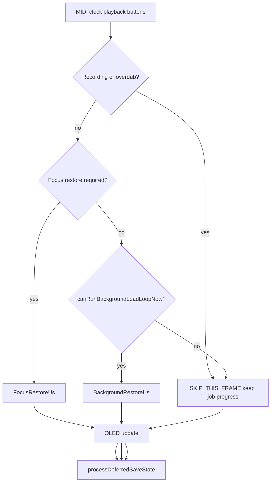

# Deferred storage — spare-time background LoadLoopJob after focus

**Kind:** enhancement  
**Role:** Phase 5.2 refinement of [`deferred_storage_time_budget_scheduler_enhancement.md`](deferred_storage_time_budget_scheduler_enhancement.md)  
**Branch:** `feature/deferred-lazy-load`  
**OpenSpec:** `unified-commit-lazy-slot-load` task 6.2  

**Status (2026-07-18):** Partially rolled back for realtime — `canRunBackgroundLoadLoopNow` again denies Low while any track is PLAYING (`223713` progressive button starve → freeze). Boot drain + idle Low + focus High unchanged. Device gate pending.

---

# Spare-time background slot load after focus

## Verdict (review-approved)

Focus-first priority was never lost. The regression is the hard PLAYING suspend that blocked all non-focus progress after the focused slot completed.

Intended architecture:

- Focus restore gets priority
- Background restore continues opportunistically when the frame has capacity
- Playback / MIDI / buttons / OLED stay protected
- No new FSM or ownership layer (Phase A stepping stone toward `DeferredJobScheduler`)

**Core refinement:** separate **job state** (what remains) from **frame admission** (whether this frame may run work).

---

## What the codebase shows

Focus-first ordering still exists:

- Priority: [`computeDeferredRestorePriority`](include/Utils/BootLoopSlotRestore.h) — `0` selected, `1`/`2` neighbors, `10+` other focus-track, `100+` other tracks
- Post-boot enqueue: [`enqueueRemainingLoopSlotRestores`](src/StorageManager.cpp) after [`bootInteractiveReady`](src/main.cpp)
- Focus admission: [`prioritizeLoopSlotRestoreForFocus`](src/StorageManager.cpp) — selected + neighbors only; full fill via remaining-enqueue
- Budgets: [`LoadLoopBudget`](include/LoadLoopBudget.h) — Focus `1200µs`, Background `250µs`

Regression (uncommitted + tasks 6.2): [`suspendBackgroundLoadLoopJobs`](src/StorageManager.cpp) returns true whenever any track is PLAYING and focus does not need load — then **parks** non-focus jobs and early-returns in [`runDeferredFrame`](src/StorageManager.cpp). After selected slot Commits → **zero** remaining-slot progress until STOPPED.

Doc drift: [`CURRENT_WORK.md`](docs/runtime/CURRENT_WORK.md) says allow background Low while PLAYING; tasks/plan said suspend. This change restores spare-time Low.

---

## Architecture: three axes

| Axis | Owns | Example |
|------|------|---------|
| **Job priority** | What should run first | Low vs High / queue order `0 → 1/2 → 10+ → 100+` |
| **Job state** | Where execution resumes | bytes read, file pos, apply pending — **unchanged across skipped frames** |
| **Frame admission** | Whether this frame has capacity | `RUN_THIS_FRAME` / `SKIP_THIS_FRAME` |

```
LoadLoopJob
  target:     Track 3 Slot 2
  progress:   chunk 12/20   ← job state (kept)
  priority:   Low

scheduler this frame:
  SKIP_THIS_FRAME           ← admission only; not a PAUSED job state

resume later:
  chunk 13/20
```

**Demote-on-focus** (existing) still parks one in-flight job when focus changes — that is lifecycle for preemption, not “frame had no spare budget.”

**Skipped frames must not call `parkActiveLoadLoopJob()`** solely because admission failed.

---

## Rename: suspend → admission gate

| Remove | Prefer |
|--------|--------|
| `suspendBackgroundLoadLoopJobs()` | `canRunBackgroundLoadLoopNow()` |

Positive name for the decision: may this frame execute background LoadLoopJob work?

Call sites today that treat “suspend” as park+return must become:

1. If focus work → run focus (unchanged)
2. Else if `!canRunBackgroundLoadLoopNow()` → **skip frame** (leave active/parked/queue as-is)
3. Else → begin **or** step **or** commit within `BackgroundRestoreUs`

---

## Realtime protection policy (replaces “PLAYING ⇒ suspend”)

PLAYING itself is not the problem. Constraints are MIDI timing, playback stability, button latency, OLED responsiveness, and spare CPU.



| Condition | Behavior |
|-----------|----------|
| RECORDING / OVERDUBBING | Budget `0` / skip non-critical SD (unchanged) |
| `isFocusedLoopSlotRestoreWork()` | `FocusRestoreUs`; demote-on-focus park of non-focus (unchanged) |
| Focus idle + `canRunBackgroundLoadLoopNow()` | Low: one of begin / step / commit at `BackgroundRestoreUs` |
| Focus idle + gate false | `SKIP_THIS_FRAME` — **no park**, job progress kept |
| Transport idle (STOPPED) | Low fill (boot holdoff unchanged) |

**Focus complete** = `!isFocusedLoopSlotRestoreWork()` only. No new focus-track FSM. Existing priority queue resumes for neighbors → focus-track → other tracks.

---

## One expensive operation per frame

Keep and make explicit — a frame performs **at most one** of:

| Op | Role |
|----|------|
| `beginLoadLoopJob` | One-time SD open/seek setup |
| `stepLoadLoopJob` | Incremental timed progress |
| `applyCommit` / Commit | Atomic publication boundary |

Do **not**: begin + multi-step, multi-job chain, or begin + commit in the same frame beyond existing begin-only early return.

---

## Silent background rules

Background restore **must not**:

- write continuous Serial logs
- block display updates (paint-before-Low while PLAYING stays)
- chain multiple jobs
- create large temporary latency spikes
- affect MIDI timing

Telemetry: counters, lightweight `#CAP` markers, deferred diagnostics — not per-begin/done Serial.

Focus-path Serial may remain for interactive diagnosis.

### Serial diagnosis (keep documented)

Captures [`213739`](captures/session_20260718_213739.log) / [`213044`](captures/session_20260718_213044.log) show ~600ms frames dominated by **Serial logging cost**, not the 250µs background slice. Hard PLAYING suspend was the blunt fix; spare-time + silent Low is the precise fix.

Permanent measurement rule for device gates — distinguish:

- Scheduler execution time
- SD operation time
- Display time
- Instrumentation time
- MIDI timing impact

---

## Spare-time gate contents (`canRunBackgroundLoadLoopNow`)

Wire these as frame admission (not job lifecycle):

1. Hot path already ran this `loop()` turn (structural — load after MIDI/buttons)
2. No pending tap (`hasPendingTapAction`)
3. Not capture-active
4. Boot holdoff elapsed (`backgroundRestoreHoldoffUntilMs_`)
5. Paint-before-Low already scheduled when background-only + timing-critical ([`playBackgroundLoad`](src/main.cpp))

Remove: any-track `isPlaying()` ⇒ unconditional deny.

---

## Code changes (Phase A owner only)

| File | Change |
|------|--------|
| [`src/StorageManager.cpp`](src/StorageManager.cpp) | Rename to `canRunBackgroundLoadLoopNow`; remove PLAYING hard-deny; on false → skip frame **without** parking; allow Low begin/step/commit when true + focus idle |
| [`src/main.cpp`](src/main.cpp) | Keep paint-before-Low + tap/capture; budget via existing `resolveLoadLoopSliceBudgetUs` (250 when not focus/capture) |
| [`include/LoadLoopBudget.h`](include/LoadLoopBudget.h) / `.cpp` | Only add `PlaySpareRestoreUs` ≤ 250 if device gate proves 250 too heavy |
| Docs / OpenSpec | Align [`tasks.md`](openspec/changes/unified-commit-lazy-slot-load/tasks.md) 6.2, [`deferred_storage_time_budget_scheduler_enhancement.md`](docs/plans/deferred_storage_time_budget_scheduler_enhancement.md), [`CURRENT_WORK.md`](docs/runtime/CURRENT_WORK.md); also write plan copy under `docs/plans/deferred_storage_spare_time_background_load_enhancement.md` on implement |

Ownership / transitions: **NO** new owner, **NO** new transport FSM — extend `StorageManager::runDeferredFrame` + admission gate. Stepping stone toward Phase B `DeferredJobScheduler` (Job owns progress; Priority importance; Runtime gates protect realtime; Scheduler decides opportunity).

---

## Success criteria

- [ ] Background progress survives focus changes without restarting SD load (demote/park + resume from file position)
- [ ] Background load preserves existing priority ordering (`0 → 1/2 → 10+ → 100+`)
- [ ] PLAYING performance remains unchanged when spare budget is unavailable (`SKIP_THIS_FRAME`)
- [ ] Background progress is observable without Serial logging (`#CAP` / counters)
- [ ] Recording/overdub continues to block non-critical SD work
- [ ] Focus 64-bar Commit while PLAYING stays responsive
- [ ] Buttons / OLED not starved; MIDI vs [`190417`](captures/session_20260718_190417.log) smoothness baseline

## Verification

- `pio test -e native`
- `pio run -e teensy41-capture-serial`
- Device gate for OpenSpec **6.2-device** using criteria above

## Out of scope

- Phase B `DeferredJobScheduler` type
- Boot audible-set sync Commit changes
- Expanding `prioritizeLoopSlotRestoreForFocus` to full-set enqueue
- New focus-track completion FSM
- New job PAUSED state for skipped frames
